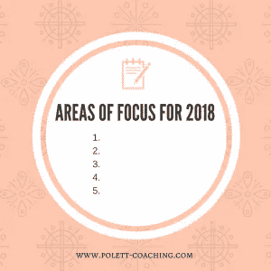
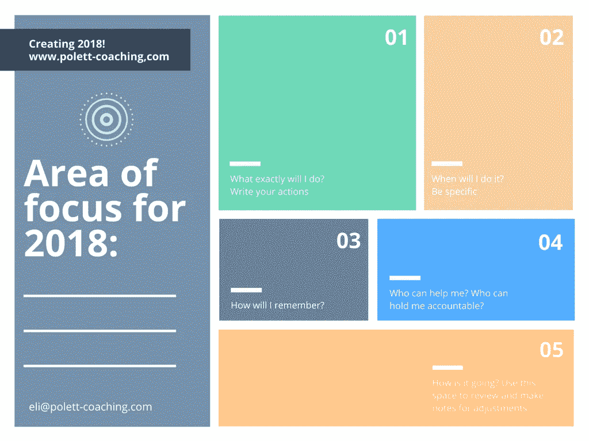

# 创造美好未来的路线图

> 原文：<https://medium.com/swlh/a-roadmap-to-creating-a-great-year-ahead-80fe04b28ebc>

我们已经醒来，迎来了新的一年，这又是一个激动人心的时刻，我们期待着重新开始，创造充满可能性的一年。

我必须承认，我曾经害怕每年的这个时候。现在我喜欢它。这些年来，我学会了反思并真正从我所留下的东西中学习，以便带着新的能量前进。

很多人都为来年制定计划。“每天锻炼”…“不要和我的伴侣吵架”…“不要对我的孩子大喊大叫”…这个清单还在继续，但很少有人能坚持到一月底而不放弃他们的决心。

我不相信决心。

原因很多，但主要是因为它们根本不起作用。

新年决心旨在改变我们的行为，但不改变这些行为背后的信念。他们的目标是带我们快速到达目的地，假设存在不现实的捷径(他们没有，对不起，伙计们！).此外，决心往往过于雄心勃勃(“今年不吃巧克力！”…是啊，没错！)导致一段不愉快的旅程。

**忘记决心，让我们看看我们都可以做些什么，而不是**——让我们看看定义我们的“为什么”而不是“什么”——谁知道呢，我们可能会有一个伟大的一年！

# 你从去年带走了什么？

重要的事情先做——每年年底，我都会花些时间反思我即将离开的这一年(我是走路，而不是坐着)。我也和我的伴侣讨论过，用语言表达出来真的很有帮助。

**回顾这一年，我涵盖了这 5 个关键领域:**

**1。感激和欣赏**——我最感激的是什么？今年我最欣赏的是什么？我想感谢哪些人参与了我的旅程？有哪些经历让这一年变得丰富、刺激、艰难、人性化？

**2。助推器**——今年还有什么可以做得更好的？有什么是我本可以做而没有做的吗？或者任何我想改变的事情？有什么我想为未来改进的吗？

**3。学习** —我学到了什么？我试了什么？我失败在哪里？我学到了什么新技能？

**4。工作和事业**——今年我的工作怎么样？我达到目标了吗？(我有目标吗？)我冒险了吗？我前进了吗？

**5。身心**——今年我的健康状况如何？我的身体感觉如何？我和我的身心有什么关系？

Image credit: Pexels.com

# 你想创造的年份是什么样子的？

现在是时候考虑未来的一年了…

正如杰基·凯的诗所说:

“记住，每年的这个时候

当未来出现时

就像一张白纸

一个干净的日历，一个新的机会。"

**你想在你的空白画布上创作什么？**

以下是我在年初问自己的一些问题:

*   我想学什么？我想如何在个人和职业上成长？我想实现什么，创造变化，建设什么？
*   **今年我想关注什么**，我将优先考虑什么？我想把我的能量导向什么？
*   **如果我在这个新年的末尾，回首过去，我想看什么？**有哪些事情是我希望发生的？我最想进行的对话是什么？我想学的东西是什么？我想尝试的事情有哪些？我想拥抱的人是谁？

用这些问题列出你今年想要关注的事情。这些是你优先考虑的领域，是你真正想把精力放在的事情，是对你真正重要的事情。

以下是我在未来一年的工作重点，请在下面留言，让我知道你打算重点做什么:

1.  作为教练成长——我喜欢教练的一点是，这是一种持续学习和技能深化的过程。今年，我将重点学习叙事训练——我们告诉自己的故事如何塑造我们。很迷人，不是吗？
2.  属于自己的时间——我每周都花些时间关注自己的幸福，给我内向的内心一些爱。无论是洗个长长的澡，还是去一个新的地方散步，这都是我的时间，我正在拥抱它。
3.  正念和冥想——我每天都花一些时间冥想(无论是在通勤途中、淋浴时、睡前还是做饭时)。我使用 Headspace 应用程序，我很喜欢它。
4.  保持活跃——长时间的例行锻炼和无数个小时的健身房锻炼。我专注于快速锻炼(15-20 分钟),这可以适应我正在做的其他事情(如果你想要的话，我很乐意分享),并且在我的日常生活中努力变得更加活跃——例如，提前一站下火车，然后走完剩下的路。我喜欢它。
5.  沟通——回想去年，我意识到自己更擅长与客户和同事沟通，而不是与最亲近的人(我的丈夫和父母)沟通。因此，我优先考虑开放和积极的沟通。而且，是的，他们知道这件事，并在船上:)

花些时间写下你今年的重点领域。

**现在想想是什么让这些对你来说如此重要——为什么你要关心自己的未来？**

例如，改善沟通对我来说很重要，因为我想为我的儿子树立一个榜样。我想让他在一个人们公开、诚实、健康地交流的环境中成长。对我来说，这是一个推动它并挑战自己每天沟通能力提高 1%的理由。你推动自己选择的东西的理由是什么？

# 你将如何实现它？目标和系统的区别

大多数人设定目标…因为这是我们被反复告知要做的。

我认为改变游戏规则的是根据你的目标设定系统。例如，如果你是一名作家，你的目标可能是今年写一本书。你的系统将是你每周遵循的写作时间表——比如说，你每周一、三、五早上写作。

所以，看看上面我关注的领域——其中之一是冥想和正念。我的目标是每天冥想。我的系统是每晚睡觉前登录我的 Headspace 应用程序，完成 5-10 分钟的冥想。

我喜欢这个关于目标与系统的视频，点击这里观看。

# 如何建立一个系统？

因此，这里有一个快速指南来建立一些系统，以帮助你在你上面选择的重点领域取得进展。

1.  **你到底会怎么做？行动:**你打算做什么？附上一些实际行动。比如，如果你的目标是多打坐，为了多打坐，你到底会怎么做？例如，你可能会说，“我会每天在吃午饭前进行 5 分钟的正念冥想。”
2.  **你什么时候做？**具体什么时候你会做你计划做的事情？例如，如上所述，每天在我吃午饭之前。或者每天早上醒来后或者每周两次在路上(具体点！).
3.  你将如何记忆？我正在使用一款名为 Productive 的应用程序，我很喜欢它。我设置了每日、每周和每月提醒，这真的有助于我坚持下去。
4.  谁会让你负责？与他人分享你的意图会非常有帮助。你可以要求别人让你负责任，或者，如果这不是你喜欢的，那么你可以创造自己的方式让自己负责任。然而，将你的意图用语言表达出来，并与他人分享你的系统，这不仅有助于巩固，也有助于检查他们。
5.  **不要等到年底再去回顾、调整、重置**。仅仅因为你现在认为某件事是个好主意，并不意味着一个月后仍然如此。定期回顾你的关注领域、行动和系统，根据需要进行调整和重置。没有什么是一成不变的，你在控制，重要的是拥有这个过程，并有意识地选择你想做的事情。

使用此可打印材料为您的每个重点领域创建一个系统:

# 让我们实现它

你想好你的一年是什么样子了吗？如果你想和某人讨论你关注的领域、行动或系统，我很乐意和你聊天。

[取得联系](http://polett-coaching.com/contact/)！

为未来伟大的一年干杯！拥有它，它就是你的。

Image credit: Pexels.com

## 这篇文章发表在[《创业](https://medium.com/swlh)》上，这是 Medium 最大的创业刊物，有 281，454+人关注。

## 订阅接收[我们的头条新闻](http://growthsupply.com/the-startup-newsletter/)。

