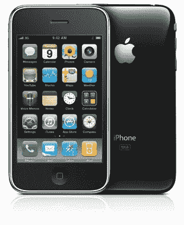
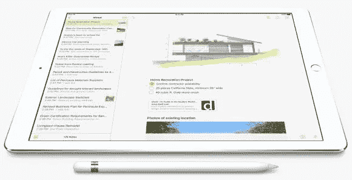

# 苹果产品后缀简史

> 原文：<https://medium.com/swlh/a-short-history-of-apple-product-suffixes-e58c722d78e5>

大多数电子公司都有庞大的产品线，这意味着他们经常在命名上挣扎。随着产品变体的积累，产品名称上的修饰语也在积累……直到最终市场营销中的一些可怜的人最终不幸地试图卖给我一台 ***iMX9600 S8 Ultra*** ，尽管我的 ***iMX8700 M9+*** 工作正常。

当然，众所周知，苹果避免了这一点。当史蒂夫·乔布斯在 1997 年回到公司时，他砍掉了所有复杂的产品型号和名称修饰语……除了一个:热门的新 PowerPC G3 处理器被认为是足够理想的，足以在“Power Macintosh G3”和“PowerBook G3”的产品名称中占有一席之地。(之前的型号被称为 Power Macintosh 9600 和 PowerBook 3400，这些数字毫无意义。)

从那以后，苹果公司在产品名称中非常少使用后缀。苹果使用的修饰词现在已经深入消费者的良心。您的计算需求更“空气”还是更“专业”？你是每隔奇数年就买一部新的 iPhone，还是追求新的数字？

这篇文章是那些不起眼的产品名称后缀的视觉清单。我注意到现在的苹果后缀有点令人惊讶:它们都是史蒂夫·乔布斯批准的。在 1986-1997 年间他不在时采用的后缀没有一个幸存下来，而今天仍在使用的一些后缀可以追溯到 30 多年前。

这就引出了一个问题:苹果什么时候会引入一个由不同 CEO 批准的后缀？蒂姆·库克会在产品命名史上留下自己的印记吗？还是乔布斯式的后缀组合会永远延续下去？(个人来说我是挺支持“Apple Watch IIIvx Hero SE”的。)

# + / Plus

原始修改器。苹果于 1979 年推出，比开创性的型号早了两年。(没错，苹果就是想让你这么写罗马数字二。)

Apple ][+ with two floppy drives

plus 在 1986 年的 **Macintosh Plus** 中再次出现，也是在最初的 1.0 产品两年后:

Mac Plus in its cool platinum color (the first non-beige Mac!)

在接下来的 30 年里，加号只在 1993 年的 **Macintosh LC III+** 和 2000 年的 **iMac DV+** 中出现过，如下图所示…

…直到它最终在苹果 2014 年推出的臭名昭著的“平板”外形中再次出现，即 **iPhone 6 Plus** :

# C

字母 C 伴随着 1984 年苹果现金牛电脑模型的彻底重新设计:

The future is monochrome but nearly portable

由青蛙设计公司设计的,**苹果 IIc** 在外观上与之前笨重的苹果 II 型有很大不同。后缀“c”代表“紧凑”。一种被称为“白雪公主”的设计语言与这种特殊的计算机设计一起被创造出来。人们经常提到，在苹果 IIc 和“白雪公主”上与青蛙合作对乔布斯的设计思想产生了持久的影响。

1989 年，小写 C 出现在 **Macintosh IIcx** 和 **IIci** 机型中:

IIci 是第一款价格合理的彩色 Mac 电脑。我怀疑字母代表“彩色集成”，因为这也是第一个内置显示器支持的型号(换句话说，你不需要显卡)。

在那次成功之后，苹果公司的业务因字母 c 而放缓。只有 1992 年的 **PowerBook 5300c** 和 **PowerBook Duo 2300c** 使用了它:

The “Duo” suffix indicated docking capability

在这里,“c”显然代表“颜色”,因为它后来也被用在一些既有彩色又有单色的 PowerBook 型号上。

在退出舞台 20 年后，“C 代表色彩”在 2013 年随着 **iPhone 5c** 重新浮出水面:

Pastel plastic? That’s so 2013.

就我个人而言，我对 2015 年没有出现 iPhone 6c 感到相当失望，但显然我对非金属手机的偏好是少数。(可悲的是，现在颜色似乎到处都过时了——就连 Lumias 也不再有黄色了。)

# S

啊，s。我们都知道它的意思是“速度”，或者在实践中，“不变的设计加上新的 CPU 和一些半有用的新功能”…

据我估计，第一款 S 产品是 1986 年的苹果 IIgs:

这台电脑完全是苹果二代的翻版。它有更好的图形和音频功能，以及更快的 CPU——高达 2.8MHz！因此，似乎“g”代表图形,“s”代表速度。

下一个 S 型是 1990 年的麦金塔 IIsi:

它不是速度恶魔，但有一个新的超薄外壳，所以“s”可能意味着“苗条”或“流线型”。

在 1995 年，有几款类似于 **PowerBook 5300cs:**

Big bones. This truly was the low point of Apple’s laptop design.

这里的“s”表示“双扫描颜色”。我真的不知道那是什么意思…不过，我肯定它打败了老式的单扫描彩色打印机。

2009 年，随着 **iPhone 3GS** 的推出，我们再次见到了“Apple IIgs”这个漂亮的后缀:

That skeumorphic microphone app was actually pretty awesome.

这是大写字母 s 的水印。接下来是每隔一年的 **iPhone 4S** 、 **5S** 和 **6S** ，看起来很有可能我们会在 2017 年 9 月看到 iPhone 7S。

# 微型汽车

下一个后缀将我们坚定地带入第二个乔布斯时代。iPod mini 于 2004 年 1 月发布，这款机型真正将 iPod 从一个奢侈的小玩意变成了一个家喻户晓的名字:

Can we have this lime green on a MacBook Pro please?

今天令人惊讶的是，iPod mini 实际上只有一个小小的 4GB 硬盘，而不是闪存——那些存储芯片在当时仍然很贵。

一年后的 2005 年，下一款迷你苹果出现了:

Mac mini 今天基本保持不变，采用了极简的包装:不包括键盘和鼠标。

迄今为止，最后一款 mini 是 2012 年的 **iPad mini** ，它以 7.9 英寸平板电脑而闻名，几年前乔布斯曾宣称 7-8 英寸平板电脑小得无用:

“iPhone mini”偶尔会有传言，但迄今为止还没有任何迹象。(我可能会认为这是新兴市场的市场份额扩张——也许是 5c 风格的塑料外壳中的 iPhone 4S 屏幕，配有最便宜的可以运行 iOS 9 的 CPU，比合同价格低不到 99 美元？)

# 赞成

虽然它现在看起来像是一个主流，但 Pro 后缀直到 2006 年才被引入。在此之前，苹果的专业 Mac 系列长期以来一直使用“Power”前缀(如 PowerBook 和 Power Mac)，但它与 PowerPC 处理器相关联。随着苹果改用英特尔处理器，一个新的命名方案已经准备就绪。

最先出现的是 **MacBook Pro** :

它看起来就像它取代的 PowerMac G4。同样的情况也适用于 2006 年年中发布的 Mac Pro——它重新使用了 Power Mac G5 的外壳设计，尽管内部结构发生了很大变化。

Mac Pro 终于在 2013 年迎来了设计革命:

这是一款看起来不像苹果产品线中其他任何东西的电脑。这同样不适用于 2015 年的 **iPad Pro** ，它看起来就像一个带可选手写笔的大 iPad:

“iPhone Pro”还有空间吗？苹果最近一直在谈论 iOS 进入企业，所以谁知道呢…让公司购买更贵的 Pro 机型不会损害他们的底线。(也许类似于微软在 Windows 10 Mobile 中的[“Continuum”功能可以成为手机上的“pro-only”功能，但我不太认为这会发生，因为 iOS 应用程序不是为在桌面风格的外设上使用而设计的。)](http://www.theverge.com/2015/10/6/9464639/microsoft-windows-10-mobile-continuum-hands-on)

# 空气

2008 年 1 月，苹果公司的最新产品后缀 **MacBook Air** 从一个信封中被拿出来:

经过一个相当缓慢的开始，Air 系列的性能最终赶上来了，它成为了一款畅销书，在一段时间内完全取代了普通的 MacBook。

唯一的其他 Air 是 2013 年推出的 **iPad Air** :

来自假设部门:超薄的“iPhone Air”可能会在时尚人士中获得成功。“Mac Air”很难想象，或许除了像 Chromecast 一样连接到高清电视的棍子式小装置？然而，我真正想要的是一台“Apple Watch Air”。体积大是智能手表的主要问题:如果苹果能把设备变薄成带状，我会欣然接受。

# 零碎东西

这就结束了目前使用的后缀的图示。还有 iPod touch，但作为同类产品中唯一的一款，它还没有自己的一整块。

其他最近的后缀是 **iPod nano** 和 **iPod shuffle** 。我怀疑有一天我们还会看到另一个“纳米”……但是“洗牌”有希望被淘汰。

现在轮到蒂姆·库克了。他敢加入这个神圣的阵容吗？

发表于*[**# SWLH**](https://medium.com/swlh)**(***创业、流浪、生活黑客)**

******