# 一个简单的技巧让我们在脸书的广告上获得 10 倍以上的社会证明(没有额外的成本)

> 原文：<https://medium.com/swlh/a-simple-hack-which-gets-us-10x-more-social-proof-on-facebook-ads-at-no-extra-cost-1cbf0696f0e>

***更新:****2019 年 6 月 16 日*

Published on [Reddit](https://www.reddit.com/r/Entrepreneur/comments/8h16cp/a_simple_hack_which_gets_me_10x_more_social_proof/) and [Udonis.co](https://www.blog.udonis.co/social-stacking-method)

如果你是一名企业家或营销人员，一直在寻找新的方法来改善你在脸书的活动，你会喜欢这个方法的。

当你读完这篇文章的时候，你会知道如何使用& deploy 这个简单的技巧，我们的代理机构用它来为我们的客户获得 10 倍以上的广告参与度(社交证明),而且没有额外的成本。

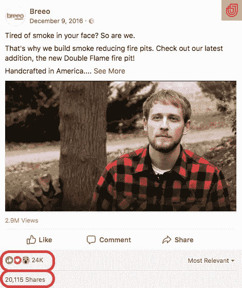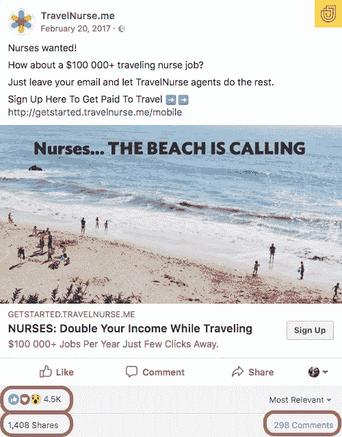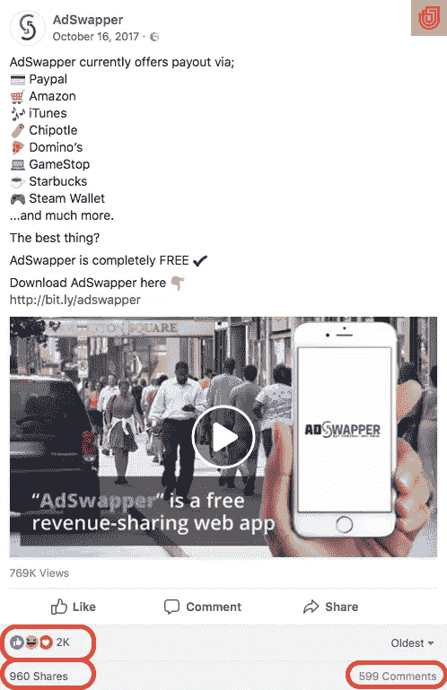

Here’s a couple of ads on which we deployed this hack

部署它不会花费您超过几分钟的时间，并且结果将在 24 小时内可见。你将获得更多的参与度(喜欢、评论和分享)，这将导致更多的参与度，最终导致**更高的点击率**，**更低的 CPM** ，**更低的 CPC** ，**更低的 CPA** & **更多的收入**。

# 脸书的社会叠加法

标准的脸书竞选结构如下所示:

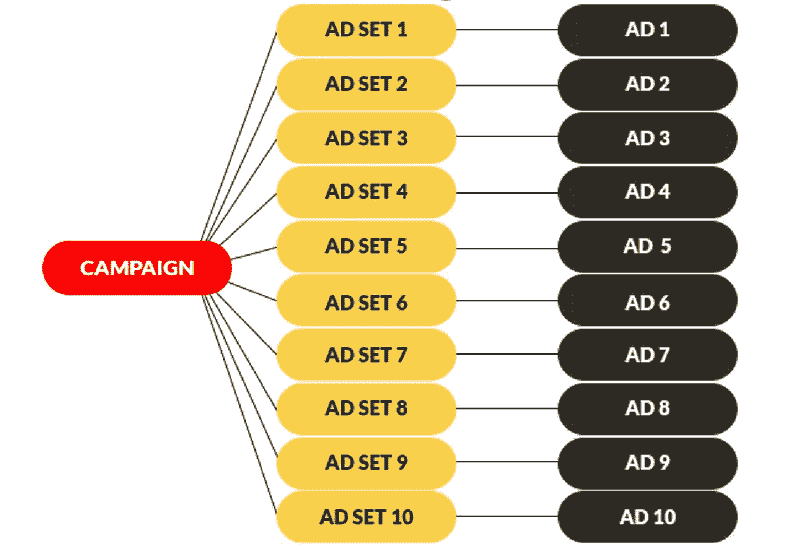

The Standard Campaign Structure on Facebook

你有一个为特定的优惠或促销活动。在广告活动中，你有*100 个*的*广告组合*，它们用*100 个*不同的*广告*针对不同的受众。

随着活动的进行，你收集了更多的数据，你发现一个**胜出的广告**比其他任何广告都表现得更好。然后，您将再次制作 *ad 套*的 *100s* 。每个广告集将包含**同一个获胜者广告**，但不是只有一个广告，而是有*100 份*同一个获胜者广告。很荒谬，对吧？

有了这种活动结构，同一广告的所有 100 份拷贝都将获得一些参与度。

几个赞、评论或分享……但是如果你能把所有的参与度，也就是社会证明，都放到一个广告里，会怎么样？幸运的是，你可以。

> 我们称之为“社交堆积”。

社交堆叠背后的想法非常简单——不是让 100 个广告集指向同一广告的 100 个副本，而是将所有的广告集指向一个广告。

以下是活动结构的不同之处:

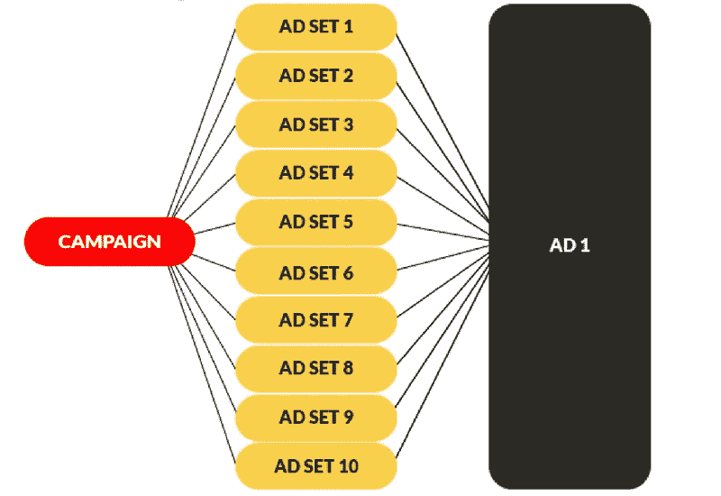

The Social Stacking Campaign Structure

这是社交堆栈在实践中的样子；

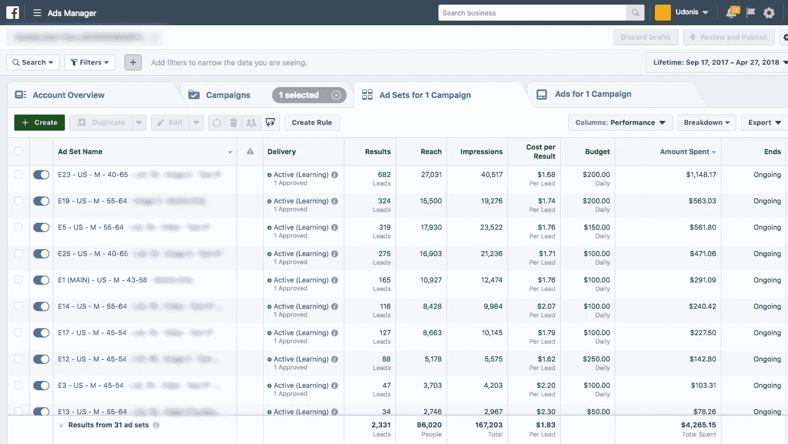

E1 (MAIN) is the main ad to which all ad sets are pointed to

# 社交堆叠法怎么部署？

正如我所承诺的，部署这个不会超过几分钟。这种方法仅适用于脸书(桌面和移动)和 Instagram(仅移动)上的*新闻推送位置，*参与度可以通过反应、评论和分享的形式来体现。

打开你的*脸书广告管理器*，采取以下步骤:

## 步骤 1 —选择广告

选择您要将所有广告集指向的广告(在活动的广告级别)，然后单击*编辑。*

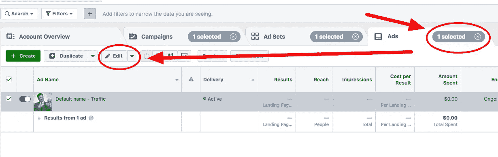

## 步骤 2-获取广告 ID

在*广告预览*部分点击*分享预览*按钮，然后点击*脸书带评论的帖子*。如果你在 Instagram 上投放广告，你会点击带有评论的 *Instagram 帖子*。

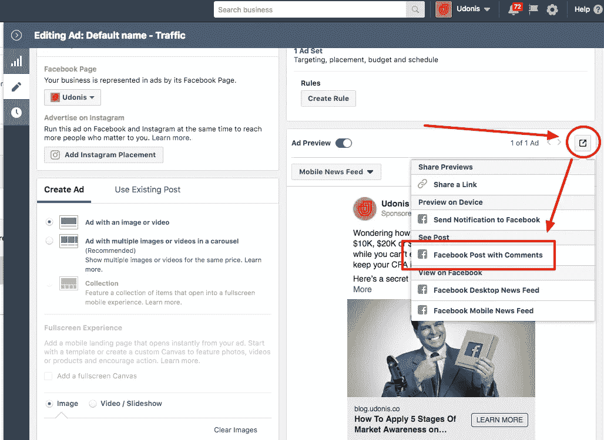

一旦广告加载，看看网址。

在脸书上，你会有两串数字被中间的 */posts/* 打断。**选择**和**复制**第二串数字。

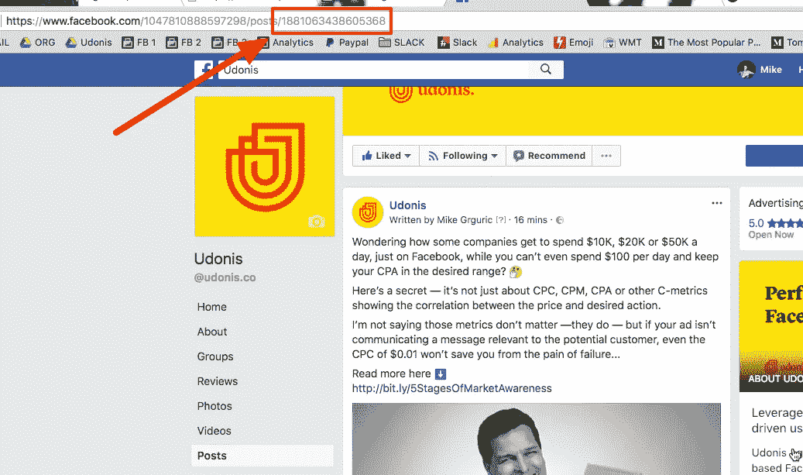

如果你在 Instagram 上这么做，你只会得到一个字符串，你将**选择**和**复制**。

## 步骤 3 —应用广告 ID

在这一步中，您需要创建一个新的广告集或复制现有的广告集(复制会更快)。改变你想要的(年龄范围、国家、性别、兴趣等)，然后进入这个新广告集的广告级别。

再次点击*编辑*，然后点击*使用现有位置*

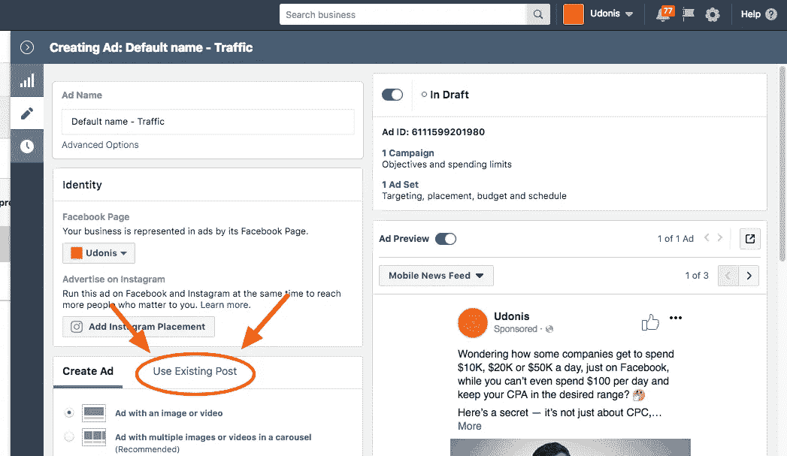

点击*输入文章 ID* 并粘贴您在**步骤 2 中获得的广告 ID。**

点击*提交*，然后*发布*广告。

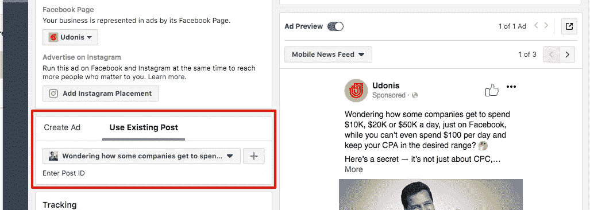

## 第四步——重复你想要的次数

将更多广告集指向此广告的最简单方法是复制您创建的第二个广告集(因为它已经使用了第一个广告集中的现有帖子)。

这种方法也很好，因为它允许您在几分钟内添加多个新的广告集。如果你正在运行健壮的分割测试系统或者发布一个新产品，这是非常有用的。

# **更新**

随着*脸书广告管理器*界面的最后改变，脸书简化了你选择*现有帖子*的方式。

对于脸书，点击*选择帖子*，然后通过*名称*、*关键字*或*帖子 ID* 继续搜索您想要使用的帖子。

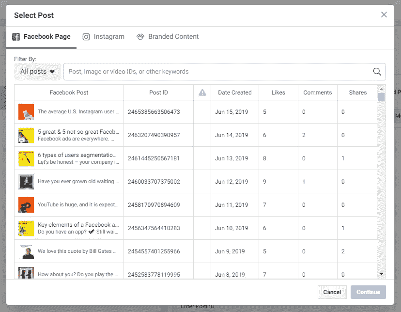

Facebook Page Existing Post

对于 Instagram，过程非常相似，点击*选择帖子，*然后在上层菜单中选择 Instagram，然后通过*名称*、*关键字*或*帖子 ID* 继续搜索您想要使用的帖子。

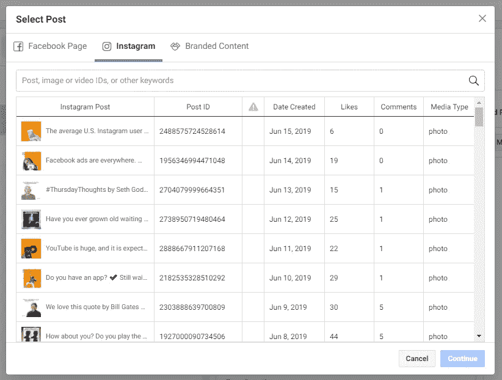

Instagram Existing Post

另外，请注意，现有帖子选项并不适用于脸书的所有活动目标。它可用于以下目标:

*   品牌知名度
*   到达
*   交通
*   约会
*   视频视图
*   转换策略
*   信息

虽然它不适用于:

*   应用安装
*   线索挖掘
*   目录销售
*   商店流量

*目标内的不同优化可能适用例外情况。*

# 接下来的步骤…

你能相信这么简单的事情会有很大的不同吗？

嘣！它可以…所以，现在就把这个方法付诸行动&让我知道你看到了什么样的结果。

有什么要补充的吗？评论如下👇或者在[脸书](https://www.facebook.com/mike.grguric)与我连线。

## 这个故事发表在[的创业](https://medium.com/swlh)上，这是 Medium 最大的创业刊物，有 331，853+人关注。

## 订阅接收[我们的头条新闻](http://growthsupply.com/the-startup-newsletter/)。

