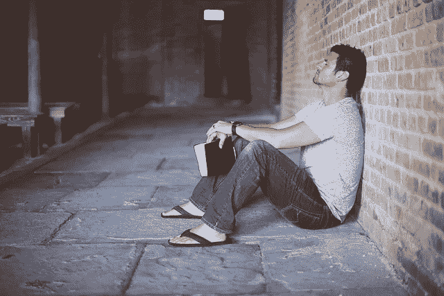

# 打破坏习惯的简单思维编程练习

> 原文：<https://medium.com/swlh/a-simple-mind-programming-exercise-to-break-bad-habits-1dfef6c163fe>

[Pexels/pixabay](https://pixabay.com/en/alone-book-brick-wall-man-person-1869997/)

当我们想到动机时，我们脑海中浮现的是积极、活力和良好的感觉。想象一下吉祥物和拉拉队让整个体育场的体育迷欢呼雀跃。

还有一种 [**动机**](https://ideavisionaction.com/personal-development/the-dark-side-of-motivation/) 的阴暗面，涉及恐惧、愤怒、厌恶等各种负面情绪，以鼓励高绩效或劝阻不想要的行为。想象一下，一个体育教练对着他们的球队大喊大叫，让他们怒火中烧。

动机的阴暗面可以成为戒除不良行为的有用工具。恐惧和厌恶的感觉是强大的动力。

我用动机的阴暗面 [**戒掉偶尔吸烟的**](https://ideavisionaction.com/personal-development/eliminating-bad-habits-with-the-dark-side-of-motivation/) 。为了做到这一点，我在香烟包装和互联网上使用了癌症器官的可怕图像。今天，我将深入探讨这个话题，并分享另一个强大的练习。

# 我们头脑的一个简单模型

为了简单起见，我们假设你的思维由两部分组成，意识和无意识。在这个模型中，你可以把你的潜意识想象成一个强大的、活跃的、但是愚蠢的人。与此相反，你的意识是虚弱的，懒惰的，但是聪明的。

我们有意识和无意识思维的特性让我想起了 [**大卫和歌利亚**](https://ideavisionaction.com/personal-development/why-do-your-personal-development-efforts-fail-and-what-to-do-instead/) 。在这个模型中，我们有意识的头脑是大卫，无意识的头脑是歌利亚。

**潜意识/歌利亚**

*   强大的
*   活跃的
*   哑的

**意识思维/大卫**

*   无力的
*   懒惰的
*   聪明的

# 我们的思想和行为之间的关系

由于其强大和活跃的性质，我们的潜意识在大多数时候决定了我们的行为。潜意识也是我们的习惯所在。

我们的意识对我们行为的直接控制是有限的。然而，我们可以利用这种有限的控制来给我们的潜意识编程。

我们的无意识思维与联想一起工作，并被情感所驱动。快乐是我们潜意识的强大动力。

# 放弃失败的策略

想象你的潜意识把你的网瘾和快乐联系在一起。你的意识已经完全意识到网瘾的负面后果。所以，在你的大卫和歌利亚之间有一场战斗。

如果战斗是基于权力，最后谁会赢？当然是歌利亚。大多数时候，我们就是这样对待我们的坏习惯和嗜好的。这就是我们未能消除它们的原因。

但是，大卫有一个优势，智力。我们可以利用我们有意识头脑的智慧来重新编程我们的无意识头脑，以打破不想要的习惯和成瘾。让我们看看我们能做些什么。

# 有效的策略

为什么我们的潜意识会染上坏习惯和毒瘾？因为这让他们联想到美好的感觉。这就是**上瘾的心理。我们如何改变这种行为？用负面联想代替正面联想。**

**这种方法的一个例子是将吸烟与癌变器官的图像相关联。现在，让我们学习另一种方法，它使用 [**痛苦和快乐**](https://ideavisionaction.com/personal-development/the-principle-that-explains-all-human-behavior/) 的原理。**

# **消除坏习惯的有效方法**

**拿一张纸。把它转向一边，这样你就有了横向模式，并把它垂直分成两部分。**

**在右手边，把你想戒掉的瘾写在最上面。然后用要点写下这种瘾的不同表现。**

**不要写长句子和段落，每个要点只用几个词。在这个练习中，我们想让事情尽可能简单，因为它是为我们的潜意识设计的。记住，歌利亚没那么聪明。**

**在左边，用要点写出你上瘾的后果。同样，保持事情简单。这些后果可能是你已经经历过的，也可能是你害怕的。理想情况下，两者都有。**

# **陷入负面情绪中**

**一旦你准备好了你的论文，是时候反思一下了。看左手边，进入心理痛苦的感觉。那可能是恐惧、愤怒、厌恶或任何其他对你的负面感觉。**

**一旦你强烈地感到疼痛，看着右手边，感受强烈的疼痛，直到它消退。然后，再重复一遍。你想花多少时间做这个练习就花多少时间。**

**每天至少重复锻炼一次，至少坚持 30 天。在过渡阶段，如果冲动出现，提醒自己后果。**

**如果你正确地做到了这一点，下一次你想到沉迷于你的瘾时，你会感到如此强烈的痛苦，以至于你宁愿跳过它。这是一项激烈、令人不快，但却是一项强大而有效的运动。**

# **摘要**

**我们的习惯和嗜好存在于我们强大、活跃而又愚蠢的潜意识中。我们的意识无法战胜我们的无意识，因为它的本性很弱。**

**我们的潜意识与联想一起工作。它将习惯和嗜好与良好的感觉联系在一起。我们可以用我们的意识打破那些积极的联想，用消极的联想取而代之。**

**为了做到这一点，我们需要准备一篇论文，在右边详细描述我们的上瘾，在左边描述上瘾的后果。**

**这个练习包括感受后果的痛苦，然后在感受那些负面情绪时阅读我们上瘾的细节。**

**如果你坚持每天做这个练习至少 30 天，你的潜意识会开始将你的成瘾与疼痛联系起来，不会像以前那样有动力沉迷其中。**

*****如果这篇文章引起了你的共鸣，*** [***注册我的电子邮件简讯***](https://ideavisionaction.com/email-newsletter/) ***每周都会收到我关于个人发展和生活教训的最新文章综述。*****

****

## **这个故事发表在 [The Startup](https://medium.com/swlh) 上，这是 Medium 最大的企业家出版物，拥有 356，974+人。**

## **在这里订阅接收[我们的头条新闻](http://growthsupply.com/the-startup-newsletter/)。**

****