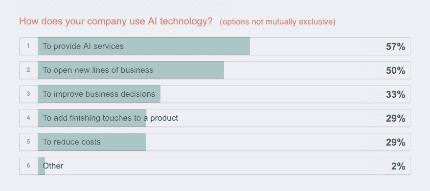
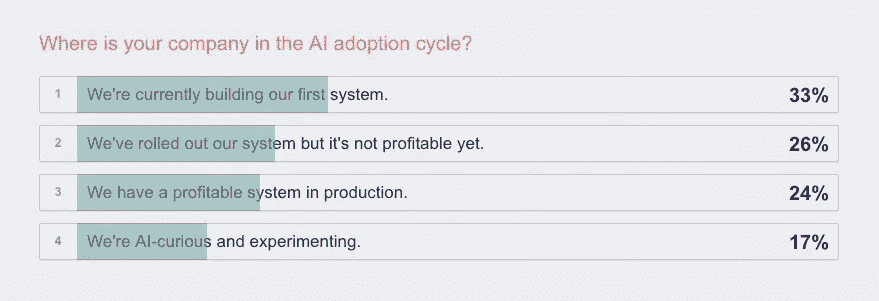
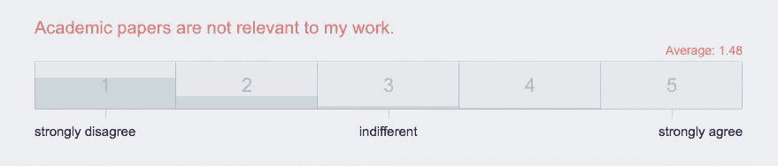
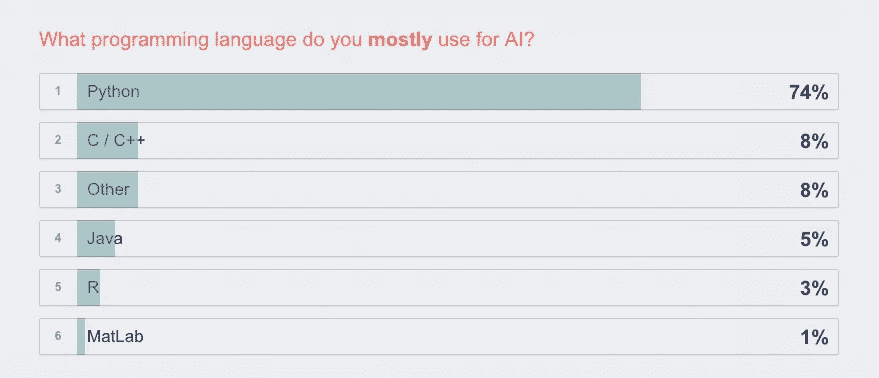
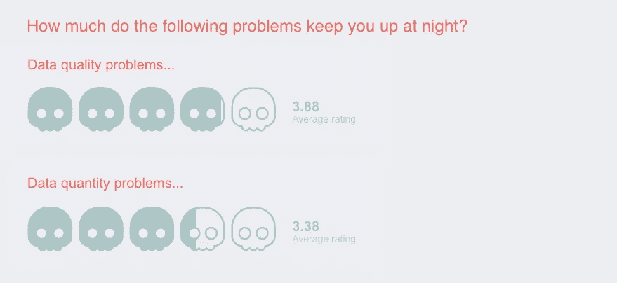
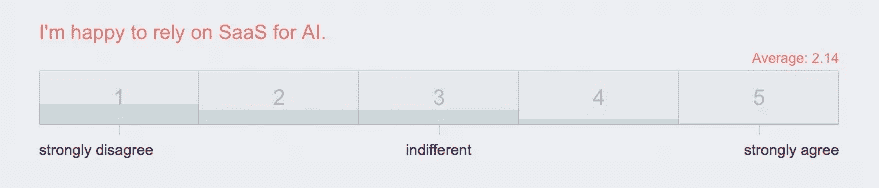

# 先睹为快 2016 的状态

> 原文：<https://medium.com/swlh/a-sneak-peek-at-the-state-of-ai-2016-d5d079e0c4de>

## 我们关于机器学习、自然语言处理和计算机视觉调查的早期趋势

昨天，我们开始收集对我们的人工智能状态调查的回应。尽管调查才刚刚开始，我们还是忍不住想看看结果，结果已经显示了一些有趣的模式。

如果您已经参与了调查，谢谢您！我们希望你喜欢看别人是如何回答的。在我们从从事人工智能技术的**研究人员、开发者和产品所有者那里得到更多回应之前，这些数据不会真正有用。如果是你，我们希望你参加[调查](https://thestateofai.com)，并与你的同事分享。**

# 人工智能正被用于开辟新的业务领域

我们期待看到每个行业的细分情况。

# 仍然处于人工智能采用周期的早期

在从事商业系统工作的受访者中，24%的人说他们的系统已经盈利。我们对此已经有很多疑问了。例如，*的新业务*已经盈利了吗？一旦调查[完成](https://thestateofai.com)后，我们会给每个人原始数据，所以你可以尽情挖掘。

# 没有人认为学术论文是不相关的

研究和生产之间有很强的知识转移。这使得高级研究学位非常有价值，并鼓励公司投资于内部研究。

# Python 是人工智能开发的(包装)语言

这些早期的结果可能有点偏向 Python。我们是 Python NLP 库 [spaCy](https://spacy.io) 的开发者，所以 Python 开发者在我们的网络中占据了很大比例。

# 数据质量是一个比数据数量更大的问题(但不会大到哪里去)

我们还询问了效率、内存使用、准确性和版本问题。这些问题对每个人来说都是一样的吗，还是取决于你所使用的语言，你所在的行业，以及你的公司在开发周期中的位置？

# 没有人喜欢依赖 SaaS

看看哪种类型的人工智能开发对 SaaS 最友好，哪种类型最不喜欢依赖它将会很有趣。

# 参加调查，并与您的同事分享！

[https://thestateofai.com](https://thestateofai.com)