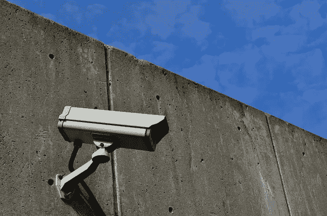

# 隐私难题的解决方案

> 原文：<https://medium.com/swlh/a-solution-to-the-privacy-puzzle-7e23b30fcb96>

*个人和企业的机会*

[ElasticComputeFarm/pixabay](https://pixabay.com/en/cctv-security-camera-1144366/)

前两天在一个中评写了两句关于宜家的话。同一天，我开始在另一台设备上接收 YouTube 上的宜家广告。

几天前，我从 audible.com 买了雷伊·达里奥的有声读物《原理》。从那以后，YouTube 开始向我推荐雷伊·达里奥的视频。**也许这只是一个巧合，或者谷歌从我的 Gmail 账户中检测到了收据。**

YouTube、Medium 和 Audible 只是最近的例子。还有其他网站使用这种类型的做法。

**被跟踪的感觉**

当我看到不相关的网站之间的连接时，我的“蜥蜴脑”会抓狂。我有被跟踪的感觉。

> 我感觉就像一个令人毛骨悚然的销售人员在看着我的一举一动，在某个地方记录下来，并试图用它来对付我，向我推销商品。

然后，我想知道“他们”还知道我什么。我说的“他们”是指所有互相出售数据的互联网公司。

**数据帮**

网站收集我的数据是一回事。当他们“联合起来”对付我时，那完全是另一回事。感觉好像我所有的数据都保存在一个中央数据库中使用。那种做法感觉就像“老大哥在看着我。”

我知道没有一个收集所有数据的中央数据库。然而，网站之间的所有数据经纪服务，这就是它的感觉。马克·扎克伯格在最近的听证会上承认使用了数据经纪服务，脸书并不是唯一一个这样做的人。

**大数据的优势**

我大脑的另一部分说我毫无理由地担心。我没什么好隐瞒的。这种联网数据的使用对我来说是有好处的。它为我提供相关的内容、产品和服务。

在最近的听证会上，马克·扎克伯格认为这种类型的数据使用对小企业有好处。他们可以更便宜地宣传他们的产品和服务。因此，消费者可以更便宜地购买这些产品和服务。

> ***大数据使得广告以及产品和服务更加便宜。***

当然，其中一些对我们大家都有好处。我们所有人都有机会。没有什么能阻止我们使用这些服务来宣传我们自己的产品或服务。我们中的一些人甚至可以找到利用数据建立业务的方法。

甚至一个博客写手或社交媒体影响者也能从他们的数据中学到很多。我不是一个有影响力的人，但是当我进入中等状态时，我想出了发表在十篇博客文章中的教训。而这仅仅是开始。

**大数据的阴暗面**

大数据是关于操纵人的。数据被用来让我们尽可能长时间地呆在一个网站上，即使它违背了我们的利益。它被用来从我们的口袋里榨取尽可能多的钱。在最坏的情况下，它被用来操纵我们以某种可能不符合我们最佳利益的方式投票。

以前，我使用亚马逊的会员链接。我的目标是销售个人发展书籍。推荐给我人生增值的书。我希望这些书也能给其他人的生活增加价值，并获得回报。

有一天，我收到了一个代销商的销售通知。我送到亚马逊的人不仅买了我推荐的书，他们还买了一些手镯。我为他们感到难过。

我觉得我让一些人把钱浪费在了他们不需要的东西上。我不是来当廉价手镯推销员的。我报名成为一名图书推销员。亚马逊把一个读书人变成了一个手环购物者。

**未来的商业模式**

我知道你们有些人担心[传媒](/)商业模式的可行性。我们喜欢媒体，因为它不会用大量的广告轰炸我们。过去，我发表了一篇关于媒体可能的盈利方案的文章。

也许，我们是在杞人忧天。也许，Medium 已经在将我们的数据货币化了。也许，高级会员只是一个回答“你如何赚钱”这个问题的门面。我不知道。

有一件事我可以肯定。

> ***越来越多的互联网业务将基于向第三方出售其用户的数据。***

这已经是一种普遍的做法，如果不加以管制，这种做法将会进一步蔓延。欧洲联盟已经采取措施反对这种做法。

**仔细审视你使用的每一个设备、应用和工具。**

最近，我收到了很多关于 Grammarly.com 的建议。最后，我想给他们一个尝试。他们可以选择在我的浏览器上安装插件。当我试图这么做时，Firefox 警告了我。

如果我安装了这个插件，我在浏览器中输入的所有内容都会通过这个插件。

> 我不太了解 Grammarly.com，所以不会把我在浏览器里输入的所有东西都交给他们。我没有安装它。

还有一个我经常使用的工具，海明威应用。是一款文艺风格检查 app。他们允许我复制并粘贴我的文本到他们的在线编辑器。这意味着我知道并选择将哪个文本发送给他们的服务。为什么 Grammarly.com 不能提出类似的东西？

也许，海明威应用程序也向第三方出售我的数据。我可以接受这一点，因为我把这些文本作为博客文章发表。很可能，其他人会收集并出售这些数据。

想想你使用的所有免费增值工具。

我用 Evernote 和 Workflowy。这两个工具都有免费版和付费版。他们似乎从他们的高级订阅中赚钱。他们会把我的数据卖给第三方吗？我不知道。我没看过他们的隐私政策。

**数据巨头谷歌**

很明显，你使用的任何谷歌产品都会收集你的数据。我在 iPhone 上使用 Gmail、Google Drive、Google Maps 和 Google 的搜索应用。很多人使用安卓手机和 Chrome。想想所有这些应用程序和手机收集的所有数据。

谷歌的付费服务怎么样？我为 Google Drive 付费。他们对待付费客户的隐私和对待免费客户的不同吗？大概不会。

> 也许，购买额外的谷歌硬盘空间是一个错误。也许，我应该在一个更尊重我的隐私的服务中购买磁盘空间。

使用 iPhone 不足以被谷歌追踪。通过使用谷歌地图，我将自己暴露在他们的数据收集中。

在某种程度上，数据收集是有好处的。它告诉我交通和杂货店的高峰时间。然而，我不知道他们收集的所有数据还做了什么。脸书和谷歌收集了大量数据。查看此[守护片](https://www.theguardian.com/commentisfree/2018/mar/28/all-the-data-facebook-google-has-on-you-privacy)了解更多信息。

**消息应用怎么样？**

脸书如何使用“什么是应用程序”数据？What's App 不是一个人们愿意公开分享自己信息的社交应用。这是一个私人信息平台。通过该平台共享的数据要敏感得多。苹果的 FaceTime 怎么样？

**苹果和微软怎么样？**

我们不希望苹果和微软收集我们的数据。毕竟我们为他们的硬件和软件付出了很大的代价。

是这样吗？iPhone、Microsoft Office 或 Windows 会收集哪些关于我们的数据？他们如何使用这些数据？我不知道。

我从来没有向我的 iPhone 输入过我的家庭或工作地址或工作时间，但当我即将离开时，它一直告诉我需要多长时间才能上班。这也令人毛骨悚然。

**隐私难题的解决方案**

只使用开源软件是一种选择。我不知道这是一个多么可行的选择。

另一个选择是提出标准的隐私认证。每个证书可以表示不同的隐私级别。类似于白金标准、黄金标准和白银标准。每个级别都将在网上清楚地记录下来。

该文档将有两个版本。普通人能理解的东西，用容易理解的图表解释。如果有必要的话，还会有一个法律版本在法庭上使用。

独立审计员可以根据每项标准对公司进行核查，并向它们颁发证书。公司可以选择是否认证他们的产品或服务。

> ***如果谷歌和脸书选择不认证他们的产品或服务，那么人们会知道他们从这些产品和服务中获得的隐私级别。***

最终，他们可以提供不同层次的产品和服务。可能会有没有隐私认证的免费版 Gmail 和 Google Drive，以及有不同级别隐私认证的高级版。

**结论**

像普通的科技用户一样，隐私对我来说是一个大谜团。我不知道我使用的软件和网站从我的使用中收集了哪些数据。我不知道他们如何使用从我这里收集的数据。有一件事我可以肯定。感觉被大哥哥跟踪了。

有一个解决隐私难题的方法。这个解决方案同时也是企业的一个机会。

> ***只要想出简单易懂的隐私等级，并用这些等级认证产品和服务。***

这样，用户知道他们注册了什么，企业可以从优质产品和服务中创造新的收入。

***如果你觉得这篇文章很有价值，注册*** [***每周简讯***](https://ideavisionaction.com/email-newsletter/) ***就可以收到我关于创业、企业家精神、领导力和自我提升的文章综述。***

## 这篇文章发表在 [The Startup](https://medium.com/swlh) 上，这是 Medium 最大的创业刊物，有 317，238+人关注。

## 在这里订阅接收[我们的头条新闻](http://growthsupply.com/the-startup-newsletter/)。

