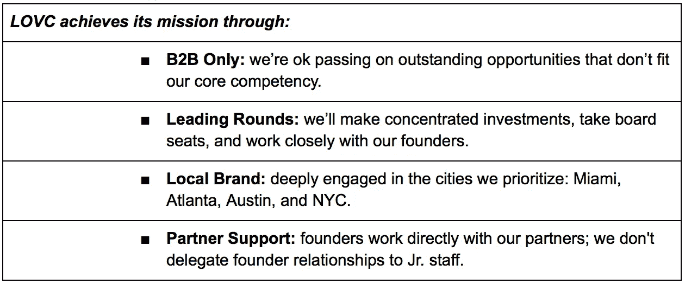
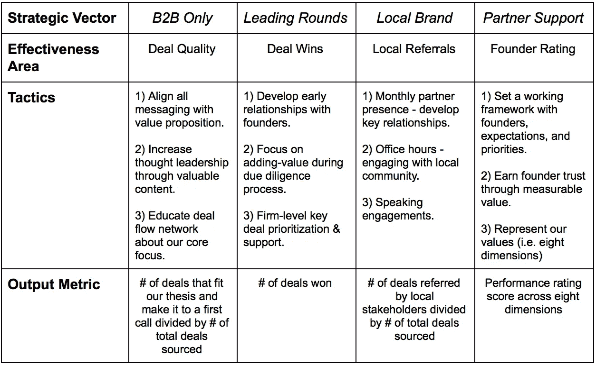
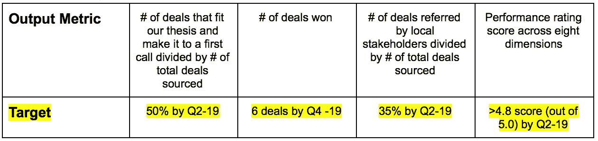
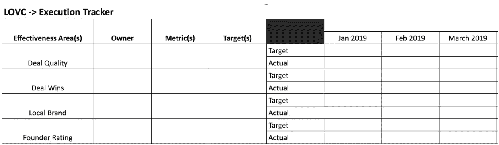
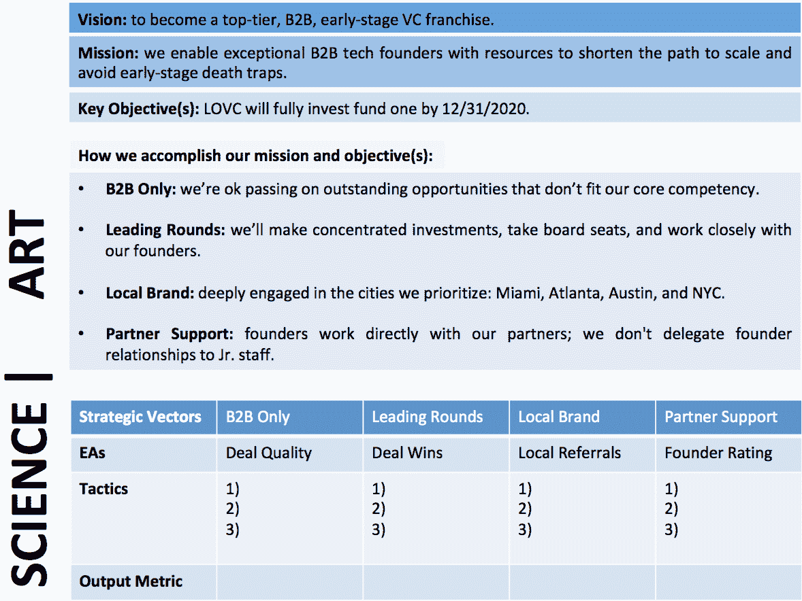

# 创业公司的操作系统

> 原文：<https://medium.com/swlh/a-startups-operating-system-859912c3d2dd>

*由* [*埃斯特万*](https://medium.com/u/e50a50a5c0a7?source=post_page-----859912c3d2dd--------------------------------) *创始合伙人*

# 摘要—TL；速度三角形定位法(dead reckoning)

人们说*“快速完成任务”*在创业中最重要。虽然我同意这种说法的意图，但我不喜欢它的陈词滥调、模棱两可和不完整。

有效的执行不仅仅是快速完成任务。速度在初创企业中非常重要，但创业者的操作方式往往过于被动。投资者可以通过提高响应度的价值来鼓励这种行为。我发现被动的反应也是执行不力的一个主要标志。

相反，我建议**创业中最重要的(也是被低估的)事情**是**实现一个设计良好的操作系统(OS)** 将愿景、战略和战术与产出指标联系起来。在早期阶段，实施操作系统可能被认为是不必要的，或者与浪费时间相混淆。但是拥有一个操作系统会带来难以置信的清晰和专注，从而带来有效的执行。

不可避免地，设计和实现一个操作系统需要时间和精力，而且做得好的话，回报也是丰厚的。

本文档不是操作指南，也不是详尽的实施手册。它的目的仅仅是为创业者和团队提供一种设计、实施和运营创业公司的思维方式。

# 启动操作系统原则

一个操作系统的动力是什么:很明显，人越有经验、越聪明越好。但是一群聪明、有动力的人一起工作并不总是等同于一个高效的团队。团队的速度和效率很大程度上取决于其领导者的能量水平，以及他们所拥有的操作系统有多好。为了交付成果，聪明的人需要明确他们的目标、资源、权力和指导。

**主要特征:** IMO 最好的创业操作系统共有五个属性:

结构化的:被设计成所有的输入和输出都朝着相同的目标协同工作。

高效:以最少的能源浪费产生最大的产出。

适应性强:容易适应新的环境或要求。

*4)仪表化:*捕捉并报告关键情报，操作员可利用这些情报做出决策。

*5)抗脆弱:*“[由于紧张性刺激、冲击、波动、噪音、错误、故障、攻击或失败而导致的]能力、复原力或稳健性的系统性]增加”——纳西姆·尼古拉斯·塔勒布，*抗脆弱:从无序中获益的事物(2012)*

**开箱即用的操作系统方法可能行不通:**关于 OKRs、MBOs、平衡计分卡等已经有很多文章，这些方法中的大多数都有有用的元素。然而，对于创业者来说，在创业的背景下很难实施和管理，尤其是对于第一次创业的人。

在 [Las Olas VC(又名 LOVC)](https://medium.com/u/11da95b5ce49?source=post_page-----859912c3d2dd--------------------------------) 我们观察到了三个主要问题:1)创始人脑子里都是这些东西，他们很忙，不想花时间将它们整理成一个操作系统，2)他们很难决定几个关键因素，3)对目标和 KPI 采取简单、零碎的方法，这些方法并不总是与全局相联系。

# 构建您的操作系统

构建您的操作系统就像堆积乐高积木。虽然没有规则，但创业公司的操作系统通常以愿景的定义开始，以团队可以用来操作的绩效仪表板结束。困难的部分是连贯地定义和连接介于两者之间的一切。

以下是初创公司操作系统的所有关键组成部分，以及我喜欢如何将它们拼凑在一起:

*   愿景:创业公司的愿景是创始人对公司未来定位的期望。一个好的愿景经得起时间的考验:它是具体的，任何人都可以理解，并且非常有抱负。它很少改变，反而随着时间变得更加清晰。

*愿景陈述示例:*

*   **使命:**使命陈述定义了初创公司的业务，可以作为做出艰难决策的指南针。这是可行的，非常简单地解释了什么是创业和它寻求解决的问题。

*使命陈述示例:*

*   **目标:**是实现愿景的可实现、可衡量的里程碑。当设计一个创业公司的操作系统时，所有团队成员必须明确[目标，并达成一致和理解。有长期和短期目标，它们通常是可以叠加和相互关联的。但是通常只有几件事是真正重要的——把你最好的精力集中在这些事情上。如果你做不到，这就是你的死因。](https://en.wikipedia.org/wiki/SMART_criteria)

*目标示例:*

*   **策略:**是你用来实现你的目标，并最终实现你的愿景和使命的方法。一个好的策略是明确的权衡——关于你做什么和不做什么。

*策略示例:*

*   **效率领域、策略和产出指标:**效率领域(EA)是你分配资源推动结果的地方。预期成绩需要是可衡量和可报告的。战术是你日常执行的关键活动，而产出指标是你衡量你的 EAs 和战术的有效性的方式。

*EAs、战术的示例&输出指标:*

**目标:**定义成功的样子，并帮助你的团队保持责任感。目标量化了你的团队的效率。关注错误的目标会导致不准确的结论和不一致。最常见的错误是混淆目标和努力。如果一个目标不能推动组织朝着它的目标前进，那么它应该被修改。

*目标示例:*

*   **执行仪表板:**是您用来衡量绩效的工具。当你在未知的领域导航时，它是让你保持正确方向的地图。最好保持简单，让所有团队成员都能接触到。

*执行仪表板示例*

**参见功能版** [**此处**](https://docs.google.com/spreadsheets/d/1825B5orm_6RXKtw7oqSU5urB5VMrDU1T0W29i9MbcMo/edit?usp=sharing)

# 操作您的系统

有了定义好的构件，你就可以“编译”你的操作系统，并让它发挥作用。操作你的系统需要一个由艺术家和科学家组成的团队。 ***艺术家*** 花大部分时间画“你创业的风景”，并激励人们去关心它。 ***科学家*** 开发并掌握你的创业公司创造和传递价值的方法。当艺术家和科学家齐心协力**时，卓越运营**就会发生。

操作操作系统的一个关键因素是一致性和纪律性。操作并不有趣，而且如果你不专心的话，很容易失去注意力。把你的操作系统当作指南针，让它朝着你的愿景前进。

*考虑以下情况:*

*   **建立一个执行仪表板—** 让它成为一个团队练习，让人们拥有所有权，不要试图推倒它。
*   **设定一个频率来定期回顾它****——这取决于你的公司、你的目标和你的团队的工作模式的具体情况——我发现每月一次是最低限度。**
*   ****任命一名首席仪表板官** —此人负责确保您的执行仪表板准确、准时地生成。**
*   ****强制要求出席** —你的整个领导团队都必须参加你的操作系统会议。**
*   ****这是一项全接触的运动:**“定了就忘了”是行不通的。它需要持续的监测和适应。**

# **结论**

**没有任何操作系统可以取代人类的智能、直觉、逻辑和合理的判断，但它可以放大。**

**启动操作系统是一个团队练习，没有规则，但它需要过程和纪律。它的复杂性随着你的团队和公司的成熟而变化。**

**重点:阅读、询问和挑选你能学到的所有关于创业公司运营方法的东西。拿出最适合您和您的团队的操作系统，并尽快投入使用。否则，你很可能只是迷失在太空中，希望一切都好。**

# **最喜欢的资源&我正在考虑写的东西:**

1.  **[*定义愿景和使命陈述*](/@gifted_products/how-and-why-to-start-a-startup-sam-altman-dustin-moskovitz-b83bdf87f745)**
2.  ***设定目标***
3.  **[*什么是战略？*](https://pdfs.semanticscholar.org/62a5/6cb47ec0a181da67358662446ab7d544c01f.pdf)**
4.  ***定义有效区域***
5.  ***确定优先事项和有效的工作计划***
6.  ***衡量团队绩效***
7.  ***性能仪表盘&工具***

****

## **这篇文章发表在 [The Startup](https://medium.com/swlh) 上，这是 Medium 最大的创业刊物，拥有+390，426 名读者。**

## **在这里订阅接收[我们的头条新闻](http://growthsupply.com/the-startup-newsletter/)。**

****