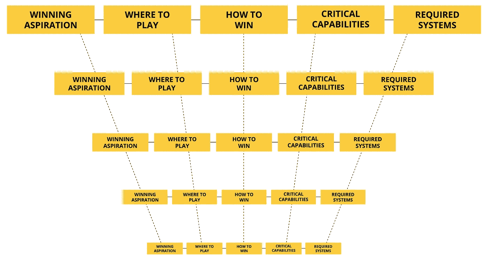

# 一个策略测试:它会筑巢吗？

> 原文：<https://medium.com/swlh/a-strategy-test-does-it-nest-afeb550f4345>

## 战略必须在公司内部层层传递

几天前，当我在当地苹果商店等待从商店后面拿出一件商品时，我有机会观察到苹果的前线战略在我面前展开。它围绕着另一个楼层的同事，帮助一位正在考虑购买苹果手表的男士。

现在，你可能会想，一个苹果员工真正需要什么样的战略？苹果设备是自己卖的吧？不对。尤其是苹果手表，这是一个看似与苹果核心业务无关的战略产品选择。许多专家质疑苹果的决定。对许多人来说，这是一个令人挠头的问题。

这种“看似不相关”的选择肯定有几个成功的条件，其中之一显然与零售销售人员的能力有关:与苹果的所有其他产品不同，手表是一种可穿戴产品，而且是一种时尚配饰。尽管苹果系列的其他产品在功能和技术上有相似之处，但苹果手表和任何佩戴它的人的手表一样，有着本质的不同。它成为你个人非常明显的一部分，当拥有它的新鲜感消失后，你会有一个问题，它是否反映了你的形象，以及相应的个人时尚感。因此，它需要一种新的销售能力，一种以个人形象、生活方式和时尚为中心的销售能力。

我记得当苹果选择在自己的实体零售店中播放时，另一个举动遭到了与 Apple watch 一样的媒体质疑。如果你还记得的话，当时的趋势是反方向的，更像亚马逊河流域的趋势:关闭实体商店，让网上零售繁荣起来。(有趣的是，亚马逊最近改头换面了……也许你已经注意到或者去过你当地购物中心的亚马逊弹出式商店。)

苹果零售店的选择是在史蒂夫·乔布斯的层面上做出的，但这一选择反过来需要在零售运营层面做出深思熟虑的选择，只需点击一下公司的选择。

正如我们现在所知道和经历的，苹果零售店策略清楚地反映了乔布斯关于简单、设计和独特的思维模式。实际上，零售战略与苹果的“think different”品牌非常吻合:天才吧的概念，完全没有排队和收银机，自组织的楼层员工，商店设计和产品展示——一切都与传统的零售店体验不同。

但是我跑题了。回到我的故事…

这是一个繁忙的中午人群，苹果手表站至少有六个顾客徘徊在它周围。一个同事已经在帮助别人了。我发现另一个正在接近大区域，它由两个平行的显示站组成:一个用于 Apple watch，另一个用于 iPad。这位助手看了两个人一眼，然后径直走向观察站。这引发了我的兴趣，因为 iPad 站周围的顾客也一样多。

我当时就意识到，这位特别的合伙人心中有一个策略。我在脑海中开始浏览整合选择的赢的框架:赢的渴望，在哪里赢，如何赢，关键能力，以及需要的系统。

如果苹果想要在“智能可穿戴”领域获胜，它需要将零售资源集中在它的成功上。换句话说，这位特殊的零售员工作出了一个战略性的选择，前往手表站，选择将他的个人和专业注意力投入到与零售和公司战略相一致的行动中。

在手表站为数不多的顾客中，有一位老先生拼命想显得精明，紧张地拨弄着显示表，但显然需要增强信心。这就是零售助理选择帮助的顾客。

*中奖愿望及地点:* ***勾选！***

不知何故，我无法想象这位先生戴着苹果手表的样子，所以我慢慢靠近去倾听和观察。这位同事说的第一句话不是“我能帮你吗？”或者甚至是一个“限定性问题”，而是一个反问:“有点令人困惑，不是吗？”马上，顾客放松了。你可以看到它。一声轻笑，一点头，一口气。用五个简单的词来说，一点点的共鸣就能产生即时的融洽。很快，我就明白了这位同事的竞争优势:与客户的共鸣。

*如何取胜:* ***检查！***

一旦在短暂的交流中建立了个人联系，问题就开始了:是考虑购买，还是只是探索并需要快速参观？为你还是为别人？你用其他苹果产品吗，比如 iPhone？

原来，这位客户正在考虑给他即将高中毕业的孙女买一块苹果手表作为生日礼物。这引发了一系列新的问题，更多的是关于时尚和生活方式，而不是功能。这位同事不再担心客户的可用性，因为他知道这位先生的孙女是 iPhone 的长期用户，但他担心具体的型号选择。她有最喜欢的颜色吗？她从事体育运动吗？

这位顾客不知道他孙女最喜欢的颜色是什么。这位同事问她喜欢穿什么，如果她有车的话，她的车是什么颜色，她的 iPhone 是什么颜色，她喜欢什么音乐。“她喜欢那个唱歌秀上戴帽子的人戴的那顶，”顾客说。这位同事的眼睛亮了起来。你可以从字面上看到正在形成的心理联系:“啊，苹果公司的战略产品放置在普雷尔的手腕上，他是 NBC《好声音》的明星教练。”原来她真正喜欢的是乐队颜色:粉色。对爷爷来说，这就决定了。

*临界能力:* ***检查！***

交易在几分钟内就在这位员工的改良版 iPhone 上完成了。电子邮件收据已发送到客户的 Apple ID 电子邮件地址。

*所需系统:* ***检查！***

整个体验不到五分钟…符合苹果“开箱即用”的理念

这个故事的要点是:如果你的顶级公司战略没有通过组织向下传递到前线，如果你的战略是“一劳永逸”的事情，你就错过了战略联盟的真正力量。在组织最高层之下的任何一层制定的战略都必须与它上面的一层嵌套。如果没有，用不了多久你就会听到员工的反馈:“我们真的没有战略。”

> 如果你的顶层战略没有通过组织向下传递到一线，你就错过了战略联盟的真正力量。

## 瀑布的纪律

许多公司擅长在整个组织中级联可测量的结果。在西方商界，彼得·德鲁克的“目标管理”或 MBO 在 20 世纪 50 年代开始流行，后来被英特尔公司的安迪·格罗夫采用，他创造了 OKR。OKR 代表客观和关键的结果。英特尔前高管、谷歌早期投资者约翰·杜尔登将这种做法传授给了拉里·佩奇和谢尔盖·布林，这就是为什么许多人认为“这是谷歌的事情”不是的。

这是东方武士道的西方版本，许多人认为它起源于 17 世纪中叶的日本，是一种武士训练。Hoshin 的基本意思是目标或设定方向，kanri 的基本意思是管理或行政。在日语词源中，它暗示了指南针金属针的光芒，指引着团队中的所有个体朝着目标前进。形象的比喻是大雁排成 V 字形飞行。所有的个体都朝着同一个方向前进，都排成一行。

它是这样运作的:高级管理层设定目标和关键结果，并垂直传递给业务部门。高级管理层的关键成果成为业务部门的目标。然后，他们设定关键结果，并将其传递给职能部门。较高级别的关键结果是较低级别的目标。

同样的原则可以也应该适用于战略决策，确保不同层次的抱负、发挥空间、竞争优势、能力和系统之间的一致性。战略组织在任何领域都是强大的敌人，因为它通常是赢家。

你可能有一个你认为是成功的策略。但是这里有一个很好的测试:*它筑巢吗？*

## 这个故事发表在[的创业](https://medium.com/swlh)上，这是 Medium 最大的创业刊物，有 329，974+人关注。

## 订阅接收[我们的头条新闻](http://growthsupply.com/the-startup-newsletter/)。

