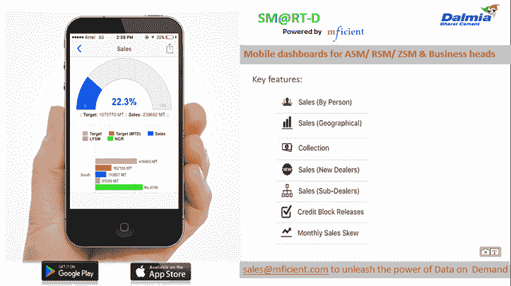

# 一次成功的失败——我作为第一次创业者的创业历程及其教训

> 原文：<https://medium.com/swlh/a-successful-failure-my-start-up-journey-and-what-i-learned-from-it-e873cbc85084>

所以在经营了三年之后，我退出了我的初创公司。一个典型的有多个波峰和波谷的创业之旅。虽然我们得到了 NASSCOM 和 Entrepreneur India 等机构的认可，在两轮中筹集了投资，建立了一个强大的团队，并获得了大客户，但事实仍然是，我们无法像我们想象的那样扩大规模。史蒂夫·乔布斯曾经说过，'**旅程就是回报**'，这段旅程真的很不平凡。很多人问我学到了什么，如果让我重来一次，我会做些什么不同的事情。所以我想写下我的一些想法会很有趣。虽然对于初创企业面临的复杂问题没有灵丹妙药，但我希望我学到的一些东西，尤其是关于上市和融资的知识，可能会在你创业的早期阶段对你有用。

**关于 m factor**—m factor 的平台即服务(PaaS)产品使组织能够通过将移动性纳入其现有业务流程或采用移动优先的新流程来降低成本并提高员工生产力。它的产品套件，如快速应用开发平台、移动后端即服务和移动应用管理器，允许公司在几个小时内跨 Android 和 iOS 平台构建自己的应用并与现有的 It 系统集成。

## **开头:**

经过 6 个月的产品开发，我们在 2015 年 7 月推出了 m factor v 1.0。发布一周后，我从上一份工作中解脱出来，可以全力投入销售。我几乎一整天都在路上，在销售和投资会议之间穿梭，因为我们在推动销售，同时因为 NASSCOM 的认可而引起了投资者的极大兴趣。在销售方面，我们知道我们已经生产了高质量的产品，并且在最初的客户互动中得到了验证。然而，我们很快就意识到我们面临的是什么。

**在 MVP 阶段构建产品和缺乏销售:**

我们犯的一个错误是，我们把销售过程推到我们完善产品的时候。我们的假设是，我们不会从客户那里获得多次机会，因此半成品可能不会起作用。回顾过去，我认为我们应该更早推出，在 MVP 阶段进行更多的销售，因为销售是获得客户对您产品反馈的最佳机会。 ***我们做了客户调查，但调查不会告诉你客户是否会为产品付费，真正起作用的是销售*。**它还能让创始人区分理想的现实和客观的现实。正如 Y Combinator 所说——**制造人们想要的东西**。尽管最终的产品非常好，但我相信我们最终还是投入了大量的时间和资源来构建我们本可以不用的功能。与此同时，我们只剩下有限的带宽来进行可能有助于我们销售更多产品的改进。

# 实现难以捉摸的产品市场匹配的漫长旅程:

我们永远无法真正解决的大问题是让产品适应市场。三年来，我们尝试了多种策略，在不同的时间针对不同的细分市场，并取得了一些成功，但总的来说从未成功过。然而，我们与所有这些市场的互动教会了我们走向市场的宝贵经验(尽管道路艰难)。

**追逐大企业:**

我们把 MFI factor 设想成一个 DIY 平台。然而，我们很快意识到残酷的现实，印度并不是最适合 DIY 技术产品的市场。除此之外，我们还销售平台即服务，事实证明，向印度企业销售平台即服务更加困难。我接触过的许多行业专家认为，PaaS 在印度仍然不受欢迎，我们应该在更成熟的市场销售。然而，我们致力于在印度建立业务(事后来看，这不是一个好的举措)，因为 DIY 在印度意味着 DIFM(为我做)，我们将我们的平台与服务捆绑在一起。这让我们起步了，我们获得了 Axis Bank 和 Hindalco 等客户。这些客户还帮助我们筹集了第一轮资金(在本文后面的部分详细介绍了融资经验)。

尽管这种模式为我们带来了一些吸引力，但销售周期变得更长，CAC 也变得难以为继。更不用说服务带来的其他挑战了。另一个障碍是 SAP 和 Oracle 提供类似的平台，我们经常与他们正面交锋。大多数大型企业都在 SAP 上运行，将 MFI factor 与 SAP 集成会带来许可问题。我们是一家初创公司的事实也对我们不利(记住，没有人会因为雇佣 SAP 而被解雇)。

**瞄准中端市场和收购要约:**

因此，我们改变了策略，将重点转向中型公司。这一举措似乎得到了回报，在仅有的几次会议中，我们就与三位客户达成了交易。然而，我们无法留住客户，因为用户采用率很低，没有用户采用率，就很难展示投资回报率并证明 MRR 的合理性。此外，还有一些更基本的问题。

> M ***id 市场参与者习惯于一次性合同，并仍对 SaaS 开放(经常性费用)。此外，他们更容易接受以解决方案为中心的方法，而不是以平台为中心的方法，因为平台对他们来说变得有点势不可挡和多余。此外，大多数印度中小企业将技术视为成本中心，并不认为缺乏技术是竞争劣势。***

此外，就购买 IT 解决方案而言，该细分市场依赖于其现有的 ERP 提供商或其他技术供应商。在我们的案例中，这些供应商的参与尤其深入，因为我们需要他们的支持来与现有的后端进行集成。在与一家这样的客户合作时，我们意外地收到了一家领先的国内 ERP 公司的收购要约。由于我们的旅程还太早，我们拒绝了这个提议，但在这里看到了另一个机会。

**与转售商合作:**

在与中小企业合作的过程中，由于我们经常被重定向到 ERP 提供商和 ISV，我们看到了瞄准他们并建立渠道合作伙伴生态系统的价值。计划是缩短销售周期时间，并获得更广泛的客户群。另一个优势是，这些转售商非常了解行业，他们的行业专业知识补充了我们的产品和移动知识。我们与国内两家大型 ERP 供应商合作，积极开发他们的客户群。然而，这种方法并没有达到我们预期的效果。首先，转售商面临着与我们在销售过程中相同的挑战，即产品缺乏市场适应性。其次，作为一家初创公司，我们不能收取溢价。这意味着双方都没有多少余地了。

> 我相信，一旦你找到了自己的销售模式，并达到一定的规模，转售模式将会很好。转售者喜欢出售具有某种吸引力的产品，而这种吸引力在最初阶段显然不存在。如果没有合适的时机和方法，你就是在浪费你没有的资源。

**回到绘图板:**

在混乱中，有一线希望。我们登上了达尔米亚水泥公司。Dalmia 使用 m factor 的平台为其销售和营销团队部署移动仪表盘。我们在一些销售会议上演示了这些仪表板，并感觉到了商机。我们决定只专注于移动仪表盘，只关注拥有类似 Dalmia 分销渠道的公司，而不是整体出售平台。这实质上意味着我们只卖出了 m factor 平台提供的可能性的四分之一(绝望的时刻需要绝望的措施！).我们跟踪了其他水泥制造商、轮胎制造商等。我们看到了相当大的吸引力，但最终，更长的销售周期和银行现金的减少迫使我们专注于手头的机会，而不是走收购路线，而不是我们乐观心态的诱惑。

在这期间，我们不得不筹集资金来生存&成长

我们每个月消耗大约 45 万卢比(7500 美元)，靠创始人和一位在瑞士日内瓦全职工作的非活跃合伙人投入的现金运转。我们银行里的现金有限，从市场上筹集资金势在必行。此外，除了钱，我们还渴望身边有能带来市场专业知识和行业联系的人。我们在 2015 年 8 月开始投资，并从一些优秀的商业领袖那里筹集了超过两轮的投资；第一次是在 2015 年 12 月，交易前估值为 85 万美元，第二次是在 2016 年 11 月，估值相同。NASSCOM 的认可极大地帮助了我们的筹款工作，这给了我们急需的信誉，打开了许多大门。此外，Delhivery 的一些创始人(Delhivery 是印度最杰出的即将上市的初创企业之一)非常支持我，也是很好的导师。我们的资本表上有 18 个投资者，转化这些投资者意味着我们要吸引更多的投资者。我不会详细介绍每一个项目，但为第一次创业的人筹集资金可能是一种痛苦的经历，我们也有过这种经历。伴随着拒绝、漫长的等待和承诺，我们经历了一系列的情绪，整个练习帮助我提高了我的情商。

我在某个地方读到过，作为一个初创公司的创始人，筹集资金是最容易的事情之一。虽然这听起来有点夸张，但它有一定的真实性。如果你有一个好的关系网，很了解你的业务，有你的数字(最关键的)，你会筹集到资金。以下是我上的一些课。

**决定你想向谁募捐:**

最初，我向每一个我能联系到的投资者推销。我后来意识到，这种做法行不通有两个原因——首先，认真的投资者喜欢把钱投在他们了解的企业上，这样他们就能帮助企业成长。第二，如果一个不了解你的空间的人投入资金，他将无法理解风险投资可能会经历的挑战，并可能成为一种负担。因此，最好去追逐那些了解这个空间并会增加价值的投资者，否则你会浪费很多时间。

**避免陌生来电:**

我们有意识地决定只通过“热情的”联系来接触潜在的投资者，这对我们很有效。在提高你的可信度的同时，它也传达了一个关于你的资源能力的积极信息。(记住，最后都是为了团队) 。我在研究生院和过去的工作中有一个很好的关系网，这对我很有帮助。说起人脉，一个好的人脉对于一个初创企业创始人的重要性怎么强调都不为过。

**区分销售宣传和投资宣传:**

回过头来看，我相信如果我们在早期阶段更谨慎一点，专注于正确的矩阵，我们的筹资可能会容易得多。我们过于迷恋我们的产品，认为产品质量本身会帮助我们筹集资金。然而，我们后来意识到潜在的投资者更感兴趣(这是理所当然的！)谈论销售业绩、预测和走向市场战略，而不是技术堆栈，显然我们还没有准备好就这些进行详细讨论。 ***因此，确定能让你的商业智慧大放异彩的衡量标准非常重要。不要沉迷于模糊的市场规模讨论和牵强的预测，因为经验丰富的投资者每天都在&处理这些事情，知道什么是可以实现的*** 。

**跟进:**

与潜在客户保持联系是有意义的。就我们而言，我过去常常发送投资者可能感兴趣的新进展的更新。此外，虽然一个人应该有弹性，但投资者通常不善于说不。学会阅读信号，在缺乏兴趣的情况下继续前进。在你的筹款之旅中，你会发现一些表示“不”的标准短语。

**设定时限:**

> 解除募集是一项全职工作，如果你不对它设定一个时间限制，它必然会影响其他业务操作。

此外，无论你计划得多好，在大多数情况下，筹款会比你想象的花费更多的时间。在我们的案例中，由于我同时负责销售和筹资，我们的销售过程受到了影响。此外，设定时间限制会让感兴趣的投资者产生一种紧迫感，否则他们会想拖延时间，看看你是否取得了进展。从我的经验来看，他们花的时间越多，投资的可能性就越小。

**有限反馈:**

在大多数情况下，我们从通过我们的投资者那里得到的反馈非常少。你需要自己弄清楚，或者与经验丰富的人讨论你的推销中可能缺少的东西。即使在一次非常有希望的、积极的谈话之后，你也可能会被拒绝，这也是没有任何理由的。我记得一家早期风投公司对我们印象深刻，并承诺了一份从未兑现的投资意向书。重要的是从这样的案例中走出来，并努力反思可能出了什么问题。

**钱不在银行就不是你的:**

即使在承诺之后，现金也需要一段时间才能到达银行(或者根本就没有到达！).这种情况更多发生在投资个人能力的天使身上。我认识的一个人经历了一段艰难的时期，因为他根据一组天使投资者的承诺雇佣了一些人，但这些投资者后来退出了。所以要谨慎，慢慢来，直到你有这笔钱贷记。

# **终于**

熟练是一次真正丰富的经历。我们尝试、学习、磨练，更好地武装自己，迎接下一个挑战。

是时候继续前进了:)

吉安(问好@[linkedin.com/in/gyantiwari](https://www.linkedin.com/in/gyantiwari)，[https://twitter.com/gyan2112](https://twitter.com/gyan2112))

## 这篇文章发表在 [The Startup](https://medium.com/swlh) 上，这是 Medium 最大的创业刊物，拥有+387，966 名读者。

## 在此订阅接收[我们的头条新闻](http://growthsupply.com/the-startup-newsletter/)。

