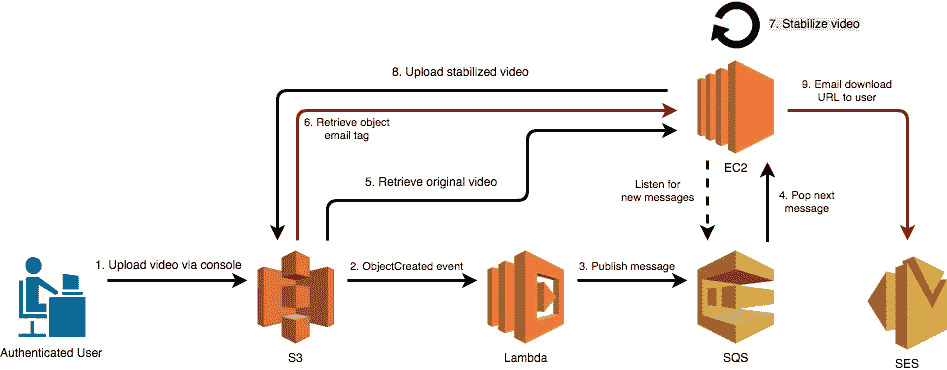

# 足够复杂的云应用程序

> 原文：<https://medium.com/swlh/a-sufficiently-complex-cloud-application-842a13529648>

## 构建由 AWS 支持的视频稳定服务

# 足够的复杂性

学习的最好方法之一是建立一个足够复杂的例子，然后教给其他人。在这篇文章中，我们将涵盖几乎所有需要建立一个视频稳定服务。它将允许用户上传视频文件，ffmpeg 将负责执行视频稳定。

```
# Calculate transform vectors
ffmpeg -i shaky-video.mp4 -vf vidstabdetect=stepsize=6:shakiness=5:accuracy=15:result=transform_vectors.trf -f null -# Stabilize the video
ffmpeg -i shaky-video.mp4 -vf vidstabtransform=input=transform_vectors.trf:zoom=0:smoothing=30:crop=black,unsharp=5:5:0.8:3:3:0.4 -vcodec libx264 -preset slow -tune film -crf 18 -acodec copy stabilized-video.mp4
```

这可能看起来太琐碎了，即使是 Hello World 的变化，但一旦我们将各种 AWS 服务连接在一起，并应用一些[云最佳实践](https://d1.awsstatic.com/whitepapers/architecture/AWS_Well-Architected_Framework.pdf)，它将很快变得足够复杂，以学习有价值的课程。

# 在 EC2 中手动运行脚本

让我们从简单开始，让上面的脚本在云中运行。由于这是一个长时间运行的流程，可能比 Lambda 的 15 分钟最大超时时间还要长，所以这个流程将在 EC2 实例上运行。


为了简单起见，我选择了一个运行在自由层硬件上的 Amazon Linux 2 实例。在将实例启动到可公开访问的子网 I 中之后，使用 curl 下载 ffmpeg，并将两个 ffmpeg 命令粘贴到 bash 脚本中。


命令已经到位，但我们需要一个不稳定的视频来稳定。我们还需要一种方法使 EC2 实例可以访问该视频。在可用的[存储选项](https://aws.amazon.com/products/storage/)中，S3 最有意义，因为我们希望用户能够通过 HTTPS 上传视频。

创建 bucket 时的一个重要部分是确保它不会被公开访问。没有必要允许对 S3 桶的开放访问，出于安全和隐私的原因，我们无论如何也不希望那扇门打开。


随着 S3 桶创建，让我们上传一个视频到 S3 稳定。


What is this? See [https://insights.aviture.us.com/blog/how-we-used-observables-for-3d-reconstruction](https://insights.aviture.us.com/blog/how-we-used-observables-for-3d-reconstruction)

现在将视频从 S3 传送到 EC2 实例。我们应该能够用 AWS CLI 来完成这个任务。


对，这个 EC2 实例没有与 S3 对话的权限。解决这个问题的正确方法是创建一个新策略，将该策略分配给一个角色，并将该角色分配给 EC2 实例。


完全的 S3 访问权限在这里有些过头了，但是一旦这个概念被证明是正确的，我们可以回过头来使权限更加严格。


最后，我们可以运行脚本，并将结果上传回 S3 下载。


现在我们有了。我们证明了 Hello World 质量应用程序，现在我们应该开始努力让用户上传功能，但我们应该首先解决一些最佳实践。

# 将 EC2 与 S3 脱钩

我们的 EC2 实例需要知道何时从 S3 下载新视频。我们可以让 EC2 直接轮询 S3，但是反复轮询 S3 的新视频既不高效也不符合架构。然而，有一种 AWS 服务是专门用来分离架构组件的，这种服务就是 **SQS** 。


从概念上讲，我们想要完成的是，当一个新的视频被上传到 S3 桶时，一条消息被发布到 SQS。在 EC2 实例上无限循环运行的脚本将对队列执行[长轮询](https://docs.aws.amazon.com/AWSSimpleQueueService/latest/SQSDeveloperGuide/sqs-long-polling.html)，当检测到消息时，它将从消息中读取桶/密钥，并从 S3 下载视频。

S3 不能将消息直接放入 SQS 队列，所以我们将借助 Lambda 函数，该函数由 S3 上传触发，将消息发布到 SQS 队列。


An S3 triggered Lambda function


该循环将持续运行，每次轮询 SQS 20 秒钟以获取新消息。一旦一个视频被上传，上面的 Lambda 函数会在队列中放置一条消息，这个脚本会看到这条消息，解析它的内容，下载并稳定视频。


请注意从队列中删除消息的最后一个命令。当从 SQS 队列中读取消息时，它会暂时变得不可见，这样其他侦听器就不会拾取它。在指定的时间段后，如果消息没有被删除，视频将被重新处理，这可以通过在处理完成后删除消息来避免。

# ami、启动模板和自动缩放组

上面的 EC2 实例是手工创建的。如果实例崩溃或发生更糟糕的情况，比如整个可用性区域断电，那就不太好了。再次下载 ffmpeg，复制 bash 脚本，然后手动启动它，这将是非常乏味的。

为了避免这一切，我们可以创建一个实例的映像(AMI ),并使用该映像在以后构建新的实例。


创建好映像后，我现在可以导航到**映像>ami**并手动旋转新实例。

尽管如此，我还是不想手动启动实例。这就是自动缩放和启动模板发挥作用的地方。通过 **EC2 自动缩放**，我可以指定我想要运行多少个实例，以及在什么条件下添加或删除实例。例如，当 SQS 队列中有很多消息在等待时，我希望增加几个实例来并行处理这些消息。当队列为空时，我希望减少到只有一个实例，以[节省计算时间](https://d1.awsstatic.com/whitepapers/architecture/AWS-Cost-Optimization-Pillar.pdf)。

为了让自动缩放创建实例，我需要指定一个**启动模板**，它本质上是对 AMI 和一些附加配置的引用，比如 EC2 角色、启动脚本和硬件。让我们首先创建一个启动模板。


还有别忘了**高级细节**下的启动脚本。


创建了这个启动模板后，我们现在可以创建一个自动缩放组，它将自动启动新的 t2.micro 实例，并预装 ffmpeg 和其他依赖项*，还会在启动时自动启动 bash 脚本。太好了。*

**

*让我们在这里暂停一下。上面配置的自动缩放组将使运行的 EC2 实例的数量保持在 1 到 4 之间。实例的数量基于一个 **CloudWatch** 警报逐渐增加，该警报在指定的 SQS 队列上有可见消息时触发。*

*类似地，当另一个 CloudWatch 警报触发时，实例会减少到单个实例，这表明 CPU 使用率低，因此视频稳定活动也低。**请注意，这第二个触发器是基于 CPU 使用率，而不是队列消息。因为视频稳定是一个长时间运行的过程，如果队列为空，但视频仍在处理中，我不希望实例死亡。***

*此时，实例供应是完全自动化的。如果我愿意，我可以同时上传 10 个视频到 S3。一个 Lambda 函数会自动将 10 条消息发布到 SQS 队列上，这个自动伸缩组会对相应的 CloudWatch 警报触发做出反应，并开始创建新的实例。随着新实例的出现，消息被自动从队列中读出，视频被下载、稳定并上传回 S3。最后，当事情平息下来时，自动缩放组会删除实例，直到只剩下一个。*

# *从网络上传视频*

*这个足够复杂的云应用程序的最后一部分是允许匿名用户上传小视频(小于 50MB)并通过网站下载稳定的结果。*

*这样做实际上是一个有点棘手的任务，因为有许多安全问题(用户应该不能看到其他人的视频)以及 AWS 的细微差别(API 网关上传限制，S3 预先设计的 URL)。*

*让我们从架构的概念开始。*

**

*为了保持 S3 存储桶的私密性，我们的想法是为用户提供一个 **API 网关**端点来上传视频文件，并最终将视频放入正确的存储桶。不幸的是，API Gateway 不允许上传大文件，这种方法行不通。*

*经过一些研究，我了解到 [S3 预先设计的 URL](https://docs.aws.amazon.com/AmazonS3/latest/dev/PresignedUrlUploadObject.html)，这将允许我们获得对一个桶的临时限制访问，并直接上传文件到 S3，而无需将桶公开。有了预先设计好的 URL，这个架构现在看起来就像下面的视频上传图。*

**

*如上所述，顺序是这样的。当用户试图上传视频时，web 应用程序将向 API 网关端点发送请求，并将相关细节传递给 Lambda 函数。Lambda 函数要求 S3 提供一个预先设计好的 URL，然后返回给 web 应用程序。然后立即发出第二个请求，将视频直接上传到 S3。*

*这方面的 web 代码相当简单，即使您不熟悉编写它的语言。*

**

*Presigned GET and upload PUT in Elm*

*第一个函数是 HTTP GET，第二个函数是 HTTP PUT。首先调用`retrieveSignedUrl`,一旦获得 URL，它立即被传递给`upload`的调用，视频被上传。*

**

# *下载视频*

*一旦视频稳定完成，用户应该能够下载视频。ffmpeg 需要几分钟的时间来完成它的工作，所以我们需要考虑如何告诉用户他们的视频完成了。我们可以让用户在网站打开的情况下等待，并通过 web 套接字或长时间轮询为用户提供下载 URL。*

*我认为更简单的解决方案是使用 **SES** 。让我们在视频上传之前要求用户提供一个电子邮件地址，当 EC2 实例完成稳定一个视频时，它可以要求 S3 提供一个一小时内有效的预先设计的下载 URL，并通过电子邮件将该 URL 发送给用户。*

*为了实现这一点，我们要聪明地使用标签。在请求下载 URL 之前，我们必须等待稳定的视频出现在 S3 *。这意味着**EC2 实例需要按需请求预先指定的 URL**，这也意味着我们需要弄清楚如何在调用 SES 之前将用户的电子邮件地址发送到 EC2 实例。**

*幸运的是，我们可以给 S3 预先设计的 URL 添加标签，让 S3 为我们自动标记这个对象。*

****

*通过添加标签到预先设计的网址 S3 将自动标记上传的视频。EC2 实例可以向 S3 索要标签，获取用户的电子邮件地址，在稳定并上传视频后，该实例将使用 SES 向用户发送一封带有下载链接的电子邮件。*

*最后，这里是完成所有这些的一些支持代码。*

**

*就是这样！还有更多的事情要完成，但为了简洁起见，我将把事情留在这里。特别是有很多安全问题需要解决，比如限制 IAM 策略、添加引用源、服务器端验证和错误处理。*

# *足够的复杂性*

*通过构建一个足够复杂的应用程序，我学到了很多东西，超过了我在这篇博文中所能容纳的。*

*需要记住的是，足够的复杂性很容易被超越。很容易有一个伟大的想法，即*应该*容易，只是看到副业项目无法在工作的第一个周末存活下来。如果你想了解更多关于云的知识，我的建议是从看起来太琐碎的事情开始，通过[五大支柱](https://aws.amazon.com/blogs/apn/the-5-pillars-of-the-aws-well-architected-framework/)开始工作。*

*   *卓越运营*
*   *安全性*
*   *可靠性*
*   *表演*
*   *成本优化*

*在这篇文章中，我们从两个 ffmpeg 命令开始，并开始深入其中的至少三个支柱，在使其具有生产价值之前还有大量的工作要做。这样做让我学到了在琐碎的 Hello World 或过于雄心勃勃但从未完成的大想法中不会遇到的经验。*