# 技术风险投资的超快速概述和历史:第四部分

> 原文：<https://medium.com/swlh/a-super-fast-overview-and-history-of-tech-vc-part-iv-7b53cf0753b2>

**闸门打开，独角兽崛起(2013 年至 2018 年)**

*感谢* [From Yahoo! Finance](https://medium.com/u/2d2972b05172#eyJTWSI6W1siXkdTUEMiLG51bGwsMCwwXSxbIl5JWElDIiwiIzAwYjA2MSIsMiwwXSxbIl5ESkkiLCIjMDA2MWNiIiwyLDBdLFsiQUFQTCIsIiNlMGU0ZTkiLDIsMF0sWyJHT09HIiwiI2ZmZGI0OCIsMiwwXSxbIkFNWk4iLCIjMDAwMDAwIiwyLDBdXSwiVFMiOlsxLCJ3ZWVrIixudWxsLFsiYWxsIiwxLG51bGxdXSwiVVMiOlswLDEsMV0sIkNTIjpbImxpbmUiLCJsaW5lYXIiLDQuODMyNTc5MTg1NTIwMzYyLDIseyJzdGFydCI6MTIyNjIxNzYwMDAwMCwiZW5kIjoxMzU5MjczNjAwMDAwfSwiI2ZmMzMzYSJdLCJTVCI6eyJ2b2wgdW5kciI6eyJ0eXBlIjoidm9sIHVuZHIiLCJpbnB1dHMiOnsiaWQiOiJ2b2wgdW5kciIsImRpc3BsYXkiOiJ2b2wgdW5kciJ9LCJvdXRwdXRzIjp7IlVwIFZvbHVtZSI6IiMwMGIwNjEiLCJEb3duIFZvbHVtZSI6IiNGRjMzM0EifSwicGFuZWwiOiJjaGFydCIsInBhcmFtZXRlcnMiOnsiaGVpZ2h0UGVyY2VudGFnZSI6MC4yNSwid2lkdGhGYWN0b3IiOjAuNDUsImNoYXJ0TmFtZSI6ImNoYXJ0In19fSwidiI6IjAuMS4wIiwibWluIjoxfQ==)

大衰退后空前的低利率和量化宽松也发挥了作用。随着 2008 年金融危机后风险投资下降，利率也(有意地)降至接近零。投资和利率迅速呈现出预期的反比关系，随着机构投资者在低/无收益环境之外寻求回报，股票投资和投机增加。进入风险投资的美元数量增加了，相应地，估值也增加了。

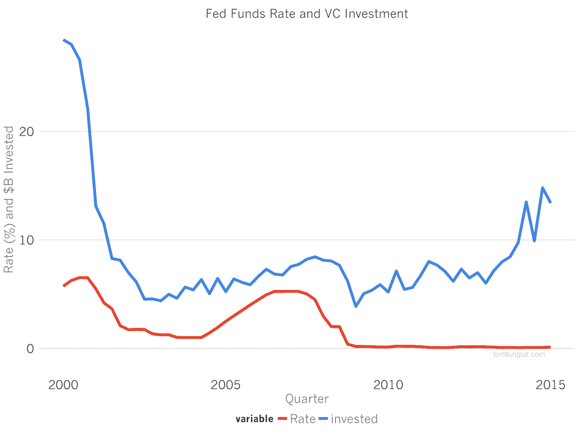

[From Tom Tunguz](http://tomtunguz.com/interest-rates-and-startups/)

Union Square Venture Partners 的弗雷德·威尔逊(Fred Wilson)提到了利率在 2014 年的作用，他写道:“估值处于极端水平，因为你不能从你的钱做任何其他事情中获得像样的回报。”此外，投资者将为超出平均值的增长支付越来越高的溢价，因为这只是数学表明的理性。在 [2015](http://avc.com/2015/06/the-coming-change-in-monetary-policy/) 中，他进一步断言:

> “[科技和创业领域的估值环境可能不会很快改变。但是会改变的。股市的估值环境也是如此。这是因为估值倍数与利率成反比。当利率上升时，估值倍数就会下降。”

过去十年，我们一直在观察这种关系，随着[倍数升至历史高点](http://tomtunguz.com/publi-arr-multiples/)，现在，在过去几周，我们终于开始看到逆转。第五部分会有更多的介绍。现在，让我们看看风险市场两端的扩张。

# **前期扩张**

在早期阶段，天使和新基金推动了新投资的大幅增长，一类种子基金站稳了脚跟，传统基金正式启动了种子和 [scout 投资计划](https://techcrunch.com/2018/01/27/scout-networks-are-latest-vc-salvo-in-war-for-founders/)。

正如我们在[第三部分](/@neildevani/a-super-fast-overview-and-history-of-tech-vc-part-iii-5e58953adf3d)中所写的，在线信息和社区的爆炸让投资者更容易找到和跟踪初创公司。在过去的六年里，这一趋势有增无减。更高级别的软件语言和框架、强大的抽象层和 API 以及更便宜的按需云服务的持续发展也继续减少了构建原型或首款产品的时间和成本。

考虑一下其中的因素:更多的初创公司成立，更多关于它们的公开数据，投资者和初创公司更容易找到彼此，以及更多的资金流动。结合起来，你有一个在早期风险经济中进行更多“市场清理”的完美风暴。

## 风险投资达到 Doctom 水平

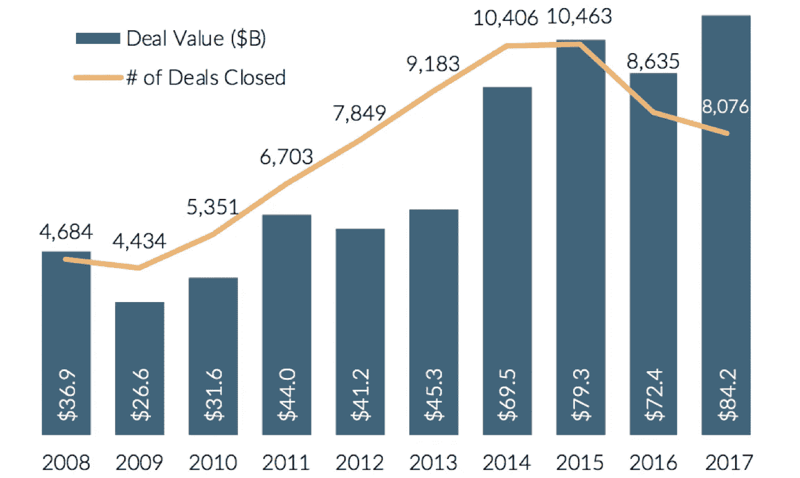

[PitchBook-NVCA Monitor](http://files.pitchbook.com/website/files/pdf/4Q_2017_PitchBook_NVCA_Venture_Monitor.pdf)

我们可以将早期投资者细分为三种主要类型，并独立考虑每种类型:个人或天使投资者、真正的种子基金和传统/大型基金的种子实践。我们在第三部分讨论了加速器，你可以将它们视为本帖中真正的种子基金。

在这段时间之前和之后，许多成功科技公司的早期员工和投资者都在收获大规模退出的收益。据报道，仅脸书[在 2012 年首次公开募股时就产生了超过 1000 名百万富翁，类似于 2004 年谷歌的情况。反弹的市场给之前周期的投资者带来了新的流动性。就连大型上市科技公司的员工也感受到了巨大的顺风，因为他们的股票薪酬以倍数增长。资本供应增加，以满足企业家现有的、未得到满足的需求。](https://blogs.wsj.com/wealth/2012/02/01/will-facebook-really-create-1000-millionaires/)

早期投资的机会非常诱人。[风险研究中心](https://paulcollege.unh.edu/center-venture-research)估计天使投资增长了约 50%,从 2009 年的 170 亿美元增长到 2013 年的 250 亿美元，并在接下来的五年里保持这一水平。研究和常识还表明，天使投资极大地提高了初创公司的存活率，这表明后期阶段的活动和机会可能会增加。

我们怀疑，天使投资的停滞是由许多意识到自己投资面临挑战的个人推动的，因为这几乎完全符合新的微型基金形成的急剧上升。

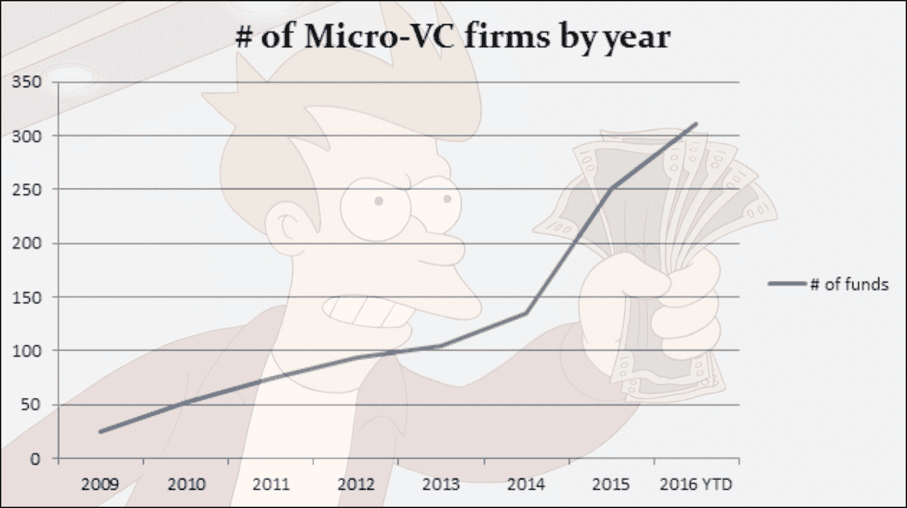

[Data from Samir Kaji, Silicon Valley Bank](http://pevcbanker.com/micro-vc-2-0-the-different-flavors-of-micro-vc/)

与此同时，传统基金在后期阶段面临着更多的竞争(详见下文)，越来越多的公司在早期阶段成立并获得资助。为了获得初创公司的所有权并保持其强大的渠道，许多基金决定向下游扩张。与处于后期阶段的新进入者相比，与天使投资者和真正的种子基金竞争更便宜、更容易，这些新进入者对价格不太敏感，在 M&A 和 IPO 的情况下可能更有价值。因此[多阶段品牌基金](https://www.cbinsights.com/research/venture-capital-seed-investment-pace/)建立了(大)种子实践。

## Accel、A16Z、格雷洛克、KPCB 和 NEA 的种子投资

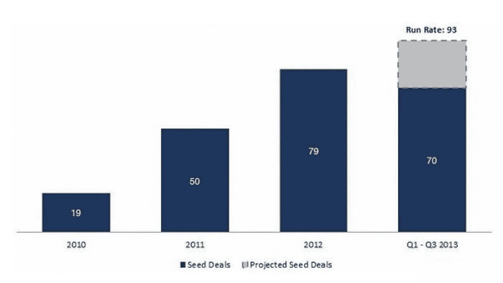

[From CB Insights](http://www.cbinsights.com)

当然，有些趋势成熟固化了，有些则没有。有了种子资金，市场从 2015 年开始放缓。是什么导致了这种变化？数据显示，种子期的繁荣在首轮融资阶段遭遇了约束。利率可能也发挥了作用，因为它们最终在 2015 年开始上升。公司以过高的估值筹集了太多资金，无法进入下一阶段。由于投资者已经筹集了资金，并且必须进行部署，他们开始整合到更大和/或更晚的阶段。请注意交易数量的下降趋势，但从 2015 年的峰值到今天，总体资本配置相当一致。

## 种子和天使投资交易量

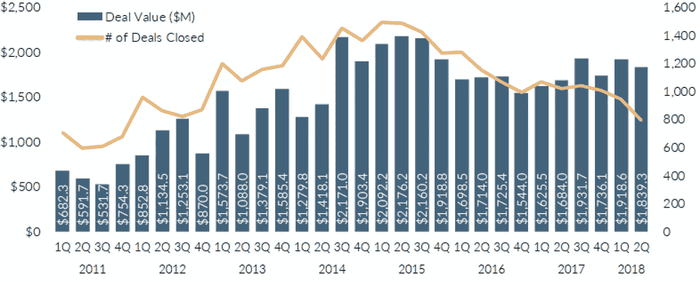

[PitchBook Data](https://pitchbook.com/news/articles/us-venture-capital-activity-so-far-this-year-in-15-charts)

## 独特种子投资者的数量

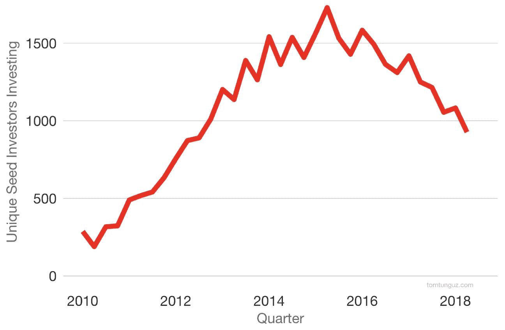

[Tomas Tunguz](http://tomtunguz.com/seed_market_dynamics_2018/)

与融资数量和投资者数量的下降形成对比的是，估值似乎在不断上升。这可能是因为投资者专注于更发达的公司，并以更高的估值大举进入这些公司，抢占了首轮融资。本质上，种子是新的 A 轮，A 轮是新的 b 轮。

## 投资前估值中值(低于 100 万美元的融资)

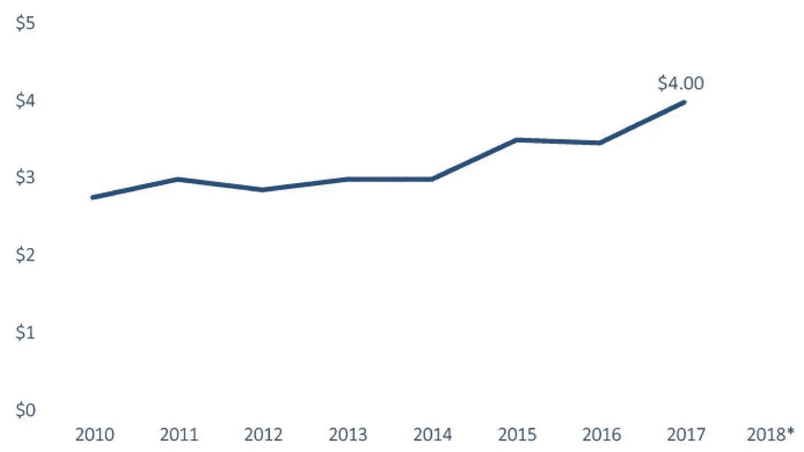

[PitchBook Data](https://pitchbook.com/news/articles/vc-valuation-trends-in-7-charts)

以上推测是我们最好的猜测，但也仅仅是，一种猜测。我们已经提到并使用了许多数据提供者，但是没有一个是完整或全面的。例如，上述 PitchBook 数据与我们估计的交易总数形成鲜明对比。在所有这些事情中，最接近“真相的来源”是 EDGAR(如第三部分所讨论的)，但公司和投资者并不总是进行所需的申报，当有更大的问题需要关注时，SEC 似乎没有兴趣强制解决这个问题或市场惯例。因此，我们怀疑这些数字甚至更高，或许种子投资在 2015 年至 2018 年并不像看起来那样集中。

我们与 [Sapphire Ventures](http://sapphireventures.com/) 的董事总经理 [Beezer Clarkson](http://sapphireventures.com/team/elizabeth-clarkson/) 讨论了现有解决方案不完整的问题，她分享了以下内容:

> “风险基金或有限合伙人通常会收集自己的数据，并创建自己的专有数据集。我们 Sapphire Venture 也是这样做的，并且很乐意与我们的合作经理分享基准分析、最佳实践和其他见解。此外，我们还利用现有的公开可用数据进行了大量研究，相信其他人也是如此。
> 
> 为了进一步鼓励分享从数据中获得的见解，以帮助满足理解风险投资中正在发生的事情的兴趣，我们做了两件事。首先，Sapphire Ventures 主动在我们的[媒体页面](https://medium.com/sapphire-ventures-perspectives)上发布文章。第二，我们和其他有限合伙人一起帮助推出了 OpenLP。OpenLP 不收集或共享开放数据集，但它是一种努力(和标签),有助于促进企业家-风险投资-LP 技术生态系统的更好理解。"

如果我们假设美元和交易在首轮融资阶段及以后保持不变或有所增加，而天使和种子投资在交易数量和独立投资者方面都有所巩固，这将为那些关注最早期阶段、坚持估值纪律、有足够技能寻找、识别和关闭优秀初创公司产品前市场的投资者提供机会。因此，市场可能会转向更多的微型和早期风险投资，以填补“种子前”机会。

# **后期精神错乱**

尽管种子和微型风险投资领域看起来很疯狂，但进入风险投资后期阶段的巨额资本却处于完全不同的水平。公司、外国投资者和传统上在公开市场运作的投资者都同时进入了风险投资的后期阶段，增加了他们寻求回报的风险。

投机和战略目标导致的价格不敏感性降低了对基本面的关注，这在后期阶段更为常见。与此同时，公司管理层也在追逐所有价值超过 10 亿美元的东西。这种组合迎来了独角兽的[崛起。](https://en.wikipedia.org/wiki/Unicorn_(finance))

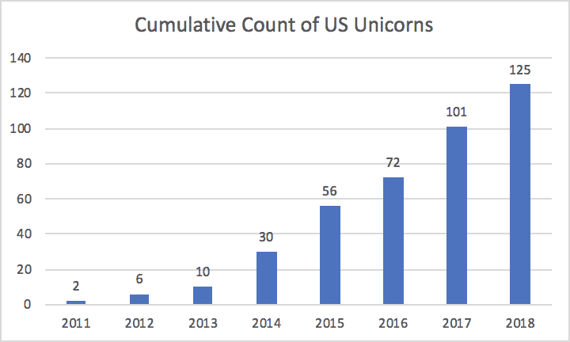

[CB Insights data](https://www.cbinsights.com/research-unicorn-companies)

再一次，来自 Beezer @ Sapphire 关于为什么公司开始以一种前所未有的方式追逐估值:

> “公司开始谈论它们的估值，在过去，这是不会被讨论的，所以其他企业家和员工知道并重视与独角兽的联系。”

这些融资的需求方不需要更多的解释，但供应方呢？

过去几年，对冲基金和共同基金经理在最后阶段大举投资。专注于公开市场的基金经理，包括富达、威灵顿和贝莱德，往往可以获得其他投资者无法获得的估值，因为他们可以从首次公开发行和获得这些发行的相关条款中获得独特的好处，因此愿意支付更高的估值。

有间接证据表明，富达如何进行了大量的后期投资，只是为了在没有重大变化或重大时间流逝的情况下，迅速降低这些投资的价值。唯一的变化是采用了哪种估值方法，该公司或富达的公开市场具有可比性。

这些参与者的投资数量在 2015 年达到顶峰，种子轮的数量也是如此，这也是利率最终开始再次上升的时候。

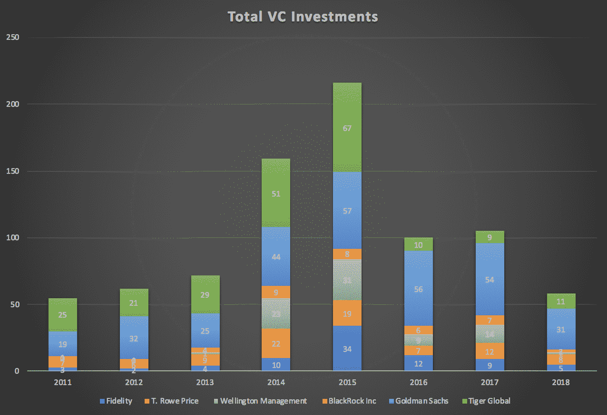

*Analysis from publicly reported data*

在此期间，大公司也越来越多地参与到风险投资的后期阶段。请注意这一时期后几年向更大规模投资和融资的转变:

## 企业风险活动、交易量和交易规模

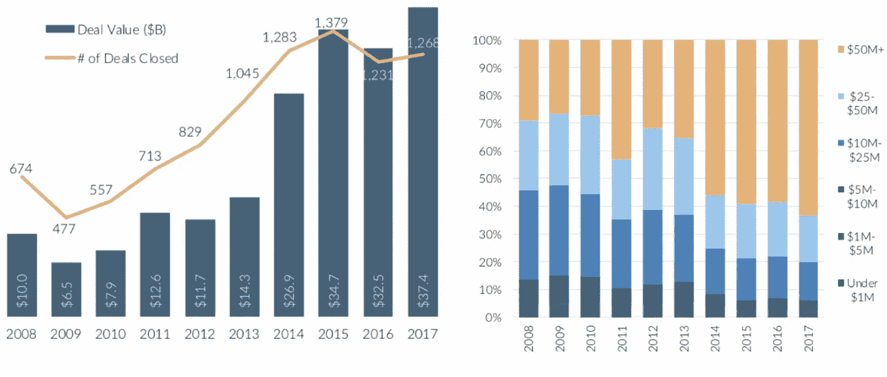

[From PitchBook](http://www.pitchbook.com)

与公共基金经理类似，企业投资者在本轮融资的财务回报之外的兴趣也可能推高估值。一个很好的例子是[英特尔最近对 Cloudera](https://equityzen.com/path-to-ipo/cloudera/) 的投资。2014 年 2 月，T. Rowe Price 和其他人以 18.5 亿美元的估值投资了 Cloudera。2014 年 5 月，仅仅三个月后，[英特尔以 43 亿美元的估值投资了 Cloudera](https://techcrunch.com/2014/03/31/intel-pours-740m-into-cloudera-in-exchange-for-an-18-stake/) ，高出 2.3 倍。到 2016 年底和 2017 年初，该公司的股票交易价格是英特尔支付的估值的一半。当公司[最终在 2017 年 4 月上市](https://techcrunch.com/2017/04/01/cloudera-finally-ready-for-the-public-stage/?sr_share=facebook)时，估值也差不多，导致英特尔的投资公开减值 50%左右。

基于以上，英特尔是否做了一个糟糕的投资？如果我们只是衡量直接投资回报的话，当然可以。然而，英特尔很清楚它同意的估值要高出多少，据报道，英特尔和 CloudEra 正在合作开发产品，以确保他们与企业客户的持续增长。英特尔的投资可能低于 3 亿美元或更多，但如果其业务部门获得的价值大于这一数额，或许这仍然是一项“好”的投资。

同样，估值数据反映了企业风险的影响:

## 以百万美元计的投资前估值中值

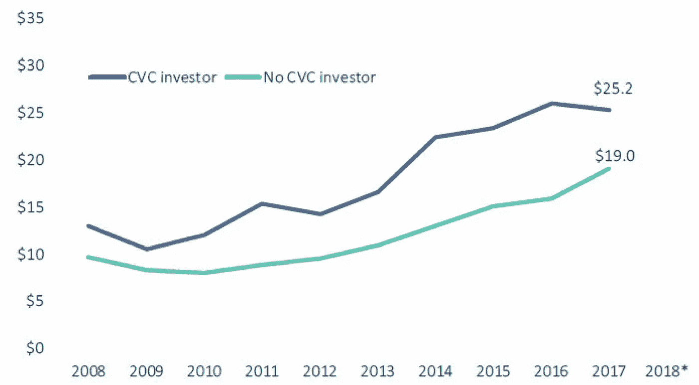

[PitchBook](https://pitchbook.com/news/articles/vc-valuation-trends-in-7-charts)

除了公共市场投资者和企业，外国投资者也为后期市场带来了资本，包括主权财富基金。许多人将目光投向本国低利率和/或不稳定的市场之外，也是为了寻求更好的回报。这些投资者通常面临激烈的竞争，并在新的市场中寻找立足点，他们可能更愿意投资于更高的估值。

**中国投资美国科技**

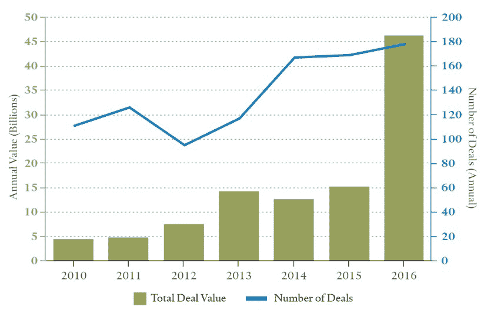

Data from [Council on Foreign Relations](https://www.cfr.org/report/chinese-investment-critical-us-technology-risks-us-security-interests)

这种资本进入后期技术公司的行列有几个后果。

首先，更多的后期公司将在未来融资中面临困难，以较低的估值进行投资。更不常见也更具破坏性的是，它们可能会完全关闭。根据上面的例子，我们已经看到这种情况发生了。根据 CB Insights 的数据，截至 2018 年 10 月，美国有 [131 家独角兽](https://www.cbinsights.com/research-unicorn-companies)，其中 42 家在过去四年中有过[后续融资事件或以较低估值退出](https://www.cbinsights.com/research-downround-tracker)。对投资者来说，更多的资本意味着更大的配置压力和更小的维持低估值的能力。过高的估值和过高的预期相互助长。在早期阶段，这种影响可能会被忽略，因为市场已经严重扭曲且不可预测。然而，后期阶段更多的资本会导致后期阶段更多的竞争者，从而导致比预期更多的损失和波动。

其次，随着企业保持私有状态的时间越来越长，并避开公开市场，早期员工和投资者将会要求流动性。通过像 [Equidate](http://www.equidate.com) 和 [EquityZen](http://www.equityzen.com) 这样的公司，提供流动性的解决方案变得越强大，公司保持私有的时间就越长，也越容易。于是一个恶性/良性循环就这样诞生了。

这两种力量一起增加了波动性，限制了 IPO 渠道，因为需要 IPO 的公司越来越少，准备 IPO 的公司也越来越少。在互联网时代，IPO 时公司的平均年龄大约是五年；从那以后，它翻了一倍，超过了十年。

虽然在过去几年中，后期投资似乎趋于平稳，但预期正在上升。软银有一个庞大的 1000 亿美元的愿景基金，并正在计划另一个。红杉资本宣布成立 80 亿美元的后期基金[，这绝不是对软银的回应](https://techcrunch.com/2018/09/06/playing-the-global-game-sequoia-can-cut-checks-for-up-to-1-billion/)。这促使人们相信，公共市场可能继续无法获得伟大的新技术公司提供的投资回报，随着竞争的加剧，整个市场的回报可能会下降。

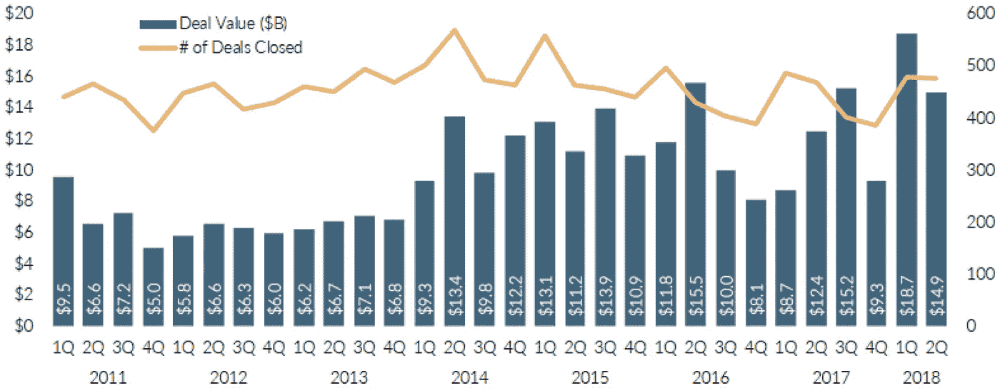

Late Stage Investment Activity, [from PitchBook/NVCA Monitor](https://nvca.org/research/venture-monitor/)

随着早期基金的爆炸式增长和大量资本在后期阶段等待，人们可能会预计投资将在所有阶段继续保持高水平和高估值。然而，如果说利率教会了我们什么的话，那就是投资和估值随着利率的上升而下降。再加上密码和 ICO 市场，未来的不确定性令人难以置信。在我们的下一期，也是最后一期，我们将探索定义未来的力量，并尝试预测未来的样子。

要在本系列的其余部分发布时获得通知，只需点击下面的“关注”。

[*Neil Devani*](https://www.linkedin.com/in/neildevani/) *是一名早期投资者，总部位于加利福尼亚州旧金山，与创造正外部性的公司合作，重点关注医疗保健、金融服务、教育行业以及某些前沿技术。他还是加利福尼亚州的执业律师。在*[*Twitter*](https://twitter.com/neildevani)*，*[*AngelList*](https://angel.co/neil-devani)*，或者*[*LinkedIn*](https://www.linkedin.com/in/neildevani/)*上找到他。*

[*迈克尔·拉莫斯-林奇*](https://www.linkedin.com/in/michaelramoslynch/) *之前在加州帕洛阿尔托的一家风险投资公司工作，目前是得克萨斯州奥斯汀的一名企业家和执业律师。在* [*Twitter*](https://twitter.com/mramoslynch) *，*[*AngelList*](https://angel.co/michael-ramos-lynch)*，或者*[*LinkedIn*](https://www.linkedin.com/in/michaelramoslynch/)*上找到他。*

以上帖子无意作为投资或法律建议。

## 这篇文章发表在 [The Startup](https://medium.com/swlh) 上，这是 Medium 最大的创业刊物，拥有+ 380，756 名读者。

## 在这里订阅接收[我们的头条新闻](http://growthsupply.com/the-startup-newsletter/)。

