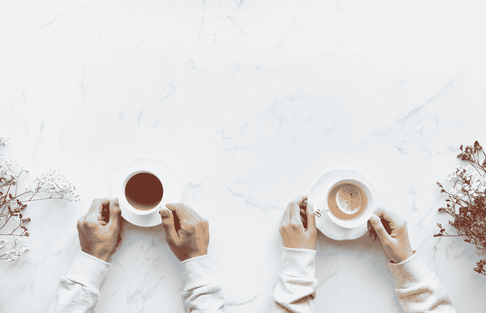

# 两天的故事

> 原文：<https://medium.com/swlh/a-tale-of-two-days-b691514a39d8>

## 第一天对第二天

by [rawpixel](https://unsplash.com/@rawpixel?utm_source=medium&utm_medium=referral) on [Unsplash](https://unsplash.com?utm_source=medium&utm_medium=referral)

和很多人一样，我不是一个早起的人。这可能是因为我最近买了一个很棒的新 Simba 床垫，所以现在我比以前更不爱早起了。伙计，那东西真舒服！那么，为什么我早上 6 点就起床，离开家，去跑步呢？我到底为什么要这样对自己？简单的原因是…