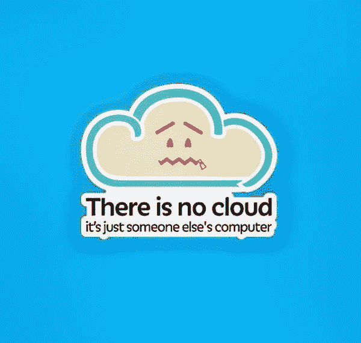
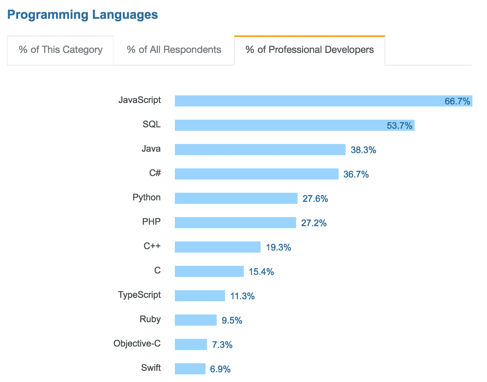
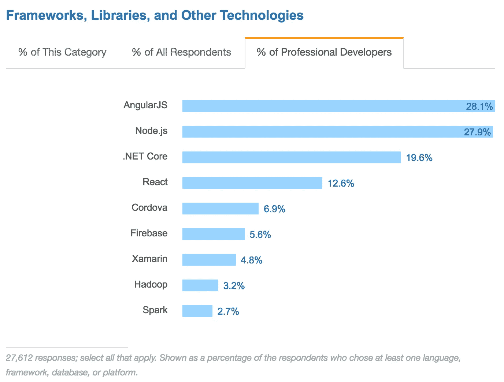
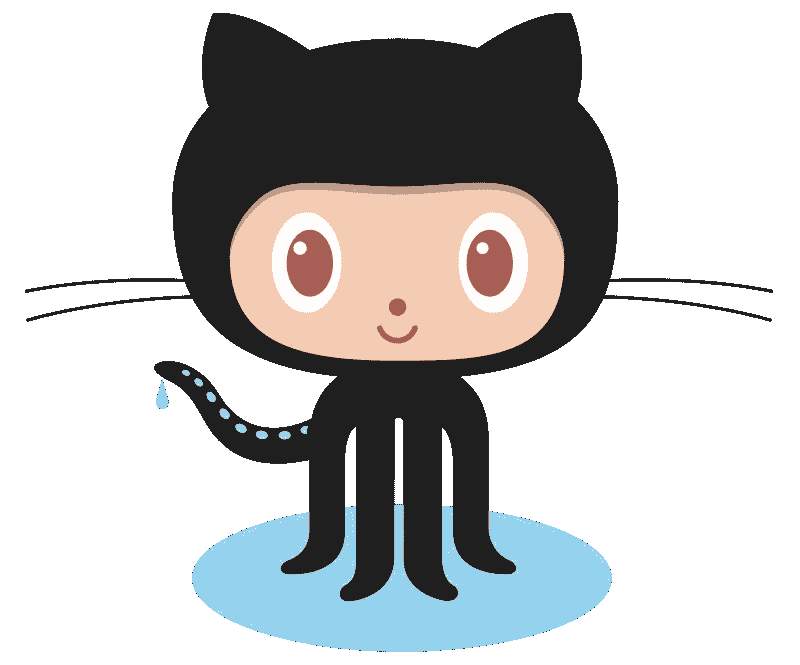

# 面向非技术创业者的技术入门

> 原文：<https://medium.com/swlh/a-technical-primer-for-nontechnical-founders-dd8b525f15cf>

经营一家科技公司，你不必知道如何编码。做一名非技术型的创始人在某些方面会对你有利，但你需要了解足够多的知识来理解正在发生的事情。

最好的非技术型创始人会确保他们知道足够多的危险。这篇文章的目标是让你对科技产品的语言有一个坚实的理解。通过了解这种语言，你可以更好地与你的团队沟通。你可以更好地理解你的产品是如何工作的。

目前这些都是高层次的概念。如果你想让我们更深入地了解什么，请在最后留下评论。这些概念很干。考虑给这一页做书签，并把它作为参考。

# 云

用 2016 年最流行的词开始。“云”只是一系列连接到互联网的服务器。

注意:尽量限制你在开发人员中使用“云”这个词。一年一到两次比较理想。

Chris Watterston’s brilliant sticker available for purchase [here](https://www.stickermule.com/marketplace/3442-there-is-no-cloud).

# 服务器

服务器是为提供文件或数据而设置的计算机。服务器几乎总是连接到互联网。任何时候你访问一个网站，你都是在通过互联网向服务器发出请求。

得益于 AWS 等工具，近年来远程安装服务器变得更加便宜和容易。这导致了“云”的兴起。

额外收获:AWS 代表亚马逊网络服务。像 AWS、谷歌云平台和微软 Azure 这样的工具可以在几分钟内从你的电脑上设置一个服务器。过去，开发人员必须在数据中心物理安装和设置服务器。

# 数据库ˌ资料库

数据库存储应用程序的所有数据。SQL 数据库就像一系列 excel 电子表格。数据库中的每个表都是一张表。像 MongoDB 这样的 NoSQL 数据库更像一个 Word 文档。这使它更加灵活，但也使管理数据之间的关系更具挑战性。

# 后端/前端

每个应用程序都由某种前端和后端组成。在汽车中，后端是发动机，前端是仪表板(或油门踏板)。仪表板接收用户输入，并将其转化为引擎驱动汽车前进。在应用程序中，后端接受用户输入，并从数据库中存储和检索数据。

后端开发更侧重于数据、算法和性能。前端开发融入了设计的更多方面。

# 应用程序接口

API 代表应用程序编程接口。API 是后端和前端的通信方式。为如何构建 API 制定标准很重要，这样整个团队的开发人员就知道会发生什么。

# UI 设计

UI 代表用户界面。UI 设计关注的是应用程序的外观。这意味着关注排版，风格，颜色，动画。元素之间是否有足够的填充？有视觉平衡吗？UI 设计就是让你的应用看起来漂亮迷人。

# UX 设计

UX 代表用户体验。UX 设计关注产品的易用性以及用户的感受。信息的布局是否有意义？产品对用户输入的反应是否如他们所期望的那样？是帮助他们解决问题还是妨碍他们？UX 设计还可以包括文案、客户支持、自动电子邮件等等。

*注:这是一种简化，更多关于这个主题的微妙之处请看***。**

# *Web 应用程序*

*web 应用程序是一种托管在 web 上的应用程序，而不是下载到您的手机或计算机上的应用程序。*

# *原生应用*

*原生应用是用设备的原生编程语言编写的移动应用。在 iOS 上这是 Objective-C 或者 Swift。在 Android 上，这是 Java。原生应用在性能上有优势。每个本地平台都有不同的范例和公共元素。花点时间为你的应用程序所在的平台定制你的应用程序对于创造一个有凝聚力的体验是非常重要的。*

# *混合应用程序*

*混合应用程序是使用 web 技术构建的移动应用程序，然后编译成两个移动应用程序。混合应用的优势在于只有一个代码库。这意味着它们需要更少的时间来开发并且更容易维护，但是在质量上有所妥协。*

# *程序设计语言*

*写代码就像写蛋糕的食谱。计算机会准确地遵循每一条指令。因此，食谱中的一个错误和你的蛋糕看起来不太像你读过的 Buzzfeed 文章。*

*编程语言定义了如何编写食谱的规则。像口语一样，编程语言都有自己的语法。不同的语言基于不同的理念，有不同的优势。此外，一些设备或应用程序仅支持某些编程语言。*

*大多数编程语言的基本原理是相同的，即使语法不同。优秀的开发人员应该能够掌握新的语言，而且大多数人至少知道一些。也就是说，你应该根据整体技能而不是某一种语言来雇佣员工。但是要准备好给学习新语言的开发人员一段适应的时间。*

*额外收获:Java 和 Javascript 是完全不同的编程语言。令人困惑，但尽量不要混淆。*

**

*Most popular programming languages according to the 2017 Stack Overflow user survey [https://insights.stackoverflow.com/survey/2017#technology](https://insights.stackoverflow.com/survey/2017#technology)*

# *编程框架*

*编程框架就像程序员的工具箱。如果你每次开始盖房子的时候都要造一把锤子，你的效率不会很高。编程框架为程序员提供了工具，这样他们就不必重新发明轮子。基于不同的哲学，不同的框架打包了不同的工具。*

*目前三大前端框架是 Angular、React 和 Ember。所有这些都是用 Javascript 写的。一些流行的后端框架有 Rails (Ruby)、Flask 或 Django (Python)和 Node (Javascript)。但是还有数百种，每种编程语言都有自己的框架*

**

*Most popular programming frameworks according to the 2017 Stack Overflow user survey [https://insights.stackoverflow.com/survey/2017#technology](https://insights.stackoverflow.com/survey/2017#technology)*

# *开放源代码*

*知识共享是软件开发最伟大的事情之一。通常，当开发者开发一个新工具时，他们会通过开放源代码与世界共享。这导致了学习的加速，并使整个行业变得更加强大。*

*如果你卖的是技术产品，开源代码也可以是一种营销或招募的形式。*

# *版本控制*

**

*This delightfully weird creature is the Octocat, the mascot for Github, the most popular git website. Github is where most of the largest open source projects collaborate.*

*版本控制是存储对代码库所做更新的一种方式。它还用于合并不同开发人员所做的更改。如果引入了 bug，版本控制可以很容易地将应用程序恢复到早期版本。*

*如果您曾经在 Microsoft Word 版本控制中使用过修订，情况也是类似的。它跟踪对代码的更改，以便团队成员可以处理相同的代码。如果他们做了冲突的更改，他们可以解决它们，而不是覆盖其他人的更改。*

*最常见的版本控制系统是 git，最常见的 git 应用程序是 Github。在 git 中，代码库是一个存储库。对存储库的更新是提交。还有很多特定于 git 的术语，但这些都是基本的。*

*注意:你的应用需要进行版本控制。*

# *开发运营*

*Dev Ops 代表开发运营。它指的是开发和部署软件变更的过程。拥有一个可靠的 DevOps 流程对于快速安全地将更新部署到您的应用程序非常重要。DevOps 操作范围从简单和非常手动到复杂和完全自动化。*

***请在下面评论您的任何问题或您希望添加到列表中的术语。我希望它能作为参考指南不断发展。***

**这篇文章最初出现在南方的*[*Start*](https://builtbykrit.com/blog/a-technical-primer-for-nontechnical-founders)*上，这是一个关于在通常的中心之外建立盈利公司的博客。**

**安德鲁是*[*Krit*](https://builtbykrit.com/?ref=Medium)*的创始合伙人，这是一家为早期创业公司提供产品开发的工作室，也是* [*信天翁*](http://getalbatross.com/?ref=medium) *的联合创始人。他相信每个人都有创造力。**

**

## *这个故事发表在 [The Startup](https://medium.com/swlh) 上，这是 Medium 最大的创业刊物，拥有 271，813+人关注。*

## *在这里订阅接收[我们的头条新闻](http://growthsupply.com/the-startup-newsletter/)。*

**