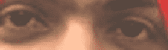
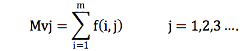
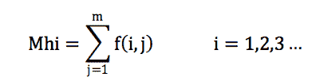
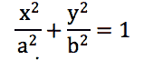
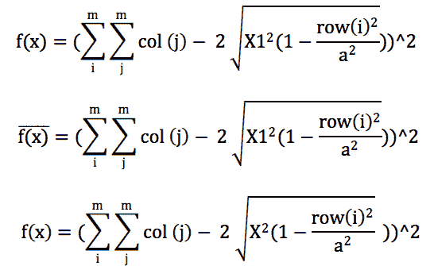
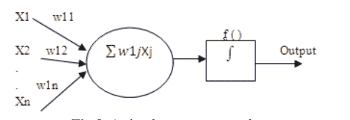
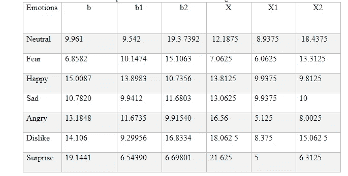
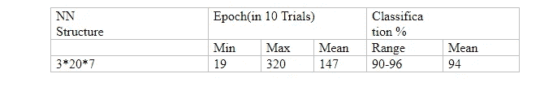

# 一个基于人工智能的情感识别的玩具例子来说明技术的基础

> 原文：<https://medium.com/swlh/a-toy-example-of-ai-based-emotion-recognition-to-illustrate-the-basics-of-technology-6fcc3c63be00>

由[哈曼·布塔尼](https://medium.com/u/6ce4d14968f8?source=post_page-----6fcc3c63be00--------------------------------)和[苏坎特·库拉纳](https://medium.com/u/6d41261644a8?source=post_page-----6fcc3c63be00--------------------------------)

*人脸情感识别是计算机视觉的一个应用，可以用于安全、娱乐、工作、教育以及人机界面的各个方面。我们展示了一个使用遗传算法和神经网络的简单的自动情感识别和分类方法，以证明任何计算机科学家都可以轻松实现它。演示系统(包括代码，检查 github 链接)由 3 个步骤组成。在第一步中，对输入图像应用预处理，例如调整对比度、颜色分割、滤波和边缘检测。第二步，用投影轮廓法提取特征。最后，在第三阶段，通过遗传算法计算眼睛和嘴唇的优化参数，然后使用人工神经网络对情绪(中性、快乐、悲伤、不喜欢、愤怒、惊讶和恐惧)进行分类。为了说明这一点，该系统在第一作者哈曼的面部图像上进行了测试。在现实世界(可监控的)工具中，显然需要建立一个更先进的实时动态情绪跟踪系统，该系统将身体姿势考虑在内，并在不同种族、年龄和性别上进行测试。也就是说，通过调整，即使是我们的玩具算法，也可以用来改善社交媒体网站的自动标记和分析。*

面部表情在人类交流中起着非常重要的作用，它表达了我们的情感。情绪与情绪、个性和动机有关。情绪识别系统可以用于改善活动中的表现(想想政治集会或娱乐节目，演讲者可以获得所有观众情绪的实时反馈)，改善工作和教育，以及与计算机进行更像人类的交互。这项技术，与巨大的监视相结合，正在改变我们的工作、娱乐和娱乐世界，并且在未来几年将会更加如此。我们提出了一个简单的或玩具式的情感识别系统，来说明如何轻松地构建这样的系统。

最近，M. Karthigayan 提出了一种通过遗传算法提取眼睛和嘴唇区域的方法。这种方法有两个重要的要求:

1)不均匀光照下的面部表情识别。

2)通过处理后的面部特征识别面部表情。我们简单地使用嘴唇和眼睛进行特征提取。

**预处理**

在预处理中，从数码相机获取输入图像，然后利用直方图均衡化来增强图像质量。在这个过程之后，系统试图找到一个与人脸相关的连续区域。如果最大的连通区域的高度和宽度的比率在 1 和 2 之间，那么它可能是脸。对于人脸边界检测，RBG 图像被转换成二值图像。对于这种转换，计算每个像素的 RGB 平均值，如果平均值低于预定阈值，则用黑色像素代替，否则用白色像素代替。然后，使用该二值图像将前额从二值图像中的脸部分离出来。这种隔离的步骤是从图像的中点水平和垂直扫描。然后，找出左右两边白色像素的最大宽度。如果发现新的宽度是先前最大宽度的一半，那么我们到达眉毛区域。在这个阶段，从前额的起始位置开始切割面部，其高度将是其宽度**的 1.5 倍。**

**眼睛和嘴唇区域的边界检测:-**

为了检测眼睛区域的边界，考虑面部宽度为 W，并从 W/4 到(W-W/4)开始扫描，以找到两只眼睛的中间位置。然后找到两个眉毛的上位置和下位置。对于左眼，从 w/8 扫描到中间，对于右眼，从中间扫描到 w-w/8。这里 w 是图像的宽度，mid 是两只眼睛的中间位置。一些白色像素存在于眉毛和眼睛之间，一些黑色像素存在于眉毛和眼睛之间。此外，垂直和水平扫描黑色像素，以确定两条眉毛的上下位置。为了检测嘴唇区域的边界，首先考虑嘴唇框并计算前额和眼睛之间的距离。然后确定眼睛的下高度和包含嘴唇的盒子的上高度。因此，这个盒子将包含嘴唇和鼻子的一部分。然后，根据方框切割 RGB 图像。最后，利用 sobel 边缘检测器对眼睛和嘴唇图像进行边缘检测。如下图所示的 sobel 边缘检测的嘴唇和眼睛图像

(中性情绪或至少哈曼声称的中性情绪)

(Sobel 边缘检测到的眼睛区域)

(Sobel 边缘检测到嘴唇区域)

**图像处理和特征提取:-**

现在，特征提取方法被应用于 sobel 边缘检测图像。该特征提取方法与边缘检测图像的白色像素的行和与列和相关联。为此，投影轮廓法由于速度快而被使用。在这个方法中，设 f(m，n)表示一个 m 行 n 列的二值图像。该投影剖面分为水平剖面和垂直剖面两种类型。垂直轮廓被定义为垂直于 X 轴的每列的白色像素的总和，

水平轮廓被定义为垂直于 Y 轴的每一行的白色像素的总和，

人眼如此像一个椭圆；它被称为正椭圆。眼睛的短轴长度因情绪而异，而长轴长度是固定的。眼睛的长轴和短轴由以下等式定义，

其中，a —长轴，b —短轴

人的嘴唇是两个椭圆的组合，称为不规则椭圆。不规则意味着它有两个短轴，其中长轴保持不变。对于每种情绪，计算短轴的长度，长轴是固定的。完全取决于嘴唇面部表情的情绪被表示为 b1、b2，眼睛的表情被表示为 b

**使用遗传算法的情感识别:**

遗传算法是一个迭代过程，每次迭代称为一代。在每一代中，计算每个个体的适应度并形成新的种群。我们使用遗传算法计算眼睛和嘴唇特征的优化值。为此，染色体的长度为 7 位，群体的大小为 20。在我们的方法中，首先选择一对眼睛和嘴唇区域。

GA 流程按以下步骤描述:-

*   首先，用交叉和变异概率表示固定长度的染色体和初始种群。
*   定义个体染色体的适应度函数。
*   随机生成初始染色体群体。
*   计算每个个体染色体的适合度
*   从初始群体中选择一对高适应度染色体进行抠图。
*   通过应用遗传算子，如交叉和变异，来产生一对后代
*   创造了一对新的后代放在新的种群中。
*   从步骤 5 开始重复，直到初始群体的大小等于新群体的大小
*   用新群体替换初始群体
*   转到步骤 4，重复该过程，直到满足标准。

**健身功能:**

适应度函数给出了目标函数类型的解的最优性。利用适应度函数获取嘴唇和眼睛特征。等式(3)是从适应度函数导出的。等式(4) (5)是‘b’，‘B2’的适应函数，以获得嘴唇特征的优化值。等式(6)是‘b’的适应函数，以获得眼睛特征的优化值。

其中，col (j)是第 j 列中白色像素的总和，row (i)是第 I 行中白色像素的总和。表 I .显示了(b，b1，b2)的手动计算平均值和通过 GA (X，X1，X2)优化的平均值。

**使用神经网络的情感分类:-**

人工神经网络是一种像人脑一样工作的非线性网络。该网络由并行工作的神经元组成，通过加权互连相互通信。

Equation taken from a text book and cropped badly…

为了我们的目的，使用了 3 个输入、20 个神经元和 7 个输出。在这个演示中，使用了前馈反向传播神经网络。在 BPN(反向传播网络)中，输入层获得眼睛、嘴唇的数据，并将其传送到下一层，称为隐藏层，该层随后计算这些值并馈送到输出层，在输出层，系统提供不同的表情作为输出。最后，对情绪(高兴、悲伤、愤怒、恐惧、厌恶、惊讶、中性)进行分类。

眼睛和嘴唇区域用于情感分类，这意味着我们的玩具方法忽略了细微差别，很容易被愚弄。这就是为什么它是一个很好的玩具，需要调整，以使它现场准备就绪。也就是说，对于在课堂上应用人工智能的实地工作，库拉纳博士的团队计划部署一种略有不同的算法。回到当前算法，眼睛和嘴唇特征已经作为输入给遗传算法，以找到优化值。对每种情绪重复优化过程。应用遗传算法来获得与嘴唇相关的 X1、X2 和与眼睛相关的 X 的优化值。表一和表二显示了手动计算的参数和通过遗传算法计算的优化参数。显示了情绪的神经网络分类。

**结论**

在这个演示中，使用了基于遗传优化算法和神经网络的情绪分类和检测方法(快乐、悲伤、恐惧、愤怒、不喜欢和惊讶、中性)。然后，在(3*20*7)结构的神经网络模型中获得了%的准确率。最后，人工神经网络的结果用于优化，并且人工神经网络提供了最佳的分类精度。

这里是哈曼为这个项目提供的 github 链接。希望它能鼓励你承担这样的周末项目，并把它们变成初创企业。

 [## HarmanBhutani/Emotion _ Recognition _ System

### 这是我在 Sukant Khurana 教授的指导下开发的项目，使用神经…

github.com](https://github.com/HarmanBhutani/Emotion_Recognition_System) 

**参考文献**

1.曾，张等，2004。双模态 HCI 相关情感识别。ICMI 04，2004 年 10 月 13 日至 15 日，美国宾夕法尼亚州州立学院。

2.潘提克，m,“一种情感敏感的多模态人机交互”，IEEE，第 91 卷第 9 期，2003 年 9 月，第 1370-1390 页。

3.从光流中识别面部表情的麦思 k。IEICE 运输公司。，e . 74(10):3474–3483，1991 年 10 月。

4.计算人脸的时空表现。计算机视觉和模式识别，1994。1994 年 CVPR 会议录。，1994 年 IEEE 计算机学会会议，1994 年 6 月 21-23 日，第 70-75 页。

5.使用图像运动的局部参数模型跟踪和识别刚性和非刚性面部运动。《计算机视觉国际会议论文集》，第 374-381 页。IEEE 计算机学会，剑桥，马萨诸塞州，1995 年。

6.田，李英丽，金德，t .和 Cohn，“用于面部表情分析的下面部动作单元识别”，IEEE 自动面部和手势识别汇刊，2000 年 3 月，第 484–490 页。

7.谷英昭，寺田宪史，“利用遗传算法从人脸图像中检测人眼”，IEEE 工业电子学会第 27 届年会，2001 年，第 1937–1940 页。

8.M. Karthigayan，M.Rizon，S.Yaacob 和 Nagarajan，“嘴唇特征在人类情绪分类中的应用”，IEEE 学报第 3 卷，第 1310-1314 页，2007 年 12 月 15-18 日。

9.曾志红；潘蒂奇，硕士；罗伊斯曼，政府军；黄；“情感方法的调查:音频、视频和自发表达”，模式分析和机器智能，《IEEE 会刊》第 31 卷第 1 期，第 39-58 页，2009 年 1 月。

10.Rafael A. Calvo，Sidney D'Mello，“影响检测:模型和方法及其应用的跨学科审查”，IEEE 影响计算汇刊第 18–37 页，2010 年 1-6 月。

11.M. Karthigayan，M. Rizon，R. Nagarajan，Pantic，m .，Rothkratz，“用于人脸情感识别的遗传算法和神经网络

— —

关于:

Harman Bhutani 是一名计算机科学工程师，毕业于卢迪亚纳的古鲁那纳克开发工程学院。他是埃森哲的软件工程师助理。我们在 Sukant Khurana 博士的指导下工作。

 [## 哈曼·布塔尼

### Harman Bhutani 的个人网站

harmanbhutani.github.io](https://harmanbhutani.github.io/) 

https://www.linkedin.com/in/iamharman

 [## 哈曼布塔尼培养基

### 阅读 Harman Bhutani 在媒体上的文章。我是一名软件工程师。我在 Guru 完成了我的计算机科学工程…

medium.com](/@HarmanBhutani) 

Sukant Khurana 博士经营着一个学术研究实验室和几家科技公司。他也是著名的艺术家、作家和演说家。你可以在 www.brainnart.com 的[或 www.dataisnotjustdata.com](http://www.brainnart.com)的[了解更多关于苏坎特的信息，如果你希望从事生物医学研究、神经科学、可持续发展、人工智能或数据科学项目的公益事业，你可以在 skgroup.iiserk@gmail.com 联系他，或者通过 linkedin](http://www.dataisnotjustdata.com) [的 https://www.linkedin.com/in/sukant-khurana-755a2343/](https://www.linkedin.com/in/sukant-khurana-755a2343/)联系他。

 [## Sukant khu Rana(@ Sukant _ khu Rana)|推特

### Sukant Khurana 的最新推文(@Sukant_Khurana)。创始人:https://t.co/WINhSDEuW0 和 3 家生物技术创业公司…

twitter.com](https://twitter.com/Sukant_Khurana) 

## 这篇文章发表在 [The Startup](https://medium.com/swlh) 上，这是 Medium 最大的创业刊物，拥有 299，352+读者。

## 在这里订阅接收[我们的头条新闻](http://growthsupply.com/the-startup-newsletter/)。

