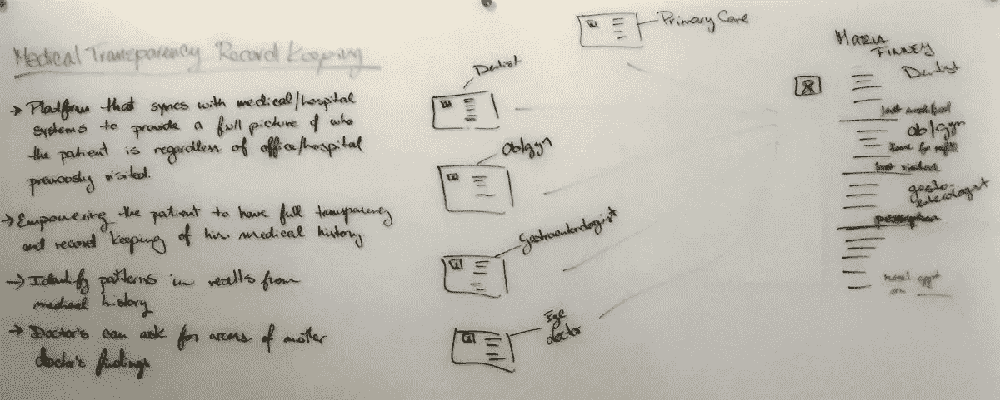
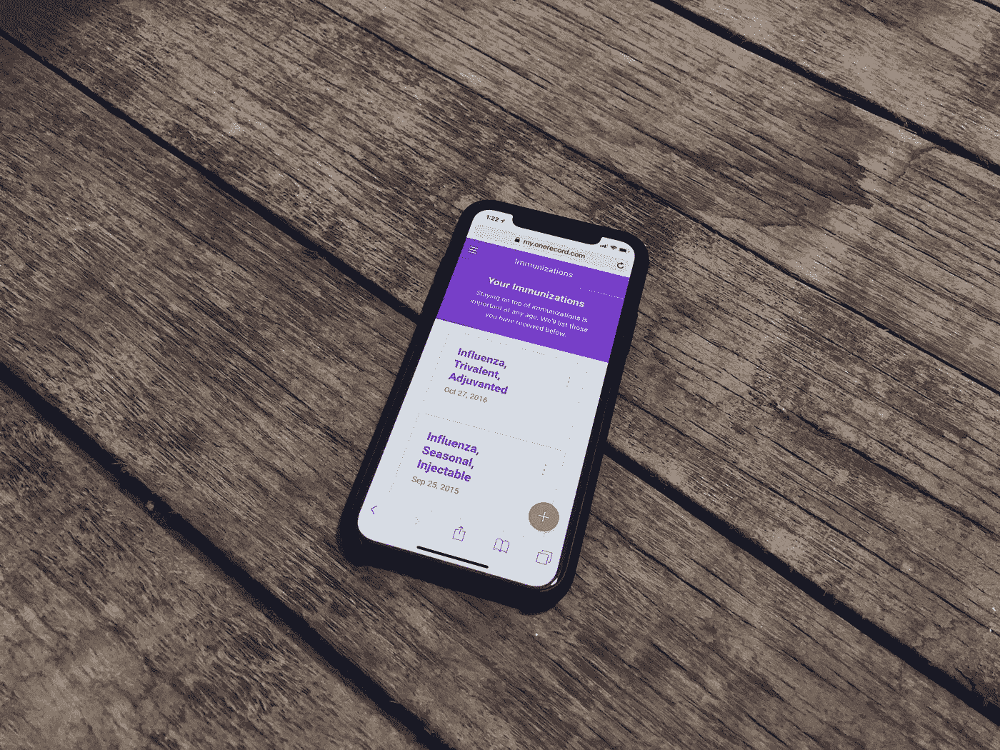

# 悄悄的健康科技革命

> 原文：<https://medium.com/swlh/a-view-into-the-quiet-health-tech-revolution-460b13ea467>

## 修补破损系统的挑战

Photo by [rawpixel.com](https://unsplash.com/photos/w9YHKTK-wLo?utm_source=unsplash&utm_medium=referral&utm_content=creditCopyText) on [Unsplash](https://unsplash.com/?utm_source=unsplash&utm_medium=referral&utm_content=creditCopyText)

# 一个乐观的发现

去年秋天，我有了创建一家公司来数字化医疗记录的想法。该公司将把所有病人的健康记录放在一个地方，一个应用程序，病人可以在需要时访问他们的全部健康记录。这个想法是在我丢失了一张纸后产生的，这张纸包含了我出生以来所有的疫苗接种。

那一刻，它觉得留下医学信息的书面记录而没有任何数字副本是一个过时、草率和愚蠢的系统。

我和几个朋友分享了我的想法，其中一个最了解医疗保健行业的人说，创造这样的东西是不可能的，美国医疗保健系统周围的官僚主义和高度监管的环境将允许我在十年内找到解决方案。

尽管如此，我很好奇，所以对健康行业几乎一无所知，我搜索了聚合健康记录公司，没有得到任何好的结果。所以，我去画板那里画了这个:

一段时间后，我放弃了这个想法，我很沮丧，有几个其他的项目和想法占据了我的时间。当然，有一次我放弃了它，它出现在我正在浏览的一个 Slack 频道，我找到了 [OneRecord](https://medium.com/u/9f3cd594cac?source=post_page-----460b13ea467--------------------------------) 。

OneRecord 是一家允许你在一个地方查看所有健康记录的公司。他们已经在纽约市建立了几年，并正在与纽约州合作标准化健康记录数据。

当我发现他们时，我兴奋得跳了起来。我很高兴地知道，人们正在努力解决这一挑战，并对卫生行业的问题有了更多的了解。

在苹果公司宣布他们计划将病人记录引入健康应用程序的第二天，我会见了 [OneRecord](http://www.onerecord.com) 的创始人。这两个女人并不担心，她们了解我们破碎的医疗系统的来龙去脉。

# **一个破碎的行业**

> 即使了解了我们卫生系统的核心基础知识，我也意识到病人和他们的数据是一个系统的一部分，讽刺的是，这个系统需要更好的护理。

“Binders on a shelf.” by [Samuel Zeller](https://unsplash.com/@samuelzeller?utm_source=medium&utm_medium=referral) on [Unsplash](https://unsplash.com?utm_source=medium&utm_medium=referral)

## **你的信息的书面记录**

当你去医院或看医生时，通常会发生两件事。

要么让你在 iPad 或电脑上输入个人信息。这发生在新的或现代化的医疗设施中。

或者，更有可能的是，办公室助理递给你一个包含 5-10 页的剪贴板，用于填写您的个人信息、保险详情、圈出的关注领域、以前的疾病和家族病史。

如果你有慢性病或者只是想寻求第二种意见，你将不得不在新的地点经历同样的过程。

OneRecord 的创始人之一对这个故事了如指掌。上大学时，摩根·诺切尔发现自己生病了，没有医生能找出病因。她主动收集信息的书面记录:医学测试、结果、处方和其他关于她的医学档案的医学信息。她把所有的东西都加到活页夹里，给她拜访的每一位医生看，直到一位医生能够把这些点联系起来，发现她患有一种罕见的遗传疾病。

## **登录和门户**

当需要查看结果时，通常可以选择登录在线门户网站。一些医疗机构有一个，一些保险公司有另一个，有时两者结合。门户网站是一个独立的市场。

患者门户网站提供商是医院和保险网络的平台公司，他们的服务是让医疗专业人员能够轻松存储和查找您的电子病历。这在商业上是有意义的，只是他们没有意识到患者在其他医疗机构可能有不止一个医生，而且他们也有病历记录。

为了让患者跟踪他们的医疗记录，他们需要记住多个登录名和密码，并访问不同的系统。

## 一堆数据

医疗科技公司面临的最大挑战之一是如何与现有的医疗记录进行交互。

有几个方面的数据可能会变得混乱。

*   首先，保存您的电子病历的患者门户网站没有一个标准化数据字段和响应的系统。这意味着，如果你或输入你的记录的人拼错了你的名字或疫苗，就很难汇总你的数据并验证其准确性。数据科学家现在必须创造性地思考，以确保正确的 T2 信息被纳入一份电子健康记录中。
*   第二，可能有多个名字和健康特征非常相似的人。OneRecord 发现了这样一个案例，一个家庭给他们所有的儿子起了同一个名字，而且他们都在相近的年龄范围内。考虑到他们是亲戚，他们也更有可能有相似的健康记录。对于数据科学家来说，从类似的记录中提取干净准确的数据是一系列的挑战。
*   但是，有一线希望，[健康信息交换](https://www.healthit.gov/HIE)正在使用 FHIR(发音为“fire”)。它代表 Fast health care inter operability Resources，这是一种标准化健康数据以供编程使用和电子健康记录使用的资源，有助于在医院和诊所之间安全地共享医疗信息。这为数据收集设置了一个要遵循的结构，这是一个保持数据向前发展的好原则。但对于结构杂乱的历史记录，还是需要有一个调和的过程。

## **自我认同问题**

虽然 FHIR 设定了电子健康记录的标准，但还没有一个标准允许你自我识别你的记录并保护你的健康隐私安全。

每家进入医疗市场的科技公司都有不同的授权和自我识别记录的方法。

## **支离破碎的未来**

> 包括苹果、微软和谷歌母公司 Alphabet 在内的科技巨头都在争夺美国医疗保健支出的更大份额，美国医疗保健支出每年超过 3 万亿美元。

虽然苹果的方法是与医院合作收集健康记录数据，但 OneRecord 的重点是从州政府的健康数据开始。他们的用户不需要 iPhone 或 Android 来访问他们的记录。这些信息通过他们的门户网站获取，使每个人，包括低收入家庭，都能方便地获得他们的健康信息。

其他公司正在转移他们的关注点，让与他们更亲近的人受益，他们的员工。[亚马逊、伯克希尔·哈撒韦和摩根大通也在开发新的合资企业，为员工提供负担得起的医疗服务](https://www.economist.com/news/leaders/21736138-welcome-doctor-you-revolution-health-care-coming)。

很明显，小公司和大公司都在尽可能地划分市场份额。他们正在为未来的医疗保健市场播下种子，旨在为已经感受到系统崩溃之痛的美国不同人群带来好处。

# **前路**

美国正在悄然发生一场医疗科技革命。科技公司正在慢慢地向医疗行业投入时间、金钱和资源。

像 OneRecord 这样的公司在向患者提供记录所有权的斗争中不再孤单。

大卫和歌利亚正在出现，并希望在别人之前征服他们的空间。

对我们来说，完全访问我们的健康记录并从健康技术创新中获益只是时间问题。

对他们来说，一个具有挑战性的旅程在等待着他们，比看上去更需要小心处理。

Source; OneRecord

___________________

## **喜欢这个故事？** [**通过电子邮件获取更多类似的内容——关于科学、营销、设计和技术的文章和想法。**](http://eepurl.com/dgDf6L)

## 这篇文章发表在 [The Startup](https://medium.com/swlh) 上，这是 Medium 最大的创业刊物，有 308，589 人关注。

## 订阅接收[我们的头条新闻](http://growthsupply.com/the-startup-newsletter/)。

