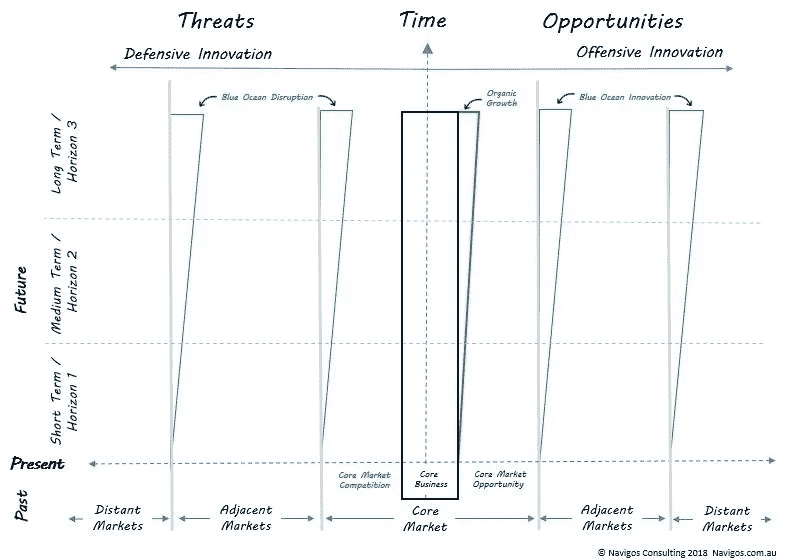
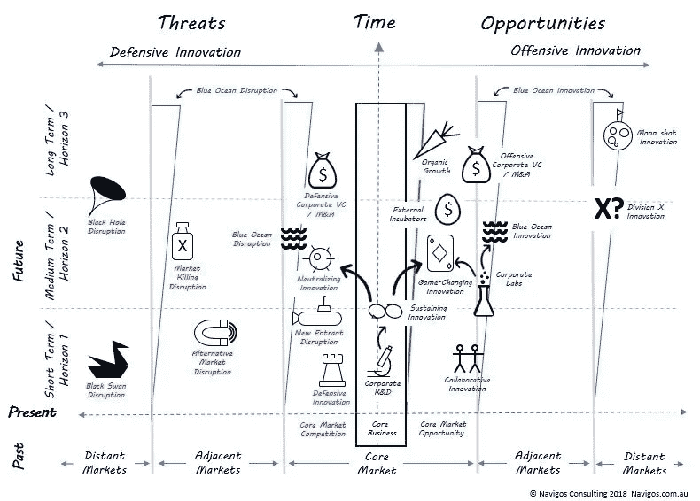

# 战略风险和创新术语的可视化地图

> 原文：<https://medium.com/swlh/a-visual-map-for-strategic-risk-and-innovation-terminology-dbae8b8aaf23>

随着一系列低成本的使能技术和方法的出现，创新比以往任何时候都更容易，最近人们对创新的兴趣越来越大。与此同时，现有组织和市场被破坏的风险也增加了。

因此，初创企业创新、设计思维、敏捷开发、精益创业和战略风险管理等学科创造的许多术语已经开始渗透到主流商业词汇中。

诸如颠覆、支点、MVP、黑天鹅和蓝海等术语都是对一组更复杂的因素、行动者和剧本的简略描述，为那些从事战略风险和创新实践的人提供了有用的见解。

然而，这些术语很容易被不太熟悉其真实含义的人误解或断章取义。对于寻求提高管理战略风险和创新能力的组织来说，这可能是一个问题，因为这些术语在正确的上下文中使用是有用的。

## 教育和背景

误用这些术语的部分问题往往是缺乏对每个术语的真正定义和来源的了解，这可以通过教育或培训来解决。

然而，即使对术语的正确含义有了更好的了解，另一个问题仍然经常存在，即缺乏对使用术语的情景语境的共同理解。

在本文中，我提供了一些我开发的图表示例，这些图表可以表示有用的情景上下文，以支持这些术语的使用。当战略风险和创新术语出现在这张图上时，我发现这通常会导致更有洞察力的战略思考对话。

## 市场地图和战略变革地图

我将与大家分享的图表是我开发的一个更详细图表的简化版本，称为*战略变革图*，我用它来帮助组织进行战略变革。

我最初开发了战略变革图，以代表其他作者、学者和咨询公司在过去 50 多年中开发的大量战略、创新、风险和执行工具的见解。

因此，我的图中包含的许多设计元素，对于那些过去使用过战略和创新工具和框架的人来说是很熟悉的。然而，在本文中，我将使用一个更简单的战略变化图，我称之为*市场图。*

市场地图用于代表在讨论战略风险和创新时可能需要考虑的各种市场。它允许你覆盖一系列关于各种其他市场参与者的信息，以及他们可能采用的与你相关的策略。它还允许你制定自己的战略选择。

本文的目的是向您介绍可定制的市场地图模板，该模板与常用的战略风险和创新术语相结合，可以帮助个人和团体更好地讨论各种战略风险和创新主题。

## 市场地图模板

## 市场地图模板设计元素

市场地图模板由两个轴组成——垂直轴代表时间，水平轴代表您的企业所从事的当前核心市场的*变化程度*。

**横轴:变化程度**

为了表示战略风险和创新场景，水平轴被划分为右侧的机会和左侧的威胁。在一张图中同时考虑到机遇和威胁，可以确保你对组织面临的战略风险和创新形势有一个更平衡的看法。

双面设计也更容易区分进攻和防守策略。人们通常认为创新仅指新的增长或生产率提高举措，但越来越多的组织可能需要划分其创新资源，以捍卫其当前的核心市场，同时开发新的市场。

我将横轴进一步细分为几个部分，以代表你的核心市场、邻近市场和更远的市场，这些市场可能会随着时间的推移影响你的核心市场或组织。

增加邻近和遥远市场的原因是真正扩展你的思维，新的机会或威胁可能在哪里。许多组织仍然认为，破坏只会来自他们当前的市场内部，这使得他们很容易被当前市场外部的变化搞得措手不及**。

在每个核心市场、邻近市场和远处市场之间，我添加了蓝色三角形来代表新的“蓝海”市场，这些市场可能由您的组织或其他人开发。“蓝海”一词来自《蓝海战略》一书，该书解释了组织如何通过结合邻近市场的概念来创造全新的市场。

如果您希望在每个部分中展示多个市场，只需将该部分分成垂直的子部分，以展示您希望展示的每个单独的市场。

最后，在中央当前核心业务矩形的右侧，我添加了一个绿色三角形来表示将扩展当前核心业务的任何新的有机增长。

**纵轴:时间**

纵轴代表时间，正如其他人所观察到的，在许多经典策略工具中，时间并不总是作为首要考虑因素。然而，随着我们今天在许多行业中看到的变化速度的增加，我认为时间是一个需要保持头脑清醒的关键因素。

我通常发现将时间轴分为 10 年期的三个时间段是有用的，第一个时间段/短期时间段代表当前详细的战略规划时间段，对于许多组织来说，这通常是 3 年左右。

如果您的组织使用更长或更短的计划周期，那么只需校准轴以适应您自己的情况，但始终使总时间周期比您的计划周期长，以扩展您的思维。

## 覆盖战略风险和创新术语

下图显示了如何将一系列战略风险和创新术语覆盖到市场地图模板上。

由此产生的图表为术语的使用提供了更大的情境背景，因为它更清楚地表明了哪些参与者参与其中，来自哪些市场，以及他们正在使用的策略。

## 实践中的应用

在车间环境中，我要么在白板上画出市场地图，要么把图表放大到 A0 海报上画出来。与大多数“画布”类型的模型一样，您当然也可以用不同颜色的便利贴覆盖图表。

在有用的地方，我用图标来说明图表和注释，以表示它们所代表的不同术语和因素。我在上面的图表中为各种术语使用的图标只是根据我自己的经验想到的。请随意使用不同的图标，这些图标最好地反映了您在自己的组织环境中使用的术语的含义。

市场地图的整体性也可能突出你的战略风险和创新词汇中的一些空白。我已经开始在下面添加我自己的新术语来弥补我的一些空白，例如黑洞破坏者*和市场扼杀破坏者*。

在下面的评论部分，当讨论战略风险和创新时，我很想听听你对其他有用术语的看法。

## 结论

本文的主要目的是与您分享市场地图，我相信它在使用战略风险和创新术语时提供了一个有用的情景背景，并导致更有洞察力的对话。

本文分享的市场地图可以用于简单的组织，但也可以扩展到代表更复杂的组织。

## 参考

* *黑洞颠覆者*——代表主要的技术平台企业，如谷歌、亚马逊、脸书、腾讯、阿里巴巴等，你知道它们就在那里，如果它们决定进入你的市场领域，很可能会把你吞掉…

**市场杀手*在相邻市场或新市场中开发新价值主张的组织，对您当前的核心市场或单个组织构成生存威胁。一些扼杀市场的破坏者故意瞄准你的市场，而其他人只是寻求以新的方式解决客户的需求，而你的组织和市场只是因为他们的新解决方案而变得多余。

** Innosight 2017 战略准备和转型调查

## 其他灵感来源:

我使用的许多术语都是我在阅读一系列战略和创新书籍和文章时遇到的，下面我列出了其中一些。

*   克莱顿·克里斯滕森:创新者的困境。ASIN: B00E257S86
*   Innosight / Scott Anthony 等著《双重转化》。ASIN: B01M7OXGYT
*   geoffery A . Moore/Everet Rogers:关于增长曲线和创新扩散的各种书籍/文章。
*   维贾伊·戈文达拉扬&克里斯·特林布尔。战略创新者的十条规则。ASIN:b 004 eiq 18
*   尼古拉斯·塔勒布。黑天鹅:ASIN: B002RI99IM /抗脆弱:ASIN: B009K6DKTS
*   renée maoborgne 和 W. Chan Kim。蓝海战略:ASIN: B00O4CRR7Y

## 这篇文章发表在[《创业](https://medium.com/swlh)》上，这是 Medium 最大的创业刊物，有 283，454+人关注。

## 在这里订阅接收[我们的头条新闻](http://growthsupply.com/the-startup-newsletter/)。

