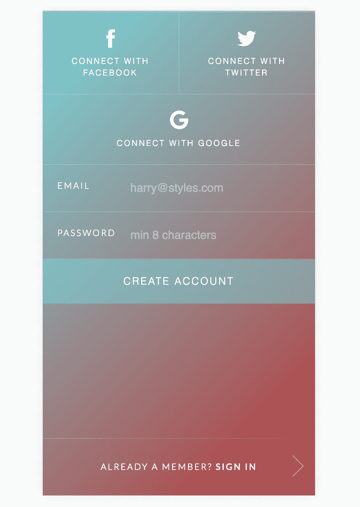

# 首席开发人员/初创企业筋疲力尽的一年(刚刚结束)

> 原文：<https://medium.com/swlh/a-year-just-over-in-the-life-of-a-lead-developer-startup-burnout-7b5501b550c0>

在一年多没有写太多内容之后，我觉得是时候动笔了。还有什么比一年的生活综述更自然的方式让我放松下来呢？

老实说，这一年我失去了很多发展或写作的动力/欲望。我终于可以写在纸上，因为我终于明白为什么会发生这种情况。我会很快解释为什么，然后我会进入过去一年我一直在做什么。

# TLDR

**-创业倦怠是真实的；我花了一年时间才熬过来。我现在有了一个男孩，他让家庭生活变得更加重要。
-我已经为大客户做了两个大项目
-一个新的附带项目让我摆脱了精疲力竭的循环
-即将出现的新事物非常令人兴奋**

# 启动烧毁

请对这一切持保留态度；这绝对可能不会发生在你身上，这纯粹是我的经历和发生的事情。创业世界是一个美丽的地方，但也有黑暗的一面。我故意省略了公司名称，因为我觉得没有必要。

我很早就开始为上述初创公司工作，我们的第一个测试版尚未发布，但从一开始，我就知道它会受到全球用户的欢迎。我是第四名全职员工，首席执行官、首席运营官和首席技术官是另外三名。和所有的创业公司一样，期权是交易的一部分，这是我第一次涉足这个世界，所以我拿了一份低薪的工作。(吸取教训！)

我们开发的产品在用户方面非常成功，仅在两年多的时间里就达到了 150 万。苹果应用商店的许多功能在教育等方面都是最好的。我们作为一个团队越来越强大。

两年半的时间过去了，我们在寻找更多的投资者加入进来；我们已经开始将比预期更好的产品货币化。我们与一位投资者就条款达成一致，并经历了非常复杂的尽职调查过程，从技术角度来看，我们取得了巨大的成功。负责人在实施这一程序时见过的最好的人之一。在这一点上，作为一个团队，我们很有信心做出正确的选择。

不幸的是，就像这些时候发生的一样，出了问题，交易取消了，我们还有一周的运行率。在这一点上，团队要停止使用工具，而 C 级员工则试图挽救企业。最终这是一笔收购，但交易的一部分是每个人都被裁员。我被授予的股份被移交给了裁员(他们将会少于我的解决方案)

这整个过程完全耗尽了我的精力，我对产品和团队充满了热情，当它消失的时候。我觉得我的一部分也做了同样的事情。我对开发和产品的热情与此同时。从专业角度来看，这是漫长的一年；我又回到了成功的自由职业游戏中。然而，有些事情就是感觉不对劲，我在一天结束的时候只想呆在家里和家人在一起。

## 从这一过程中吸取的教训

-永远不要把股票作为低工资的回报。薪水是你作为雇员的价值；股权是一种支付你辛勤工作的方式，让你的产品成为现在的样子。这是两码事。梦想远大，但不要迷失方向，你的新企业可能会非常成功并赚钱，但是，不要让收购对你必须达到的短期目标持现实态度。
-尽早赚钱，风险投资纯粹给钱让很多人使用你的产品的日子已经一去不复返了。自己赚钱，万不得已才接 VC 的钱。

# 我一直在做什么

总之相当多。我和妻子在 2016 年 2 月迎来了我们儿子的出生，做父亲是最神奇的经历。言语无法描述我有多为家人而活，有多热爱我们拥有的每一段经历。他让我们的世界变得更好，我再高兴不过了。

我发布了一个附带项目，对我第一次涉足自行车服装很有帮助。在 Kickstarter 上开展活动，为我们第一批运动衫和短裤的上市筹集资金。[点击这里了解更多信息](https://www.kickstarter.com/projects/michael-tempest/t-cycling-clothing-performance-cycling-apparel)。

T Cycling Triangles Jersey

作为首席开发人员/工程师，我工作周的剩余时间都被我的自由职业占用了。我已经和两个主要客户签订了 12 个月的合同。这两个市场都很大。

签约领导店内体验的开发，为一家大型知名客户推广和销售产品，该客户正在发布新的家庭自动化产品。我们从一开始就知道这个应用可以在移动/平板设备上运行。但是，操作系统一开始是默默无闻的；这是因为硬件团队还没有弄清楚他们将使用哪一个。

由于我们认为性能有限，我们最初使用 Cordova 构建了一个可以在包括 web 在内的任何设备上工作的混合本地应用程序。

该应用程序使用了高质量的视频内容，但我们很快意识到这种方法的性能不够。在这一点上，我们终于有了一个设备和平板电脑的操作系统，体验将被显示。我们决定建立一个完全原生的 android 应用程序。这对我们有利，因为性能远远优于混合应用程序。

另一个客户是英国的翠丰公司，自从我为它完成了第一份工作后，我又回来做更多的工作，帮助他们向前发展。

它既是首席开发人员，又是顾问；他们有一个数字团队，正在尝试改变公司处理 it 的方式。作为其中的一部分，我们已经做了大量工作，试图创建一个稳定的平台，让团队可以构建可靠稳定的应用程序，无论是 web 还是移动应用程序。最终也计划进入商店应用。大多数应用程序都是用 Angular 2 编写的(在撰写本文时是 Angular 2)。在它完全可用之前，我们做了大量的提前编译工作，这是一段非常艰难和令人兴奋的时期。现在，随着应用程序的增长，这种状态越来越成为一个问题，我们正在向团队引入 NgRX 来解决这个问题。其中一部分是与其他主要开发人员一起培养团队，提供我们认为必不可少的学习内容，并在 NgRX 上开设课程，让其他人跟上进度。

# 一个附带项目重燃战火

大约两周前，我终于将自己投入到一个我已经考虑了很久的项目中。推迟这么久的原因实际上是一年前发生的事情。它让我筋疲力尽，出于某种原因，我的头脑不允许我投入新的努力。

做出这个决定几乎立刻改变了我的思维模式，我报名参加了几个单独的策划学习课程，学习不同的开发实践，我想彻底了解它们。我找回了激情；我几乎每天都找一个小时做兼职项目。

Sneak Peak

作为首席开发人员，我的未来再次变得光明，我想追求更多，我想创造更多，我想发现更多。我终于对我的职业未来充满期待，而不仅仅是觉得自己还过得去。

这个新的副业项目是为作家创作的，无论是专业作家还是提交论文的大学生。如果你想在它发布时得到通知，请[在这里](https://mailchi.mp/d6735c4ec6c2/michael-tempests-new-side-project)注册。

如果你将来有兴趣和我一起工作，请做[联系](http://michaeltempest.com/)。

## 这篇文章发表在[《创业](https://medium.com/swlh)》上，这是 Medium 最大的创业刊物，有 293，189+人关注。

## 在这里订阅接收[我们的头条新闻](http://growthsupply.com/the-startup-newsletter/)。

