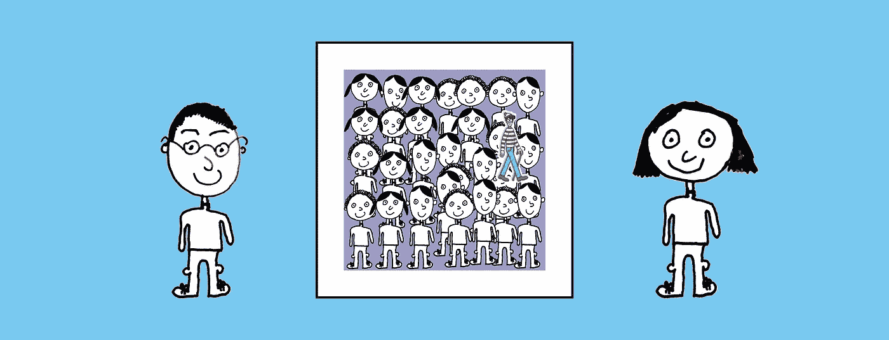
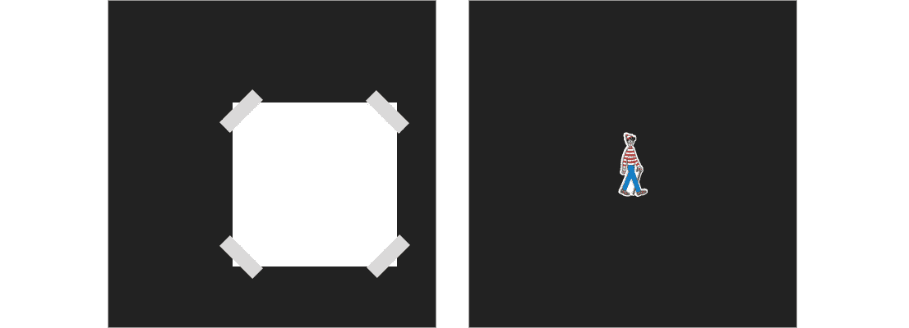
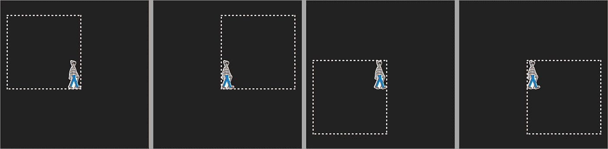

# 沃利在哪里的零知识证明

> 原文：<https://medium.com/swlh/a-zero-knowledge-proof-for-wheres-wally-930c21e55399>

Peggy the prover, Victor the verifier and a Where’s Wally puzzle. Wally image from [http://waldo.wikia.com/wiki/File:Character.Waldo.jpg](http://waldo.wikia.com/wiki/File:Character.Waldo.jpg)

在区块链世界，零知识证明是一个热门话题。

**例如，智能合同**可以使用零知识证明来隐藏合同是如何被满足的**，同时只揭示它确实被满足的事实**。(比如说，如果合同的条件很敏感，这是很有用的。最后会有更多的介绍。)

# 那么到底什么是零知识证明呢？

> 零知识证明是证明者和验证者两方之间的协议，其中证明者提出一些要求，可以使验证者相信他们的要求是有效的，同时只透露他们的要求的有效性。

嗯，这是相当多的一口！

因此，与其直接解释这个问题，不如让我们来看一个很好的零知识证明的视觉故事，稍后再回到这一段。

*在之前的* [*博客*](https://hackernoon.com/zero-knowledge-proofs-a-tale-of-two-friends-d7a0ffac3185) *中，我描述了一个魔方解的零知识证明。在这篇博客中，我们将看到一个解决沃利(或美国读者的瓦尔多)难题的零知识证明。这个想法最初是在 Naor、Naor 和 Reingold 的论文* *中写的。*

# 零知识证明故事

零知识证明故事的背景总是如下。

1.  一个很难解决的*问题*。
2.  一个*声明*的那个问题。

在这个故事中，这些是…

1.  问题:沃利在哪里？
2.  问题陈述:一个特殊的沃利在哪里的难题。

The Where’s Wally puzzle

# 人物

现在我们可以介绍我们故事的主要人物了。首先，我们有谚语人佩吉。

Peggy the prover

谚语人佩吉喜欢做断言。自然地，她希望人们相信她的*主张*是有效的。但这给她带来了一个问题。她通常不想透露证实她*主张*的细节，因为那会泄露她辛苦获得的知识。

佩吉在这个故事中提出的*主张*如下:

> 我在上面的沃利在哪里的谜题中找到了沃利。

我们的第二个角色是**验证者维克多。**

Victor the verifier

他喜欢听说话者佩吉的*主张，*但是他也喜欢确定她没有提出毫无根据的主张，因为他不想看起来像个傻瓜。现在，他想知道谚语人佩吉是否真的在谜题中找到了沃利。

# 所以…

…在这一点上，我们有一个来自佩吉的*声明*，佩吉是沃利难题的解决方案的证明者(*声明*，她想向验证者维克多炫耀这个声明。

现在，在一个传统的证明(不是零知识证明)中，有一个非常明显的方法(或*协议*，证明者 Peggy 可以借此验证她的*声明*。她可以简单地指出沃利在拼图中的位置。

在这种情况下，验证者 Victor 完全相信证明者 Peggy 在做出她的*声明*时没有说谎。他确信她是值得信赖的。

然而，证明者 Peggy 对这种方法并不满意，因为验证者 Victor 知道 Wally 在谜题中的位置。

# 零知识方法

如果证明者 Peggy 不信任验证者 Victor，或者不想透露她的秘密知识，该怎么办？如果验证者维克多也知道在哪里可以找到沃利，那么她对解决方案的了解就贬值了。她当然不希望他离开，向别人假装他自己找到了沃利。

所以她想，有没有一种方法可以让我说服验证者维克多，让他相信我知道沃利在这个谜题中的位置，而不泄露任何关于他的位置的信息？我能在*零知识*说服他吗？

# 那么，谚语者佩吉需要隐藏什么呢？

对于任何零知识证明，考虑验证者 Victor 已经知道的东西通常是一个好的开始。

在这种情况下，验证者维克多预先知道

1.  沃利在拼图的某个地方，
2.  沃利同样有可能出现在拼图中的任何位置。

所以佩吉只需要在所有其他可能的地点中同样地掩盖沃利的位置，当她向维克多透露她的解决方案时，沃利可能会占据这些地点。只要佩吉不泄露任何维克多已经知道的东西，她就会很高兴。

所以她想出了下面的方案(或*协议*)。

# 协议

谚语者佩吉去找了一张黑色卡片，它的高度和宽度至少是“沃利在哪里”谜题的两倍。然后她在卡片的正中间切一个小孔。

然后，她拿出“沃利在哪里”的谜题(在一张纸上)，用胶带粘在黑色卡片的背面，这样沃利就占据了中间的沃利形状的洞。

重要的是，当佩吉把它粘起来的时候，验证者维克多，从他站在黑卡前面的地方，应该看不到沃利在拼图中的任何周围环境。

然而，一旦佩吉将谜题固定到位，他就可以确信他没有被欺骗，因为如果佩吉不知道沃利的确切位置，她就不可能通过洞显示沃利。

(显然，佩吉可能会用一些卑鄙的伎俩来欺骗维克多，例如，把沃利的打印本贴在她的口袋里。但是让我们假设所有这些方法都被维克多解释过了。)

因此，当验证者 Victor 通过洞看到 Wally 时，他确信证明者 Peggy 的*声明*是有效的(协议的这一特性在学术文献中被称为*可靠性*)。

The back and the front of the black card. Peggy can see the back, but Victor can only see the front.

佩吉也很开心。黑卡足够大，这样无论沃利在拼图中位于何处，她都可以将拼图贴在黑卡的背面，而不会有任何拼图从黑卡后面伸出来。

因此，这个*协议*满足了证明者 Peggy 的愿望:她已经能够说服验证者 Victor 她知道解决方案(在文献中称为*完全性*)，同时除了 Victor 已经知道的以外，没有透露关于 Wally 位置的进一步信息(在文献中称为*零知识* - *ness* )。

The black card is big enough to hide the whole puzzle regardless of the position of Wally.

她已经证实了她的*主张*对零知识中的*陈述*沃利在哪里*问题*的解决方案，也称为*零知识证明。*

我现在希望，如果你重读第一段，它会更有意义！

# 这在现实中怎么用？

回到我们开始的地方，一个聪明的契约可以，比如说，要求某人满足条件 A 或 B 或 C，以履行契约。但是“满足者”可能不希望透露他们确实满足了这些条件中的哪一个。也许这个信息是敏感的。

这就好比把沃利在哪里的谜题分成 N 个和沃利一样大的盒子，佩吉在毫无知识的情况下证明她知道沃利在哪个盒子里:盒子 1，盒子 2，盒子 3，或者……或者盒子 N。

对于智能契约的零知识证明，当验证者看到契约已被满足时，他们不会学到比他们事先已经知道的更多的信息。

为什么有人想要隐藏这个满足合同的信息？嗯，也许这涉及到佩吉的身份、她的签名或她拥有的一些其他敏感属性。

如果你喜欢这个故事，请鼓掌给出一个事实的充分知识证明，并请查看我以前的博客 [*哈希函数用表情符号*](/swlh/this-simple-yet-powerful-invention-is-changing-the-world-d04688c25f13) *解释。*

另外，请到 www.pilcro.com**查看我公司。我们通过提供清晰、快速的品牌资产和指南访问，将您的整个公司与其品牌形象联系起来(针对 G-Suite 用户)。**

**

## *这篇文章发表在《T8 创业》(The Startup)杂志上，这是 Medium 最大的创业刊物，拥有 300，118+读者。*

## *在这里订阅接收[我们的头条新闻](http://growthsupply.com/the-startup-newsletter/)。*

**