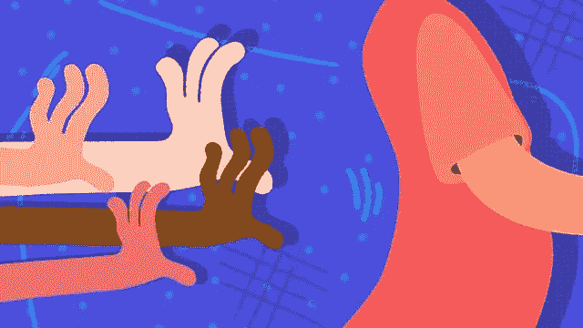

# 关于同伴压力

> 原文：<https://medium.com/swlh/about-peer-pressure-2bfd071a6c27>

Source: BBC UK

自从有时间以来，也许是永恒以来，人类不仅利用他们的智慧向前发展，而且还警惕地利用他们的智慧观察他们的同胞在做什么。从亚当和夏娃时代开始，我们就可以找到这一永恒真理的例证。事实上，如果我们看得足够近，我们会发现，不仅是人类，动物或这个星球上任何智商较低的生物也屈服于这一现象。

我们可能正开心地开着我们的大众汽车，突然有一天，隔壁的家伙开着崭新闪亮的奔驰回家了。尽管隔壁的家伙开什么车对我们来说并不重要，但当他升级他的座驾时，我们就开始听到来自内心的声音。关于为什么要跟风升级。那个无处不在的声音是什么？是同龄人的压力！

乐观地说，如果以一种相当积极的态度对待它，同龄人压力的整个概念是建立在一个更大的支柱之上的，那就是能力。这种竞争的心态是否对人类有益，完全是一个不同的问题。因为这一直是社会主义者和资本家之间不时引起激烈争论的话题之一。作为一个选择，如果我们同意竞争的社会规范对于人类社会的整体发展是不可避免的，我们也应该以积极的态度接受同伴的压力。两者紧密结合在一起，一个触发另一个。在某种程度上，我们可以有把握地得出这样的结论:同龄人的压力是装饰资本主义社会规范的竞争心态的后果之一。

即使我们认为在当前的社会政治环境中，同辈压力是不可避免的，但是如果不给予应有的关注，它的普遍负面影响是我们不能放弃的。即使对于那些大部分时间倾向于表现出旺盛行为的人来说，同龄人的压力也会扰乱这些人的情绪平衡，不管他们有多勇敢。同辈压力具有这种内在的特性，可以消除人类情绪的负面特征，从长远来看这是相当危险的。

让我们重温一下我们之前说过的例子，我们邻居的新奔驰。如果我们最终买了一辆奔驰作为对他购买的回应，这将在邻居心中引发另一轮同龄人压力。这丝毫没有减轻同辈压力的不良影响，只是将它们转移到了创始人身上。最终，我们都会把自己拉向一堆充满压力的场景，以满足在社会中保持领先的欲望。何时何地会结束？答案是永远不会。只要我们中的任何一个人明白，在这种同伴压力下采取行动是多么愚蠢，我们两个人就会像太空中的人一样，不受控制地在同伴压力的恶性循环中打转。

简而言之，从长远的社会观点来看，除了一个人由此获得的短暂快乐之外，同龄人的压力行为没有任何益处。然而，从另一方面来说，人们总是可以争辩说，有些企业是由同辈压力间接培育起来的，这反过来又有助于经济繁荣。

只要世界倾向于在理想主义的社会主义和实用主义的资本主义之间保持平衡，同辈人的压力将继续作为一种臭名昭著的暴行而存在，以普通社会的特质为食。

有没有想过忘掉它？不要做绵羊，用自己的方式做自己。毕竟，你只需要对自己的良心负责。在人群中不被人注意是容易的，但要突出你所推崇的美德却是困难的。选择权在你！

## 这个故事发表在 [The Startup](https://medium.com/swlh) 上，这是 Medium 最大的企业家出版物，拥有 282，454+人。

## 订阅接收[我们的头条新闻](http://growthsupply.com/the-startup-newsletter/)。

