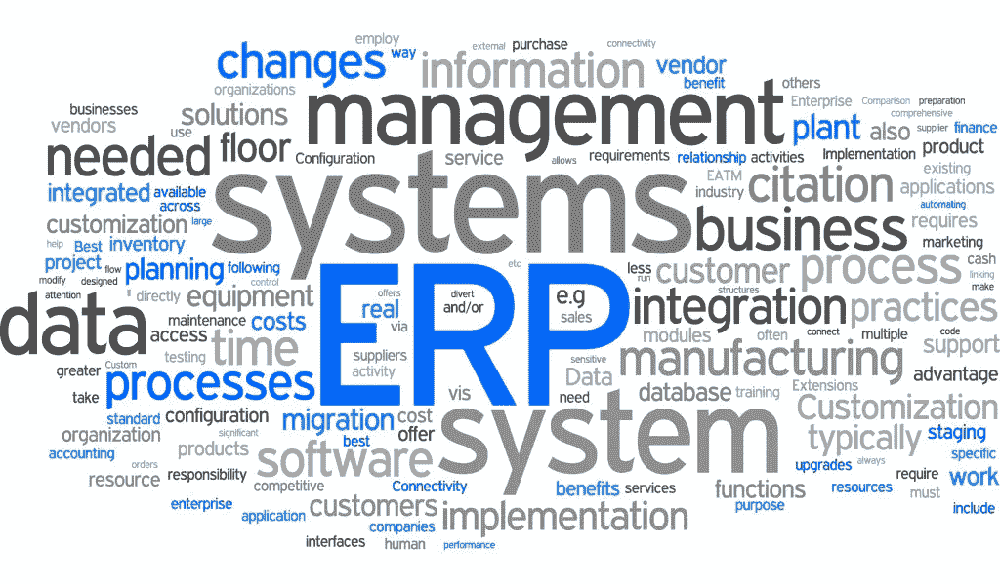

# 初创企业的会计制度

> 原文：<https://medium.com/swlh/accounting-system-craze-14552117000b>

## 你的初创企业真的需要一个会计软件吗？

Accounting systems — a hype or a need? (photo source: [The Realtime Report](http://therealtimereport.com/2016/02/02/3-ways-erp-systems-streamline-order-processing/))

从专业角度来看，直接的答案是肯定的——也就是说，从专业销售人员的角度来看。会计软件通常打包出售，称为“ERP”或企业资源规划系统——这是一种很好的方式，可以让客户为这种系统的“预测”需求投入大量资金。

虽然我不打算在这一点上长篇大论(这可能会引起我们的 ERP 供应商朋友的愤怒！)，请允许我强调几个您可能确实需要的情况:

## **库存设置很复杂**

采用 ERP 系统的关键驱动因素是，当你的初创企业的库存过于复杂，无法使用简单的电子表格或手工库存卡进行管理时。当你的初创企业从事简单的零售、餐饮和快餐业务时，没有太多困难，如果你的初创企业是基于项目的企业，就更是如此。

许多人出售这些闪亮的软件有一个很好的理由，是的，它们可以更有效，它们可以提供神话般的图形和图表，而且它们对你的初创企业来说可能真的很昂贵。在你决定使用 ERP 之前，如果你需要的话，和一个好的会计师或者簿记员聊聊——只要确保他们卖的不是一样的(或者你会更有信心去买一个！).

## **记账流程高效**

如果你想专注于你的业务，同时在旅途中监控你的财务状况，那么基于云的 ERP 系统可能会为你创造奇迹。但是，不要期待魔法。如果你不更新你的财务记录——比如扫描你的发票、收据和其他文件——那么不要指望系统会神奇地生成一份更新的报告。

At the end of the day, your bookkeeping speed won’t change just because of changing the system.

现在，你认为你的生意能满足你的期望吗？不要只想一次，不要两次，要想很多次。在大多数情况下，一家初创企业只能负担得起一名廉价的股份会计师或簿记员，更重要的是，如果你真的想专注于经营你的业务，而不是坐在漂亮的扫描和拍摄你的收据和发票，你的记录很可能不会随时更新。

## **只是该死的有钱人**

当然，你可能不是那种典型的靠有限的现金创业的人。所以，为了美丽和骄傲，尽情享受吧，尽情挥霍吧。

你不需要会计系统的原因有很多。如果你真的想为你的初创公司做基于云的会计，市场上有很多免费软件，但大多数时候，优秀的老微软 Excel 可以做到这一点。

> 当你需要继续前进的时候，确保你准备好你的记录。

在做任何投资决定之前花点时间，说到底，你不相信你的会计师吗？或者是你的会计师把他的业务转移到销售？

> Filbert Tsai 是英国的一名会计顾问。在专业上，他的专业领域是电力和公用事业，为公司和政府提供技术建议。就个人而言，他是初创企业和小企业的倡导者，他的脸书主页[向会计顾问咨询](https://www.facebook.com/AskTheAccountingAdvisor/)——为初露头角的企业家提供免费的商业建议，特别是那些在菲律宾的企业家。