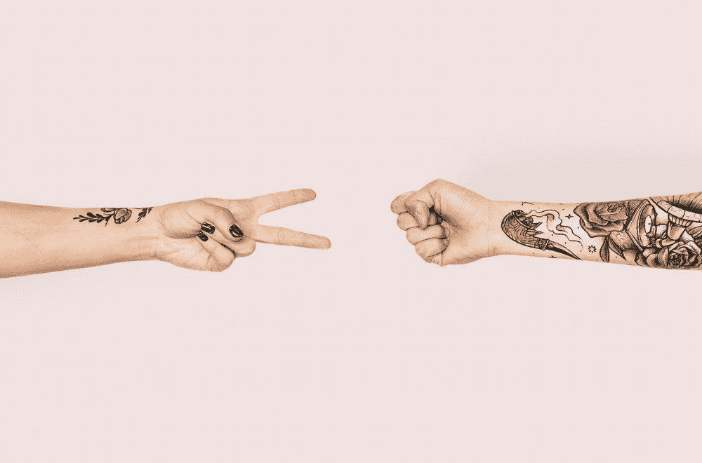

# 在充满挑战的创业氛围中实现卓越的产品管理

> 原文：<https://medium.com/swlh/achieving-product-management-excellence-in-challenging-startup-atmosphere-4fb4c270ccb5>

***当你失败的时候，不要失去教训*(达赖)**

我一直努力追求卓越的产品管理，同时也追求高效。我讨厌犯两次同样的错误，并试图从我所做的每件事中吸取教训。或者就像达赖喇嘛曾经说过的:当你失败的时候，不要失去教训。

在我融入学习、创新和产品管理的旅程中，我遇到了一家真正帮助我将成为学习型产品组织的愿景变为现实的公司。

与 [Shamaym](https://www.shamaym.com/) 一起，我实施了一种独特的基于汇报的学习模式，以弥合团队在日常工作中的学习和改进差距。该模型是基于以色列空军的述职方法。

[Shamaym](https://www.shamaym.com/) 用 3 个技巧帮我构建了一个强大的学习文化:

**#1 实施自我学习模式**

对行动、错误和学习的个人责任。

**#2 学习的文化**

犯错误是可以的，只要每个人都能从中吸取教训，并且把错误变成所有人学习的机会。构建学习论坛，你会看到人们如何努力相互学习，并非常支持。

**#3 学习程序**

将基于汇报的日常学习融入到日常工作中，让汇报成为第二个习惯(好的和坏的)，而不仅仅是在事情(通常是坏的)发生时。

我在产品管理生命周期的许多方面使用了它，从客户会议汇报、冲刺回顾汇报、演示会议汇报、路线图会议汇报等等。这有助于在团队成员之间传播知识(R&D、产品、营销)。围绕失败进行的讨论有助于文化的发展，也有助于打破你一个人即使从错误中学习也无法思考的框框。

继续学习，随时联系我，在 LinkedIn 上找[我](https://www.linkedin.com/in/dror-jacoby)了解更多相关信息！

德罗·雅各比

(照片由 [rawpixel](https://unsplash.com/photos/3Zt0qoHUYb0?utm_source=unsplash&utm_medium=referral&utm_content=creditCopyText) 在 [Unsplash](https://unsplash.com/search/photos/competition?utm_source=unsplash&utm_medium=referral&utm_content=creditCopyText) 上拍摄)

## 这篇文章发表在 [The Startup](https://medium.com/swlh) 上，这是 Medium 最大的创业刊物，拥有+404，714 读者。

## 在这里订阅接收[我们的头条新闻](http://growthsupply.com/the-startup-newsletter/)。

