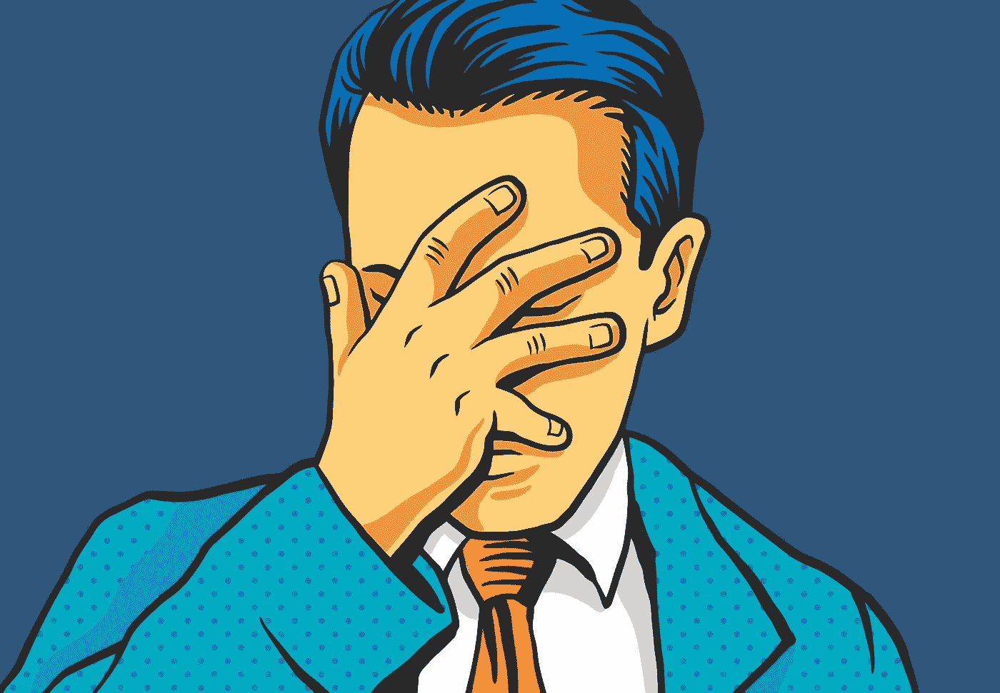

# 首字母缩略词让你变得愚蠢。

> 原文：<https://medium.com/swlh/acronyms-are-making-you-dumb-682e7fd52c86>

Image Credit: [123RF](https://www.123rf.com/)

你什么都缩写吗？Tanya 会变成棕褐色然后变 T 吗？

首字母缩略词是个大问题。*为什么？你的沟通方式决定了你每天付出的努力是否有所收获。*

首字母缩略词会变成一种无形的力量，压制你写的东西或说的话，以至于没人能理解你。他们把你的观众变成了聋子，他们迫切地想要…