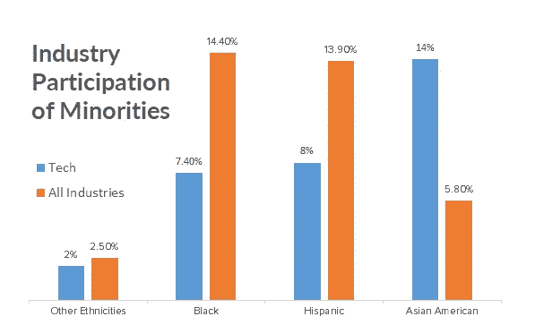
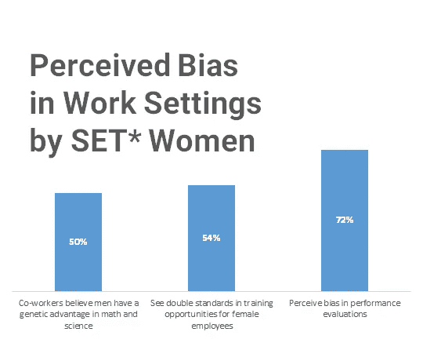
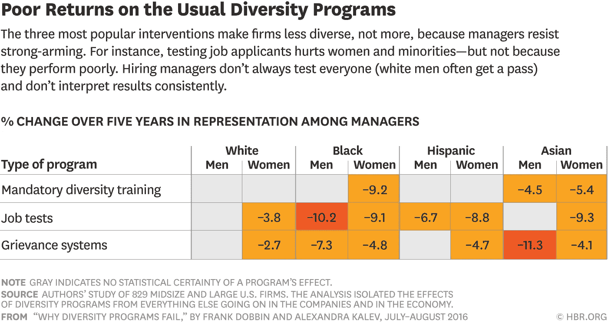

# 消除技术偏见的可行建议

> 原文：<https://medium.com/swlh/actionable-tips-for-dispelling-biases-in-tech-46d6995de902>

听到关于工作场所种族主义和性别歧视的讨论？

有些人会说，这在业内并不是什么新鲜事，尤其是最近发生的一些事件，如 [***苹果多元化主管下台***](https://www.google.com/url?sa=t&rct=j&q=&esrc=s&source=web&cd=1&cad=rja&uact=8&ved=0ahUKEwj8-ISw_tDXAhWKsFQKHbA3DiQQFggrMAA&url=https%3A%2F%2Fnypost.com%2F2017%2F11%2F17%2Fapples-diversity-chief-lasts-just-six-months%2F&usg=AOvVaw0y0i0GybGvJZ13yWUlHgk7) ， [***谷歌与一名员工关于性别歧视的备忘录发生冲突***](https://gizmodo.com/exclusive-heres-the-full-10-page-anti-diversity-screed-1797564320) ，以及 [***苏珊·福勒对优步粗暴对待女性的个人描述。***](https://www.susanjfowler.com/blog/2017/2/19/reflecting-on-one-very-strange-year-at-uber)

由于美国的历史深深植根于住房和贷款机会( [***从亚当废墟中了解到一切***](https://www.facebook.com/truTVAdamRuinsEverything/videos/710617992474278/) )，我们的多元化问题仍然困扰着我们，这一点也不奇怪。

唯一真正令人惊讶的是，这种情况发生在科技领域，一个以合作和创新著称的行业。这很有趣，因为人们谈论技术时，好像它总是比其他任何东西都领先几步。奇怪的是，就少数民族和性别的多样性而言，科技行业在某些方面比其他行业更差。

[Statistics from the report of U.S. EEO Commission about the Diversity of High Tech](https://www.eeoc.gov/eeoc/statistics/reports/hightech/index.cfm#_ftn14)

*Science, Engineering, and Technology. [Statistics from the U.S. EEO Commission about the Diversity of High Tech](https://www.eeoc.gov/eeoc/statistics/reports/hightech/index.cfm#_ftn14)

数字不会说谎，对于一个自称合作的行业来说，它似乎主要利用来自相似种族背景的志同道合者的公司，导致回音室存在于一个影响全球社区的领域。

你可能想知道:你能做些什么呢？

这里有一个任何人都可以做的事情的列表，不管工作级别，背景和人口统计:

# **1。承认有问题**

一切都从承认房间里的大象开始。科技公司处理多样性的方式存在问题，而且有大量的战争故事。

听说过**“你不够专业，因为你的*在这里插入人口统计*”**的故事吗？

> 在一次采访中，一位职业教练引用了她的女性黑人同事的故事，她拥有一家软件开发公司。当与客户打交道时，她实际上不得不说她绝对是技术型的，而且当涉及到软件开发时，她**知道她的东西**，因为她身份的种族假设首先出现在她工作经历的经验假设之前。

或者“**因为你的种族和性别，我们拒绝给你升职，让你接受额外的测试”的故事又如何？**

> 在另一场面试中，一名拉丁裔 UX 设计师不得不参加额外的工作测试以向他的潜在雇主验证他的技能，结果却让一名白人男子错过了测试，尽管他有同样的证书，却不必参加测试。

# 2.重新审视你自己的态度

下一步需要一点自我意识、谦逊和开放的经历。如果你有时间和意愿，拿一张纸，开始写下你对不同背景的人的感觉。之后，让它静置一段时间，然后开始一行一行地剖析整个事情。

例如，你碰巧写了类似“哦，我认为来自某个特定种族的一些人太让人讨厌了。我不认为他们会融入我们公司的文化。”

什么样的经历让你有这样的想法？ *也许你过去和他们有过创伤性的遭遇？*

那个种族群体中的所有人行为方式都一样吗？ *没有。你可能会想到很多人打破了这个假设的模式。*

为什么那个种族的人会有这样的行为？他们可能有一个共同的经历，那就是经济和政治等外部力量带来的。不是说都是因为那个。你也要考虑他们的个人经历！

因此，他们完全不适合你们公司的文化吗？ *也许是，也许不是。这取决于人。*

# 3.不要把它强加给别人

正如先前的社会学研究所解释的，人们经常不服从权威和规则，只是为了加强他们作为一个人的自主性。这听起来非常正确，尤其是在多样性方面。多伦多大学 的 [***研究成果就是一个证明。他们让白人测试者阅读一本关于对黑人少数民族的偏见的小册子。当人们感受到认同它的压力时，这种解读加强了他们对黑人的偏见。当他们觉得选择权在他们手中时，阅读减少了偏见。***](https://www.researchgate.net/publication/227677080_The_rich_get_richer_Predicting_participation_in_voluntary_diversity_training)

因此，通过张贴你认为人们应该做的事情来进行反对种族主义和性别歧视的运动可能很有诱惑力，但很有可能，这可能是违反直觉的。

对于那些强迫员工参加强制性多元化项目的公司来说，这是事实。他们减少了他们的多样性，而不是增加。如果你决定向社交媒体的狂野世界发布一篇未经过滤的长篇大论，你也可能会遇到同样的情况。

如果我们想改变对待少数民族的方式，我们就不应该像人们选择了偏见一样去抗争。我们最好只是平等地分享我们的想法，并希望他们能看到我们的观点。

# **4。连接，不是网络**

一位前谷歌实习生说:“与某人联系和与他们建立专业关系网是有区别的。”。他说，联系是关于培养对一个人的真正理解，而网络只是机会主义者获得更多可能性的方式。

此外，他分享说，与谷歌的导师和同事联系让他感到受欢迎，因为他们试图将他融入他们工作场所的活动和流程。那里多样化的雇员数量确实让他感到安慰，但他也认为他们的待遇更重要。正是通过这一点，他觉得谷歌真正重视多样性，更重要的是包容性。

企业往往会错过包容性(行为)的理念，去追求多样性(数字)。将会有项目从更多样化的背景中招聘员工，但是这些都不会改变任何事情，除非我们努力维持这种变化。

人不仅仅是另一张名片、简历或联系人。他们是和你一样有抱负、恐惧、技能和观点的人类。通过与他们联系并深入了解他们，我们开始更好地了解他们的为人，这有助于消除你和他人的偏见。

所以，走出去，不要与人交往，与他们联系，了解他们的背景，因为你分享你自己真实的观点，让他们理解。

# **5。选择正确的领导者**

最终，这一切都归结于选择好的领导者。无论是首席执行官还是经理职位，如果我们在基层没有强大的人数优势，影响和变革往往来自高层。如果我们希望组织具有包容性，我们必须确保我们的领导者和有影响力的人也具有包容性。根据哈佛商业评论 [***罗伯特·多宾的文章***](https://hbr.org/2017/02/diversity-doesnt-stick-without-inclusion) ，包容性领导者至少有以下三种行为:

1.  *确保团队成员畅所欲言并被倾听*
2.  *让提出新颖想法变得安全*
3.  *授权团队成员做出决策*
4.  *采纳建议并实施反馈*
5.  *给出可行的反馈*
6.  *分享团队成功的荣誉*

因此，关于什么是可行的，我们可以与我们的领导分享我们的担忧并希望他们效仿，为具有包容性领导的公司工作，雇用正确的领导，或者…

# 6.自己成为那个领导者

如果你想成为一名有影响力的人，任何时候都不算早。无论你是否处于领导地位，通过大胆发言、写作、谈论和讨论整个科技行业的偏见问题，我们与人们联系起来，帮助他们意识到正在发生的现实。只要我们没有做的事情是强有力的，只要我们没有盲目地说服他人平等是正确的，那么就继续走向世界，与他人联系，保持真实。

如果你正在参加一个女人不断被打断的会议，大声说，“我想回到简刚才说的话。简，你能把你的想法说完吗？”

如果你有一个来自少数族裔的同事，他非常出色，但无论他在团队中做了什么，都没有得到赞扬，那么说“我认为 Suresh 也做得很好。”

如果你正在招聘，而你的同事告诉你，他们不想雇佣这个来自黑人背景的合格男人，只是因为他是黑人，问一些尖锐的问题，说“黑人有什么错，这有什么关系？”

开拓自己的包容性(不仅仅是多样性)领导力之路。不要等待。

也许到那时，我们终于可以有勇气自由而自豪地宣称，技术是协作和进步的。

## 如果你非常喜欢这篇文章，拿起你的手指或光标，拍手拍手！

> ***Nelson Gomez*******【www.nelgomez.com】****是大洛杉矶地区一名初级自由交互设计师，该公司正在迎接新的机遇。在自愿的基础上，他领导着一个名为用户体验协会的青年组织的一个小分会，他们在我们通过小规模应用程序和项目工作时学习 UX。**

**

## *这个故事发表在 [The Startup](https://medium.com/swlh) 上，这是 Medium 最大的企业家出版物，拥有 270，416+人。*

## *在此订阅接收[我们的头条新闻](http://growthsupply.com/the-startup-newsletter/)。*

**