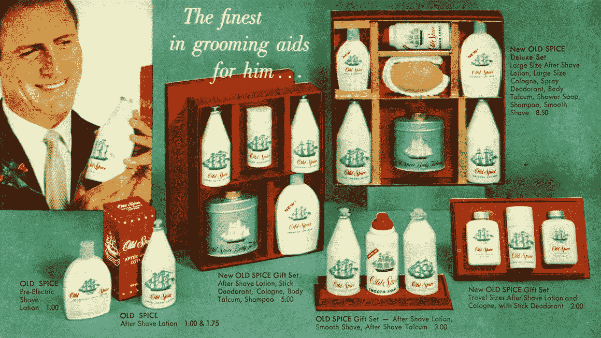
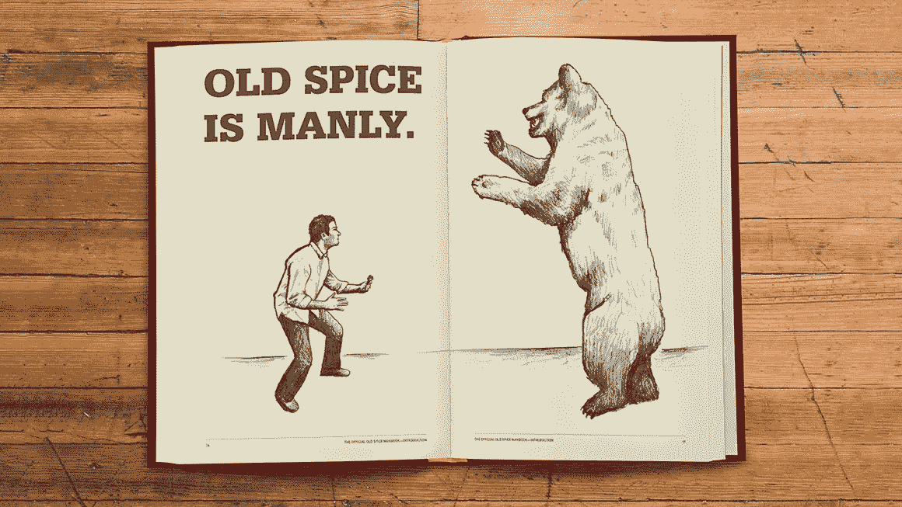

# 加一点老香料！

> 原文：<https://medium.com/swlh/add-a-bit-of-old-spice-4758040cc681>

## 勇敢的品牌重塑如何重振你的企业。

“Frozen in time” by Peter Forster on Unsplash

旧香料。

一个人。一匹马。一块肥皂。

现在这个标志性的广告是 Old Spice 极其成功的品牌重塑计划的一部分。但鲜为人知的是，这个品牌重塑实际上早在艾赛亚·穆斯塔法裹着毛巾坐在小马上之前就开始了。

老香料的胜利回归我们的货架的无名英雄实际上是 2008 年威登+肯尼迪的“招摇”运动。十年过去了，让我们回顾一下他们勇敢的品牌重塑是如何拯救了公司。

Image courtesy of Old Spice.

“老香料”创立于 1938 年，最初被包装成一个成熟的品牌，面向年长的绅士——参加茶会、喝加冰威士忌的退役军人。但在接下来的几年里，这个品牌反而与老年男性联系在了一起。它在市场上失去了吸引力。男性，尤其是年轻男性，并不买账。太中年太中产了，对大众市场没什么吸引力。坦白说，没有人想闻起来像他们的祖父。

作为回应，Old Spice 在 2007 年发起了“1-800-PROVE-IT”活动。主要集中在他们的产品的体味破坏属性，运动失败了。科学、逻辑和实用性并没有把棍子、罐子和瓶子从货架上拿下来。

Image courtesy of Flickr user Brian Bennett.

所以，他们改变了策略。他们需要一个完整的品牌重塑。它必须是情绪化的。

从这一观点出发，“招摇”运动诞生了。

他们不仅仅创造了一个广告。他们改变了自己的定位、受众、身份——除了名字，几乎所有的东西都变了。

针对 12-34 岁的新客户群，他们去掉了品牌的所有严肃性。“昂首阔步”活动的主题是变得酷、有趣和有男子气概。

再加上一个天才的营销噱头，男人们把他们的照片上传到 swaggerise.com，一系列描述他们有多聪明的可搜索文章随之产生，一股真正的热潮开始围绕这个品牌形成。

拥有 70 年品牌传统的老香料已经是男子气概的代名词。他们只是更新了他们的信息。他们不仅是如何成为男人的专家。他们可以把任何人，甚至是书呆子和极客，变成性感的帅哥。

在销售的第一年，他们招摇过市的香水销量翻了两番。翻了两番！

Image courtesy of Old Spice.

两年后，病毒式的“你希望你的男人闻起来像谁”广告出现了。但那时，艰难的工作已经在幕后完成，重新定位他们的品牌，重塑他们的身份。

如果他们坚持安全质量驱动的角度，他们可能会失去更多的销售甚至破产。通过大胆地分析市场和竞争对手提供的产品，他们想出了一个绝妙的新品牌战略。

“老香料”摆脱了其过时的名声，为年轻一代重新塑造了自己。他们现在是市场上最成功的男性美容品牌之一。

他们勇敢的品牌重塑得到了回报。你的也可以。

## 了解[未来之王](http://futurekings.co.uk)如何帮助你重振品牌。不要只相信我们的话，看看我们是如何重塑 [PrivateFly](http://futurekings.co.uk/work/private-fly/) 品牌来实现 50%的增长的。

## 这篇文章发表在[《创业](https://medium.com/swlh)》上，这是 Medium 最大的创业刊物，有+ 379，306 人关注。

## 在这里订阅接收[我们的头条新闻](http://growthsupply.com/the-startup-newsletter/)。

