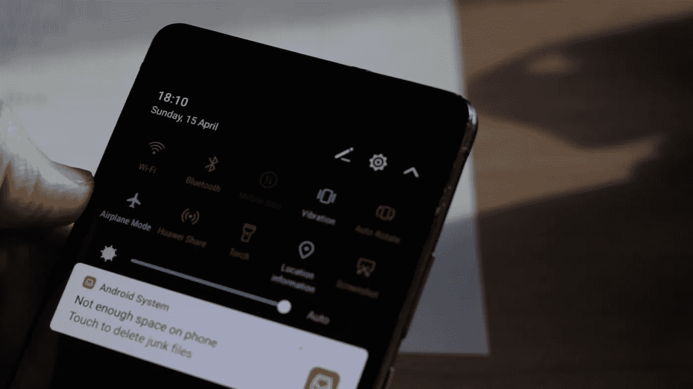

# 沉迷社交媒体？控制你的电话瘾

> 原文：<https://medium.com/swlh/addicted-to-social-media-gaining-control-over-your-phone-addiction-a971da7b0783>

*Queue dramatic music*

## 社交媒体是邪恶的吗？

**【更喜欢视频形式？**你可以在本帖末尾找到视频短文。]

# 新货币

今天上网就像走过一条繁忙的旅游街道。为了达到你的目标，你必须拒绝所有的提议，避开随机的人，在有人试图欺骗你之前继续前进。

我的观点是，网络世界是一个饱和的地方。每个人都在里面，每个人都有重要的话要说。

我认为这种自由把钱变成了第二种货币。相反，每个人都在寻找一件东西:**注意力**。

像达尔文进化论一样，互联网自然进化到最大化寻求关注的行为。在注意力链的顶端，我们有社交媒体网络。

[https://www.lyfemarketing.com/blog/social-media-marketing-statistics/](https://www.lyfemarketing.com/blog/social-media-marketing-statistics/)

在智能手机的帮助下，社交媒体应用成为我们日常生活的一部分。截至 2017 年，共有 27.9 亿活跃社交媒体用户，其中脸书以 20.1 亿月活跃用户领先。[1]

这些数字还会继续增加，正如预期的那样，人们想知道社交媒体是如何影响我们的生活的。事实是，这些技术使我们能够相互联系，但也让我们面临很多风险。

# 终极生产力杀手

有许多研究将社交媒体的使用与抑郁、焦虑和其他情绪后果的原因联系起来。像脸书这样的公司收集和出售我们的个人数据，以至于政府开始增加我们对自己个人信息的权利。

这个公司和平台有很多问题…

然而，我想关注一些更私人的东西，社交媒体是如何影响我的生产力的。

我在网上长大，不出所料，我在 YouTube 和脸书这样的平台上养成了一些非常低效的习惯。

当我在科技面前的时候(就像现在)是我最脆弱的时候。我可以在眼角看到我的手机，无声地低语着引起我的注意。

我想你可以称之为拖延，但我认为这更像是一个坏习惯或上瘾。

# 死亡的社交媒体循环

当我坐下来开始一项重要的工作时，比如写作或研究一个话题，我的思想开始走神，于是我查看我的手机。

> 有通知吗？

我回去工作了，但是现在我需要在网上查一些东西。

所以我谷歌了一下…

20 分钟后我在 YouTube 上看一些随机的名人访谈。

我回去工作了…

在一天结束的时候，我感到疲惫，不是因为我完成了很多，而是因为这种在分心和工作之间的来回消耗了我的意志力。

这个循环中最糟糕的部分是失去对我如何支配时间的控制。这种上纲上线的冲动是完全无意识的，这使得相当难以避免。

#千禧问题。需要尽快解决的问题。

听起来没有多少人支持社交媒体，对吗？情感问题，时间浪费，隐私问题。有越来越多的人批评社交媒体，以及技术如何积极地设计我们的观点和窃取我们的注意力。

退出社交媒体正在成为一种声明。

然而，尽管有这些负面影响，我仍然认为社交媒体非常棒。

# 将“社交”放回社交媒体

作为一个内容创作者，它允许我与喜欢它并需要它的人分享我的内容。我的播客是社交媒体好处的完美例子。

到目前为止，我在节目中邀请了 7 位嘉宾，他们都是我通过社交媒体应用发现的，也是我第一次与他们建立联系。

是的，我在网上的大多数互动都是肤浅的，可能是人为的，但偶尔，真实的人会找到我的内容并与我联系。老实说，这是寻找新的创造者并向他们学习的最佳工具。

这些工具旨在吸引我们的注意力，让我们花尽可能多的时间使用它们。老实说，我也希望你这样。

如果你花一整天的时间看完我所有的内容，我会非常高兴。然而，如果你通过阅读我的内容来拖延时间，那不是我的错。

你要对你的时间负责。

# 承担责任

像脸书或 YouTube 这样的巨头拥有一个工程师团队，他们不断试图窃取你的注意力，将你的时间转化为利润，但最终，我们仍然控制着局面。就像我们的情感一样，我们必须对自己选择如何支配时间的能力负责。

这听起来可能很讽刺，但在脸书发表的一篇名为*艰难的问题:花时间在社交媒体上对我们有害吗【2】*的博客文章中，他们提到了以下几点:

> “根据研究，这实际上取决于你如何使用这项技术。例如，在社交媒体上，你可以被动地浏览帖子，就像看电视一样，或者主动与朋友互动…就像在人身上一样，与你关心的人互动可能是有益的，而只是在一旁看着别人可能会让你感觉更糟。”

单纯从生产力的角度来看社交媒体的问题，如果我们都放弃社交媒体，转而花时间看电视，那还有什么意义呢？

因此，我认为更有成效的做法是看看我们能做些什么来控制我们的时间，而不去考虑试图窃取我们注意力的技术。

# 让我们实际一点

## 1.练习自我意识

你需要意识到这些注意力的中断。我设计了一个简单的表格来记录我工作时上网的频率。你可以在这里下载[。](http://roaddelta.com/fightback/)

当你工作的时候把它放在你身边，每次你想上社交媒体的时候，把它记下来。这种冲动有时会战胜你，所以一旦你发现自己心不在焉，停下来，记下来，然后继续工作。

这个练习将训练你发现这些弱点，很快你就能阻止自己。

## 2.打开飞行模式。

这就像是第二层保护，你应该在你的电脑和手机上启用它。如果你无法阻止自己上社交媒体，你会收到一个礼貌的提醒，让你回去工作。

如果你需要在网上搜索一些东西，创建一个搜索词列表，当你回到网上时，批量搜索所有的东西。因为你有一个明确的上网理由，所以你不太可能分心，走神。

## 3.小心纵容

记住，一旦你上了网，每个主要的网站都经过了优化，通过面部来吸引你的注意力。

避免提要，关闭自动播放功能(像在 YouTube 上),记住你的注意力对你的成功能力是多么珍贵。

如果你想更深入地了解这些策略，我收集了一些工具和简单的技巧，你可以实现它们来创建一个额外的保护层。欲了解更多信息，请访问博客。

不管你为什么和如何来到这里，我设法抓住了你宝贵的注意力。尽管如此，我还是希望这些信息能让你有能力控制自己的注意力，有意识地消费内容。

请记住，技术只是在向你展示基于你过去搜索的信息方面变得更好，但如果你想改变，你必须决定你未来想要消费的内容。

## 来源

[1]https://hostingfacts.com/internet-facts-stats-2016/

[2][https://news room . FB . com/news/2017/12/hard-questions-is-spending-time-on-social-media-bad-for us/](https://newsroom.fb.com/news/2017/12/hard-questions-is-spending-time-on-social-media-bad-for-us/)

喜欢这篇文章吗？让我听听👏让我知道你的想法，⬇️

## 让我们连线:[博客](http://roaddelta.com/)|[YouTube](https://www.youtube.com/channel/UCW3hau6M3heC37fIaMI866g)|[The Gram](https://www.instagram.com/roaddelta/)

## 这篇文章发表在 [The Startup](https://medium.com/swlh) 上，这是 Medium 最大的创业刊物，有 319，283+人关注。

## 在此订阅接收[我们的头条新闻](http://growthsupply.com/the-startup-newsletter/)。

