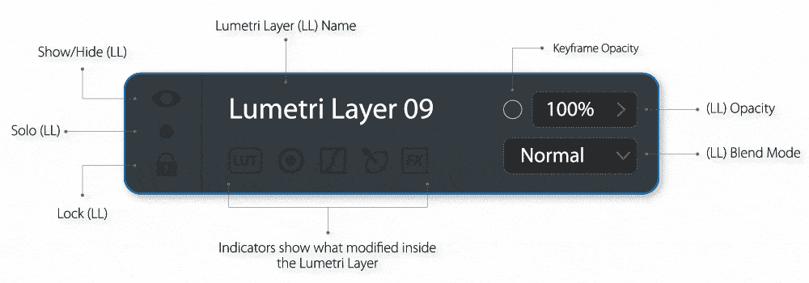

# Adobe Lumetri CC！专业颜色分级应用程序的原型

> 原文：<https://medium.com/swlh/adobe-lumetri-cc-1f673a56cda1>

自 2015 年以来，Adobe 停止了对其专业评分软件 Adobe Speedgrade 的升级，并开始致力于一种应用内解决方案，即 Premiere Pro 和 After Effects 中的 Lumetri 面板。

一开始，我们导演和编辑喜欢这个概念，它听起来像一个更容易和更快的工作流程，就像 resolve 用户已经拥有的东西一样。

但实际情况是，adobe 没有创建一个专门用于颜色分级的完整页面或界面，而是添加了一个非常简单的面板，只能进行一些基本的颜色校正(不是颜色分级！).

Lumetri panel in Adobe Premiere

他们试图模仿 Premiere 中的 Light Room 工具，让所有类型的用户都可以更容易地完成这个过程，老实说，很多人现在都可以使用一些滑块和 lut 来编辑和颜色校正他们的镜头，即使他们不是专业的调色师。

然而，视频不像照片，颜色校正只是颜色分级的第一步，Adobe 的 Lumetri 面板中缺少许多工具，尽管他们每六个月左右更新一次，但仍然缺少。

多年来这个概念证明了它的失败，我们“专业调色师”开始离开 Premiere 去 Resolve 做我们的评级，有些人甚至永远离开了 Premiere，因为 Resolve 更新了他们的编辑工具，现在他们的音频工具也更新了。

因此，这个概念和原型是对这一困境的回答，它不是要取代 Lumetri 面板，而是要扩展它。

用户仍然可以在 Premiere 中纠正颜色并简单地对他们的镜头评分，但如果他们想将他们的评分提高到一个新的水平，他们可以很容易地在 Lumetri CC 中继续他们的工作。

工作流程和概念取自 Adobe Audition CC 及其与 Premiere 的动态链接，您可以在 Premiere 中编辑和混合您的音频轨道，您几乎拥有相同的工具和插件，但如果您的项目很复杂，或者如果您想专注于您的音频工作，您只需将您的项目发送到 Audition 并继续其工作。

因为 Audition 是一个独立的软件，它可以被更广泛的用户使用，并且可以用于多种任务，您不需要知道 Premiere 就可以调整或清除声音！这使得 Audition 成为全世界收音机使用的头号软件。

我们的原型也是如此，因为它是一个独立的应用程序，调色师不需要知道如何使用 Premiere 或任何编辑技术，他们唯一需要做的就是在 Lumetri CC 应用程序中导入一个 Premiere 项目文件。

该应用程序还可以用来给单个剪辑评分，由于它是一个独立的应用程序，它可以被片场的编辑用来快速给日报评分，或者被社交媒体的影响者用来风格化他们的视频。

# 这个概念

Adobe Lumetri CC Prototype

在 Resolve 之前，我曾经用 After effects 给我的视频上色，老实说，除了实时回放的不足，After Effects 是我认为最强大的分级软件！原因是您可以随心所欲地添加效果，以您想要的方式对它们进行分层，完全控制素材、裁剪、复制、预合成、遮罩和跟踪工具、遮罩、混合模式以覆盖泄漏或模糊等效果，当然还有添加和合成灰尘、烟雾或粒子等元素的能力。

但是正如我上面提到的，缺乏实时回放和我通常必须交付项目的有限时间使我开始解决问题，这是一个多么神奇的评分应用程序啊！它简单、轻便、快速而强大，问题是我不得不离开 adobe 的生态系统，回到 XML 工作流程，事实上它错过了我喜欢的层系统！

这就是 Adobe Lumetri CC 概念的诞生，它是 After effects power 和 layer system 与 Resolve 的简单性和工具的结合。

# 界面

该界面分为七个主要区域:

## 01.项目面板:

Adobe Lumetri CC: Project panel

像所有 Adobe 的应用程序一样，您可以在这里导入您的媒体并创建新的项目和时间线，但该应用程序的特别之处在于，它能够直接在项目面板中拖放 Premiere Pro 项目文件，以便使用 Premiere 使用 **Adobe 的动态链接对其进行动态处理！**您在 Premiere 中所做的任何编辑都会立即反映在 Lumetri CC 中，这与 Adobe Audition 现在与 Premiere 的工作方式完全相同。

当然，如果你不是来自首映式，你也可以直接与你的媒体合作，只需导入你的镜头，并从它们创建一个**“LUMETRI 时间轴”**，并开始着色。

## 02.观众:

Adobe Lumetri CC: Viewer panel

在这里你可以预览你的作品和播放你的媒体。

您可以播放和循环播放您正在处理的剪辑，或者播放整个 Lumetri 时间线。

您还可以在这里为您的作品拍摄**快照**，分享、保存或用作参考。在这里，您可以**分割屏幕**以与其他剪辑和参考图像进行比较，或者使用**匹配颜色按钮**来匹配剪辑或参考图像之间的颜色。

## 03.矢量示波器和快照:

Adobe Lumetri CC: Vector scopes & Snapshots panels

在“矢量范围”轻按中，您可以使用行业标准范围来评估您的作品。

“快照”轻按是您使用检视器中的“快照”按钮储存作品快照的地方。

这些快照存储了所有的**“LUMETRI 图层”**结构，因此您可以稍后将它们添加到另一个剪辑中，快照也可以用作比较或匹配的参考，并可以导出为静止图像或 LUT 文件。

## 04.Lumetri 时间表:

Adobe Lumetri CC: Lumetri Timeline

Lumetri Timeline 是存储剪辑的地方，在这里您可以选择要分级的剪辑(带三角形的蓝色轮廓)，发现哪些剪辑已分级，哪些没有分级(蓝色轮廓)，选择多个剪辑并将它们分组(橙色轮廓)。

当处理导入的视频文件(不是 Premiere Pro 时间轴)时，可以拖放剪辑以重新排列。

## 05.Lumetri 图层面板:

Adobe Lumetri CC: Lumetri Layers panel

Lumetri 图层面板是您创建 **Lumetri 图层**以开始颜色分级的地方，它有 **3 个点击**:

**剪辑点击**是将 Lumetri 图层添加到选中的**单个剪辑的地方。**您还可以为每个剪辑创建多个分级版本，并在它们之间切换。

**群组点击**是将 Lumetri 层添加到**群组剪辑**的地方，您可以选择正在处理的群组，还可以创建多个分级版本。

**时间线点击**将 Lumetri 层添加到整个选中的 **Lumetri 时间线**中。

## * Lumetri 层

Adobe Lumetri CC: Lumetri layer

Lumetri 层是 Adobe Lumetri CC 的**核心，它相当于 Resolve 的串行节点，使用它你可以添加和操作所有的颜色分级工具，从色轮到遮罩和效果。您可以根据需要添加和分层。**

## 06.属性面板:

属性面板是所有工作和艺术发生的地方，位于工作区的中央，分为六个页面，你可以使用面板顶部的六个图标在它们之间切换:

## A.相机原始数据和颜色检查器页面:

当在 Lumetri 时间线中选择一个剪辑时，如果没有选择 Lumetri 层，您将进入第一页，即“相机原始数据和颜色检查器”页面，在这里您可以调整原始数据设置并使用颜色检查器网格匹配颜色。

## B.LUTs 页面:

在此页面中，您可以导入和可视化浏览 lut 并控制其强度。

## C.色轮/色条

第三页包含**两个子页面**，色轮，色条，以及许多其他滑块，在这里你可以做你的原色和发展你的外观。

## D.曲线页面:

该页面包含**六个子页面** : RGB 曲线、色调与色调、色调与饱和度、色调与亮度、亮度与饱和度&饱和度与饱和度，在这里你可以做二级评分和修饰你的外观。

## E.遮罩和 HSL 颜色选择器页面:

在此页面中，您可以使用参数化形状或手绘来创建蒙版，并且可以使用 HSL 颜色选择器来隔离特定的颜色，将蒙版和 HSL 选择器结合使用可以获得最佳的隔离效果。

## F.效果页面:

在这个页面中，您可以锐化/模糊您的图像，减少噪音和添加第三方插件。在导入的 Premiere 项目中使用的插件将在这里找到。

## *关键帧时间轴和迷你时间轴

在属性面板的底部设置了**迷你时间轴**，它显示所选属性的关键帧并允许快速访问它们。

迷你时间轴可以扩展成一个**完整的关键帧时间轴**，您可以在其中同时编辑关键帧。

## 07.剪辑变换

在这个面板中，您可以变换选定的剪辑，平移，倾斜，缩放，旋转，翻转，裁剪和改变不透明度淡入淡出。

当导入 Premiere Pro 时间轴时，所有剪辑变换都将随之导入并应用到此面板。

# 出口和交付

使用“文件”>“导出”命令，您可以使用 Adobe Media Encoder 导出您的 Lumetri 时间轴或特定剪辑，或者您可以只**保存并返回到 Premiere** ,以发现您的所有剪辑都已着色并准备就绪。

# 结论

Adobe Lumetri CC 是我们作为专业调色师、编辑和编辑正在等待的来自我们心爱的 Adobe 的颜色分级应用程序，它使我们保持在 Adobe 的生态系统中，并完成 Creative Cloud 视频和音频包。

我希望这将有助于 Adobe 了解我们的问题和需求，如果您喜欢这个想法，请在 Adobe 的功能请求网站 [**这里**](https://adobe-video.uservoice.com/forums/911233-premiere-pro/suggestions/34785010-adobe-lumetri-cc) 上**投票支持它。**

## 谢谢你。

**创作&设计:** Bilal Alsurri，九部作品

## 这篇文章发表在 [The Startup](https://medium.com/swlh) 上，这是 Medium 最大的创业刊物，拥有+385，662 名读者。

## 在这里订阅接收[我们的头条新闻](http://growthsupply.com/the-startup-newsletter/)。

