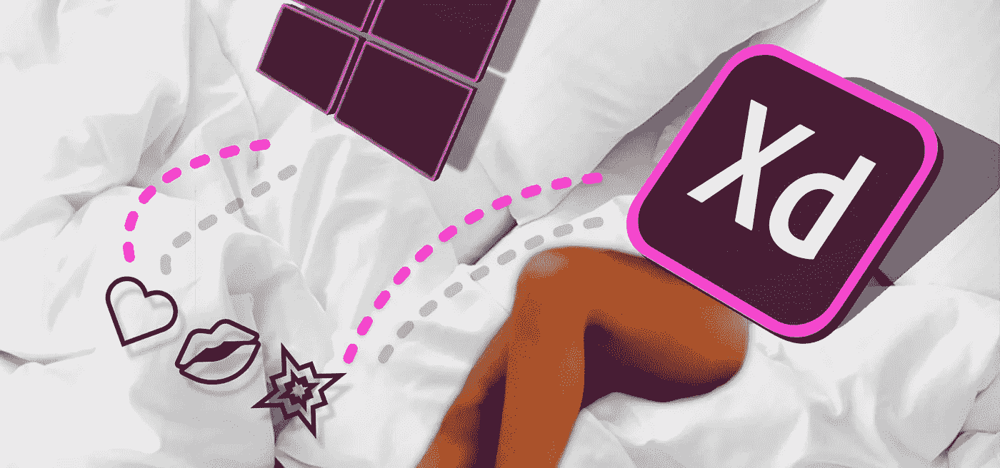
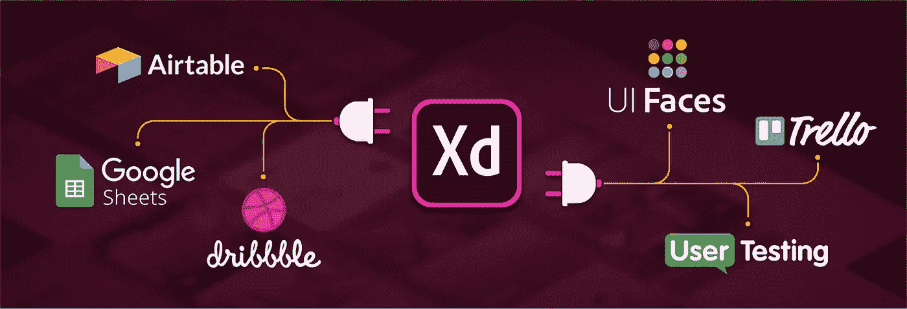
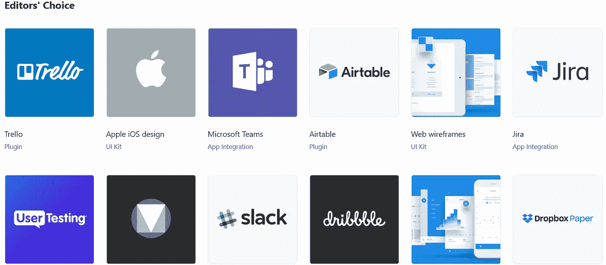
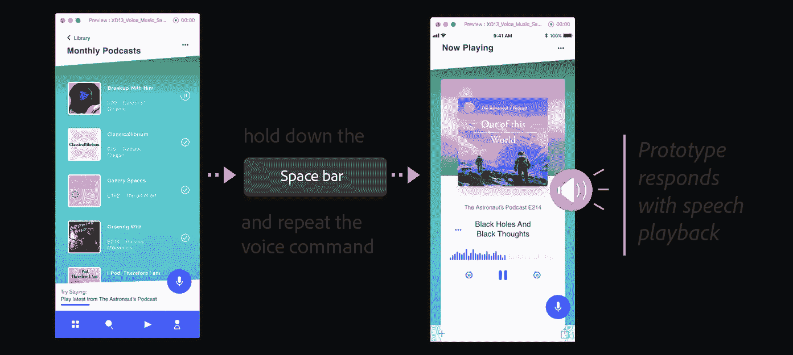

# Adobe XD 和 Windows——一个爱情故事

> 原文：<https://medium.com/swlh/adobe-xd-windows-a-love-story-674d80be50e0>

## 你不再需要一台 Mac 来成为一名伟大的设计师

承认吧，如果你参与设计界面、标志或任何形式的图形，Mac OS 将是你的首选。MAC 支持流行软件，如 [Sketch](https://medium.com/u/d39f69b23aa2?source=post_page-----674d80be50e0--------------------------------) 、Principal、Final cut 等等。很长一段时间以来，我一直嫉妒你们 Mac 用户和你们超级简单易用的设计应用。当然，windows 用户有 ProtoPie 和 Adobe XD 这样的替代产品，但它们从来都不够高效或充分。

不够，到 2018 年 10 月。游戏开始发生如此剧烈的变化。我醒来时发现 YouTube 上有一条来自 Adobe 的通知，标题是:

# 第三方插件支持

作为一名使用 Windows 的设计师，我想尽一切办法在我的设备上运行 Sketch 从运行虚拟机到考虑构建一个 Hackintosh。但是这两种方法都不适合我。Sketch 看起来就像一颗未经雕琢的钻石，因为它提供了一种简单快捷的方式来制作好看的线框，而且还有**插件，允许你做的不仅仅是设计实体模型。**您可以与其他设计师合作，将设计转换为 react 组件，在应用程序中压缩图像，导出为 HTML/CSS，等等。*插件就像是设计过程中的类固醇。*

Picture Credit: helpx.adobe.com

随着 10 月份的更新，Adobe XD 现在支持第三方插件，对于初始更新来说，它甚至没有那么多问题。你现在可以直接从 XD 内部上传到 [Dribbble](https://medium.com/u/b2c7a6c2542b?source=post_page-----674d80be50e0--------------------------------) ，你可以连接到 [Slack，](https://medium.com/u/26d90a99f605?source=post_page-----674d80be50e0--------------------------------)但对我来说，最重要的是，ProtoPie 应用程序集成可以实现更流畅的工作流程。

有一个插件，UI 套件和应用程序集成的完整目录，可以下载和安装，无需离开 XD。然而，不要期望开箱即用的数百个插件和应用程序。由于更新是在 10 月份进行的，开发者需要时间来给现有的插件阵容添加新的东西。

# 自动动画是自动真棒

我不擅长制作界面动画。好了，我说了，我有足够的勇气承认这一点。我只是觉得导出到 After effects 或 ProtoPie 的过程冗长乏味。启动一些微观互动需要时间。借助 Adobe 的自动动画动作，您可以直接在 XD 中快速创建微交互和简单的过渡。如果你足够勇敢，你会用它创造出动画原型。

在上面的视频中，我创建了一个快速互动的原型，并为互动制作了自动动画。动画是平滑的，对于这样一个项目来说，放松是理想的。你现在可以从不同的缓动选项中进行选择，包括— **抓拍、卷紧和反弹**。这允许你做更多的转换。然而，我希望看到更新的放松选项，也许还有一个**贝塞尔曲线**用于自定义放松。贝塞尔曲线将是已经令人惊叹的更新的惊人补充，我完全可以看到它在 2018 年底成为现实。

# 男孩哦男孩！拖动手势、定时转换和语音触发

随着最新的更新，你得到了 3 个新的触发器，它们完全改变了你与原型互动的方式。现在你可以拖动一个元素来触发某件事，让某件事在一段时间的延迟后发生，甚至说一句话来触发动画。现在，其他一切都很好，但语音触发器真的让我兴奋不已。由于今天有如此多的应用程序集成了语音和人工智能搜索，这个功能真的可以帮助像我这样的设计师向我的客户展示基于语音的命令将会是什么样子。

时间转换触发器真的帮助我创建了很酷的动画，一系列画板在一定的延迟后播放——就像一个非常酷的加载动画可以在 XD 中创建。

# Windows 事件

让我把这篇文章引回到我最初写这篇文章的真正动机。很长一段时间以来，Windows 用户都有软件工具来设计，与 mac OS 上的相比，这些软件工具实在是次等。真的有楼梯。一个楼梯，底部是基于 Linux 的系统，中间是 Windows，顶部是 Mac OS。有了 Adobe XD，windows 只是爬了几个台阶，和 Mac 有了一些公平竞争。此外，XD 在 windows 操作系统上运行非常流畅，感觉和工作方式与在任何其他操作系统上一样。

在今天，使用 XD 让我对使用 windows 进行设计更有信心，也让我觉得没有必要出去给自己买一台 Macbook。

 [## 2018 年值得学习的设计风格指南

### 许多设计师经常花几个小时在 Dribbble、Behance 和其他展示……

medium.com](/@punitweb/design-style-guides-to-learn-from-in-2018-1ae43a5c8191) 

此外，通过向我的 paypal
捐款来支持一位年轻的设计师，这里—→[**https://www.paypal.me/punitweb**](https://www.paypal.me/punitweb)

## 这篇文章发表在 [The Startup](https://medium.com/swlh) 上，这是 Medium 最大的创业刊物，有+388，268 人关注。

## 在此订阅接收[我们的头条新闻](http://growthsupply.com/the-startup-newsletter/)。

