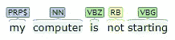

# 基于搜索查询和元因素的高级个性化问题

> 原文：<https://medium.com/swlh/advance-context-personalised-search-query-processing-ranking-challenge-ccbbcab97231>

搜索的世界正变得越来越复杂。

每天都有数十亿次的搜索，其中隐藏着数百万种含义。不是所有的搜索在上下文中都有相同的意思。每个人都有自己的偏好和个性化的含义。

我们 Origgon 正试图给这些查询添加一个更好的排序。

让我们考虑一个搜索查询来找出有价值的含义:

“我的电脑无法启动”。

通过简单的 NLP 和模型方法，处理这个查询并为其带来有价值的结果非常简单。

Parts of Speech Tagging of the query

一个简单的倒排索引搜索可以单独找到这个词，并逐渐找到最可能的结果和位置，然后是网站的排名。

为了更具体地查询排名，我们可以轻松地进行以下一些匹配:

从中寻找另一种意义:

**计算机、机器、系统、台式机、笔记本电脑、设备等。**

然后尝试使用更好的逻辑，比如:

我的电脑可以是 **Windows 10** (来自用户代理或来自用户或过去搜索的可用数据)

**因此查询可以是这样的:**

Windows 10 不工作了

我的机器启动不了

我的桌面没有启动

我的笔记本电脑无法启动

我的系统无法启动

嗯，更多的可以添加到这一点，以找到一个更好的和良好的结果质量。

但是，对于上下文不敏感的查询，问题变得更加复杂，比如:

*‘什么是 IP？’*

是 IP——互联网地址，还是知识产权

*或者，*

“谁是总统？”

这是什么意思？

谁是什么的总统？是我的国家还是一个公司还是一个简单的谁是总裁的意思作为一个工作岗位。

很艰难对吗？

要向查询桶中添加更多内容:

*【美国电影】*(是美国这个国家还是环球影城还是美国)

很难解决的问题，

让我再添加一种类型的查询

*“我的电脑变慢了”*

好吧，把排名的体验个性化一点怎么样。

假设用户过去的搜索是:

***免费杀毒软件***

***下载 XYZ 杀毒***

然后 ***我的电脑变慢了***

我们能在这个词中找到上下文吗，就像软件一样，反病毒可以和计算机联系起来。

将此放入图表中进行关系排序，我们是否可以说 ***我的电脑变慢是因为 XYZ 杀毒*** 或 ***安装 XYZ 杀毒后我的电脑变慢了。***

**有趣吧？**

需要有一个关系，词义，同义词和反义词，缩写和用户索引的大量数据的长数据库。

但是挑战是你不想把不相关的结果扔给用户，对吗？

例如:

***【好看的电影】***

该查询可以有许多分类，例如:

根据上次搜索进行个性化:

**阴险的电影**

**召唤电影**

上面的查询确定用户喜欢恐怖电影作为类型，所以要看的好电影可以是要看的好恐怖电影。

但是用户也可能有点思想开放，哈哈。喜欢 ***好电影看我附近*** 或者 ***好电影看*** (国家或语言特定)。

随着用户对查询的深入挖掘，问题变得越来越复杂，可能性越来越大。

再举一个例子，

假设有人在搜索:

*   最佳购买笔记本电脑

排名个性化可以有多种形式，如:

他让说以前搜索 GTA 5，Far Cry 4 下载，然后这个信息说明这是 windows 和高端游戏，或者他的用户代理显示他是 iPhone 用户，因此我们可以显示基于游戏搜索的高端笔记本电脑或 iPhone 用户的 mac。

但这只是排名模型的方式，还有很多要加起来。

我们有一个更好的解决方案来处理这种类型的查询问题。

保持调谐！

我会用更好的算法答案写出解决方案。

谢谢你。

阿比克·萨哈

Origgon 的首席技术官兼创始人

印度自己的也是世界上第一个社交搜索引擎。