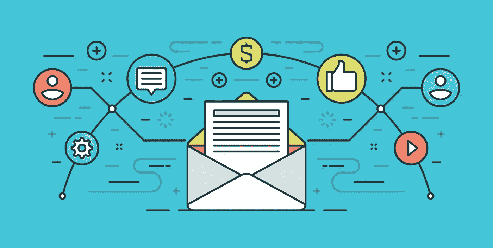
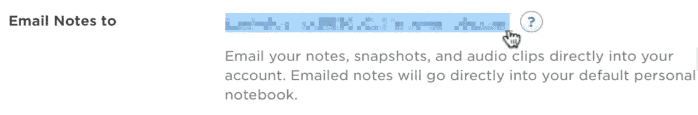
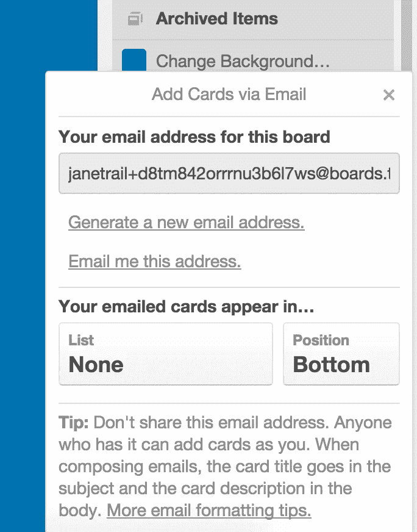
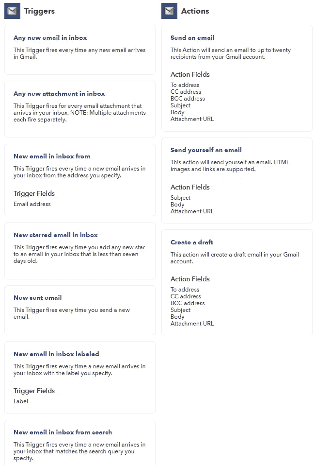
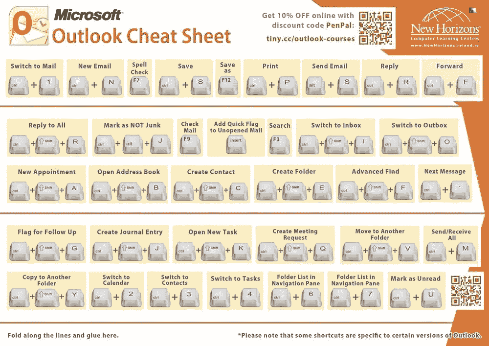
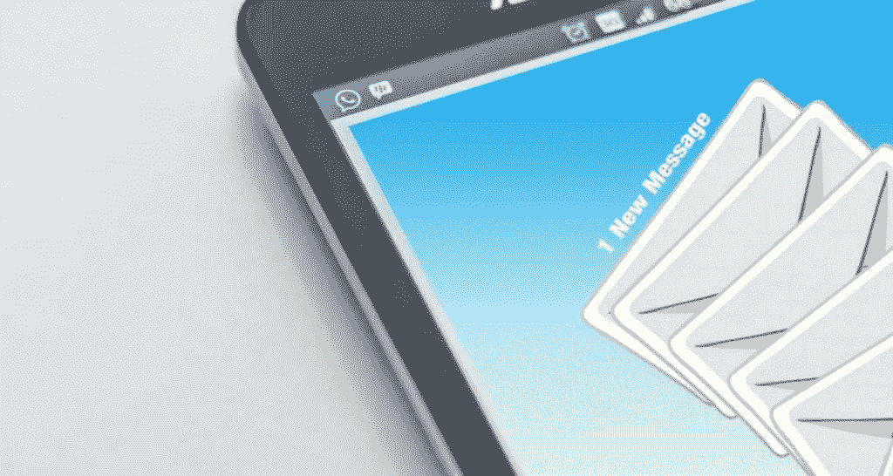

# 高级电子邮件提示:自动化您的入站电子邮件工作流程

> 原文：<https://medium.com/swlh/advanced-email-tips-automate-your-inbound-email-workflow-6c64fc88069e>

对于一些人来说，拥有一套完善的电子邮件分类方法并利用服务提供商的原生功能可能就足够了，但如果你是一个电子邮件的重度用户，你需要更进一步。事实上，电子邮件超级用户很快发现自己需要一个电子邮件工作流来及时处理收到的邮件。

幸运的是，电子邮件是如此的普遍，以至于到处都有电子邮件！从你的待办事项到你的笔记 app，大部分都提供了对邮件的支持。如果他们没有，你可以**使用 IFTTT 或 Zapier 等工具自己**构建集成。

一旦我们介绍了您可以用来提高电子邮件处理工作流程效率的工具和服务；我们将以一些最后的提示和建议来结束。让我们从您可以使用的最简单有效的电子邮件集成开始。

# 利用“电子邮件至”功能

电子邮件和其他生产力应用程序之间的集成非常有用。虽然大多数电子邮件服务都附带了一个日历(至少对于 Gmail 和 Outlook 来说是这样)，但你可能会使用许多第三方应用程序，例如**笔记应用程序或待办事项列表**。其中大多数都提供电子邮件集成:

## 保存电子邮件的内容以备将来参考

Evernote 和 OneNote 都提供了一个简单的解决方案来保存你的电子邮件以备后用:就像发送一封邮件到一个特定的地址一样简单。
[这是详细介绍 OneNote](https://www.onenote.com/EmailToOneNote) 和[流程的页面，这是 Evernote](https://help.evernote.com/hc/en-us/articles/209005347) 的页面。

两者都可以让您决定笔记应该放在哪个分区/笔记本中，以及使用主题行中的符号的其他高级功能。利用这些功能，你可以在一封简单的电子邮件中保存和整理你的笔记。下面是 Evernote 的主题语法:
`Email Subject: [Title of note] ![optional date for reminder] @[notebook] #[tag]`

## 从电子邮件创建任务

项目管理工具和待办事项列表中通常会提供与上述笔记应用相似的功能。

例如，Trello 允许你通过电子邮件创建一张卡片。主题行是邮件的标题，正文是卡片的内容。您还可以在主题行中分别使用@和#来指定卡片或标记它。你可以在他们的帮助中心找到更多的细节和格式提示。

许多项目管理解决方案都有一个相似的特征:这里是 Asana 上的[电子邮件提交，Avaza](https://asana.com/guide/help/email/email-to-asana) 上的[，看板工具](https://www.avaza.com/create-tasks-via-email/)上的[的文档。如果你正在使用另一种服务，你可能还需要搜索才能发现如何做同样的事情。](https://kanbantool.com/support/integrations/I-want-to-add-tasks-via-email-to-kanbantool)

# IFTTT 的高级电子邮件工作流程

要进一步推动电子邮件工作流程的自动化和优化，您需要的不仅仅是您所使用的服务提供的内置集成。好消息是**我们现在有工具可以将几乎任何服务相互连接**，你可能已经听说过或者正在使用它们。最常见的两个是 If This Then than(If TTT)和 Zapier。

两者工作方式相同；它们让你通过一系列条件语句连接两个应用或服务。这两种服务，特别是 IFTTT，都在物联网等各种场景下使用。今天我们将坚持用它们来收发电子邮件。

它们支持任何电子邮件提供商，并提供 Gmail 和 Outlook 的高级集成。您可以创建自己的食谱或使用他人已经制作的食谱。

它们提供的可能性几乎是无限的，以下是一些帮助你开始的建议，并展示它们简化你的电子邮件处理的潜力:

## 从基础开始

自动将标有星号的电子邮件同步到 Evernote :非常清晰，但超级方便，这取决于你使用星号功能的目的。

[把标有 RIL 的邮件存到口袋里](https://ifttt.com/applets/16264p-gmail-label-pocket-to-pocket?term=gmail):如果你的同事和朋友经常通过邮件与你分享文章，这是一个简单却非常有效的方法。

**标签触发器**很有趣，因为 IFTTT 连接了如此多的通道。例如，[您可以创建一个 slack 标签，通过点击](https://ifttt.com/applets/252336p-post-labeled-gmail-messages-into-a-slack-channel?term=gmail)在您的 slack 上共享特定的电子邮件。

## 高级电子邮件工作流的示例

到目前为止，我们用两步小程序保持它的简单，但是你可以用 IFTTT 做更多的事情。让我们来探究一下其中的奥秘:

[自动将 Gmail 电子邮件与收据、订单、&发票同步到谷歌电子表格](https://ifttt.com/applets/90162p-automatically-sync-gmail-emails-with-receipts-orders-invoices-to-a-google-spreadsheet?term=gmail):这是自由职业者、小企业的杀手锏，甚至如果你在大企业工作，你的工作涉及大量发票。这也是一个很好的演示**的三步公式。**具体情况如下:

1.  **触发**:你收到一封主题行包含收据、订单或发票的电子邮件。
2.  **第一个动作:**将第一个附件保存在您选择的驱动器文件夹中。
3.  **第二步:**然后，它会在 Google Sheets 中列出账单/收据/订单，以及您可能需要的任何相关信息(电子邮件发件人、日期……)

不费吹灰之力，这个食谱就能让你的账单和发票井井有条。

## 通过 GMAIL 和 IFTTT 更进一步

与 Gmail 的整合非常有用，你可以更进一步。例如，你可以使用“来自搜索的收件箱中的新邮件”作为触发器，使用我们在专门针对 Gmail 的文章中提到的所有搜索修饰符。

## 成为终极邮件处理机器的最后一步

如果我们给你的一切还不够(你每天收到多少封邮件，几百封？)我们还有最后一招:**键盘快捷键**。它们可用于(尽管可能有所不同)所有查看电子邮件的方式:无论是直接通过网络服务还是使用电子邮件客户端。

这里有一份非常全面的 Gmail 快捷方式备忘单。

对于 Outlook 用户，这里有一个单独的页面，展示了主要的:

# 手机和平板电脑呢？

**手机和平板电脑不适合高效处理电子邮件**。如果你想实现一个有效的工作流程来处理你收到的电子邮件，它必须在电脑上。

## 错别字在专业环境中不会起作用

智能手机和平板电脑的设计初衷是先消费(内容、视频、社交)。它们不适合在专业环境中制作。错别字总是会给人留下不好的印象，而且你的收件人并不在乎你的邮件是否“来自我的(你的)iPhone”。我们把这种签名的影响这个话题留给了[《大西洋月刊》](https://www.theatlantic.com/technology/archive/2013/07/mobile-device-email-signatures-more-than-you-ever-wanted-to-know/277950/)、[《赫芬顿邮报》](https://www.huffingtonpost.com/bianca-bosker/sent-from-my-iPhone-signature_b_3516549.html)、[生活黑客](https://lifehacker.com/are-sent-from-my-phone-signatures-useful-or-annoying-659230357)和其他似乎对此非常着迷的媒体。

## 手机:通知超载的入口？

此外，在智能手机上设置邮箱就像打开潘多拉盒子一样。如果你很聪明，微调你的通知设置，你会没事的，但你是那 1%。

**大多数人从不改变他们手机上的通知设置**，尽管每天会被他们打断很多次。错过重要通知的恐惧如此强烈，以至于他们宁愿每天收到垃圾通知，也不愿错过独角兽。

电话成瘾对生产力已经够糟糕的了，我们不要再火上浇油了。

> *ds cout 的研究还发现，普通用户每天花 145 分钟在他们的(Android)手机上，进行 76 次电话会话。至于 iPhone 用户，苹果公司最近证实，其设备用户每天解锁手机 80 次。大约每小时六到七次。*

–[指出我们对手机的痴迷](https://blog.dscout.com/mobile-touches)——ds cout 的迈克尔·温尼克

当然，有些情况下，你需要通过移动设备访问和回复邮件。您可以通过设置您的电子邮件帐户，**禁用电子邮件和所有形式的电子邮件通知的自动同步，让您的手机为这些时间做好准备。在智能手机上实施高效的电子邮件工作流程几乎是不可能的。**

你要做好准备，在不影响日常工作效率的情况下，偶尔用移动设备处理电子邮件。

# 你想怎样就怎样

最终，**没有一个放之四海而皆准的解决方案**来处理收到的邮件。根据你收到的邮件数量、你的职业状况、你需要多长时间来处理你的邮件以及许多其他参数，对你的具体情况最有效的回答会有所不同。

通过我们的电子邮件系列的第一部分，我们向您展示了一种方法，有用的服务和工具，以更快地处理您的电子邮件。为了最大限度地利用它，你必须挑选、选择并根据你的具体情况调整我们的建议。在 Gwapit，我们在讨论中有既得利益，因为我们正在开发一个解决方案来帮助我们的用户优先考虑他们的通知，无论是电子邮件还是其他东西。

## 避开电子邮件通知洪流

我们建议的技巧和集成是有效的，但需要相当多的设置。此外，为了最大限度地利用它，你必须**改变你处理电子邮件的方式，并记住你使用的所有工具**(比如标签和当你使用一个给定的工具时会发生什么)。

在 [Gwapit](https://gwapit.com/?utm_source=blog&utm_campaign=em&utm_term=em4) ，我们从不同的角度看待这个问题。我们的目标是制作**一个单一的仪表盘，在那里你可以看到来自你邮箱的通知以及你在工作中使用的其他应用**。从这里开始，你可以通过创建**自定义过滤器**(“组”)来对即将到来的风暴进行分类，从而根据你的规则对进行优先级排序。设置阶段结束后，好处很快就会显现出来。

Screenshot of Gwapit’s main dashboard with all the notifications coming from different apps

好奇吗？来试用产品，也许可以和我们一起制作？ [Gwapit 目前处于测试阶段，可以免费获得](https://gwapit.com/?utm_source=blog&utm_campaign=em&utm_term=em4)。为我们提供反馈和建议的早期用户可以获得几个月的免费使用(甚至终生免费使用！)一旦 app 发布。

*原载于 2018 年 10 月 9 日*[*gwapit.com*](https://gwapit.com/blog/email/automate-your-inbound-email-workflow/)*。*

## 这篇文章发表在 [The Startup](https://medium.com/swlh) 上，这是 Medium 最大的创业刊物，拥有+385，662 人关注。

## 在这里订阅接收[我们的头条新闻](http://growthsupply.com/the-startup-newsletter/)。

