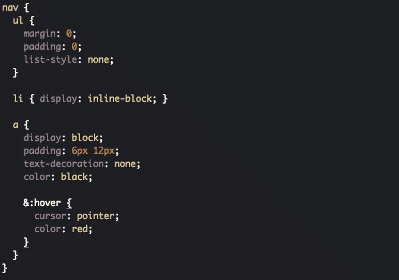

# 在 CSS 开发中使用预处理器(Sass)的优势

> 原文：<https://medium.com/swlh/advantages-of-using-a-preprocessor-sass-in-css-eb7310179944>


“program script digital wallpaper” by [Maik Jonietz](https://unsplash.com/@der_maik_?utm_source=medium&utm_medium=referral) on [Unsplash](https://unsplash.com?utm_source=medium&utm_medium=referral)

关于使用 CSS 预处理器在开发中是否有用，网上有很多争论。我个人的看法是，对于小型的 web 项目或应用，可能不需要预处理器。

然而，随着项目越来越大，CSS 代码的维护和可读性变得越来越难。处理数千行 CSS 规则，浪费开发者时间，提高项目成本。随着项目越来越大，CSS 会导致一些问题，例如:

*   小变化大努力
*   构建代码的困难
*   代码冗余
*   无尽的 CSS 类和规则

预处理器帮助我们处理这些问题。它比普通的 CSS 有一些优势。在我们深入探讨之前，首先解释一下什么是 CSS 预处理器…

> ***随意看看我 Youtube 上的*** [***CSS 初学者教程***](https://www.youtube.com/watch?v=moOAB9rr6OE&list=PLaz1hMFq311xO7KEX4Y84hMMbjBI1GTGJ) ***。***

# 什么是 CSS 预处理器？

> 一个程序/工具，它有自己的语法，随后被编译成标准的 CSS 代码。

预处理器有自己的语法，开发人员可以用它来编写更简单、更简洁的 CSS 代码。后来，它在一个单独的文件中被翻译成标准的 CSS，因为浏览器不理解语法。

有不同的预处理器，如 **Sass、Less、**和 **Stylus** 。在这篇文章中，我将解释 **Sass** 的一些优点。

# 什么是萨斯？


**Reference:** [Sass official website](https://sass-lang.com/)

Sass 是使用最广泛的 CSS 预处理程序之一。它有各种功能来帮助开发人员编写更好、更干净的 CSS 代码。更多详情可以从 [Sass 官网](https://sass-lang.com/install) & [Github 资源库](https://github.com/sass/ruby-sass)查询。

## 常见问题:萨斯 vs SCSS

这是一个常见的问题。它们实际上都使用不同的语法。SCSS 基本上是一个更新的版本， **Sass 版本 3。**

**Sass 语法示例:**

```
$color: gray=my-font($color)
  font-family: Arial, Helvetica, sans-serif
  font-size: 16px
  color: $colorbody
  background: $color
  margin: 0
  +my-font(white)
```

**SCSS 语法示例:**

```
$color: gray;@mixin my-font($color) {
  font-family: Arial, Helvetica, sans-serif;
  font-size: 16px;
  color: $color;
}body {
  background: $color;
  margin: 0;
  @include my-font(white);
}
```

正如我们所见， **SCSS(时髦的 CSS)** 有一个类似 CSS 的语法，这是更容易阅读。它是 CSS 的一个扩展，而 **Sass** 有一个更加不同的语法。他们的文件扩展名也不同:`.sass` & `.scss`。

你可以在这里阅读更多信息[。让我们继续讨论 Sass 的特性。](https://stackoverflow.com/questions/5654447/whats-the-difference-between-scss-and-sass)

# 特性#1:变量

在一个项目中，不同的 CSS 类可以包含相同的规则。例如，我们的网页上有 20 个不同背景颜色的框:

```
.box-1 {
   width: 100px;
   height: 100px;
   background: red; 
}.box-2 {
   width: 100px;
   height: 100px;
   background: yellow; 
}....box-20 {
   width: 100px;
   height: 100px;
   background: blue; 
}
```

后来，我们的客户改变了主意，想要更大的箱子。所以我需要逐个增加每个类的`width`和`height`属性。这也可能是 50 类。在现实生活的编程中，这可能会令人沮丧。正如我上面提到的，这是一个**大努力小改变的例子。**

我们怎样才能更有效地做这件事？

> **Sass** 提供了一个解决方案:**变量**。像在其他编程语言中一样，我们可以使用变量来存储值，并在以后重用它们。

变量的定义:

```
$variable-name: value; 
```

回到上面的例子，如果我们为`width` & `height`定义**变量**:

```
$box-width: 100px;
$box-height: 100px;
```

以后需要改变的时候，我们唯一要做的就是改变自己的价值观一次:

```
$box-width: 200px;     // changed from 100px to 200px
$box-height: 200px;    // that's all!.box-1 {
   width: $box-width;  // using variables now instead of pixels
   height: $box-height;
   background: red; 
}.box-2 {
   width: $box-width;
   height: $box-height;
   background: yellow; 
}....box-20 {
   width: $box-width;
   height: $box-height;
   background: blue; 
}
```

CSS 本身现在也支持变量了，但是在 IE &其他浏览器的老版本中就不行了:


[https://caniuse.com/](https://caniuse.com/)

# 特性 2:嵌套

标准 CSS 不支持嵌套。我们不能在另一个类中编写一个类。随着项目越来越大，这带来了可读性问题，结构看起来也不好看。

例如，让我们在下面的 HTML 中定义一个带有可点击链接的导航菜单:

```
<nav>
  <ul>
    <li><a href="#">Home</a></li>
    <li><a href="/about">About</a></li>
    <li><a href="/contact">Contact</a></li>
  </ul>
</nav>
```

HTML 支持嵌套代码。然而，如果没有嵌套，它们在 CSS 中看起来像这样:


**CSS** classes for navigation menu

我们必须为每个标签编写 **nav** ，甚至为 anchor (hover) 的**伪类编写，因为 **nav** 是所有标签的父标签。然而，Sass 支持嵌套:**



Same classes with **Sass**

在这里，我们可以像在 HTML 中一样编写结构更好的代码。我们不需要一节课接一节课写`nav`，这也防止了**冗余**

> **重要提示:****不建议**嵌套深度超过 **3 级的类。**

# 特性#3:混合

我们在上面学习了如何为 CSS 规则使用**变量**。但是如果我们需要一起使用一组规则呢？Sass 有一个特性叫做 **mixins** ，让我们来做。

## 什么是 Mixin？

Mixins 是将 CSS 声明组合在一起的 Sass 函数。我们可以像**变量**一样在以后重用它们。

我们可以用 **@ mixin** 命令创建一个 mixin，后跟一个名称:

```
**@mixin** my-font {
  font-family: Arial, Helvetica, sans-serif;
  font-size: 16px;
  font-style: italic;
}
```

或者我们可以创建一个 **mixin** 作为函数并添加参数:

```
**$font-color**: red;**@mixin** my-font(**$font-color**) {
  font-family: Arial, Helvetica, sans-serif;
  font-size: 16px;
  font-style: italic;
  color: **$font-color;**
}
```

创建 mixin 后，我们可以用 **@ include** 命令在任何类中使用它。所以我们每次可以用 **my-font** mixin 代替 4 行**字体规则**。这种方法简化了代码。

```
p { 
  **@include** my-font; 
}
```

> 使用 **mixins** 是防止代码冗余的好方法。

# 功能#4:导入

最后，我们可以用 Sass **import** 特性将巨大的 CSS 文件切割成小块。阅读&维护小文件比阅读一个有**无尽行的大文件要容易得多。**

实际上，CSS 现在也有了一个**导入**特性。但它的工作原理不同。CSS 每次向服务器发送一个 HTTP 请求来导入一个文件。Sass 不需要 HTTP 请求就能做到这一点，这是一种更快的方法。

您所需要做的就是，用 **@ import** 命令将您的 Sass 文件导入到另一个 Sass 文件中:

```
// Your main Sass file**@import** 'file';
**@import** 'anotherFile';.class {
  // Your code
}
```

> 我们不必使用**。文件路径中的 scss** 扩展名，Sass 会理解它。

以上是 Sass 的一些重要特性，它帮助我们编写更高效的 CSS 代码。还有其他不错的特性，也许我可以在另一篇文章中介绍。为了更好的理解，你可以在你的系统中安装 Sass。或者可以直接在 [codepen.io](https://codepen.io/) 开始编码。我希望这篇文章对你有所帮助。

> ***如果你想了解更多关于 Web 开发的知识*****[***在 Youtube 上关注我***](https://www.youtube.com/channel/UC1EgYPCvKCXFn8HlpoJwY3Q) ***！*****

**非常感谢&下次再见！**

**[](https://medium.com/swlh)**

## **这篇文章发表在 [The Startup](https://medium.com/swlh) 上，这是 Medium 最大的创业刊物，拥有+387，966 名读者。**

## **在这里订阅接收[我们的头条新闻](http://growthsupply.com/the-startup-newsletter/)。**

**[](https://medium.com/swlh)**