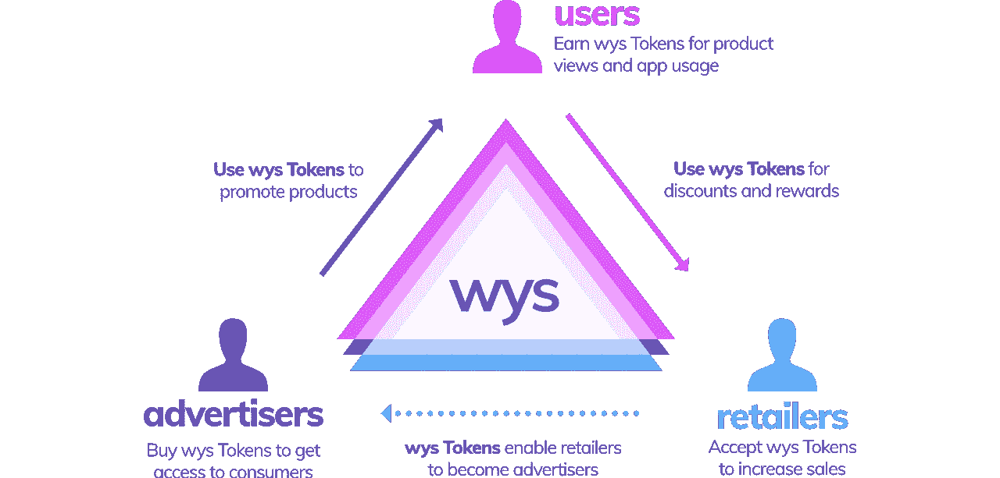

# 加密货币的冒险

> 原文：<https://medium.com/swlh/adventures-in-cryptocurrencies-f59471356f93>

最近几年，我的同事谈论了很多关于区块链技术的事情。我们在 2016 年与法兰克福的 fin techs 一起做了一些[原型项目，并即将与客户开始一些真正的项目工作。区块链当然是最有影响力的技术趋势之一。但不知何故这一个没有自发传染给我。我不太相信区块链的科技故事。但是区块链的用例似乎总是很吸引我。尤其是摆脱双方之间昂贵的中间人听起来很有趣。因此，我等待着一个机会来获得区块链技术的应用或使用的个人第一手经验。](http://www.between-the-towers.com/de/event/blockchain-next-steps/)

10 月初，我得知了即将推出的 [Wysker](https://www.wysker.com/) 购物应用。维斯克计划在几个层面上使用区块链技术:他们发行自己的代币(WYS 代币)，以便在用户、广告商和零售商之间使用它们进行折扣、奖励和促销，如下图所示:

我发现这个想法很吸引人:让用户重新控制他们的数据，甚至让他们为使用他们的数据付费。这对我来说非常有意义——尤其是对传统上非常关注隐私的德国消费者来说。维斯克还计划通过德国第一个 ICO[ICO](https://www.wystoken.org/)寻找投资者。Wysker 位于柏林，由一个有趣的[团队](https://icobench.com/ico/wysker/team)运营。

所以我决定用少量的钱加入那个 ICO。我终于想对每个人都在谈论的事情有一个更好的个人感受了！

开始时看起来很容易的事情最终变成了一个小小的业余项目。出现的问题有:

*   我如何获得通用以太币(ETH)来兑换威斯卡币(WYS)？
*   哪些平台使用安全？
*   我为什么需要钱包？
*   我在哪里存储我的私钥？

没想到会有这么多困难。你读得越多，你就越怀疑。当你处理代币的时候，损失你的钱是非常简单的。所以我一步一步来。

我知道我需要用它们来换 WYS 代币。所以第一个问题是:我如何得到 ETH？许多网站推荐北海巨妖或 T2【比特币基地】作为许多标准代币的已建立和安全的交换平台。比特币基地似乎非常有用，但从德国/欧元的角度来看费用略高。北海巨妖更便宜，但不容易使用，缺乏稳定性(我后来才知道)。

> 但是，我们不是一开始就想通过区块链的方式摆脱中间商吗？而现在:第一步涉及到想挣钱的第三方…

尽管如此，我还是和北海巨妖开始了我的第一步。第一个惊喜是北海巨妖对你的身份非常明确。他们有 5 层(0 到 4 层)验证。事实证明，我需要第三级验证才能根据需要从德国进行交易。所以这需要一些时间(读作:小时)！

下一步是将一些“真金白银”从你的银行账户转移到你的北海巨妖账户。北海巨妖称之为“融资/存款”。我用的是 SEPA 变速器。2017 年 10 月免费。但是事情变得“有趣”了。你得到了关于 SEPA 转移的明确指示。北海巨妖使用 Fidor 银行作为中介银行。你把钱转到北海巨妖在 Fidor 银行的账户，并在交易备注中注明你的北海巨妖账户。

听起来像冒险？确实是！

所以你按照提议进行交易。这笔钱会离开你的私人银行账户，消失几天。你变得紧张，但在网上看到许多令人安心的帖子，说钱最终会到达克拉肯。它确实在 3 天后到达我的箱子里。所以最后我准备在北海巨妖交易。

> 因此，我在这个对等的区块链世界找到了第二个中介 Fidor bank...

与此同时，我注意到欧元和瑞士法郎之间的汇率大起大落。因此，此时你面临着汇率风险。此外，Wysker ICO 的预售即将结束。离预售结束只有两天了。它对 WYS 代币提供 30%的折扣。很有吸引力，但当时几个小时内，ETH/EUR 汇率也在 245 至 275 欧元/ETH 之间波动。尽管如此，我最终还是以一个似乎还算合理的价格买下了我的第一个 ETH。

> 有很多方便的工具可以观察加密货币的价格涨跌。我在写作的时候用的是[密码交易器](https://itunes.apple.com/us/app/cryptotrader-bitcoin-ethereum-real-time-chart/id1027547409?mt=8)。

与此同时，我了解到你不能用像 kraken 这样的代币交易所的代币参加 ICO。你需要一个以太坊[钱包](https://tokenmarket.net/what-is/ethereum-token-wallets/)，可以处理标准化 [ERC20 代币](https://theethereum.wiki/w/index.php/ERC20_Token_Standard)。如今，大多数 ico 都发行 ERC20 代币。您的钱包不存储您的代币，但它存储您的私钥，并且有一个在以太代币交易中使用的相关公共地址。有软件钱包，也有硬件钱包。软件钱包使用起来很舒服，但许多消息来源推荐使用硬件钱包，如 [Trezor](https://trezor.io/) 或 [Ledger Nano S](https://www.ledgerwallet.com/products/ledger-nano-s) 。我买的是后者。再次提醒:注意运输时间！这可能需要几天到几周的时间…

因此，我的下一步是准备我的硬件钱包，并将我的 ETH 令牌从北海巨妖转移到我的硬件钱包。但是:没用。北海巨妖报告了我不理解的错误。在北海巨妖支持团队的帮助下，我在北海巨妖的一个论坛上找到了一个解决方案:在你第一次把钱转到你的存款账户后的三天内，你不允许提取现金或代币！至少不是作为德国公民。

> 注意:你的住所在密码交易中起着重要的作用！

因此，由于这一意外延迟，我最终错过了 30%的 Wysker ICO 预售折扣。事后看来，我已经接受了一个相当糟糕的欧元/瑞士法郎汇率，但没有及时把我的瑞士法郎放进钱包。太糟糕了。

但我利用这段时间习惯了我的硬件钱包以及如何使用它。正如许多网站推荐的那样，我决定在 Chrome 浏览器中使用 [MyEtherWallet](https://www.myetherwallet.com/) (MEW)来使用我的 Ledger Nano S wallet。Ledger 有自己的软件包，但 MEW 是开源的，是一种标准工具。在很多教程中也会用到。所以我试了一下。您使用 MEW 来访问您的钱包—检索您当前的令牌状态或转移令牌。其余时间你的钱包(和你的私钥)是离线的。这增加了你的安全性。

我也利用这段时间去理解以太交易的概念，比如天然气和天然气限额。它们很重要，因为它们决定了你为以太网交易支付的交易价格。水电部在这些方面有很多很棒的文件，比如这个关于天然气价格的解释。我还学习了像 [ETH 加油站](https://ethgasstation.info/)这样的工具，你可以用它来为你的交易确定一个好的汽油价格。

> 注意:在 MyEtherWallet 等工具中预先配置的默认油价并不总是最佳选择。

我终于成功了，把我的 ETH 从北海巨妖转到了我的钱包里。北海巨妖将此视为撤资。取款需要支付小额费用(比如将欧元交易到瑞士联邦储蓄银行)。费用可以用欧元或瑞士法郎支付。

> 当你的代币到达你的钱包时，你就为你的 ICO 做好了准备。所以对于第一次尝试的人，我建议考虑至少两周的时间来准备你的第一个 ICO。也许更多，如果你想得到一个好的汇率！

需要明确的是:你的钱包里没有真正的代币。在公共区块链中有一个交易证明某个账户地址拥有这些代币，并且该账户地址与你的钱包相关联。我想很多人会对“钱包”这个词感到困惑。钱包或多或少是一个安全的密钥库，有一个公开的账户地址...

继续我的个人故事:我最终用 ETH 换来了 WYS 代币。由于上述延误，我只得到 15%的预售折扣，因为我错过了最后期限。您向 ICO 提供的公共地址发送/传输 ETH 令牌。我通过 MEW 做那件事。作为回报，您将获得一个交易号。您可以使用此交易编号来观察区块链处理您的交易。这真的是很好的部分:只需要几秒钟就可以完成我的交易。交易费用真的很少。

大多数 ico 基于 ERC20 令牌。你可以使用像 [ETHplorer](https://ethplorer.io/) 这样的工具来了解新的 ERC20 令牌以及如何配置它们以在 MEW 中显示。

在我投资 Wysker 的几天后，我得知他们受到了奇偶错误的影响。砰！得知 Wysker 为早期投资者做了一切，我很感激:他们发行了一个新代币，并将这个新代币与我的账户相关联(因子为 1.25)。我只是不得不[收回新代币](https://www.reddit.com/r/wysker/comments/7duihz/how_to_claim_tokens/)。

在撰写本文时(2017 年 11 月)，ETH 价格仅在 4 周内就上涨了 50%，至目前的 390 欧元。所以你对 ICOs 的投资都是关于时机的。

> 注意:购买 ETH 的正确时机可能比获得 30%的 ICO 售前折扣更重要。

我希望我能用我的故事描绘出这个美丽新世界的微妙之处。像区块链这样的技术肯定会带来新的可能性，甚至新的市场。像往常一样，如果你进入很少或没有监管的地方，你需要非常小心。你会感觉到很多贪婪。与此同时，看到新技术以惊人的速度出现并被采用也是一件令人着迷的事情。很难相信这种情况会再次消失。

## 这个故事发表在 [The Startup](https://medium.com/swlh) 上，这里有 263，100 多人聚集在一起阅读 Medium 关于创业的主要故事。

## 订阅接收[我们的头条新闻](http://growthsupply.com/the-startup-newsletter/)。

