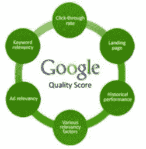
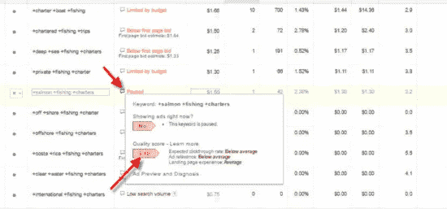
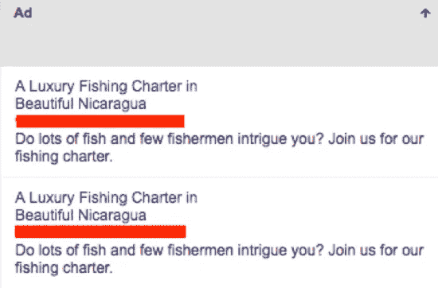
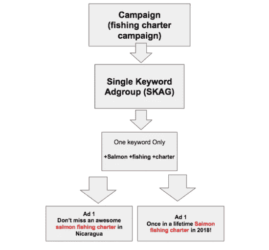
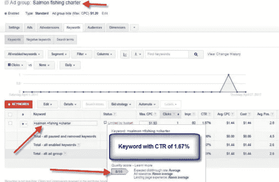
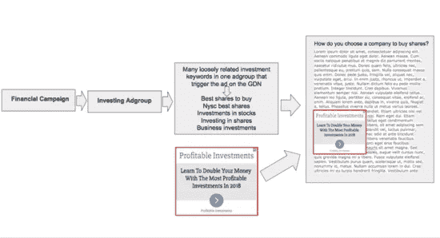
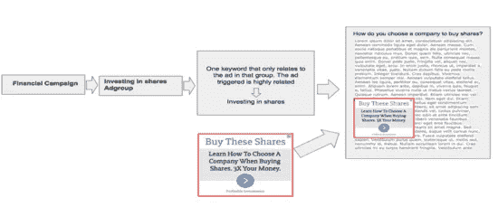

# 单关键词广告群(skag)——如何处理低质量分数和高每次收购成本

> 原文：<https://medium.com/swlh/adwords-single-keyword-adgroups-skags-d6953e598a60>

广告商在搜索网络上发起活动时遇到的一个主要问题是低质量的关键词得分。低的

高质量的关键词得分会很快毁掉一个活动，最大的问题是更高的每次点击成本，这反过来会增加你的潜在客户获取成本。

当你发起一个活动时，很难判断哪些关键词会产生印象、点击和转化，所以这是一次钓鱼探险，直到你找到获胜的关键词。

广告组中的独特关键词越多，每个关键词与该组中的广告的相关性就越低。谷歌的系统很快认识到这一点，并开始惩罚它认为与广告“不相关”的关键词，甚至在广告开始收到印象之前。

# 发起活动后立即注意到低质量分数

如果你的关键词得分质量在广告投放后立即下降到 3/10，并且你看到*由于低质量得分*通知而很少显示，很可能是因为根据 AdWords，你使用了与广告“不相关”的关键词。你的每次点击成本(CPC)会因为低质量而上升，从而增加你每次购买所支付的费用。

幸运的是，一切都没有失去！你可以让这些关键词重新获得谷歌的青睐。在第一个例子中，我将向您展示我们是如何为一次豪华钓鱼活动完成这一任务的。

以下是度假村放入名为“私人捕鱼宪章”的广告组的关键词列表:

*+租船+乘船+钓鱼*

+深海+海洋+钓鱼+租船

+私人+钓鱼+包机

+包车+钓鱼+旅行

+离岸+钓鱼+租船

+鲑鱼+钓鱼+租船

+离岸+离岸+钓鱼+租船

+哥斯达黎加+哥斯达黎加+钓鱼+租船

+清澈+水+钓鱼+租船

+国际+钓鱼+租船

关键词*+三文鱼+钓鱼+包机*在发布后立即获得了 3/10 的质量分数，尽管点击率(CTR)为 2.38%。从点击率来看，即使搜索用户找到了与广告相关的关键词，对 AdWords 系统来说却是另一回事。

虽然广告组中的所有关键词都与“捕鱼执照”相关，但它们之间的关系并不紧密，因为该列表由不同类型的捕鱼执照组成。AdWords 认识到了这一点，并认为它们都与广告无关。结果，一些关键词立即被给予低质量分数。

这是由关键词触发的两个广告:

# 单关键词 AdGroups 一键就能提高你的质量分！

单关键词广告组(SKAGs)是改善低关键词得分的最佳方式。SKAG 是一个常规的广告组，除了只有一个关键字。它可能包含也可能不包含多个广告。广告必须在广告文案中包含锚关键字。

这是一个基于“鲑鱼捕捞许可证”关键字的新创建的 SKAG 广告组的鸟瞰图。

注意这两个广告中的关键词。这向 AdWords 系统发出信号，表明该关键字与广告组中的广告极其相关。

只需点击一下，AdWords 立刻给新广告组中的同一个关键词打 8/10 的质量分！由于这种改进，每次点击费用下降 30%并不罕见。你可以期待看到这种下降也反映在你的每收购成本(注册会计师)。

随着你的活动开始产生印象，你要密切关注平均位置。在这种情况下，它是 2.6。这个想法是让关键词/广告保持在一个健康的位置，这样你就能保持很高的点击率。

我建议一开始就更积极地出价。随着时间的推移，AdWords 系统将继续重新评估关键词的表现，并开始更加重视关键词/广告的点击率。

下面是一个新广告组中的关键字示例，质量得分为 8/10。

# 在谷歌展示网络上使用单一关键词广告组

谷歌展示网络(GDN)的问题也没什么不同:注册会计师太高，但与给你的关键词打质量分的搜索网络不同，GDN 没有这种东西。我建议用你的 CPA 目标作为关键词表现的基准。

在我们遇到的大多数账户中，广告客户在同一个广告组中有几十个，有时几百个松散相关的关键词，还有 GDN 上的几个广告。不可能有那么多关键词与一两个广告相关。

你应该从 GDN 用户的角度来看这个设置的问题。

假设用户正在浏览网页，并开始阅读提供“你如何选择一家公司购买其股票”信息的内容你的广告上写着“了解最有利可图的投资”。虽然你的广告与整体主题相关，但用户在那个时刻并不完全感兴趣。

当每个广告组有多个关键词时，您的广告将使用以下示例显示:

有些人可能会说，读者对投资的一般概念是开放的，所以广告是相关的。这是绝对正确的；然而，如果你想提高转换率，降低注册会计师，你会想提供一个更有针对性的广告内容。

以下是在单个关键字广告组中的设置:

通过在上面的广告组中使用单个关键字“投资股票”，AdWords 将广告提供给对“投资股票”主题最感兴趣的用户，而不是其他人。每个广告组有多个关键词不能达到这种程度的相关性。

可能很难证明为每个关键词创建一个广告组是合理的，尤其是当你有几十个甚至可能上百个关键词的时候。节省时间的一个方法是在每个广告组中使用多个关键词来启动你的广告活动，让他们开始产生流量。

一旦你发现哪些关键词产生了大部分的印象和点击，你就可以为这些特定的关键词创建一个新的 SKAGs，并为每个关键词创建一个广告。我们最近使用这个策略为一个国际客户削减了大约 43%的 CPAs！

我们注意到的另一个优势是印象份额增加。当关键词是广告组中唯一的关键词时，AdWords 似乎给予了更多的触及范围。我的理论是，与同一组中的许多关键词相比，系统可以找到与单个关键词相关的更好的页面和内容。

请记住，你能做的任何使你的活动更相关的事情总是在 AdWords 中胜出。

感谢阅读，

tye Binuyo
Agora 整合营销客户经理

附言:如果你有兴趣利用专业直复营销团队数十年的知识、测试和专业技能，请立即订阅我们的每周简讯。[你可以在这里报名](https://readyfireaim.eu/free-ready-fire-aim-eletter/)。

## 这个故事发表在 [The Startup](https://medium.com/swlh) 上，这是 Medium 最大的创业刊物，有 300，118+人关注。

## 在此订阅接收[我们的头条新闻](http://growthsupply.com/the-startup-newsletter/)。

