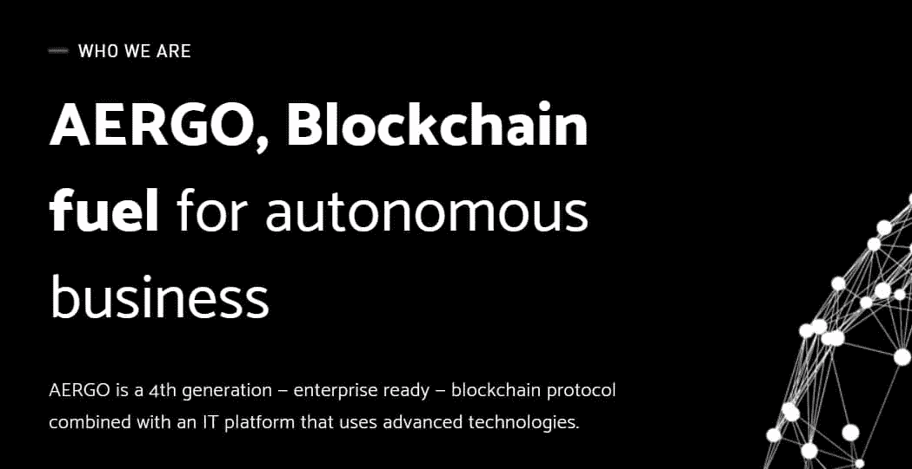
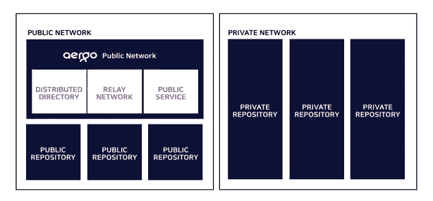

# AERGO——真正的专业企业区块链

> 原文：<https://medium.com/swlh/aergo-a-true-specialist-enterprise-blockchain-30988531630b>

## 安全、透明和信任是任何成功企业的三个核心要素。找到一个能够不折不扣地提供这三者的平台是一项非常具有挑战性的任务。


[Alex Kotliarskyi](https://unsplash.com/@frantic?utm_source=medium&utm_medium=referral) | [Unsplash](https://unsplash.com?utm_source=medium&utm_medium=referral)

幸运的是，区块链通过其不变的总账技术为变革奠定了基础，这种技术可以在集权化难以完全比拟的领域提供服务。

然而，对区块链科技来说，这并不是一条平坦的路。在整个世界能够完全采用区块链作为他们的领先技术之前，有许多未完善的功能需要改进。

AERGO 希望以企业为先导引领这场技术革命。现有的区块链系统无法提供客户和潜在用户都需要的安全性、透明度和信任。AERGO 的[提议](https://paper.aergo.io/AERGO_Whitepaper_v5.2.pdf)是一个新的专家解决方案，允许组织完全接受并蓬勃发展。

# **介绍阿尔戈**

AERGO 的提议涵盖了企业市场中的所有利益相关者。它提议的平台对企业、开发者和 IT 供应商都是有利的，这些对这些系统的工作是至关重要的。涵盖这三个主要利益相关者使 AERGO 领先于任何竞争对手。大多数现有的平台通常会照顾一两个利益相关者，而不是整个团队。

➡️The 目前为止，区块链的进展偏向于支持业务结构，而开发人员面对他们发现自己所处的不熟悉的系统。如果 AERGO 的平台成为支持全球企业的全功能单元，这样的例子将很快结束。

# **企业专员**

企业组织的业务需求是多种多样的，并且根据所提供的服务类型而与单个企业不同。有些可能具有相同的底层流程，但是随着需求变得更加具体，差异可能会出现。

➡️The 喜欢以太坊和为各种商业提供基础的其他协议 dApp 被设计为通用协议。它们服务于从游戏到教育的各种行业，所有这些都在一个协议下。该系统引入了许多效率问题，尤其是当多个 dApp 变得流行并且它们的使用增加时。这种协议的负载变得难以承受，从而降低了整个网络的速度。这种情况对任何企业来说都是灾难性的。

在某些情况下，运营供应链等敏感企业的 dApp 中的➡️Downtime 可能会导致大规模延迟甚至灾难。专业化，尤其是在企业市场中，是必不可少的。通过其平台，AERGO 被证明是寻求将区块链集成到日常运营中的企业的正确解决方案。

# **物联网**

世界在不断进步。随着创新的增加和技术的改进，企业也在改变其经营模式，从而允许持续的全球演变。各行业经历的新技术进步的一部分是**物联网或物联网**。[物联网](https://www.forbes.com/sites/louiscolumbus/2017/12/10/2017-roundup-of-internet-of-things-forecasts/)很可能成为未来科技不可或缺的一部分。


IoT devices and information will substantially grow over the coming years, so it is vital that a platform to serve the ecosystem is created | [Source](https://www.google.co.uk/url?sa=i&rct=j&q=&esrc=s&source=images&cd=&cad=rja&uact=8&ved=2ahUKEwjNg9j0kOXdAhUQTBoKHZrHBc0Qjxx6BAgBEAI&url=http%3A%2F%2Fluxreview.com%2Farticle%2F2015%2F06%2Fthe-internet-of-things---the-jargon-explained&psig=AOvVaw0j8bjzyLhjYJKIxYWUi57E&ust=1538479500557416)

在供应链管理等领域，各种设备正被用来帮助提高仓储和运输物流等部门的效率。多个区块链和 dApp 也试图为物联网相关机制提供支持。

➡️Blockchain 可能被证明是将各种技术结合起来使企业高效运行的重要组成部分。物联网只会越来越大，因此 AERGO 的提议来得正是时候。

# **开发者友好**

开发人员需要实现创意者概念化的想法。企业充满了改变世界的想法，需要独特的眼光来决定在现实世界中的实施。区块链配备了几个技术上有前途的功能，特别是在去中心化方面，这将吸引最多的创新。

> 问题是当开发者想要根据创新者向他们描述的功能来创建应用程序时。

现有的区块链平台向开发者提供有限的服务。它们要求开发者理解适合区块链的新编程语言。学习一门完整的语言来编写一两个应用程序可能会阻碍开发者注册新的语言项目。

➡️To 克服了这个可能阻碍区块链在企业中快速崛起的瓶颈，AERGO 的平台将是开发者友好的，允许用开发者熟悉的传统编程语言编写智能合同。这将通过 AERGO 平台的 **AERGOSQL** 特性来实现。


[Makers](https://unsplash.com/@nesabymakers?utm_source=medium&utm_medium=referral) | [Unsplash](https://unsplash.com?utm_source=medium&utm_medium=referral)

# **编写智能合同的便利性**

最终，根据智能合约中定义的参数，在 AERGO 平台上执行交易。取决于服务提供商和客户，不同的 dApp 将具有不同的参数。AERGOSQL 不仅允许在 AERGO 平台上对 dApp 进行更简单的编程，而且它还将包含一个带有 SQL 语言的智能契约引擎。

对于企业来说，这将转化为生产力的提高。开发人员将有更轻松的时间来研究智能合约的新想法，因此可以以更快的速度实现更改。新想法也有可能通过 AERGO 更快地转化为实际的产品或服务。

## ➡️ **改进的可扩展性**

AERGO 非常积极地让它的平台不仅满足开发者的需求。AERGO 平台也是以客户为中心创建的。AERGO 了解对平稳运行平台的需求。因此，其建议包括技术因素，这将有助于提高行动速度相比，其他现有的相同口径的区块链。

## ➡️ **残疾人组织**

共识机制的选择表明了在保持优质服务的同时提供最高运行速度的意愿。**专用的股权证明**机制很可能会用在 AERGO 平台上。它在备受瞩目的区块链的使用显示了该系统在区块链行业享有的可信度。DPOS 有望缩短达成共识的时间，从而提高平台的整体效率。

## ➡️ **平行度**

并行也是一个有价值的工具，AERGO 将使用它来确保它的速度是优秀的时间。AERGO 将建立自己的平台，以便同时处理多个交易请求。

这种结构是对当前协议中同时处理事务的方法的改进。将通过实施若干程序来提高处理时间的效率，同时旨在最大限度地提高区块链系统的性能。

事务的处理取决于创建一个新块所需的时间，以及处理新块所需的时间。这些过程有不同的阶段，可以有针对性地提高 AERGO 平台的预期性能。通过 AERGO 链元素，将在块创建和块处理中引入各种形式的并行性，以提高块创建和处理的运行时间。

这些改进最终将使 AERGO 从竞争对手中全面脱颖而出。

➡️The 提高了 AERGO 的速度，改善了生态系统的可扩展性。随着需求的增加，更多的客户得到了服务。每当请求增加时，额外的速度将作为系统的缓冲。这使得 AERGO 可以根据企业的需要进行扩展。例如，当供应链管理企业中的订单增加时，基于 AERGO 的 dApp 将具有它需要的架构结构，以适应传入的流量，而不会损害服务质量。

# **AERGRO 文件系统提高了可扩展性**

任何以指数级增长为目标的区块链平台都必须深入考虑他们在可扩展性方面的选择。AERGO 正在确保其所有组件的可伸缩性。在其文件系统中，AERGO 采用了一个名为 **AERGOFS** 的独特系统，该系统增强了可伸缩性，尤其是在平台将利用的横向扩展和纵向扩展 IT 系统上。AERGOFS 很可能为这个平台的主干提供结构化和非结构化数据存储能力，这个主干就是 **AERGO 链。**

# **基于域的划分**

这是 AERGO 增强可扩展性的最主要方式。AERGO 受到了 GitHub 等平台的启发，GitHub 可以通过[分布式版本控制(DVC)](https://git-scm.com/book/en/v1/Getting-Started-About-Version-Control) 托管数千万个存储库，允许通过分布式账本的各个分支自由分流和合并数据。然后，分布式分类帐可以通过一些存储库在物理上和逻辑上进行划分。

> 随着越来越多的企业寻求推进其运营，物联网可能会成为其中的一部分，因此需要可扩展性。将需要来自不同数据收集点的各种反馈，这些反馈必须实时处理和给出信息。

因此，企业将需要一个平台，既能处理所有这些数据，又能处理来自客户的交易请求。

➡️The 编写智能合同的便利性也将受到开发者和创新者的欢迎，因为他们将有一个平台，可以用技术形式表达他们的想法。从 AERGO 的设置来看，它很可能是企业唯一合理的解决方案。

# **自主经营的燃料**

本世纪实现的大多数创新都在寻求消除不必要的中介，以最小的成本实现最大的效率，同时降低安全风险，增加隐私。这是自主商业背后的部分驱动力，也可能是推动人工智能和机器人技术的原因。

如前所述，物联网已经在影响各种业务，如供应链管理。这涵盖了从处理物流到确保货物质量的广泛范围。物联网下的设备可以通过与标准网络相连的创新设置来管理物流和确定质量。

随着➡️As 技术的进步，自主未来的可能性越来越大，因此企业需要快速适应这些未来的运营方法。



With a rapidly developing technological landscape, AErGO will be at the forefront of innovation | [Source](https://www.google.co.uk/url?sa=i&rct=j&q=&esrc=s&source=images&cd=&cad=rja&uact=8&ved=2ahUKEwjyz6K-keXdAhVS1hoKHRfbDAIQjxx6BAgBEAI&url=https%3A%2F%2Ficodrops.com%2Faergo%2F&psig=AOvVaw3LQ7BPuZf3Ck5Dv7Ym19KF&ust=1538479657043064)

> 这种创新高速贯穿各行各业。他们在一个行业的成功可能会很快被另一个行业接受。AERGO 允许企业在自主业务接管各种业务后可能需要的移动性。

➡️Integrating 企业与 AERGO 将使企业了解区块链技术的好处和最佳实施方法。企业将能够在 AERGO 平台上测试市场上的各种 dApp，以确定哪些最适合他们。

➡️Furthermore，如果没有可用的解决方案，AERGO 允许以 dApp 的形式提供特定的解决方案。这些 dApp 源于 AERGO 和企业的想法，它们结合起来提高企业的整体效率。AERGO Marketplace 是企业可以购买现成的 dApp 的地方，这些 dApp 可以为现有问题提供快速解决方案。

# **私人和公共储存库**

AERGO 还拥有公共和私有的存储库。不同的开发团队可以用最少的成本为企业开发一个全球产品，这是因为减少了差旅费和其他管理费用。

开发人员可以从世界上的任何地方访问这些存储库，并为现有的项目做出贡献。

然而，出于安全和隐私目的，对存储库的访问受到创建它们的一方的限制。因此，在全球范围内引入新功能变得更加容易管理，因为来自不同开发者的全球贡献为全面的服务或产品提供了必要的输入。



The two networks provide freedom for developers thoughts of creation | [Source](https://www.google.co.uk/url?sa=i&rct=j&q=&esrc=s&source=images&cd=&cad=rja&uact=8&ved=2ahUKEwjyvc38keXdAhVLzhoKHVrvCewQjxx6BAgBEAI&url=http%3A%2F%2Fmowiejakjest.tv%2F%40nhanhoang91%2Faergo-when-enterprise-developers-have-full-right-for-borderless-creation&psig=AOvVaw3UgJ6co8FlvmdeJMItb6eY&ust=1538479767800925)

例如，创建一个供应链管理 dApp，使得它使用从其他港口获得的数据在所有装运港口工作。每个港口或地区的开发人员都可以为网络做出贡献，提高其效率。

➡️Local 供应链也可以从 AERGO 的平台中受益。送货无人机越来越受欢迎。AERGO 是 dApp 管理此类系统的完美人选。AERGO 生态系统上的私有网络创建，可以处理整个无人机交付网络。它可以链接到 AERGO 平台中的公共区块链，这使得任何用户都可以提出交付请求。

➡️AERGO's 互操作性将允许公共和私有区块链通过 dApp 进行通信，从而使这项服务成为可能。

# **总结**

AERGO 的平台优先考虑企业组织。它的所有功能都是面向企业的。如果执行得当，它有可能成为所有业务相关的区块链解决方案的默认平台。未来越来越有望以区块链技术为核心。

➡️Businesses 也在不断发展和适应不断增长和到来的新技术。未来，企业将需要合适的燃料来发展；这种燃料就是 [AERGO](https://www.aergo.io/) 。

```
***Disclaimer:*** *Please only take this information as my* ***OWN*** *opinion and should not be regarded as financial advice in any situation. Please remember to* ***DYOR*** *before making any decisions.*
```

♂️你好，我叫萨尔。*如果你觉得这篇文章很有用，并想看我的其他作品，请务必鼓掌并关注我的* [*中型*](/@salmanmiah) *和* [*LinkedIn！*](https://linkedin.com/in/salman-miah-57aa90a0/) *😎*

[](https://medium.com/swlh)

## 这篇文章发表在 [The Startup](https://medium.com/swlh) 上，这是 Medium 最大的创业刊物，拥有+ 373，685 名读者。

## 在这里订阅接收[我们的头条新闻](http://growthsupply.com/the-startup-newsletter/)。

[](https://medium.com/swlh)