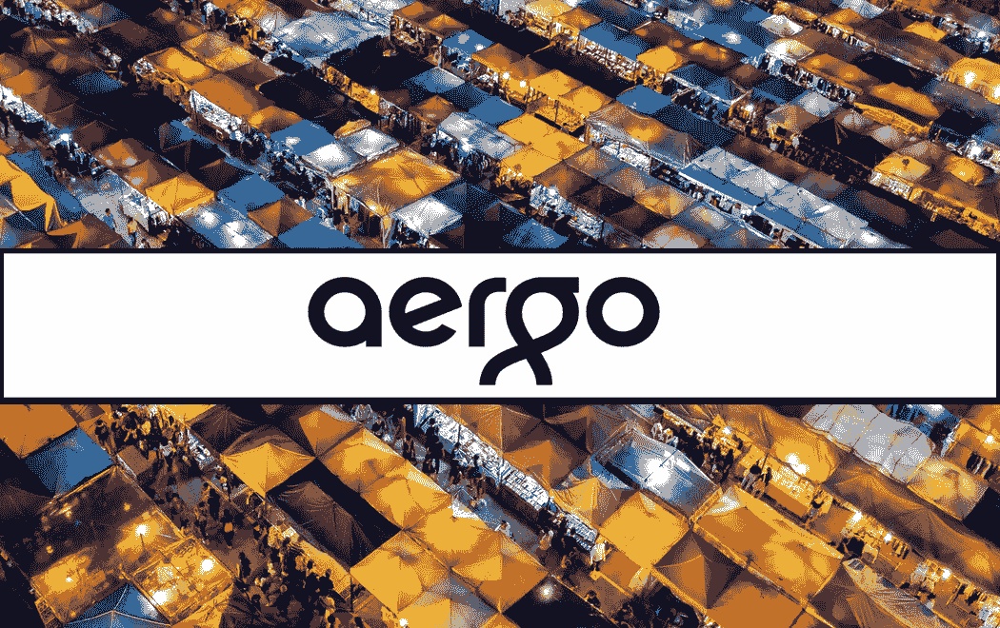
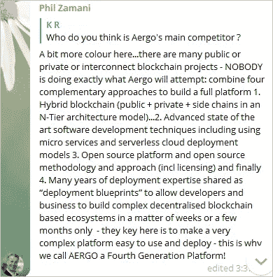
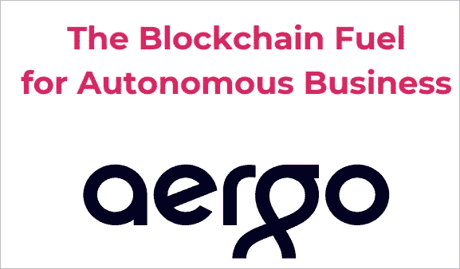
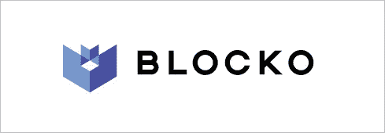

# AERGO:为企业解决方案构建面向未来的区块链

> 原文：<https://medium.com/swlh/aergo-building-a-future-proof-blockchain-for-enterprise-solutions-35c53b00e712>

还需要另一个区块链项目吗？第四代区块链解决了哪些前代产品无法解决的问题？是什么让阿尔高成为第四代区块链？在本文中，我将尝试回答这三个问题。所以事不宜迟，让我们更深入地研究 Aergo 项目。

# **四代区块链技术**

所有前几代区块链都面临着可扩展性、安全性和效率的三重困境，这意味着很难提高可扩展性、安全性或效率；而不影响其他人。例如，比特币(1.0 代)只能实现每秒数笔交易(TPS)，这使得它作为主流区块链解决方案非常缓慢和不切实际。以太坊(第 2.0 代)通过增加智能合约功能对比特币进行了改进，并允许 10 至 30 个交易点，与其他支付方式相比仍然太慢(例如 Visa，它可以处理约 45，000 个交易点)。EOS/Quarkchain(第 3.0 代)等项目旨在通过构建有可能达到一百万 TPS 的区块链解决方案来解决可扩展性问题；然而，在这样做的过程中，它们要么在效率上妥协，要么在安全性上妥协。

Aergo 正试图建造第四代区块链，有可能解决上述区块链三难问题。开发人员要花很多时间来建造第四代区块链。AERGO 的优势在于，他们已经在其母公司 Blocko 的子公司 COINSTACK 中开发了第三代区块链产品。

# **是什么让阿尔戈成为第四代区块链？**

最后一个问题:“是什么让阿尔戈成为第四代区块链？”将在 AERGO 基金会首席执行官 Phil Zamani 的帮助下得到解答。我冒昧地在 AERGO 的 Telegram 频道捕捉到了他对一个社区成员问题的回复截图。他告诉社区，AERGO 链是基于结合 4 种特定的方法来创建一个完整的平台。这四个特征是:1 .一辆混合动力区块链 2。独特的软件开发技术。开源其平台，方法和途径，4。“部署蓝图”是多年部署专业知识的结晶。

## **阿尔戈**

基于其广泛使用的第三代区块链 COINSTACK，AERGO 的目标是升级到第四代区块链，为企业采用和主流使用做好准备。

AERGO 将基于 3 个关键要素:

- **AERGO Chain** 是该公司的公共区块链，它包括一个基于 SQL 的智能合约平台，并提供用于可伸缩性目的的侧链。

- **AERGO Hub** 将成为托管服务，被纳入该平台的公司可以在那里测试、管理和部署独立的区块链。

- **AERGO Marketplace** 将是供需双方进行对等计算资产转移的地方。

# **布洛科**

AERGO 的母公司 Blocko 是南韩领先的区块链企业解决方案提供商之一。他们成立于 2014 年，已经拥有超过 2500 万客户的用户群。他们的企业合作伙伴包括三星、思科、起亚汽车和现代。根据商业洞察平台 [Crunchbase](https://www.crunchbase.com/organization/blocko#section-overview) 的数据，Blocko 迄今已获得 1380 万美元的资金，每年收入 1000 万美元。

# **结束语**

虽然 AERGO 的路线图需要很长时间才能完成，但他们的 mainnet 预计将于 2019 年底推出，这实际上可能是一个现实的路线图。像 [Trinity Network](/@TrinityProtocol/a-letter-to-the-community-dc2dce5f5ac) 和 [Zilliqa](https://www.cointrust.com/news/mainnet-launch-of-zilliqa-postponed-to-january-2019-from-3q18) 这样的项目最近宣布他们将推迟他们的路线图，因为他们各自发布的初始时间设置不切实际。

AERGO 背后的公司 Blocko 已经取得了成功。如果他们对 AERGO 采取同样的商业策略，他们可以取得伟大的成就。我将密切关注这个项目，并希望看到他们推出第四代区块链。

***免责声明*** *:本文不作为投资建议。这只是我个人对 AERGO 项目的看法。你应该总是做自己的研究。*

订阅我的频道: [Medium](/@cultcrypto) 、 [Twitter](https://twitter.com/CryptoShowdown) 和 [Steemit](https://steemit.com/@cryptoshowdown) 如果你喜欢我的文章，并希望了解区块链、加密货币项目和新闻。也可以看我在 [LinkedIn](https://www.linkedin.com/in/donjohanson/) 上的文章。

如果你对这篇文章有任何问题，请在下面的评论区评论。掌声也欢迎，谢谢！

**秘密对决**

## 这篇文章发表在 [The Startup](https://medium.com/swlh) 上，这是 Medium 最大的创业刊物，拥有+ 377，345 名读者。

## 在这里订阅接收[我们的头条新闻](http://growthsupply.com/the-startup-newsletter/)。

