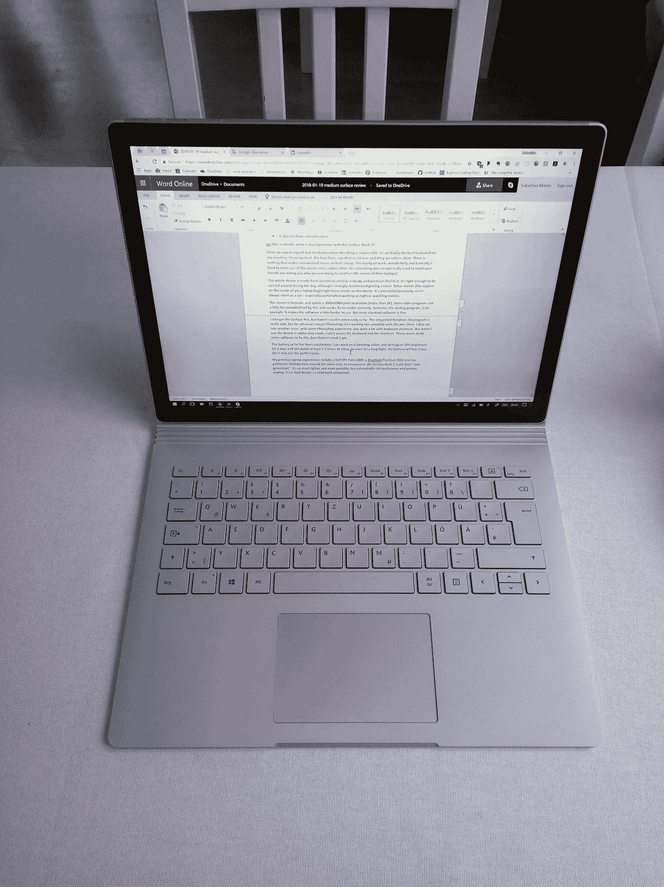

# 在使用微软 Surface Book 2 一个月后

> 原文：<https://medium.com/swlh/after-one-month-of-working-with-the-microsoft-surface-book-2-6a9f26a83006>

## 闪闪发光，闪闪发光。这款超极本是名副其实的工作伴侣。

El Surfaco

圣诞节前不久，我需要一台新的笔记本电脑。去年，我一直在开发一款旧的 MacBook Pro。这是一项非常强大的技术，可以轻松处理大多数 Adobe Creative Cloud 应用程序(除了偶尔的 250MB Illustrator 文档)。我甚至可以使用 Blender 和 Cinema 4D，尽管渲染需要相当长的时间，因为图形芯片来自上一代。

顺便说一下，我是在 Windows 环境下长大的，但是我对平台并不敏感。我有一段时间拥有一部 iPhone，在过去的几个月里，在 macOS 上工作没有遇到什么麻烦。我也有一台带专用显卡的台式电脑，放在家里处理繁重的工作。

> 选择一台新的笔记本电脑实际上并不有趣。

连续三天，我逛遍了当地电子超市的笔记本电脑区，摸遍了每一台设备，权衡利弊。(说句题外话:这家名字古怪的德国大型连锁店的员工真的是糟糕的销售人员。)

在网上阅读测试只是半个帮助(值得信赖的出版物所做的测试比亚马逊客户的恐怖故事要好)。

> 最终，我的要求是:一款轻薄的超极本，最大 13 英寸，超过高清分辨率的显示屏和一个非常好的键盘。

选择有点有限。我把范围缩小到华为 Matebook、MacBook Pro 13”和微软 Surface 设备。

有一段时间，我考虑过 Surface Pro 平板电脑，但结果是键盘在盖子里，打字时似乎很不稳定(我经常这样做！).

华为 Matebook 也是一个候选产品，它拥有令人印象深刻的屏幕和漂亮的设计。但是在商店里使用触控板并不是我所希望的体验——太慢，反应迟钝。如果它在我试着打开商店的时候困扰我，它可能也会在我使用它的时候困扰我。基本上只剩下了 Surface Book 2 和 MacBook Pro。

你已经知道我是怎么决定的了。MacBook Pro 输掉了比赛:

*   它更贵(比较直接的技术统计)
*   它更重，电池续航时间可能更短
*   我不喜欢新型号的键盘，按键没有我期望的那种力量
*   它没有触摸屏

**那么一个月后，我对 Surface Book 2 的体验如何？**

> 我讨厌重复我自己，但是这东西上的键盘是无可挑剔的。这可能是我用过的所有机器中最好的键盘。这些键有很好的抵抗力，而且相当安静。

没有什么会发出意想不到的噪音或者感觉很廉价。触控板非常好用，老实说，我倾向于经常使用触摸屏。这是你可以真正习惯的事情(直到你的朋友问你为什么要在他们的笔记本电脑屏幕上滚动)。

整个设备由机械加工的镁制成(感谢 Lucas 的纠正)，具有坚固和优质的感觉。它很轻，可以在白天随身携带，尽管我强烈建议带一个盖子。其他金属(如笔记本电脑包内的拉链)可能会在设备上留下痕迹。

> 它也是被动冷却，所以它总是像猫一样安静——在晚上工作或看电影时特别有用。笔记本电脑再也没有直升机的噪音了。

屏幕很棒，拥有 3000x2000 像素的分辨率(超过 2K)。一些老的程序对此有点不知所措，需要修复才能正确渲染。书写程序 Scrivener 就是一个例子。这使得软件有点难以使用。但是大多数标准软件都可以。

它还有两个摄像头，可以让你用微软的人脸识别软件 Hello 登录。

我也拿到了 Surface Pen，但至今没有广泛使用。

> 集成的 Windows Ink 程序真的很酷，但不管出于什么原因，Photoshop 用笔不太流畅。

在这里，我还遇到了另一个问题:有了一些 Photoshop 的经验，你会大量使用键盘快捷键。但当我在平板电脑模式下使用设备时，我无法使用键盘和快捷键。似乎有一些软件可以解决这个问题，但我还没有试过。我很乐意求推荐！

正如我所说，我习惯在 Windows 上工作，最酷的是，即使你把平板电脑拆下来，它仍然是一台完全可用的 Windows PC。我不局限于任何应用商店之类的，但它可以运行任何有 Windows installer 的东西。我还没有尝试过，但这也有可能用于游戏…

到目前为止，电池令人满意，我可以在 50%的亮度下工作 2 天(在线工作和写作),仍然可以观看至少 2-3 小时的视频。因此，即使是长途飞行，如果你不最大限度地发挥性能，电池也可以持续使用。至于连接:有两个 USB-3.1 和一个 USB-C 端口，以及一个 3.5 毫米音频和一个 SD 读卡器。

我以前的笔记本电脑经历包括 2009 年的戴尔 XPS，2012 年的 MacBook Pro 和大约同一时间我女朋友的东芝。

> 相比较而言，Surface Book 2 真的感觉是“下一代”。它更轻，更便携，有一个可拆卸的 2K 触摸屏和被动冷却。这是一款时尚的设备，是有效的工作伴侣。

感谢您的阅读，如果您有问题，请告诉我！

## 这个故事发表在 [The Startup](https://medium.com/swlh) 上，这是 Medium 最大的创业刊物，有 286，184+人关注。

## 订阅接收[我们的头条](http://growthsupply.com/the-startup-newsletter/)。

