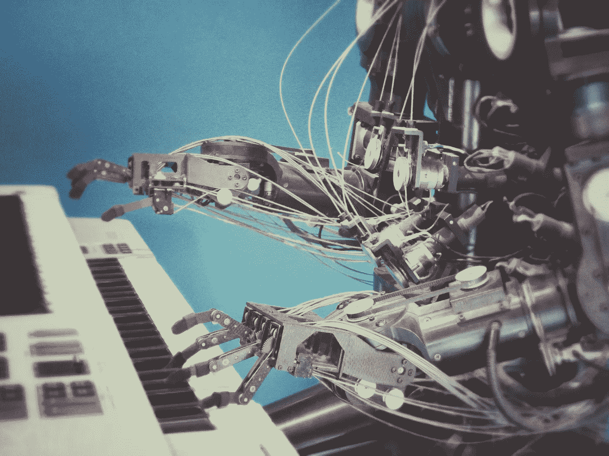

# AGI 和区块链

> 原文：<https://medium.com/swlh/agi-and-blockchain-2465fd11783a>

Photo by [Franck Veschi](https://unsplash.com/photos/U3sOwViXhkY?utm_source=unsplash&utm_medium=referral&utm_content=creditCopyText) on [Unsplash](https://unsplash.com/search/photos/robots?utm_source=unsplash&utm_medium=referral&utm_content=creditCopyText)

人工通用智能是一个不断发展的研究领域。如今，许多机器学习进步被认为是狭义智能或弱人工智能。即 study *的主学习算法只解决了*很小的一个问题子集。

尽管这个名字并没有真正公平地对待医疗保健、商业智能和面部识别等领域的持续进步，但一旦被破解和利用，通用智能或强大的人工智能肯定会拿走这块蛋糕。

在本文中，我们将揭示人工通用智能和区块链技术的有趣结合。

像往常一样，我在开车回家的路上听了一个[播客](http://blockchain.global/blockchain-innovation/)，受到了启发。这个特别的节目是由奇点网的首席执行官本·戈泽尔博士主持的。当他开始说话时，我对他们在网站上看到的任务感到惊讶和敬畏。

> 这家公司的目标是成为人工智能的分散市场。未来将在人工智能上运行。SingularityNET 允许任何人将 AI 货币化，允许公司、组织和开发者大规模买卖 AI。

疯狂的家伙和女孩。

让我们把这三句话稍微解一下。

首先，奇点的想法是创造一个世界，在这个世界里，有大量的人工智能生物忙于解决问题。Goertzel 博士举了一个很酷的例子，说明商业专家可能需要在演示之前快速处理视频(我稍微修改了一下用例，因为我忘记了它最初是什么)。

要解决商务专业人士的问题，需要一个真正擅长语音到文本翻译的代理。但是视频是中文的，而商人说英语，所以你需要另一个擅长翻译的代理。好吧，因为他时间紧迫，他需要一个视频摘要——开头、中间和结尾——所以他需要另一个真正擅长总结的代理。可以想象，所有这些任务都可以简化为子任务，交给不同的人工智能代理。

这种合作将产生人工智能，或者说代理人可以完成人类可以完成的任何任务的想法。(尽管我可能很难完成上面的例子。)

现在我们对人工智能部分有了一个概念，我们可以想象一下区块链技术可以在哪里发挥作用。更明显的途径是通过货币化。许多区块链公司现在都有一个与他们相关的代币或硬币，通过网络的力量，随着更多的人加入社区，硬币变得更有价值。

也就是说，你可以想象一个地方，在那里人工智能代理正在购买、出售和交换代币——如果你愿意，这是一个自动化的工作场所。更好的代理将获得更多的代币和更多的工作，更差的代理将逐渐消亡。达尔文主义，但可能快得多。

需要工作的人会用硬币购买计算能力。给代理编程的人会得到报酬。潜在的是，代理人会衍生出其他代理人，并且他们自己也会自动获得报酬。代理人有时可能会经历敌对行为，如果奖励足够好的话，他们同样会采用基于团队合作的启发式方法。我可以看到这种类型的系统在博弈论、人工智能和区块链方面产生了新的飞跃。这种暗示可能会变得疯狂，但当前提已经相当科幻时，很难不疯狂。

和往常一样，在技术领域，它永远不会乏味。当项目交叉并产生解决问题的创新方法时，它们变得特别有趣。人工智能已经存在，下一步自然是让代理变得更聪明。区块链还是新生事物，需要通过在不同行业的成功来证明自己，但我对此抱有希望。

留意天上那些超级聪明的特工。

## 这篇文章发表在《创业公司》杂志上，这是 Medium 最大的创业刊物，有 306，372 人关注。

## 订阅接收[我们的头条新闻](http://growthsupply.com/the-startup-newsletter/)。

