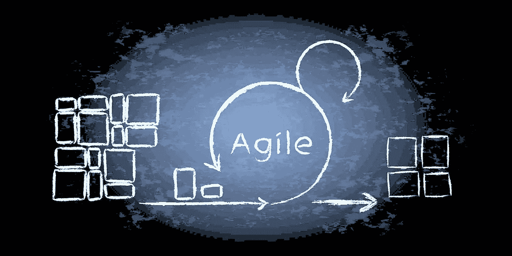

# 敏捷开发 vs 瀑布开发:什么对你来说是完美的？

> 原文：<https://medium.com/swlh/agile-development-vs-waterfall-development-what-is-perfect-for-you-a9c147644602>

Agile Development vs Waterfall Development: What Is Perfect For You?

随着敏捷方法开始被广泛采用，你会发现网上有足够多的平台在讨论它是否是真正优秀的方法。大多数人会让你相信，敏捷是必经之路，而其他人则争论采用瀑布方法的好处。今天，我们拒绝参与这场辩论，因为这场战争没有赢家。你看，当你归结到它的时候，敏捷方法和瀑布方法都不是天生就比另一个好。因此，不要期望在这里找到任何简单的答案。相反，我们将用瀑布和敏捷方法的信息武装你。最后，你会对什么对你最好做出明智的决定。

# 瀑布方法

经典的项目管理，大多数意味着线性方法，也称为瀑布方法。这恰好是一种结构化的、有纪律的、分阶段的顺序方法，其中每组工作都是分阶段完成的。当第一阶段结束时，你就进入第二阶段，以此类推。根据所选择的瀑布方法，阶段的数量会有所不同。顾名思义，受瀑布本质的启发，你从收集文档、设计、编码开始，然后执行系统测试、用户验收测试，解决任何问题，最后交付产品。

*   开发人员和客户就交付成果达成一致。这使得计划和实施变得容易。
*   每一个阶段结束时都有切实的结果，这确保了他人的可见性，并提供了继续前进的基线。
*   你可以更容易地测量进度，因为所有需要做的工作都已经安排好了。
*   决策者将能够更现实地设定目标交付日期，因为他们可以看到每个阶段的进展。
*   整个过程都有很好的记录，并为每个阶段留下了清晰的书面记录。这将证明对未来的项目有益，因为您可以遵循类似的逻辑，并帮助奠定基础。

# 瀑布方法的缺点是:

*   改变会让你付出代价。这是这种方法带来的僵化的主要缺点之一。测试发生在接近尾声的时候，所以如果你的客户不接受产品，那就太晚了。
*   直到生产线快结束时，客户才看到工作产品。
*   将所有的测试留到最后不是一个好主意。当截止日期临近时，有一种逃避测试的倾向。一个测试很差的产品对你没有帮助。
*   如果某个特定阶段的任何任务没有正确完成，并在稍后阶段发现，整个项目都会受到严重影响。
*   如果你的项目有外部或内部的依赖，那么可能会有延迟。

如果你和一个纪律严明的团队一起工作，列出的大多数利弊可能并不适用于你。即便如此，大多数列出的优点，如制定整个计划，给你预测交付日期的能力，在很大程度上取决于太多的因素，以采取这种专业没有一撮盐。如果您的客户已经清楚地定义了他们的需求，并且在完成项目的整个过程中不会改变，那么瀑布方法将为您工作。更常见的是，对于简单且可预测的项目，您将受益于采用瀑布的线性开发路径和固有的稳定性。

# 敏捷方法

敏捷通常被视为瀑布方法缺点的“解决方案”。敏捷方法遵循增量方法，强调应用程序的快速交付，而不是顺序设计过程。这是一种迭代方法，在这种方法中，完成一个项目所需的不同阶段或冲刺阶段，如需求、设计、构建和测试，是相互并行进行的。不同的需求和解决方案随着项目的进展，基于优先级和规程而不断发展。Scrum 是敏捷方法论下最流行的方法。

*   需求不断变化，计划周期也越来越短。变化可以顺利迎合。
*   这种方法鼓励利益相关者的积极参与，确保产品是根据您的优先级和愿景构建的。
*   团队成员之间频繁的交流和面对面的互动确保了更快的进展和更少的障碍。
*   短的开发周期意味着您的项目具有随时改变任何事情的灵活性。
*   这种方法不需要太多的文档。如果你决定更换任何东西，这可以节省你在不需要的材料上花费的时间。
*   开发更加以用户为中心，这是与用户更多互动的结果，减少了用户不接受产品的风险。

# 敏捷方法的缺点是:

*   由于任务的优先级经常被重新调整，时间表可能会超出你的预期。
*   敏捷方法通常由相对较小的多学科团队实践。与瀑布方法相比，团队之间相对缺乏结构，这意味着团队成员应该遵守纪律并有主人翁意识。
*   当团队的每个成员都致力于项目时，这种方法最有效。敏捷方法完全是关于积极的团队参与，比瀑布方法耗费更多的时间。
*   你的团队必须在代码和文档之间找到正确的平衡，因为敏捷提倡软件胜过全面的文档。

> 如果你仔细观察，精益或敏捷方法的大部分缺点都是“如果你做得草率，它就不会工作”的不同版本。这应该不用说。如果你在一个不确定的市场中开发一个新产品，并且有一个截止日期，那么你应该选择敏捷。特别是如果你没有足够的信息，在项目开始时选择执行严格的要求和计划将会导致代价高昂的错误。敏捷对于最终目标还不明确，并且需求总是在变化的项目来说是理想的。

# 结论:

大多数人的结论是，如果市场不确定，瀑布项目往往会更慢，风险更大，而且比敏捷项目更昂贵。首先，不要让自己被大多数有偏见的人的观点所影响。你看，瀑布并不都是坏的，敏捷也不都是好的。那么，为什么不选择两者的精华，将两种方法结合起来呢？它们被称为 Agifall 或 Wagile 方法，并开始成为全球组织的首选。成熟高效的企业知道何时应用这些方法。我们 CognitiveClouds 是所有三种模式的倡导者，这取决于您想要实现的目标。

*最初发表于 CognitiveClouds 的产品洞察博客:Top* [***网络应用开发公司***](https://www.cognitiveclouds.com/custom-software-development-services/web-application-development-company)

## 这个故事发表在 [The Startup](https://medium.com/swlh) 上，这是 Medium 最大的企业家出版物，拥有 296，127+人。

## 在这里订阅接收[我们的头条新闻](http://growthsupply.com/the-startup-newsletter/)。

