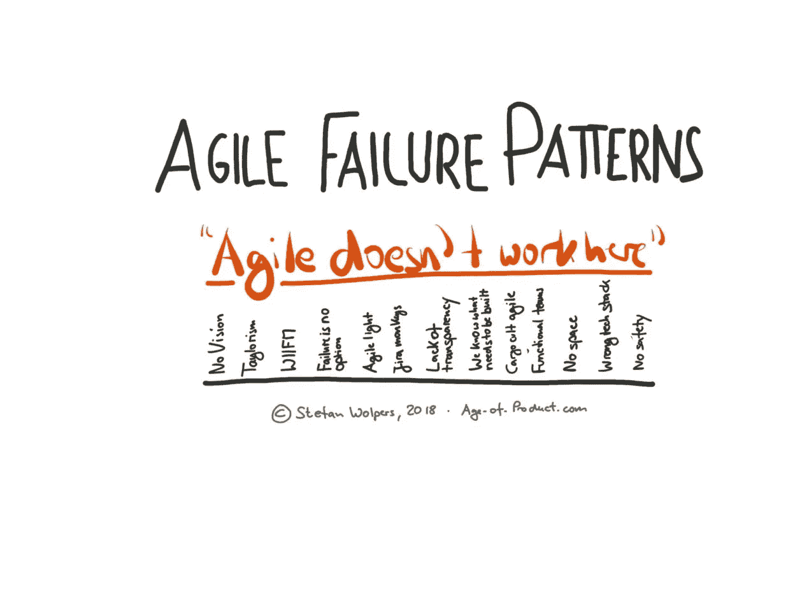

# 组织中的敏捷失败模式 2.0

> 原文：<https://medium.com/swlh/agile-failure-patterns-in-organizations-2-0-b198ade309b0>

# TL；DR:敏捷失败模式——为什么敏捷既简单又复杂

尽管许多组织已经开始了他们的敏捷之旅，但是敏捷的失败似乎越来越突出。

有趣的是:谁会不同意敏捷宣言的四个核心原则

1.  过程和工具之上的个人和交互
2.  综合文档之上的工作软件
3.  合同谈判中的客户协作
4.  响应变化而不是遵循计划

—源自将常识应用于一个具有挑战性的问题？此外，这些原则的应用可能适合于修复众多的组织功能障碍，并将一个容易出错的复杂社会环境简化为一个复杂的环境？

Agile Failure Patterns in Organizations 2.0

采用敏捷有各种好的理由，例如:

*   生产率低，
*   士气低落，
*   在日益激烈的人才争夺战中招聘高级人才的问题，
*   高级人员的流失，
*   预算限制(没有更多资金浪费在瀑布项目上)，或者
*   竞争快速推动创新，传统的方法无法跟上。

但事实是，敏捷组织变革的范围经常被完全低估。敏捷并不是解决所有问题的捷径。每个组织都有自己的一套功能障碍，因此处理这些功能障碍的解决方案需要针对该组织量身定制。

# 敏捷故障模式

通过分析我过去的项目，我发现了以下四种跨组织的模式，它们使得敏捷向更困难、更低效、更昂贵的模式过渡:

## I .组织层面的敏捷失败

1.  首先没有一个(产品)愿景:[如果你不知道你要去哪里，任何一条路都会把你带到那里。](http://www.brainyquote.com/quotes/quotes/l/lewiscarro165865.html)
2.  “我们知道我们需要建造什么”的谬论。不需要产品发现或假设测试；高级管理层可以定义什么与产品待办事项相关。
3.  管理层面上的失控导致微观管理。(“我是什么”综合症。)
4.  组织对愿景和战略不透明，因此团队无法实现自组织。
5.  没有失败的文化:因此，团队不会离开他们的舒适区，而是安全行事。([HN 的 Mathgeek](https://news.ycombinator.com/user?id=mathgeek) 建议用“跌倒后学习爬起来的文化”取代“失败文化”)
6.  组织没有针对快速构建-测试-学习文化进行优化，因此各部门以不同的速度水平前进。由此产生的摩擦很可能会抵消之前的敏捷收益。
7.  高级管理层没有参与敏捷过程，例如，sprint 演示，尽管他们是一个角色模型。相反，他们确实期待一种不同形式的(推送)报告。
8.  不要让组织缺陷变得明显:敏捷的好处是它迟早会发现所有的组织问题。(“当你把问题放进电脑时，盒子里藏着答案。问题必须是可见的！” [Hideshi Yokoi](http://runningahospital.blogspot.de/2009/08/problem-must-be-visible.html) ，美国肯塔基州厄兰格市丰田生产系统支援中心前总裁。)
9.  产品管理并不被视为组织内的“问题解决者和领域专家”，而是将需求转化为可交付成果的人，也就是“吉拉猴子”
10.  其他部门从一开始就没有涉及产品管理。大型组织中的典型行为是一种筒仓式思维，以局部优化努力为特征，而不考虑公司的整体战略，通常由个人激励(如奖金)驱动。(个人议程并不总是与公司战略一致。)
11.  销售组织保护对客户的访问，从而阻止团队学习。
12.  产品管理的核心职责由其他部门承担，例如，跟踪指标，因此产品依赖于其他部门进行数据驱动的决策。
13.  如果与工程团队的规模相比，产品管理团队规模过大，没有专门团队的产品经理可能会有问题。
14.  工程团队不能自由选择“他们的”技术组合。

# 敏捷过渡——来自战壕的手册

下载最新的，212 页的版本**“敏捷过渡——来自战壕的实践手册”**

[这里有**、**还有免费的](https://age-of-product.com/download-agile-transition-hands-guide-trenches/)。

## 二。团队层面的敏捷失败

1.  一个工程团队里初级工程师太多了。他们倾向于将微观管理作为培训的一部分。通常，他们对敏捷方法没有经验或者经验很少。因此，他们很难遵守流程，尤其是他们不会说“不”
2.  具有开源编码心态的工程师:任务一旦完成，就会在拉式请求中讨论，但不会在准备或冲刺规划会议中提前讨论。(他们倾向于以分散的团队心态运作。)
3.  团队太小，因此没有跨职能。例如:一个团队只处理前端问题，缺乏后端能力。该团队将总是依赖另一个团队提供功能来构建。
4.  团队没有足够的人员，例如，scrum master 的位置没有人，产品负责人必须同时担任两个角色。
5.  团队成员公开拒绝敏捷方法，因为他们不想被推出他们的舒适区。
6.  团队不是自组织的。这需要接受对团队绩效的责任，以及对交付和价值创造的紧迫感。这种模式下的“团队”更像是一个团体——例如，在公共汽车站等车的人——他们在同一时间同一地点为了同一目的，但这不会导致形成一个团队。(这个[规范、强攻、成型、执行](https://en.wikipedia.org/wiki/Tuckman%27s_stages_of_group_development)的循环好像没了。)
7.  更糟糕的是，团队成员悄悄地放弃了敏捷，认为这是一种迟早会消失的管理时尚。
8.  **伪敏捷**:团队机械地遵循“敏捷规则”，而不理解为什么这些规则首先被定义。这种程度的采用通常会导致一种被称为“尖峰 Scrum”的现象:尽管所有的敏捷规则都被严格遵循，但是与之前的过程相比没有任何改进。或者更糟:士气和生产力下降，因为最初的敏捷培训后的热情在战壕中很快消退。
9.  在短时间内调动团队成员。即使出于技术原因需要，这也会对团队的绩效和士气产生负面影响。

## 请点击“拍手”👏，如果你觉得这篇文章有用——它对我来说意义重大！

***如果你更喜欢邮件通知，请*** [***注册我的每周简讯***](https://age-of-product.com/subscribe/?ref=Food4ThoughtMedium) ***，加入 15521 位同行。***

## 三。流程层面的敏捷失败

1.  敏捷之光:当关键问题出现时，管理层放弃自组织，转而组建“任务小组”。
2.  每当合适的时候，敏捷过程要么被扭曲，要么被忽略。缺乏过程纪律。
3.  敏捷过程被调和，例如，scrum 产品所有者的角色被降低为项目经理的角色。通常，这是通过将 backlog 所有权的任务分配给管理层的不同实体来实现的。(“Scrum”没有一个产品负责人，做出了一个波澜壮阔的瀑布 2.0 流程。)
4.  利益相关者绕过产品管理来完成事情，并且在高层管理人员看来，他们会表现出主动性。
5.  组织没有在团队沟通和研讨会上花费足够的时间来创建对将要构建的内容的共同理解。

## 四。设施层面的敏捷失败

1.  一个团队不在同一个地方，不在同一个房间里工作，而是分散在不同的楼层，或者更糟，不同的位置。
2.  工作环境缺少正式交流的场所，更重要的是缺少非正式交流的场所:自助餐厅、茶水间、沙发等。
3.  工作环境缺少白板。办公室内每面可用的墙上都没有白板应该是有问题的，没有白板。
4.  敏捷需要合适的办公室来进一步合作:宽敞，有充足的空气和光线。但是它们不应该仅仅是一个开放的空间，那样会变得太吵，特别是当几个 Scrum 团队同时站立的时候。

你观察到了什么敏捷失败模式？请在评论中与我们分享。

# ✋不要错过:加入 2750 多人的强大的“动手敏捷”Slack 团队

我邀请你加入[“手把手的敏捷”Slack 团队](https://goo.gl/forms/LObbRtSF9vvxN3CL2)，享受来自世界各地的敏捷实践者的快速增长、充满活力的社区的好处。

如果你现在想加入，你现在所要做的就是[通过这个谷歌表格](https://goo.gl/forms/LObbRtSF9vvxN3CL2)提供你的证书，我会帮你注册。对了，**是免费的。**

# 你还想这样多读书吗？

好吧，那么:

*   📰*加入 15521 位同行和* [*报名我的每周简讯*](https://age-of-product.com/subscribe/?ref=Food4ThoughtMedium)
*   🐦*关注我的* [*推特*](https://twitter.com/stefanw) *订阅我的博客* [*产品时代*](https://age-of-product.com)
*   💬*或者，免费加入* [*Slack 团队【手把手的敏捷】的 2750 多名同行。*](https://goo.gl/forms/XIsABn0fLn9O0hqg2)

[组织中的敏捷失败模式 2.0](https://age-of-product.com/agile-failure-patterns-in-organizations/) 首次发表于《产品时代》。

## 这篇文章发表在 [The Startup](https://medium.com/swlh) 上，这是 Medium 最大的创业刊物，有 309732+人关注。

## 在这里订阅接收[我们的头条新闻](http://growthsupply.com/the-startup-newsletter/)。

