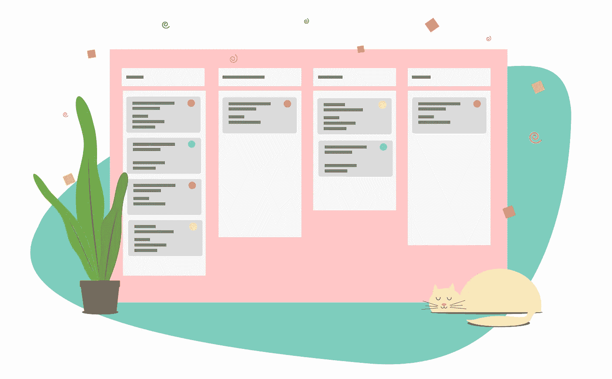

# 创业敏捷

> 原文：<https://medium.com/swlh/agile-for-startups-594e47500dc6>

这篇文章是讨论我们在创业过程中学到的经验的系列文章的一部分。我们希望将这些知识传授给你，将加速你的决策过程，并让你了解其他初创公司是如何解决问题的。本系列的最后两篇文章可以在这里找到:

 [## 如何实现伟大

### 当今世界有一种信念，认为难以形容的壮举是由一只孤狼完成的。一个单一的…

medium.com](/swlh/the-lone-wolf-fallacy-83cb2ccf371f)  [## 在没有钱的情况下击败竞争对手

### 惊喜！你有竞争对手。

hackernoon.com](https://hackernoon.com/crushing-your-competition-with-no-money-55f174f74cd0) 

在创业的世界里，有无穷无尽的想法。创意多如牛毛。与实现一个想法所需的努力相比，它们无关紧要。执行方面经常在混合中丢失。这篇文章关注的是通过一个有效的过程来执行的方法。这个过程是敏捷的。

对于一家初创公司来说，最好的流程是能够快速决策、简化工作流程，并就如何做事情达成共识的流程。随着业务规模的扩大，为每个新团队提供一个可以轻松复制的流程也是很方便的。这允许一致的执行和可预测的结果。从哪一点来说，将目标转化为结果只是一个逻辑问题。计划何时解决不同的问题，制定特性时间表，并扩展团队。

首先，一个简短的故事。

几周前，我在 LinkedIn 上收到一条陌生人的消息。

> “你好，我为*****工作。我们能否安排一次通话，讨论我如何帮助您实现年度营销目标？”

> “没有。”

> "难道你没有想要完成的年度营销目标吗？"

> 不，我们几乎没有月度营销目标。我们不以月或年来思考，而是以分钟和小时来思考。

我们没有时间在一年的范围内做决定。这将是对时间的巨大浪费，而且无法预测。大公司往往会误解这一概念。他们与保持创业竞争力所需的快节奏脱节。对我们来说，执行和计划的时间尺度要小一个数量级。计划一年的营销和发展，然后不折不扣地执行，这不是一种成就，这是一个失败的创业。团队需要不断地接受反馈，重复他们的想法，并根据新的信息做出更好的决策。

不要像经营公司一样经营创业公司。这是一家创业公司。你拥有的唯一优势是快速行动的能力，并有意识地做出快速调整你位置的决定。

# 敏捷如何帮助

敏捷有助于在清晰的上下文中构建重要的问题。一旦团队中的每个人都理解了回答这些问题的格式，这个过程就变得可预测和系统化了。只要每个人都遵循这个过程，就很容易有一个不干涉开发的方法。期望是明确的，结果是可以衡量的。敏捷回答的一些问题的例子有:

*   任务应该什么时候完成？
*   任务的优先级是多少？
*   一项任务如何融入大局？
*   谁应该做这项工作？

其结果是能够更快地做出决策，在更短的时间内执行，并纳入短期反馈循环。不用担心几个月或几年的开发，每个问题都被分解成小虾大小的问题。每个开发人员都可以有一个明确的工作范围，他们需要在一个特定的时间表内完成。

没有这种环境，时间表会变得混乱，沟通不畅会在整个团队中出现，每个人的执行效率都会降低。这并不是说敏捷是帮助你的团队成为运转良好的机器的唯一方法，但这是我们发现的最好的方法。

## 心态

在企业界，人们鄙视敏捷开发周期。我们的团队在许多使用敏捷的大公司中亲身经历过这一点。当每个人都在不同的页面上时，这不是令人愉快的。这会在团队成员之间产生摩擦。那些方法学的支持者会与这种开发风格的反对者发生冲突。

为了防止这种冲突，每个人都需要理解和欢迎敏捷过程。这只能通过向团队阐明敏捷的目的来实现。解释过程背后的原因。每件事都有一个非常具体的原因来解释为什么它会以某种方式完成。在理解这些原因之前，不应该忽视它们。只有当每个人都致力于这个过程时，敏捷才会起作用。没有每个人的承诺，这个过程就会失败。一旦每个人都理解了这个过程，将会有更少的困惑和更强的团队意识，因为每个人都在同一页上。

我们相信，一旦你进入了敏捷的思维模式，当你和你的团队一起更好地工作时，你会感到更加充实，在一周内完成更多，并且围绕你的工作生活有一个结构。

# 关键概念

敏捷使用了许多理解起来很重要的概念。在开始敏捷之前，应该彻底讨论这些概念，这样你的团队就可以决定如何有效地将它们合并到你的开发过程中。

## 短距离赛跑

短跑是 1 或 2 周的工作部分。sprints 的目的是定义用多少时间来完成一项易于计划、执行和保持一致的工作是合适的。较大的公司可能会利用 2 周冲刺，但初创公司更有能力运行 1 周冲刺。初创公司应该能够更快地做出决策，更快地实施解决方案。这需要更少的会议，更少的计划，和一个简化的开发过程。冲刺是划分工作的一种简单方式。它们允许在你的时间线中重复的期望或进展流。代替混乱，sprint 允许团队可以坚持的刚性结构。

**注意事项**

*   根据创业公司的工作习惯，选择你的冲刺开始和结束的日子。我们选择了一个简单的周一到周日的冲刺周期，因为我们整个周末都在工作。然而，你也可以基于你的工资周期或任何其他对你的团队有意义的标准。
*   选择尽可能短的冲刺。两个月的冲刺是完全不可接受的。对于大多数软件初创公司来说，一周的冲刺应该是不错的。

## 故事

故事通常是创业公司的最小工作单元。大公司倾向于实现额外的方法来分解故事，但是这很快变成一个占用大量时间的过程。因此，我们的团队除了故事之外不再分解任务。

**描述**

创作故事时，要极其具体。不要忽略细节。写一个描述，团队中的任何人都可以阅读并快速理解在这个故事中将要完成的工作。这些细节可能看起来不重要，但它们可以节省大量时间。这消除了对任务期望的混淆，并以一种不需要额外信息就能完成的方式来组织问题。

> 示例:您的应用程序有一个阻止一些用户登录的错误。不要简单的把“用户无法登录”作为故事描述，要更加具体。比如说，“周一早上，我们的‘支持’邮箱收到一封来自‘someone @ something . com’的邮件，说他无法登录。我开始调试这个问题，因为我认为这可能是一个阻止所有人登录的关键问题，但我发现我们的登录明确表示，如果您的电子邮件是“someone@something.com ”,则不允许您登录。Jim、Joe 和 Jake 讨论了这个问题，我们同意推出这个故事，因为它只影响一个用户。”

在这个例子中，我们看到了提供细节和解释问题是如何使情况变得更容易理解的。一两周之后，有人回顾这个故事时，会有足够的信息来重新审视这个问题，提出问题，并快速解决问题。由于发现 bug 或编写特性描述的人不一定是实现解决方案的人，这也为团队提供了一种增加沟通和清晰度的方法。一个不熟悉这个故事的人可以很快上手，在很少的帮助下解决问题。

**长度**

因为故事是创业公司最短的工作单元，所以它们应该被分解成合理的小单元。尽可能地具体，这样你就可以结束项目，并表明正在取得进展。

> 例子:不要用一个故事来“实现网站”，而是进一步分解任务。为每个页面、功能和任务分配单独的任务，这将花费一天左右的时间。可以细分的故事越多，就越容易理解工作的范围。

可能会有大故事无法进一步分解的情况。比方说，你有一项任务，某人需要在 excel 中手动输入 1，000，000 个用户名，这些用户名原本是刻在石碑上的。不幸的是，这将是一个需要很长时间的单一故事。原因是因为都是一回事。按照你一次做多少来分解也许是可能的，但这也是随意的，不会增加多少价值。

**优先级**

每个故事都应该有优先权。如果有一个故事的优先级未知，应该在下一次每日或每周的计划会议上决定。这允许每个人尽早讨论高优先级的项目。我们个人用来分配优先级的等级是 1-5。其中 5 是最高优先级，1 是最低优先级。获得 ***5 优先级*** 的故事应该立即处理。它需要进入冲刺阶段，并尽快完成。在这个问题解决之前，其他一切都应该搁置。这个优先级是为对产品功能至关重要的故事保留的。一个 ***4 优先级*** 要推到下一个 sprint(即使当前 sprint 中有优先级较低的项目，你已经敲定了 sprint，现在就不要改了)。一个 ***3 优先级*** 意味着它应该在这个月的某个时候完成，但不一定是下一个 sprint。一个 ***2 优先级*** 表示这是一个长期目标，也许在接下来的几个月内就应该实现。一个 ***1 优先级*** 的意思是这件事是可以考虑的，但是你甚至不知道自己是否想去做。1 优先级的一个例子是用户请求一个您不打算实现的特性。它仍然可以被记录为 1 优先级项目，直到可以做出关于是否应该实施 is 的明确决定。

## 史诗

史诗是一组故事。每个故事都应该是史诗的一个组成部分，朝着一个更大的特征或发展方向发展。

> 例如:你是第一次实现你的网站。你可能有一个“主页”、“博客”页面、“新闻”页面和“团队”页面。不要创建一个需要完成整个网站的故事，而是为每个组件创建故事。这可以是每页一个故事，甚至可以通过为每个单独的页面添加多个故事来将每个页面缩减为更小的故事。epic 是整个静态网站，故事是完成网站所需的每个任务。

无论你做什么决定，想象史诗的结构应该是容易的，这样你就可以在发展的过程中从任何史诗中获取故事。比如你想在下一个 sprint 中改进“主页”。您可以通过在“Home”选项卡上过滤有哪些改进选项，快速地将某个特定的特性从 epic 拉到 sprint 中。

## 容量

能力是在特定的时间框架内可以完成的工作量。在敏捷中，这通常是在一次冲刺中可以完成的工作量。由于这是一个确定的值，工作能力在整个冲刺阶段不会改变。因此，一旦 sprint 开始了，就不应该再有新的工作引入到 sprint 中(当然关键的 bug 除外)。

在创业公司中，每个 sprint 分配的工作量应该尽可能接近 100%的能力。这实质上意味着在 sprint 中要完成的 100%的工作都是在 sprint 开始时分配的。即使关键的 bug 浮出水面，团队也应该竭尽全力完成分配给 sprint 的每个故事。分配少于 100%的空间确实会给弹出窗口和关键的错误修复留下空间。然而，如果开发提前，这也降低了应该完成什么工作的清晰度。

容量通常有两个不同的组成部分。团队能力以及个人能力。团队中每个成员的个人能力不需要相同。其实不太可能。不同的人能够完成不同的工作量。一个人可能需要 2 个小时来完成一个故事，而另一个人可能需要 6 个小时来完成同样的故事。在评估每个 sprint 的容量时，应该考虑这一点。

## 站立

站立通常发生在一天的开始。如果大多数人早上 9 点去上班，那么 9 点就会有人站起来。站立不要超过 15 分钟。站立时注重简洁。每人用不到 60 秒的时间回答以下 3 个问题:

*   我昨天做了什么。
*   我今天在做什么。
*   是什么阻碍了我完成我的工作。

现在不是讨论问题的时候。它是有意缩短的，以减少浪费的时间，并最大化传播给团队的信息量。如果有必要的话，这也是发布与每个人都相关的简短公告的时候。

## 规划(每日、每周、每月、每季度、每年)

你的创业方向会改变。随着您适应客户的需求并不断加深对市场的了解，当合适的机会出现时，您需要快速调整策略。这需要频繁但短暂的规划。与其每隔几周或几个月开一次冗长的会议，不如开得快，开得勤。这保持了发展的方向，并允许快速调整公司战略。

**每日**

每天都应该有一个快速的“明天会发生什么”的会议。如果你选择在站立会议期间进行这个简短的会议，它会变成一个“我们今天做什么”的会议。这应该是一个 5-10 分钟的快速会议，讨论计划的任何更新或更改，讨论下一个工作日发生的事情，以及该发展是否有任何预期结果。在 Shrimpy，我们在晚上 9 点召开日常计划会议，开始我们的夜间工作。一般只需要几分钟，剩下的时间可以花在其他工作上。

**每周一次**

每周都应该有一个周计划会议，开始下一个冲刺，结束上一个冲刺。这个会议稍微长一点，因为它将包括回顾、故事规划、工作分配以及规划下周需要完成的所有事情。在此期间，还应该评估当前的方向是否符合月度计划，以及一切是否都在完成的轨道上。

冲刺周会有事情发生。没关系。然而，它们不应该在本周的冲刺阶段完成。周计划是板上钉钉的。当新的事情在冲刺阶段出现时，创造一个故事，并将其推进到下一个冲刺阶段。只有当一个新故事对应用程序的运行至关重要时，才应该引入当前的 sprint。

计划应该是 100%的时间应该分配在冲刺阶段。这意味着不可能每件事都完成，因为关键的事情出现了，但它提供了灵活性，如果 100%可以完成，在 sprint 中仍然有项目可以完成，所以不需要引入新的项目。

**月刊**

如果有更重要的事情发生也没关系，月计划比周计划更灵活。每个月都应该有一个“这个月我们在做什么”的会议。这可能会稍微长一点，因为高级项目是在这个月决定的。当考虑一个月要做多少工作时，想想一个月通常可以完成的工作量，然后计划完成大约 60-75%的工作。另外 25-40%的工作将来自新出现的任务。

**每季&每年**

季度和年度会议在初创企业中应该很少见。每个人都应该知道公司发展的大方向。这应该包括每个人对公司在 3 个月、6 个月和 12 个月内的总体看法。然而，计划这么远的未来几乎是不可能的。新的机会出现了，事情没有按计划进行，发现是通过迭代获得的。不要决定接下来 3 个月你要实施的每一个故事。讨论各种选择，以及这些选择如何适应公司的愿景。经常让每个人了解方向的变化，以及什么时候会有新的事情发生，从而彻底改变公司的进程。

## 追溯(追溯)

追溯发生在每个周计划之前。每个人都要快速的过一遍自己的物品，怎么样了，哪些事情顺利，哪些事情不顺利，下一次冲刺可以做哪些改变让它变得更好。这是回顾之前的 sprint，结束故事，找出某些项目没有完成的原因的时候了。

## 产品所有者

在大多数敏捷环境中，团队通常会强制执行许多角色。在《创业敏捷》中，我们发现整个团队没有必要也不方便有个人角色。相反，我们只实现一个角色，即“产品所有者”角色。这个人负责分配故事，开始/结束 sprint，将项目引入 sprint，并执行流程。

# 过程

我们推荐的过程是一个简单的过程，可以优化开发时间。我们团队使用一周冲刺。这让我们可以每周计划，将我们的工作分成容易完成的任务，并快速完成工作项目。

## 回顾一周

现在我们已经对敏捷如何工作的概念有了一个大致的了解，让我们看看我们典型的工作周是怎样的。

**周一至周五**

我们早期优化流程的一个方法是将我们的一天分成两个不同的时间段，每个时间段的功能不同。晚上 9-6 点被限制在 sprint 项目上。这通常意味着不回复邮件，不弹出工作，并遵循冲刺时间表。如果你正在做一些不在冲刺阶段的事情，那你就做错了。要么将该项目引入 sprint，要么停止工作。为了在 sprint 中引入一些东西，应该与产品负责人或其他工程团队成员进行讨论，以澄清为什么要在 sprint 中引入新的项目。这可以确保每个人都认同项目的优先级和立即完成项目的重要性。

为了完成 sprint 之外的工作，我们在晚上 9 点到 12 点之间分配了时间。在此期间，我们完成新功能的设计，讨论当天的用户反馈，回复电子邮件，并快速计划第二天的工作。夜间会议更多的是基于讨论，重点是传递信息。

**周六**

有很多事要做，所以我们周六工作。一般来说，这是一个更灵活的工作天，所以我们决定在一周的晚些时候开始工作。在大多数情况下，我们从下午 2 点到晚上 10 点左右工作。如果我们一周的所有工作都已经完成，那么这段时间通常是我们可以完成的小项目，这将使下一次冲刺变得更容易，或者只是我们没有时间去做的事情。尽可能地，它们应该是更小的事情，这样它们就不会延续到下一个冲刺阶段。

**周日**

星期天是自由的一天。除了在晚上 9 点开会进行每周计划和回顾之外，我们通常会在下一次冲刺开始之前休息和放松一下。

在每周的计划会议上，我们回顾上周完成的项目，讨论下周要做的工作，并为下一次冲刺分配工作。在周日晚上 9 点至 12 点举行这次会议，使我们能够在周一带着对一周的清晰愿景重新开始。在周五或周四召开这样的会议通常会浪费时间去回忆我们上周讨论的内容。因为计划不一定要花去全部时间，剩下的时间可以用来处理本周需要完成的其他事项。

在每个月 1 号之前的星期天，我们有一个月会。这决定了下个月的方向，我们想要实现什么样的高级特性，并回顾了上个月。在这次会议中，每个人都应该讨论他们是否觉得团队正在实现长期目标。思考一下本月应该实现的功能，它们将有助于实现这些长期目标。

## 遵循流程

我以前说过，现在我再说一遍:在冲刺阶段努力完成项目。每个人作为一个小组决定在每个冲刺阶段需要做什么工作。为了完成业务目标，团队决定这些事情需要在本周完成。这意味着每个人都应该只做那些事情，不要把不必要的项目带入冲刺阶段。

积极推出商品。当事情发生时，它不被添加到 sprint 中。那项工作被推迟到下周。这是为了提高每周的关注度和对期望的理解。每个人都应该 100%完成任务，所以更多的任务会导致项目无法关闭。理解这一点可以确保 sprint 中没有不必要的工作。

## 完成交易

发展就像一笔商业交易。想象一下，sprint 中的每个故事都是一辆汽车，而你是一名汽车销售人员，拿的是佣金。除非你卖掉一辆车，否则你什么也得不到。一毛钱都没有。你失败了。这是每个人都应该思考发展的方式。如果某件事没有完成，你将一无所获。如果每次冲刺都以“嗯，我们几乎完成了我们的项目，但没有什么是完整的”结束。那意味着你什么也没做。你什么都没完成。

当一周都在工作时。 ***关闭物品*** 。不要等着完成它们。在你开始另一个项目之前，完成一个故事。一个完整的故事比 10 个完成了 25%的故事要好。这听起来可能违背直觉，但它确保事情实际完成。不可能管理一长串只完成了一部分的任务。更容易的是完成一个项目，并进入思维模式，直到你完成这个故事，你才能继续前进。

随着你对敏捷经验的积累，你会开始发现优化这个过程的机会。有时候，为了优化你的工作安排，你可能需要开始两个故事。然而，这种预见并不是天生的。它来自实践。

## 创作故事

新的故事应该一直被创造出来。每当有事情发生，就编一个故事。当一个用户建议一个新功能时，写一个故事。当你发现一个 bug，就编一个故事。创造一个故事并不是完成故事的契约。这只是一种跟踪将要、可能和可能完成的事情的方法。

# 哲学/心态

当你考虑在创业公司的敏捷框架中开发时，目标是一种简化的开发方式。不仅要优化工作顺序，还要优化人们的工作方式。

## 会议

所有会议都应尽可能简短。他们也应该专注于完成事情。一起解决问题，讨论对公司真正重要的事情。只有必要的人才应该参加每次会议。

## 焦点

在初创公司里，一切都进展得很快。很容易迷失方向。为了抓住重点，你需要专注。强化流程以提供固有的关注点。除非绝对必要，否则不要偏离周计划。如果你发现自己总是在做除了那些在冲刺阶段的任务之外的事情，那就有问题了。花些时间评估问题，和团队讨论，回到正轨。

## 沟通

人们很容易在混乱中迷失方向。想法会被埋没，团队成员会走神，问题有时会被忽视。减少这些问题的发生通常是一个沟通问题。交流越多，就越容易让每个人保持诚实，确保每个人都意识到问题，并作为一个团队来解决问题。一起解决一个问题比让一个人因为试图解决一个他们无法理解的问题而慢慢筋疲力尽几个星期要好。

## 关闭

说真的，亲密的故事。除非前一个任务已经完成，否则不要继续下一个任务。一心多用没有效率。从一个故事跳到另一个故事需要上下文切换成本。[这一点已经过广泛研究，结果一致表明试图同时处理多项任务会降低工作效率](http://www.apa.org/research/action/multitask.aspx)。

## 推出

这不是你今天的问题，让未来的你来处理。先写一个 backlog，以后再来。在这个冲刺阶段，你还有工作要完成。

# 工具

有许多工具可以用来管理您的敏捷过程。在 Shrimpy，我们主要使用由 [Atlassian](https://www.atlassian.com/software/jira/agile) 提供的工具。这帮助我们通过单一平台管理整个流程。我们在 Atlassian 使用的两个最重要的工具是吉拉和比特斗。我们使用吉拉来管理我们的冲刺、追踪故事、分配工作等等。Bitbucket 用于代码管理。由于这两个工具是在同一个平台上提供的，它们很好地协同工作，以确保您可以从任务完成的那一刻起，直到它被合并到您的发布分支上，强制执行您的过程。

# 结论

当设计一个为你的团队工作的过程时，有许多事情要考虑。虽然这对于您的团队来说可能不是最佳的过程，但是我鼓励您将敏捷作为一种组织开发过程的方式来探索。上面讨论的一些话题可能对你有用，但也有一些不一定。迭代您的过程，找到最适合您的团队的方法。如果这是你第一次尝试敏捷，你第一次不会做对。这就是为什么你有回顾。讨论每一次冲刺中不成功的地方，为下一次冲刺调整你的流程。

不要忘记查看 [Shrimpy 网站](https://www.shrimpy.io/)，关注我们在 [Twitter](https://twitter.com/ShrimpyApp) 和[脸书](https://www.facebook.com/ShrimpyApp)的更新，并向我们在[Telegram](https://t.me/ShrimpyGroup)&[Discord](https://discord.gg/gXyy95y)上的惊人、活跃的社区提出任何问题。

请发表评论，让我们知道您对资产列入黑名单的想法！

*捕虾队*

## 这篇文章发表在 [The Startup](https://medium.com/swlh) 上，这是 Medium 最大的创业刊物，拥有+ 374，357 名读者。

## 在这里订阅接收[我们的头条新闻](http://growthsupply.com/the-startup-newsletter/)。

