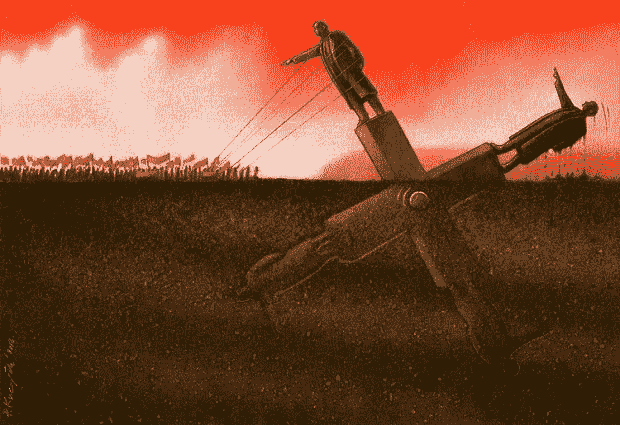
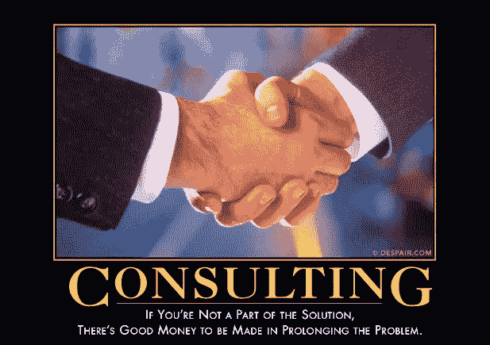

# 敏捷是新的瀑布

> 原文：<https://medium.com/swlh/agile-is-the-new-waterfall-f7baef5d026d>

*这篇文章产生了很大的激情，在回应之前请* [*阅读我对批评家*](/@ayasin/agile-is-the-new-waterfall-a-followup-f1c0bcd2162e#.310qen6th) *的回应。*

你被一直欺骗你的人欺骗了。

敏捷太可怕了。Scrum 更糟糕。

在我开始之前，让我先澄清一下敏捷的稻草人:没有一个理智的人支持瀑布。重复，没有清醒的瀑布拥护者。也就是说，敏捷的追随者对他们的对手提出的每一个论点都可以很容易地被那些他们非常害怕的想象中的瀑布追随者提出来，只需要稍微改变一下措辞。

敏捷已经成为了瀑布对开发者的一切，甚至更糟。这是一只披着羊皮的狼，我今天要在这里揭露它。

## 敏捷承诺

> “充满了喧嚣和愤怒，却毫无意义”——莎士比亚，麦克白

敏捷向我们承诺了工程师驱动的开发。这是从瀑布般的反乌托邦中的一次闪光的解脱，在瀑布般的反乌托邦中，每一个重要的决定都是在工程师之外不可改变的。如果你读了敏捷宣言，就会明白这一点。它重视个人、工作软件、协作和随遇而安。这些都是令人敬畏的理想。我们会被包括在需求中，我们可以给出反馈。变化会发生，这不是任何人的错，也没有人会在周末工作来跟上变化。我们将在每个层面都有投入，最重要的是，我们将是技术决策的驱动者。会有软糖和棒棒糖。我是说谁会反对软糖和棒棒糖呢？不幸的是，对我们大多数人来说，我们从“伯蒂博茨各种口味豆”那里得到了棒棒糖和软糖，各种口味都有，就是没有呕吐。

## 敏捷是一把锤子

锤子是伟大的工具，有它们的位置。敏捷只在一个地方起作用:如果你是一家咨询公司，需要为一个不知道他们真正想要什么的客户做一个快速原型。在这种情况下，如果您是基于时间和材料计费，那么 Agile 会解决这个问题。你只是尽可能快地把东西扔在一起，因为你知道反正大部分都是垃圾。无论客户想出什么疯狂的主意，你都要安排时间，解释成本，如果他们同意就去做。客户很高兴，咨询公司得到报酬，最终项目完成了。赢了赢了(虽然赢了对咨询公司非常有利)。

## 你是钉子

上面要注意的一点是，咨询公司根本不负责任何事情。他们是处理“业务驱动的开发”的普通工人。

瀑布和敏捷的核心共享“业务驱动开发”的理念，正是在这一点上，它们是不同包装中的同一袋坏东西。

## 敏捷的现实:瀑布 2.0

Image Credit: [Pawel Kuczynski](http://www.pawelkuczynski.com/index.php)

敏捷的现实是，你仍然拥有由对技术没有真正理解的业务人员做出的不可改变的决策。这些决定然后被强加给开发者。最终结果和瀑布一样，只是名字变了。

不幸的是，由于很少或没有文档，现在开发人员对结果负责，而很少或没有权力创建一个成功的结果。这种没有权威的责任使得敏捷甚至比瀑布还要有毒。

> "当权威第一次发现混乱接踵而至时，它会想出最卑鄙的办法来挽救它那井然有序的外表。"—阿兰·穆尔，V 代表仇杀

每日“scrum”的加入确保了任何被认为工作太慢的人(不管这是不是真的)会被立即强调出来。这种“锅炉房”的氛围对一些人来说可能很好，但对大多数人来说，这是巨大压力的来源，最终会降低生产力。这种压力促使开发人员不去考虑未来，而只是在今天拼凑一些几乎不起作用的东西。这在敏捷中非常普遍，以至于“技术债务”看起来像是过程的基本支柱。如果你是一家计划在 6 个月内倒闭的初创公司，这真的不是问题。如果你想在这里呆一段时间，你最好练习一下你在车间课上学到的东西:“量两次，切一次”。在软件中，这意味着在你开始写代码之前要考虑更大的图景。

## 故事点，敏捷的衡量标准

即使在衡量敏捷方面也失败了。它使用了一种无单位的测量方法，叫做“故事点”。不幸的是，这些都是任意分配的，然后管理者试图从中辨别“速度”。问题是团队并不都那么稳定，你需要大量的数据点。如果你的冲刺持续 2 周，你一年最多可以得到 26 个数据点，但通常在团队流失的情况下，你只能得到 10 个或更少的数据(数据不足以得出结论)。想象一下，从 4 月到 8 月对温度进行 10 次采样，以确定你在 12 月应该穿什么。

更糟糕的是，在负责人的头脑中，故事点几乎总是变成“时间单位”。这些单位然后被用来比较团队或部队，以解释为什么他们的“速度”下降，即使这些数字开始是任意的无单位值，所以不能以这种方式进行比较。

## 你做敏捷是错误的

Image Credit: despair.com

大批“敏捷咨询”公司如雨后春笋般涌现，让你相信你需要敏捷开发方面的帮助。您的项目失败了；不是敏捷，是你。你只是做错了，如果做对了，你就会赢(对感兴趣的人来说，这是一个不真实的苏格兰人的谬论)。敏捷教练、认证的 scrum 大师、为期两天的敏捷培训课程等都有保持谎言的既得利益。为什么宣言中的 4 个基本思想需要教练、大师和培训？剧透:你没有。但是，您确实需要他们将瀑布式应用到这个新的包中。

## 那么我们该怎么办呢？

> “幸福的家庭都相似；每个不幸的家庭都有自己的不幸。”—托尔斯泰，安娜·卡列尼娜

托尔斯泰所说的关于家庭的话，对过程来说是反过来的。所有成功的过程都是独一无二的。你不可能通过阅读一本书并经历它的 12 个步骤来构建伟大的软件，就像你不可能通过阅读一本书并经历它的 12 个步骤来想出下一件大事一样。你得针对你的情况想清楚。我从这里开始:

**摆脱一切。**

摆脱你的 scrum 大师，你的产品所有者，你的敏捷教练，解雇会让你更加敏捷的敏捷顾问。现在你有了一张白纸，你可以开始思考什么对你有意义。

**引入最少的流程。**

也许这是一个应用程序创意的展示板，也许这是一个目前正在开发的功能列表，这样你就可以知道是否会有冲突，等等。不管你最低设置是多少，从那里开始。

**参与。**

当一个功能从“头脑风暴”阶段(可能包括疯狂的想法，如“如果用户注册了 4 个朋友，就让他们搭车去国际空间站”)进入“细化”阶段时，让每个人都参与进来。我指的不仅仅是开发经理，我指的是所有人，从头到尾，都将参与到这个特性中。不讨论需要多久。讨论该特性的优点，如何实现等。这些讨论应该是积极的、破坏性的(这并不意味着不专业)。这些事。很多。如果你排除任何人，排除经理。这创造了一个真正的工程驱动的文化。

**仅添加可降低重大实际风险的流程。**

如果您对以下三个问题中的一个回答“是”,则创建流程来帮助降低特定风险:

1.  是否出现了系统性而非一次性的实际问题？*例子:Sally 和 Bob 都重复地开始做同一个功能，两天之内都没有搞清楚，因为他们没有办法这样做。*
2.  出现问题的风险很高吗？例子:如果你的源代码在一个月内没有被检查到源代码控制中，那么驱动器崩溃的频率就会很高，这就存在着重大损失的风险。
3.  一个问题会有灾难性的后果吗？*例如:如果飞机在飞行中机翼脱落，机上所有人的游戏都结束了。*

如果所有这些问题的诚实答案都是否定的，那么你在这个过程中就是在浪费时间。

**准备好了就发货，不是之前，也不是之后。**

让工程师做他们的工作，把事情想清楚，写 15 行代码而不是 150 行。使用代码审查、测试等。运送错误产品的成本远远高于任意错过运送正确产品的最后期限的成本。

## 等等，现在我很敏捷了

是的，现在你是小写 a 敏捷，而不是大写 a 敏捷。我希望你现在已经看到了巨大的不同。你有一个最简单的流程，可以让你有效地完成重要的事情。你以前花在不属于你的新的最小核心的过程上的每一分钟现在都被回收用于生产性的工作。最后，但同样重要的是，你现在(希望)有一个工程驱动的组织。

**去赢**。

## 关于我

我是 Amir Yasin，是一名通晓多种语言的开发人员，对高性能、可伸缩性、软件架构和解决难题非常感兴趣。你可以[在 Medium](/@ayasin) 上关注我写的关于软件工程的博客，[在 Twitter](https://twitter.com/ayasin) 上关注我偶尔说的有趣的事情，或者在 GitHub 上查看[我对 FOSS 社区的贡献。](https://github.com/ayasin)

**如果你喜欢这篇文章，我会非常感谢你的推荐(点击下面的心脏)**。

发表于*****(***创业、流浪、生活黑客)****

******************