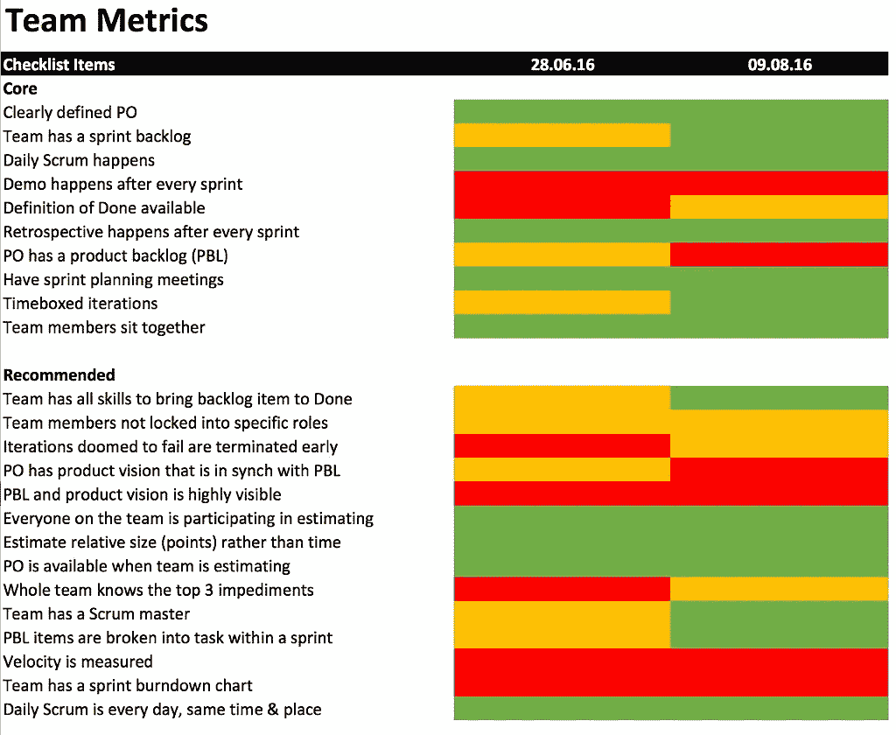
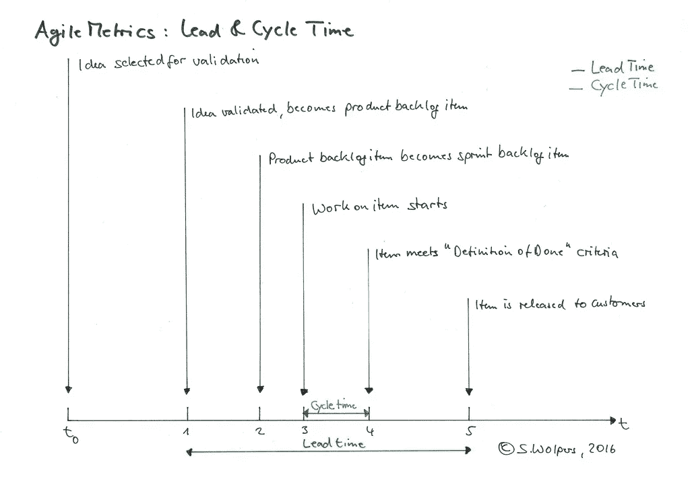

# 敏捷度量——好的、坏的和丑陋的

> 原文：<https://medium.com/swlh/agile-metrics-the-good-the-bad-and-the-ugly-65639d28fd29>

# TL；DR:敏捷度量

合适的敏捷度量反映了团队在变得敏捷方面的进展，或者您的组织在成为学习型组织方面的进展。

为了解决团队层面的问题，定性敏捷度量通常比定量度量更有效。在组织层面上，情况正好相反:定量的敏捷度量比定性的敏捷度量提供了更好的洞察力。

# 良好的敏捷指标

一般来说，指标用于更好地了解当前情况，以及洞察随时间的变化。没有度量标准，评估任何努力或开发都将受到直觉和基于偏见的解释的影响。

因此，度量应该是模式变化的领先指标，提供及时分析原因的机会。以下三个敏捷指标的通用规则已经被证明是有用的:

1.  跟踪有意义的度量的第一条规则是只跟踪那些适用于团队的度量。忽略那些衡量个人的。
2.  跟踪指标的第二条规则是，不要因为参数容易遵循就去衡量它们。这种实践通常是使用各种提供现成报告的敏捷工具的结果。
3.  跟踪指标的第三条规则是记录上下文。没有上下文的数据，例如，可用团队成员的数量，或者在冲刺过程中事件的强度，可能只不过是噪音。

例如，如果技术债务指标(见下文)的(平均)情绪缓慢但稳定地下降，这可能表明团队:

*   可能已经开始牺牲代码质量来满足最后期限，或者
*   可能故意构建了一些临时解决方案来加速实验。

虽然后者可能是件好事，但第一种解释令人担忧。(你需要在回顾中与团队一起分析这一点。)

## 良好的定性敏捷度量:自我评估测试

如果您喜欢跟踪团队在采用敏捷技术和过程方面的进展，自我评估测试非常适合这个目的。例如，我喜欢使用 Henrik Kniberg 的 [Scrum 清单。](https://www.crisp.se/wp-content/uploads/2012/05/Scrum-checklist.pdf)

你所要做的就是在回顾期间每四到六周进行一次问卷调查，记录结果并汇总:

在这个例子中，我们使用了一种评估扑克，用三个值绿色、橙色和红色中的一个来回答每个问题。颜色编码如下:

*   *绿色*:这对团队很有效。
*   *橙色*:对车队来说，这还算有效，但仍有改进的空间。
*   红色:要么不适用，例如团队没有使用烧毁图表，要么实践仍然失败。

如果最终的 Scrum 实践图随着时间的推移越来越环保，那么团队就在正确的轨道上。否则，你得深入挖掘，了解没有持续改进的原因，并相应地适应。

除了这个练习，我还喜欢在每两周一次的 sprint 结束时进行一次匿名投票。该调查由三个问题组成，每个问题的回答范围从 1 到 10:

1.  *在去年的冲刺阶段，团队交付了什么价值？* (1:我们没有提供任何价值，10:我们提供了可能的最大价值。)
2.  *在最近的冲刺阶段，技术债务的水平如何发展？* (1:从头重写应用，10:没有技术债。)
3.  你和队友一起工作开心吗？我在找一份新工作，10:我迫不及待地想在周一早上回到办公室。)

每个团队成员的投票时间不到 30 秒，结果当然是每个人都可以得到的。同样，跟踪三个定性指标的发展提供了对趋势的洞察，否则可能会被忽视。

## 请点击“心脏按钮”💚下面，如果你觉得这篇文章有用，它将对我意义重大！

***如果您喜欢电子邮件通知，请*** [***注册我的每周简讯***](https://age-of-product.com/subscribe/?ref=Food4ThoughtMedium) ***并加入 5182 位同行……***

## 良好的定量敏捷度量:交付时间和周期时间

最终，任何敏捷转变的目的都是成为一个学习型组织，从而获得竞争优势。以下度量标准适用于(软件)产品交付过程，但也可以相应地适用于其他各种过程。

从长远来看，这不仅需要将组织从职能孤岛重组为或多或少的跨职能团队(如果适用)。还需要分析系统本身，例如，找出价值创造在哪里受到队列的阻碍。

为了有效地识别产品交付流程中的现有队列，您开始记录五个日期:

1.  以前验证过的想法，例如一个新特性的用户故事，成为产品待定项的日期。
2.  该产品待定项成为 sprint 待定项的日期。
3.  这个 sprint backlog 项目开始开发的日期。
4.  sprint backlog 项目满足团队“完成定义”的日期。
5.  将 sprint backlog 项目发布给客户的日期。

**提前期**是第一次和第五次约会之间经过的时间，**周期时间**是第三次和第四次约会之间经过的时间。

目标是减少交付时间和周期时间，以提高组织向客户交付价值的能力。这是通过消除产品交付过程中团队之间的依赖和交接来实现的。

这方面的有益做法有:

*   创建跨职能和协同定位的团队
*   拥有功能团队而不是组件团队
*   促进所有团队成员的整体产品观点和系统思维。

测量提前期和周期时间不需要复杂的敏捷工具或商业智能软件。如果所有团队都坚持一个简单的规则，一个简单的电子表格就可以了:一旦你移动了一张票，记下日期。这甚至适用于索引卡。

## 其他优秀的敏捷指标

Esther Derby 在她的文章[中建议敏捷](http://www.estherderby.com/2011/10/metrics-for-agile.html)的度量也要测量*修复工作*与*特性工作*的比率，以及逃避到生产中的缺陷数量。

# 错误的敏捷指标

团队速度是一个糟糕但流行的敏捷度量标准。团队速度是一个众所周知的不稳定的度量，因此实际上只有团队自己可以使用。

让团队内部的 sprint 比较变得如此困难的许多因素包括:

*   团队吸收新成员，
*   经验丰富的队员正在离开，
*   团队成员的资历级别发生变化，
*   这个团队正在未知的领域工作，
*   该团队正在开发遗留代码，
*   团队遇到了意想不到的技术债务，
*   假期和病假会降低冲刺阶段的产能，
*   团队必须处理严重的错误。

实际上，你需要[标准化](https://en.wikipedia.org/wiki/Normalization_(statistics))一个团队在每个 sprint 中的表现，以获得至少一些可比的值。(通常不会这样做。)

此外，速度是一个很容易操作的指标。在指导新团队时，我通常会做一个如何编写“敏捷书籍”的练习。我从来没有和一个不能想出合适的主意的团队一起工作过，如何确保它能满足任何基于其速度的报告要求。你不应该对此感到惊讶——这被称为[霍桑效应](https://en.wikipedia.org/wiki/Hawthorne_effect):

> 霍桑效应(也称为观察者效应)是一种反应类型，其中个体响应于他们被观察的意识而修改或改善他们行为的一个方面。

更糟糕的是，你不能比较不同团队之间的速度，因为他们所有人的估计都不一样。这完全没问题，因为估算并不是为了报告的目的。它们是试图在团队成员之间建立对用户故事的原因、方式和内容的共同理解的副作用。

所以，不要用速度作为敏捷的衡量标准。

在这里阅读更多关于速度的内容: [Scrum:对承诺匹配速度的痴迷](https://age-of-product.com/scrum-the-obsession-with-commitment-matching-velocity/)。

# 丑陋的敏捷指标

到目前为止，我遇到的最丑陋的敏捷度量是“每个时间间隔每个开发人员的故事点”。这基本上相当于传统项目报告方法中的“代码行”或“花费的时间”。该指标完全没有用，因为它没有提供任何解释或比较的背景。

同样无用的“敏捷度量”是，例如，认证团队成员的数量，或者完成敏捷实践研讨会的团队成员的数量。

# 结论

如果你只能记录几个数据点，用开始和结束日期来衡量提前期和周期时间。如果您刚刚开始您的敏捷之旅，您可以考虑通过测量定性信号来跟踪单个团队的采用率，例如，基于像 Henrik Kniberg 的“Scrum test”这样的自我评估测试。

你用什么来跟踪你的进步？请在评论中与我们分享，或者加入我们的 Slack 团队“动手敏捷”——我们有一个敏捷指标的渠道。

# 相关职位

[如何开始你的敏捷转变(第一部分)](https://age-of-product.com/agile-transition-scrum-team-1/)

[产品待办事项细化—敏捷产品化第二部分](https://age-of-product.com/product-backlog-refinement-agile-transition-part-2/)

[如何构建离线板——敏捷过渡(第三部分)](https://age-of-product.com/offline-boards/)

***请点击【心脏按钮】*** *💚下面，如果你觉得这篇文章有用，它将对我意义重大！*

***要不要这样多读书？*嗯:**

*   📰 ***加入 5182 同行和*** [***报名参加本期每周快讯***](https://age-of-product.com/subscribe/?ref=Food4ThoughtMedium)
*   🐦 ***关注我的*** [***推特***](https://twitter.com/stefanw) ***并订阅我的博客*** [***产品年龄***](https://age-of-product.com)
*   💬 ***或者，加入我全新的*** [***懈怠团队【动手敏捷】免费***](https://goo.gl/forms/XIsABn0fLn9O0hqg2)***……***