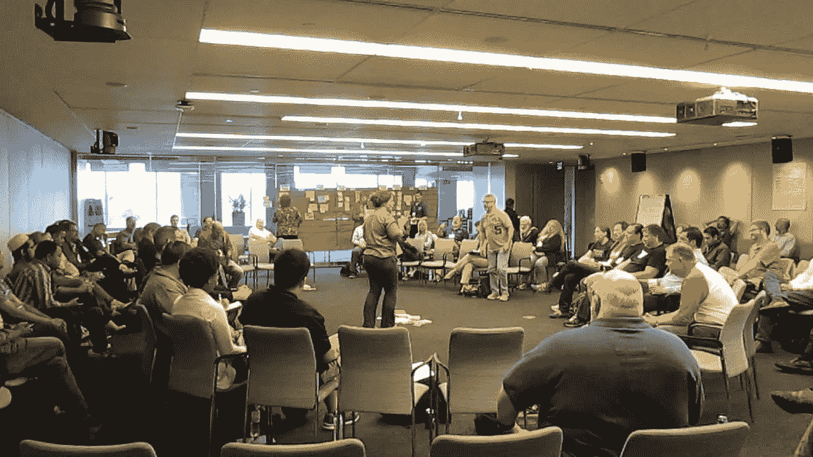

# 敏捷开放空间

> 原文：<https://medium.com/swlh/agile-open-space-57c010cb65ea>

开放空间技术(OST)是一种目的驱动的领导方法，包括举办会议、冲突意识和平建设、会议、公司式务虚会、研讨会和社区峰会活动的方式，专注于特定和重要的目的或任务，但开始时没有任何正式议程，超出了总体目的或主题。

主要的想法来自于观察到人们习惯在饮水机、咖啡机等旁边进行大部分的对话。所以人们开始考虑把这作为一种方式，也许可以把会议转变成类似的概念，人们更喜欢讨论他们感兴趣的事情。

# 开放空间技术

想象一下，一个没有预定议程的会议，人们围绕着议题转来转去，然后由哪个小组来选择。或者人们可以离开一个团体去另一个有趣的团体。您可以使用(2 英尺)

*   **二尺定律:**
    这是一条允许个人离开房间或加入其他房间进行讨论的定律。所以，如果你觉得你对讨论没有贡献，那么你可以离开那个房间。也许，如果你对别的东西感兴趣，那就抬起你的脚，直接去那个地方。

房间通常会以某种方式建造，以帮助促进进程，这将是一个大空间，人们通常会坐在大圆圈中，然后传播，然后标记和笔记将可供所有人使用。
一些公司实际上做了一些架构来为流程提供氛围。

Example of kick off of a discussions in OSTs

在讨论过程中，小组中的任何人都可以拿起一张纸条，可能会说我有这个问题，这可能是一个解决方案，所以他在会议室贴了一张纸条，告诉人们欢迎任何人参加，并且
鼓励解决方案不应该总是来自团队领导，而是来自个人。

# OST 依赖的 5 个主要原则

*   **无论谁来都是合适的人**
    只有对那个话题感兴趣的人，才在那个房间里。
*   **无论何时开始都是正确的时间**
    准时在这里可能不是一件好事，因为你不能强迫创造力，相反，创造力创造自己的时间。
*   **无论发生在哪里，都是合适的地方**
    游泳池、花园、会议室或任何个人提议的地方。
*   **准备大吃一惊**
    无论发生什么都是唯一可能发生的事情。如果发生了什么不对的事情，不要争论、指责或其他什么，只要抓住要点，继续前进。
*   **当它结束时，它就结束了**
    你不必为某件事设定时间框(当然也不要掉进兔子洞)，当它完成时，它就完成了，然后你再去做下一件事。

> “没有激情，没人在乎。没有责任，什么也做不成。”哈里森·欧文

# 参与角色:

在这个过程中，有一些主要的角色是经常出现的，它们被允许发生，但是它们不像是被分配的或者类似的。

*   人们在不同的房间里跳来跳去寻找他们可能喜欢的话题，然后在找到合适的地方后，他们会分享来自其他房间的知识，然后坚持自己的知识直到完成(除非那里使用了 2 英尺定律)..
*   **蝴蝶:**长得漂亮，吸引别人和自己交谈。

当然，就像任何其他流程一样，适应它们需要时间，但我看到可能出现的两件重要事情以及对它们的反应确实很重要(邀请和授权)。
你邀请人们，而不是强迫他们。因此，如果没有人参加会议，你必须真正接受这个事实，知道只有感兴趣的人才会出现，至少你会知道你没有足够的人对某个主题感兴趣。

另一个是授权，即无论谁发号施令，都必须将球传给试图实施该流程的人。这意味着不要微观管理，不要很快推动进度，不要唠叨，相信任何控制和顺应变化的人(当然是在一定程度上)。

在每个开放空间会议结束时，就像任何其他讨论过程一样，会有一个会议，summery 会得到讨论的内容、结果、谁参加了会议，并向组织报告建议和结果。

这个过程的主要目标是创造自组织的个体，努力提高团队的生产力和积极性。但是，这并不意味着这个过程可以在所有行业或公司实施，试验这个过程真的很重要，可能会带来很大的改进，但是强迫它，不是敏捷的工作方式。

> 开放空间是唯一一个专注于扩展时间和空间，让自组织力量发挥作用的过程。尽管我们无法预测具体的结果，但无论人们想关注什么问题，这总是非常有效的。人们经常注意到的一些鼓舞人心的副作用是笑声、感觉像玩一样的努力工作、令人惊讶的结果和引人入胜的新问题。
> 
> ——迈克尔·潘维茨，开放空间实践者

**非常感谢**阿斯特丽德·克拉森，所有内容都是她在 meetup 会议上的发言摘要。

**阅读更多关于这次结账的链接如下:**
[http://openspaceagility.com/about/](http://openspaceagility.com/about/)
[https://www.meetup.com/Agile-Hong-Kong/events/243909261/](https://www.meetup.com/Agile-Hong-Kong/events/243909261/)

## 这篇文章发表在 [The Startup](https://medium.com/swlh) 上，这是 Medium 最大的创业刊物，有 308，471+人关注。

## 在这里订阅接收[我们的头条新闻](http://growthsupply.com/the-startup-newsletter/)。

