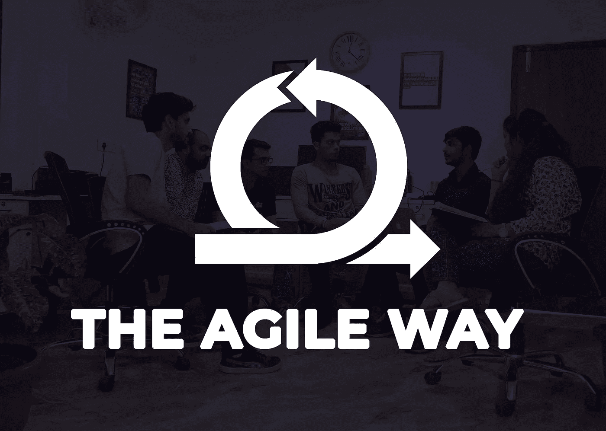

# UX 大猩猩团队的敏捷项目管理

> 原文：<https://medium.com/swlh/agile-project-management-in-our-team-at-ux-gorilla-d544f3fac808>

One of our team meetings.

周一早上，我们感觉又重新充满了活力。为下一个目标和挑战做好准备。

我们是一个 6 人团队，没有人单独做任何事情。这是我们团队中敏捷思维的美丽和力量。所以，我们来讨论一下房间里的大象。

如今科技行业的问题是需求在变，期望在变，但没有人有时间去实现这一点。我们从一个接一个地放弃所有东西的模式([瀑布](https://en.wikipedia.org/wiki/Waterfall_model))转变为一种非常增量的方法，在这种方法中，所有东西都是零零碎碎地完成，并尽早交付。

# 为什么要敏捷项目管理？

在讨论为什么敏捷之前，我们先讨论一下[敏捷](https://en.wikipedia.org/wiki/Agile_software_development)？敏捷项目管理是一种将成员聚集在一起的软件开发方法；让他们在协作的环境中工作。这本质上是迭代的。敏捷是用于开发软件的一套方法和实践的总称。

"*早期工作，但以最终的愿景打造渐进的经验*"-梁家杰

# 敏捷项目管理如何帮助:-

## 1.拥抱计划，而不是计划。

随着时间的推移，我们知道我们应该更经常地计划。我们热衷于规划我们要去的地方，但是解决问题的方法会随着需求的变化而变化，在一个特定的时间框架内随着期望的变化而变化。

*“规划就是一切。计划什么都不是。”–*德怀特·艾森豪威尔

## 2.你不能停留太久。

我们在团队中练习极限编程，结对编程帮助我们的团队解决两个或更多人在同一个屏幕上的更大问题。

帮助他人爬得最高的人

## 3.日常评价。

我们更喜欢晨会文化，在晨会上，每个人都讨论前一天的问题和进展、今天的目标以及团队之间的依赖关系，并有时间限制，以避免不必要的事情。对问题、质量和额外交付持续时间的日常评估。

“我们的交流手段越复杂，我们交流的就越少”——j . b .普里斯特利

## 4.修复得更快。

我们有尝试新事物和失败的自由。当我们遵循增量解决方案时，我们不太可能需要一起改变所有的事情。如果出了问题，转移到最后一天建设，你就可以再次去。

“*如果你想要一个保证，买一个烤面包机*”—克林特·伊斯特伍德

## 5.快速迭代。

我们有每天的目标，我们评估每天的需求，决定我们必须改变什么，并与我们的管道结构一起工作。

*智力是适应变化的能力。*——斯蒂芬·霍金

## 6.经常反馈和开会。

我们每天至少坐在一起两次，让整个团队都在同一个页面上，并获得关于我们最新构建的反馈。

“我们当中没有一个人像我们所有人一样聪明。*。*——肯·布兰查德

# 敏捷如何帮助:-

*   作为团队中的一员，我们都需要在灵活性方面保持警觉。
*   我们在制作过程中互相补充。
*   我们鼓励每个人发出声音；不管多温柔。
*   我们鼓励快速学习，经常学习。
*   我们的工作不应该是完美的，但我们确保它应该工作。
*   无论进步有多小，我们都会欣赏并分享。
*   我们互相帮助和激励，寻找对用户和团队最有效的方法。

# 敏捷项目管理:行动中

我们的一天开始于一个带计时器的晨会，以便检查不必要的事情；在这里，我们讨论问题和前一天的进展，今天的目标和工作，所有团队成员的依赖性，以及是否需要任何其他帮助。我们在内部使用[特雷罗](https://trello.com/)来让整个团队保持一致。我们在各种问题上一起工作，每天至少与团队分享一次构建，并根据我们得到的反馈进行更改。

我们的开发人员在实现构建时使用单个大屏幕，这使得问题更容易解决；“小工程，做得好，又快”。我们根据指南的变化做出反应，使其更加实用。对我们来说，工作软件比全面的文档更重要。

> 对于敏捷团队来说，不管你是遵循 [scrum 还是看板](https://www.agileweboperations.com/scrum-vs-kanban)，你都应该能够生产；最终，它应该会起作用。团队中运作良好的，才是我们所需要的。

# 为了让敏捷工作，你应该

*   找到一个高度积极的团队，相信交付。
*   你应该对每个人都有信心；像所有人一样。
*   为您的团队提供最新的信息和技术。
*   在过程的早期识别并记录易于理解的目标。
*   这些错误在构建中很常见；所以，允许错误。
*   灵活处理精力、时间、技术和金钱。
*   永远不要计划长跑；被老鼠咬了。
*   不要忽略成员之间的交流。

## 你如何在你的团队中运用敏捷方法？请分享。

我很乐意收到你的来信。[取得联系](mailto:tdesignsguy@gmail.com)

感谢您投入宝贵的时间；希望你得到回报。

> ***你也可以在***[***Uplabs***](http://uplabs.com/iamrohanmishra)*[***insta gram***](https://instagram.com/iamrohanmishra)***和***[***Linkedin******。***](https://www.linkedin.com/in/iamrohanmishra/)*

**原载于 2018 年 4 月 25 日*[*uxgorilla.com*](https://uxgorilla.com/agile-project-management/)*。**

**

## *这个故事发表在[的创业](https://medium.com/swlh)上，这是 Medium 最大的创业刊物，有 319，283+人关注。*

## *在这里订阅接收[我们的头条新闻](http://growthsupply.com/the-startup-newsletter/)。*

**