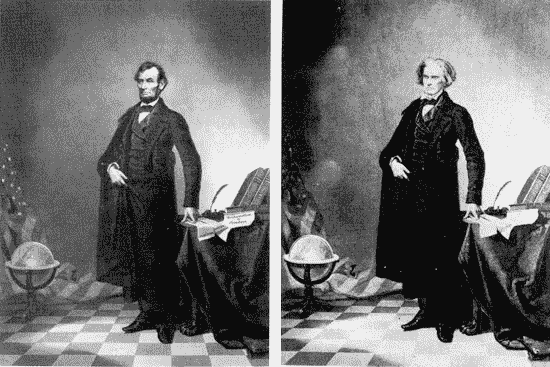

# 人工智能、深度虚假和真理的终结

> 原文：<https://medium.com/swlh/ai-and-the-end-of-truth-9a42675de18>

## 觉得现在的假新闻问题不好？有了 AI 也不会好到哪里去。

2016 年发生了很多事情。

首先，2016 年是[过滤泡沫](https://www.ted.com/talks/eli_pariser_beware_online_filter_bubbles)破裂、假新闻争议震动媒体行业的一年。美国大选后，脸书因在其平台上传播假新闻而影响选举结果而受到[的抨击。Buzzfeed](http://www.nytimes.com/2016/11/14/technology/facebook-is-said-to-question-its-influence-in-election.html?_r=0) 的一篇[报道展示了假新闻，如](https://www.buzzfeed.com/craigsilverman/viral-fake-election-news-outperformed-real-news-on-facebook?utm_term=.ucxNBnnW3P#.ivj2rppa6m)[教皇方济各支持唐纳德·川普](http://www.snopes.com/pope-francis-donald-trump-endorsement/)，是如何比《纽约时报》和《华盛顿邮报》等可信媒体渠道的真实新闻获得更多关注的。马克·扎克伯格很快驳斥了这种说法，但是考虑到将近一半的美国人主要从平台上获取新闻，相信脸书在选举中发挥了作用是非常合理的。

假新闻的争议引发了很多讨论，以及如何面对假新闻的一些好主意。在众目睽睽之下，脸书和谷歌都做出了反应，禁止假新闻网站与他们一起做广告。脸书还更进一步，引入了新的措施来限制假新闻在其平台上的传播，例如用户可以报告可疑内容，然后在旁边显示一个“有争议”的警告标签。

Facebook’s new [disputed warning label](https://dribbble.com/shots/3159606-Fake-News-on-Facebook).

虽然这些是有希望的第一步，但我担心它们还不够。我相信我们目前的误传问题只是我们面前巨大冰山的一角——这从人工智能开始。

# 进入人工智能

2016 年也是 AI 成为主流的一年。在经历了长时间的失望之后，人工智能正在卷土重来，这要归功于最近的突破，如深度学习领域的 T2。现在，不需要编写问题的解决方案，而是可以教会计算机自己解决问题。这种改变游戏规则的方法正在实现令人难以置信的产品，这些产品在几年前还被认为是不可能的，例如像亚马逊 Echo 和[自动驾驶汽车](/swlh/the-unintended-ways-self-driving-cars-will-change-our-world-3b15d1db9026#.fkvp2yx67)这样的语音控制助手。

虽然这很棒，但人工智能也使一些令人印象深刻但完全可怕的操纵媒体的新工具成为可能。这些工具有能力永远改变我们感知和消费信息的方式。

例如，几周前，Adobe 发布了 VoCo，这是一款用于演讲的*Photoshop:*

换句话说，VoCo 是一个人工智能工具，可以复制人类的声音。你只需要给软件输入一段 20 分钟长的某人谈话录音。人工智能将分析它，并学习那个人如何说话。然后，只要输入任何东西，计算机就会用那个人的声音读出你的话。从根本上说，Adobe 构建 VoCo 是为了帮助声音编辑轻松修复播客或电影中的音频错误。然而，正如你所猜测的，这一声明引发了对该技术潜在影响的重大担忧，从降低对新闻业的信任到造成重大安全威胁。

这还不是结束。我们可以对音频做什么，**我们也可以对视频做什么**:

Face2Face 是一个人工智能工具，可以进行实时视频重现。这一过程与 VoCo 大致相同:向软件输入某人说话的视频记录，它将学习此人面部移动和操作的微妙方式。然后，使用面部跟踪技术，你可以将你的脸映射到那个人的脸上，基本上让他们以一种不可思议的真实感做你想做的任何事情。

将 VoCo 和 Face2Face 结合起来，你会得到非常强大的东西:操纵视频的能力，让某人以几乎与现实无异的方式说出你想要的东西。

它不止于此。人工智能可以用许多其他方式来模仿你。例如，研究人员创造了一种人工智能工具，它可以模仿任何笔迹，有可能轻松操纵法律和历史文件，或者制造虚假证据供法庭使用。更令人毛骨悚然的是，一家初创公司创造了一种人工智能的纪念聊天机器人:这种软件可以从你的聊天日志中了解你的一切，然后允许你的朋友在你死后与你的数字自我[聊天。](http://www.theverge.com/a/luka-artificial-intelligence-memorial-roman-mazurenko-bot)

# 一切都用 Photoshop

还记得你第一次意识到自己被骗了吗？你看到一张你以为是真的照片，却发现是 PS 过的？好吧，又来了。

过去，人们常说[相机不会说谎](http://www.phrases.org.uk/meanings/camera-cannot-lie.html)。由于照相机的发明，第一次有可能真实地捕捉现实。因此，没过多久，照片就成了人们可以依赖的最可信的证据。像“过目不忘”这样的短语就是最好的证明。诚然，历史上人们一直在操纵照片，但是那些编辑是罕见的，并且需要专家们单调乏味的工作。现在不再是这样了。

One of Lincoln most iconic portrait is a composite of his head and the Southern politician John Calhoun’s body.

现在的这一代人非常清楚，相机确实一直在说谎。随着照片编辑工具(如 Photoshop)的广泛采用，处理和分享照片现在已经成为互联网爱好者的爱好之一。这些工具使得处理照片变得如此容易，也使得辨别真假照片变得更加困难。今天，当我们看到一张看起来非常不可能的图片时，我们会很自然地认为它是经过 PS 的，尽管它看起来非常真实。

有了人工智能，我们正走向一个其他媒体形式都是如此的世界:文本、声音、视频等等。公平地说，像 VoCo 和 Face2Face 这样的工具并不完全是革命性的。好莱坞多年来一直在做声音和面部替换。然而，新的是，你不再需要专业人员和强大的计算机来做这件事。有了这些新工具，任何人都可以用普通电脑毫不费力地达到同样的效果。

VoCo 和 Face2Face 现在可能不会给出最令人信服的结果，但这项技术将不可避免地得到改进，并在某个时候被商业化。这可能需要一年，或者可能需要 10 年，但任何愤怒的青少年都将拥有人工智能软件，可以以与原始媒体无异的方式操纵任何媒体，这只是时间问题。

鉴于假新闻在网上的表现，以及我们对媒体行业的信任度处于历史最低点，这是一个令人不安的消息。例如，考虑一下如此广泛的技术会如何影响:

*   **司法:**今天构成证据的很多东西可能在法庭上不再被接受。就像[数码摄影](http://www.crime-scene-investigator.net/admissibilityofdigital.html)一样，法院建立一个书面、音频或视频证据不被接受的先例只是时间问题，因为没有办法证明它不是使用人工智能工具伪造的——即使它看起来或听起来完全真实。
*   政治:我们可能会看到许多令人震惊的视频，这些视频是为了诋毁和羞辱政治对手而制作的。即使在视频是真实的情况下，例如[特朗普吹嘘自己能够抚摸女性](https://www.youtube.com/watch?v=WhsSzIS84ks)，被质疑的人也可以很容易地辩称视频是假的——音频或视频片段是用 VoCo 等软件编辑的——公众也没有办法确定。

# 进入后真相世界

2016 年，牛津词典选择 post-truth 作为年度国际词汇，理由充分。今天，我们似乎越来越多地生活在一个扯淡的王国里，在这里，白宫传播着各种事实，一切都是见仁见智。

技术并没有让这一切变得更容易。随着它改善我们的生活，它也越来越模糊真理和谬误之间的界限。今天，我们生活在一个 Photoshop、 [CGI](https://www.fastcodesign.com/3034975/75-of-ikeas-catalog-is-computer-generated-imagery) 和人工智能驱动的[美化自拍应用](http://motherboard.vice.com/read/selfie-retouching-apps-popular-in-asia-are-moving-into-the-west)的世界。互联网承诺通过允许自由获取信息来实现知识的民主化。通过这样做，它也打开了一扇惊人的[信息闸门](https://en.wikipedia.org/wiki/Information_overload)，其中包括大量的谣言、错误信息和彻头彻尾的谎言。社交媒体承诺让我们更加开放，与世界联系更加紧密。它们还让我们更加深陷数字回音室，在那里令人震惊、令人不快和羞辱的谎言被系统地强化，在这个过程中为它们的制造者创造了大量金钱。现在，除了其他方面，人工智能有望彻底改变我们创建和编辑媒体的方式。这样做，也将使他们更容易扭曲和伪造。

这并不意味着这些技术都不好。根据定义，技术是解决问题的手段——而解决问题总是一件好事。正如一切改善世界的事物一样，技术创新往往伴随着不良副作用，这些副作用往往会成为头条新闻。然而，从长远来看，技术对社会的好处远远大于它的坏处。几乎以任何可能的标准衡量，世界范围内的生活质量都在提高:教育、预期寿命、收入、和平程度都比历史上任何时候都要好。尽管技术存在缺陷，但它在所有这些进步中发挥着巨大的作用。

这就是为什么我认为我们应该推动像 VoCo 或 Face2Face 这样的工具的商业化。这项技术是可行的。我们无法阻止那些想用它作恶的人染指它。如果有的话，让每个人都可以使用这些工具会让公众意识到它们的存在，进而意识到我们的媒体容易腐败的本质。就像 Photoshop 和数码摄影一样，我们将共同适应一个任何人都可以轻松操纵文字、音频和视频内容的世界。最后，我们甚至可能从中获得乐趣。

*此文为* [*原载于 2017 年 02 月 09 日 VentureBeat 上的*](http://venturebeat.com/2017/02/09/ai-and-the-end-of-truth/) *。*

💚**如果您喜欢这篇文章或从中受益，请点击“推荐”。**