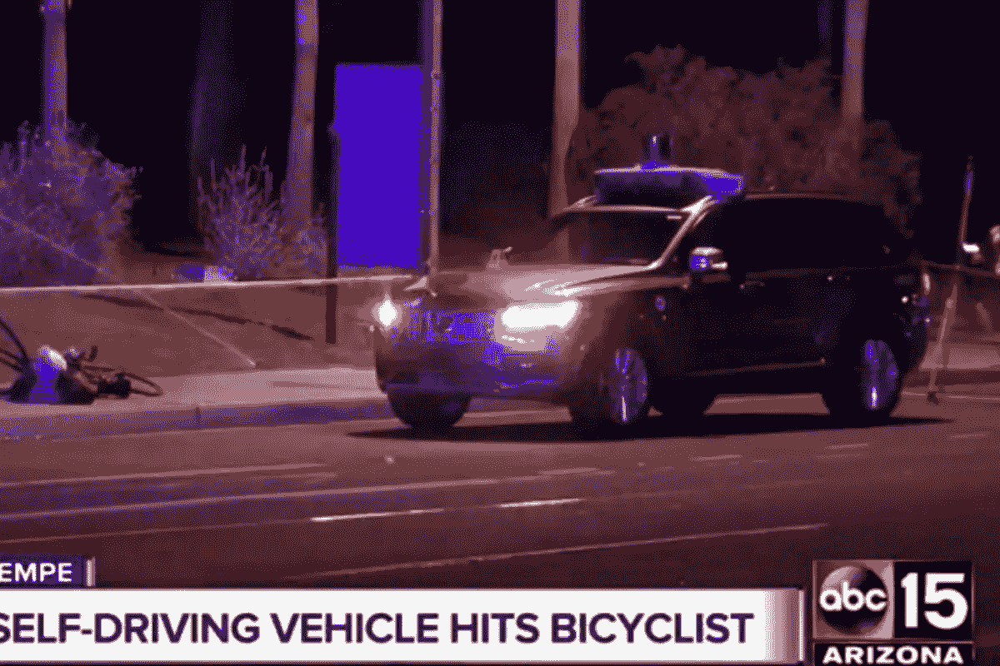

# 人工智能与网络安全:为什么我持怀疑态度

> 原文：<https://medium.com/swlh/ai-cyber-security-why-i-am-skeptical-232ed6f20896>

## 有些事情我们应该担心

An adult was killed by a self-driving car being tested by a ride-sharing company.

作为我“真实”生活的一部分——你知道，我们生活在一个社区中，与比特和字节几乎没有任何关系——我主持了一个社区规划小组。这是一群志愿者，他们帮助当地政府审查社区土地的开发计划。我们有一个…