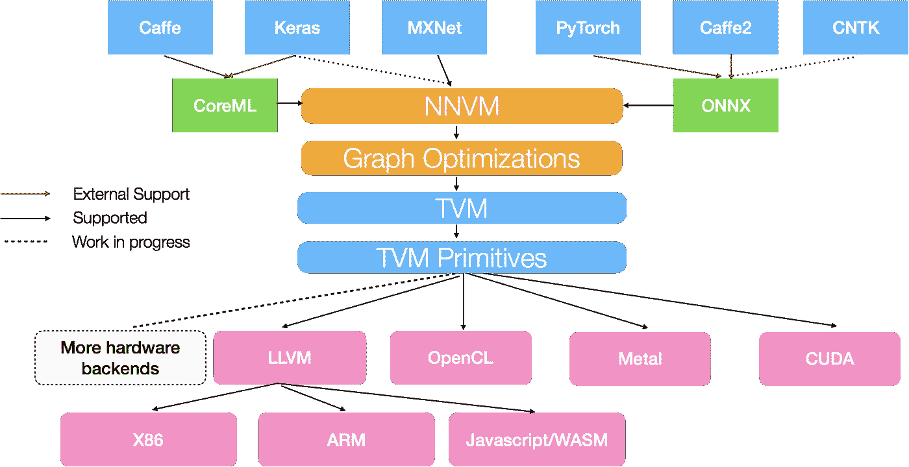
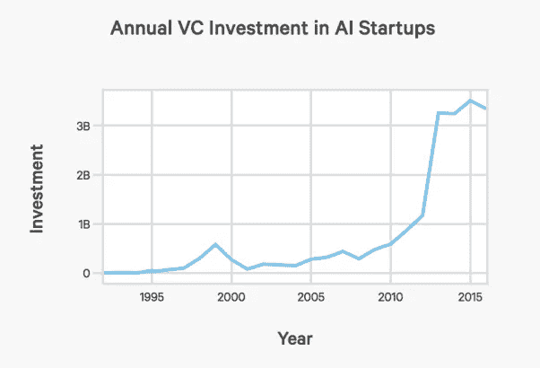

# 2018 年面向开发者的人工智能

> 原文：<https://medium.com/swlh/ai-in-2018-for-developers-2f01250d17c>

又见面了。在上一篇文章中，我试图展示我对今年哪些研究领域正在成熟并有望发展壮大的看法。研究很酷，但 AI world 肯定有一些东西在 2017 年变得成熟，现在已经准备好用于大规模应用。这就是这篇文章的内容——我想告诉你一些足够好的技术，可以用在你当前的工作中，或者基于它们建立你自己的创业公司。重要提示:这是人工智能领域、算法或技术的列表，可以立即使用。例如，你可以在列表中看到时间序列分析，因为深度学习正在迅速取代信号处理中以前的最先进水平。但是你在这里看不到强化学习，即使它应该更酷，因为以我的拙见，你现在不能在一些工业应用中真正使用它，但它是令人惊讶的和不断增长的研究领域。

我只想提醒你，这是一个由三篇文章组成的系列，我在两篇文章中从三个不同的角度分享了我对未来一年人工智能领域**将会发生什么**的展望:

*   [作为一名人工智能研究者，谁在推动这个领域的发展](https://blog.goodaudience.com/ai-in-2018-for-researchers-8955df0caaf9)
*   作为开发者，谁在工业中应用机器学习(本文)

希望你会喜欢阅读，并为自己选择一些东西！

另外，我不是在这里谈论识别图像和一些简单的计算机视觉，你已经做了很多年了:)

# 甘斯和假货

即使生殖对抗网络是几年前创建的，我对此也相当怀疑。几年过去了，我仍然持怀疑态度，即使我看到了在生成所有 64x64 图像方面的巨大进步。在阅读了一些数学文章后，我变得更加怀疑，这些文章告诉我甘并没有真正学会分布。但今年发生了一些变化，首先是新的有趣的架构(如 [CycleGAN](https://github.com/junyanz/CycleGAN) )和数学上的改进( [Wasserstein GAN](https://arxiv.org/abs/1701.07875) )让我在实践中尝试了 GAN，它们或多或少工作得很好，但在两次应用之后，我确信我们可以而且必须使用它们来生成东西。

首先，我很喜欢 NVIDIA 关于生成看起来真实的全高清图像的研究论文(与一年前的 64x64 令人毛骨悚然的面孔相比):

 [## 所有这些面孔都是人工智能催生的假名人

### 当代人工智能热潮的一个更意想不到的结果是，这些系统在生成假…

www.theverge.com](https://www.theverge.com/2017/10/30/16569402/ai-generate-fake-faces-celebs-nvidia-gan) 

但是我真正喜欢的(作为一个完美的青少年梦想应用程序)和印象深刻的是生成虚假的色情视频:

 [## 人工智能辅助的假色情在这里，我们都完蛋了

### 图片:来自 SendVids 的截图网上有一段盖尔·加朵和她继兄做爱的视频。但是它…

motherboard.vice.com](https://motherboard.vice.com/en_us/article/gydydm/gal-gadot-fake-ai-porn) 

我在游戏行业看到了很多应用，比如用 GANs 生成风景、英雄甚至整个世界。我认为我们必须意识到假货的全新水平，从你亲戚的色情作品开始，到网上完全假冒的人结束(也许很快就会下线？)

# 所有神经网络的唯一格式

现代开发的一个问题(不仅仅是在人工智能行业)是，我们有几十个不同的框架在做完全相同的事情。今天，每一个做机器学习的大公司都必须有自己的框架:[谷歌](https://www.tensorflow.org/)、[脸书](https://github.com/caffe2/caffe2)、[亚马逊](https://aws.amazon.com/ru/blogs/aws/introducing-gluon-a-new-library-for-machine-learning-from-aws-and-microsoft/)、[微软](https://github.com/Microsoft/CNTK)、[英特尔](https://github.com/intel-mxnet/mxnet)，甚至[索尼](https://github.com/sony/nnabla)和[优步](http://pyro.ai)，以及许多其他开源解决方案！在单个人工智能应用中，我们希望使用不同的框架，例如用于计算机视觉的 Caffe2、用于 NLP 的 PyTorch 和用于某些推荐系统的 Tensorflow/Keras。将它们融合在一起会花费大量的开发时间，而且会分散数据科学家和软件开发人员的注意力，使他们无法从事更重要的工作。

解决方案必须是一种独特的神经网络格式，可以很容易地从任何框架中获得，并且必须很容易被开发人员部署，也很容易被科学家使用。我们在这里遇见 ONNX:

 [## ONNX:开放式神经网络交换格式

### 可互换人工智能模型的新开放生态系统

onnx.ai](http://onnx.ai/getting-started) 

事实上，这只是非循环计算图的简单格式，但在实践中，它让我们有机会部署真正复杂的人工智能解决方案，我个人认为非常有吸引力的是——人们可以在 PyTorch 这样的框架中开发神经网络，这些框架没有强大的部署工具，也不依赖于 Tensorflow 生态系统。

# 动物园爆炸

三年前，人工智能世界中最令我兴奋的事情是咖啡馆动物园。当时我做了很多计算机视觉的工作，我尝试了所有的模型，检查它们是如何工作的，它们做了什么。稍后，我将该模型用于迁移学习或特征提取器。最近，我使用了两种不同的开源模型，作为大型计算机视觉管道的一部分。这是什么意思？这意味着实际上不需要训练你自己的网络，例如，对于 ImageNet 对象识别或位置识别，这些基本的东西可以下载并插入到你的系统中。除了 Caffe Zoo 之外，其他框架也有这样的 Zoo，但让我惊讶的是，你可以直接在你的 iPhone 上插入计算机视觉、NLP 甚至加速度计信号处理的模型:

 [## likedan/Awesome-CoreML-Models

### awesome-Core ML-Models-Core ML 的最大型号列表(适用于 iOS 11+)

github.com](https://github.com/likedan/Awesome-CoreML-Models) 

我认为这些动物园将会成长，并考虑到像 ONNX 这样的生态系统的出现，它们将会更加集中(和 ML 区块链应用程序一起分散)

# 自动更换管道

设计神经网络架构是一项痛苦的任务——有时你只需堆叠卷积层就能获得不错的结果，但大多数时候你需要使用直觉和超参数搜索方法，如随机搜索或[贝叶斯优化](https://github.com/hyperopt/hyperopt)，非常仔细地设计宽度、深度和超参数。特别是当你不在计算机视觉领域工作时，这是很难的，在计算机视觉领域，你可以微调一些在 ImageNet 上训练的 DenseNet，但一些 3D 数据分类或多变量时间序列应用程序。

有很多使用另一个神经网络从头生成神经网络架构的不同尝试，但对我来说最好、最干净的是最近的谷歌研究开发:

 [## 用于大规模图像分类和目标检测的 AutoML

### 几个月前，我们推出了 AutoML 项目，这是一种自动设计机器学习模型的方法…

research.googleblog.com](https://research.googleblog.com/2017/11/automl-for-large-scale-image.html) 

他们用它来生成比人类设计的网络更好更快的计算机视觉模型！我确信很快会有很多关于这个主题的论文和开源代码。我认为我们会看到更多的博客帖子或创业公司，而不是“我们已经开发了一种人工智能……”告诉“我们的人工智能创造了学习其他人工智能的人工智能……”。至少这是我在我的项目中要做的，我相信我不是唯一一个这样的人。

# 形式化智能堆栈

关于这个概念，我在俄罗斯系统分析师、教练和人工智能爱好者 Anatoly Levenchuk 的博客中读过很多。在下图中，你可以看到一个被称为“人工智能堆栈”的例子:

[http://www.tvmlang.org/2017/10/06/nnvm-compiler-announcement.html](http://www.tvmlang.org/2017/10/06/nnvm-compiler-announcement.html)

它不仅仅由机器学习算法和你喜欢的框架组成，它更深层次，在每个层次上都有自己的发展和研究。

我认为 AI 开发行业已经足够成熟，可以有更多不同的专家。你的团队中只有一名数据科学家是不够的——你需要不同的人来进行硬件优化、神经网络研究、人工智能编译器、解决方案优化和生产实施。在他们之上必须是不同的团队领导、软件架构师(必须为每个问题分别设计以上绘制的堆栈)和经理。我提到这个概念是为了给出人工智能领域的技术专家在未来可以成长的某种愿景(对于那些想成为人工智能或技术领导者的软件架构师，你需要知道学习什么)。

# 基于语音的应用

人工智能可以以 95%以上的准确率解决的问题非常少:我们可以将图像识别成 1000 种类别，我们可以判断文本是正面还是负面，我们可以围绕它做一些更复杂的事情。我认为另一个即将被成千上万的应用程序颠覆的领域是语音识别和生成。事实上，在一年前 DeepMind 的 [WaveNet](https://deepmind.com/blog/wavenet-generative-model-raw-audio/) 发布后，这已经很不错了，但现在多亏了百度的 [DeepVoice 3](http://research.baidu.com/deep-voice-3-2000-speaker-neural-text-speech/) 和最近在谷歌 Tacotron2 中开发的产品，我们已经远离了:

 [## Tacotron 2:从文本生成类似人类的语音

### 几十年来，从文本生成听起来非常自然的语音(文本到语音，TTS)一直是一个研究目标。有…

research.googleblog.com](https://research.googleblog.com/2017/12/tacotron-2-generating-human-like-speech.html) 

很快这项技术将会开源发布(或者由一些聪明人复制),每个人都将能够识别声音并以非常高的准确度产生声音。有什么在等着我们？更好的个人助理、自动读书器和谈判记录员，是的，声音是假的。

# 更聪明的机器人

我们今天看到的所有机器人都有一个大问题——99%的机器人根本不是基于人工智能的，它们只是硬编码的。之所以会这样，是因为我们意识到，我们不能简单地在数百万次对话中专注地训练一些编码器-解码器 LSTM，并拥有一些智能系统。这就是为什么 Facebook Messenger 或 Telegram 中的大多数机器人只有硬编码的命令，或者在最好的情况下，有一些基于 LSTM 和 word2vec 的句子分类神经网络。但是现代的自然语言处理技术已经超出了这个水平。请查看 Salesforce 中已经完成的有趣研究:

 [## 人工智能研究-Salesforce.com

### 编辑描述

www.salesforce.com](https://www.salesforce.com/products/einstein/ai-research/) 

他们正在建立数据库的 NLP 接口，克服现代编码器-解码器自回归模型，训练嵌入不仅是单词或句子，也包括字符。而且，有一个有趣的研究是关于[使用强化学习优化 NLP 分数为 ROUGE](https://www.salesforce.com/products/einstein/ai-research/tl-dr-reinforced-model-abstractive-summarization/) 。

我相信，随着这些发展，我们可以至少通过更加智能的信息检索和命名实体识别来增强我们的机器人，并且可能在一些封闭的领域中完全深度学习驱动的机器人。

# 时间序列分析的发展现状

在 Salesforce 之后，第二个被低估的公共机器学习研究实验室是优步人工智能实验室。不久前，他们发表了一篇博客，展示了他们的时间序列预测方法。老实说，这让我受宠若惊，因为我在我的应用程序中使用了基本相同的方法！看一看，这是一个将统计特征和深度学习表示结合在一起的惊人例子:

 [## 用递归神经网络对优步极端事件进行工程预报

### 在优步，事件预测使我们能够根据预期的用户需求提供经得起未来考验的服务。目标是…

eng.uber.com](https://eng.uber.com/neural-networks/) 

如果你需要更多激励的例子，这里是用 34 层 1D ResNet 诊断心律失常。最酷的部分是关于性能——它不仅比一些统计模型更好，甚至超过了专业心脏病专家的诊断！

 [## 算法诊断心律失常的准确度达到心脏病专家的水平|斯坦福新闻

### 斯坦福大学计算机科学家开发的一种新算法可以筛选由一些…

news.stanford.edu](https://news.stanford.edu/2017/07/06/algorithm-diagnoses-heart-arrhythmias-cardiologist-level-accuracy/) 

我最近忙于深度学习的时间序列分析，我个人可以确认神经网络工作得非常好，与“黄金标准”相比，你可以轻松获得 5-10 倍的性能。简直管用:)

# 超越内置的优化

我们如何训练我们的神经网络？说实话，我们大多数人只是用了一些“Adam()”和标准的学习率。一些聪明的家伙选择最合适的优化器，并调整和安排学习率。我们总是低估优化主题，因为我们只是简单地按下“训练”按钮，等待我们的网络收敛。但是，在这个世界上，我们在计算能力、内存和开源解决方案方面都有或多或少的平等机会，赢家是能够在最短时间内从相同的亚马逊实例和 Tensorflow 模型中获得最佳性能的人——这一切都与优化有关。

 [## 2017 年深度学习的优化亮点

### 目录:深度学习最终是要找到一个能够很好地概括的最小值——并为……

ruder.io](http://ruder.io/deep-learning-optimization-2017/index.html) 

我鼓励你看看上面惊人的 Sebastian 的 Ruder 博客帖子，其中有一些 2017 年关于如何修复标准优化器的最新进展，这些优化器只是开箱即用，还有一些其他非常有用的简单改进。

# 普遍炒作放缓

cdn.aiindex.org/2017-report.pdf

这张图片能告诉我们什么，尤其是在阅读了本文之前的观点之后？考虑到发布了多少开源工具和算法，开发一些新的有价值的东西并为此获得大量资金并不那么容易。我认为 2018 年对于像 Prisma 这样的创业公司来说不会是最好的一年——将有太多的竞争对手和太多的“聪明人”可以利用今天的开源网络，将其部署为移动应用程序，并将其称为创业公司。

今年，我们必须专注于基本的事情，而不是快钱——即使我们计划将谷歌的 Ratacon 用于一些有声读物初创公司的语音识别，这也不能是一项简单的网络服务，而是一项与合作伙伴合作的业务，获得一些投资的商业模式:)

# 结论

简单来说，我们有几种技术可以在实际产品中使用:时间序列分析、GANs、语音识别和一些 NLP 进展。我们不应该再为分类或回归设计基础架构，因为 AutoML 会为我们做这些。我希望通过一些优化改进，AutoML 能比以前做得更快。通过 ONNX 和模型动物园，我们将用两行代码将基本模型注入到我们的应用程序中。我认为，制作基于人工智能的应用程序，至少在当前的艺术水平上变得非常容易，这对整个行业来说一点也不坏！对于今年可以拍摄的研究领域，请查看我的[上一篇文章](https://blog.goodaudience.com/ai-in-2018-for-researchers-8955df0caaf9)。敬请期待:)

附言
关注我也可以在[脸书](https://www.facebook.com/rachnogstyle.blog)关注太短的人工智能文章，在 [Instagram](http://instagram.com/rachnogstyle) 关注个人资料，在 [Linkedin](https://www.linkedin.com/in/alexandr-honchar-4423b962/) ！

## 这个故事发表在 [The Startup](https://medium.com/swlh) 上，这是 Medium 最大的企业家出版物，拥有 280，345+人。

## 在这里订阅接收[我们的头条新闻](http://growthsupply.com/the-startup-newsletter/)。

