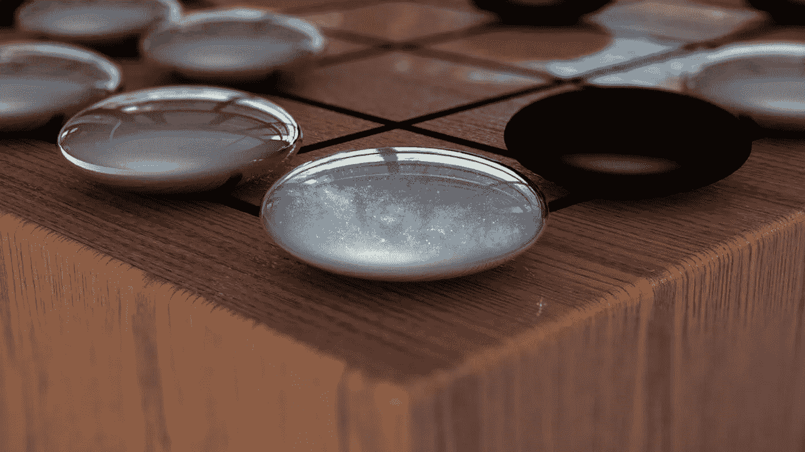

# 32 个要点中的人工智能

> 原文：<https://medium.com/swlh/ai-in-32-bullet-points-2ed4e037b056>

## 这是我对人工智能目前正在发生的事情以及为什么它如此迷人的原始头脑风暴。

## *N.B* *这是为非人工智能专家，是 100%的漫谈。*

1.  没有证据或先例表明“智力爆炸”。自我改善系统的历史表明，智力的增长是线性的，而不是指数式的。这是因为智力是情境性的，而不是一般性的。这是一个反对人工智能接管世界的论点，[弗朗索瓦·乔莱](https://medium.com/u/7462d2319de7?source=post_page-----2ed4e037b056--------------------------------) [在这里做了很好的阐述。](/@francois.chollet/the-impossibility-of-intelligence-explosion-5be4a9eda6ec)
2.  TL；大卫:人类和他们的处境/环境一样聪明。因为我们都是凡人，大多数人类智慧都以法律、制度、科学、产品、商业等形式储存在外部。
3.  TL；DR 2:然后，我们利用这些外部基础，通过一代代递增来提高我们的智力。没有一个智能系统创造出比自己聪明数倍的东西。
4.  在过去的几年里，人工智能的大量发展一直围绕着 [**监督学习**](https://en.wikipedia.org/wiki/Supervised_learning) 。借助两件事发展人工智能:1。人类经验的训练数据，例如扑克手、[围棋](https://en.wikipedia.org/wiki/Go_(game))/象棋比赛历史。第二。基本参数:例如游戏规则+真理([象棋]如果对弈=输，如果对弈=赢)。
5.  AlphaGo 的第一次迭代就是一个很好的例子。它被输入人类[围棋](https://en.wikipedia.org/wiki/Go_(game))比赛/训练数据以及某些参数。
6.  现在我们继续讨论最近的人工智能发展，特别是 2017 年“自我游戏”训练和 AlphaGoZero 背后的成功。这种新的人工智能只有一个输入的帮助，而不是两个输入。
7.  游戏的参数很简单:规则和基本真理是[走](https://en.wikipedia.org/wiki/Go_(game))也就是说，在棋盘上用自己的石头包围比对手更大的区域=赢。没有像它的前辈那样丰富的训练数据、比赛历史或人类策略。它通过反复试验学会了演奏。事情是这样的:
8.  “在数百万场 AlphaGo 对 AlphaGo 的比赛中，该系统从零开始逐步学习围棋，在短短几天内积累了数千年的人类知识。AlphaGo Zero 还发现了新知识，开发了非常规策略和创造性的新动作，这些策略和动作呼应并超越了它在与李·塞多尔(Lee Sedol)和柯洁(Ke Jie)的比赛中使用的新颖技术。[(通过 DeepMind research)](https://deepmind.com/blog/alphago-zero-learning-scratch/) 。
9.  😮
10.  首先:“在短短几天内积累人类数千年的知识”…
11.  AlphaGoZero 在 3(！)天。随后它在 40 天内成为 SuperAI(意味着它击败了之前最好的 AlphaGo 版本:AlphaGoMaster)，100 场比赛 0。
12.  相比之下，最初的基于“监督学习”的 AlphaGo 花了两年时间才成为超人。两年了。因此可以说，人类的训练数据阻碍了人工智能的发展。AlphaGoZero 能够用一双全新的“眼睛”进行自我游戏，并通过反复试验来了解游戏的来龙去脉，这极大地提高了成绩和训练时间。
13.  因此，仅仅因为最聪明的人，在某个领域或游戏中，正在以一种特殊的方式做事，并不意味着这是最好的方式。这一点很简单，但很重要。
14.  通过计算效率，人工智能**在获取能力方面比任何人类**都更先进。自娱自乐的人工智能升级的速度比人类快得多(人工智能同时运行 000 个游戏，而人类通常一次只运行一个)。
15.  所以……回到№1
16.  这算是“智力爆炸”吗？指数增长而不是线性增长？
17.  可以说，T4 积累的情报在某种程度上以前所未有的速度激增。AlphaGoZero 在 3 天内玩游戏的水平相当于任何人一生中玩游戏的水平，这听起来不太线性(也不公平😤)对我来说。但是情况有多好呢？AlphaGoZero 比人类围棋手聪明多少？
18.  事实证明，这是一个很难回答的问题，也很难衡量过去对它的评价。它要么打败所有人类，要么不。更难回答的是，这种人工智能迄今为止只应用于规则和参数定义清晰的游戏中。当这些神经网络学会在更复杂的环境中竞争时会发生什么？那么衡量人工智能比人聪明多少会更容易还是更难呢？
19.  目前的自我游戏人工智能可以在几场比赛中以创纪录的时间成为超人:国际象棋、围棋、[扑克(NLH 和极限扑克)](https://en.wikipedia.org/wiki/Texas_hold_%27em)和非常特定的 1 对 1 模式的 [DOTA。](https://en.wikipedia.org/wiki/Dota_2)你可以在这里阅读更多关于埃隆马斯克公开赛 AI DOTA bot [的内容。](https://arstechnica.com/gaming/2017/08/ai-bot-takes-on-the-pros-at-dota-2-and-wins/)
20.  因此，目前人工智能的成功仍然局限于一对一的比赛。例如，5 对 5 [DOTA](https://en.wikipedia.org/wiki/Dota_2) 或多手[无限扑克](https://en.wikipedia.org/wiki/Texas_hold_%27em)中的变量数量超过了现有任何人工智能的当前计算/神经网络能力。
21.  但是对于这些人工智能来说，将它们的神经网络成功应用于更复杂和混乱的环境，例如股票市场、自动驾驶安全、外科手术、疾病筛查/预防、CRISPR 修补等，感觉只是时间和计算/算法发展的问题。已经有了 [IBM Watson powered ETF 基金](https://www.bloomberg.com/news/articles/2017-10-17/ibm-s-watson-is-key-to-new-artificial-intelligence-powered-etf)，在我写这篇文章的时候，无人驾驶汽车制造商将会努力解决[电车问题](https://en.wikipedia.org/wiki/Trolley_problem)。
22.  那么，人工智能作为一种几乎瞬间变得比人类聪明一点的捷径，是否有潜力，但仍然受到来自地球上存在的与我们相同的生物/化学/物理法律的硬性环境限制？
23.  正如 Chollet 指出的那样，没有自我改进系统以指数速度改进的先例，这意味着在理论上，一个实体，无论是人类还是人造的，都不可能创造出另一种形式的比自己聪明得多的智能…
24.  随着我们越来越接近这种可能性的极限，这就是预测变得模糊的地方。
25.  那么短期内人类会用这些 AI 突破做什么呢？
26.  最优秀的国际象棋、Dota 和围棋选手已经在和他们的对手 AI 进行对抗训练了。因此，在人工智能是超人的游戏/领域，人类将能够向人工智能学习，以便只比人工智能笨一点，但至少比其他人聪明。是的，我也觉得很奇怪💁‍♂️.
27.  DeepMind 正在将其技术应用于一系列有趣而重要的领域，如乳腺癌预防和其他医疗用途。
28.  我也对人工智能训练人类变得正常感到奇怪的兴奋。目前只在某些游戏中有用，如扑克、围棋、象棋、Dota 等。
29.  自我游戏训练的这些突破会影响我们如何教人类吗？未来，我们是否会有人工智能培训课程，促进更个性化、试错式的学习，而不是像大多数西方教育那样遵循指示、宜家指导式的标准化方法？
30.  有趣的是，当前我们教孩子的令人厌倦的方法与 AlphaGo 版本 1 的监督学习之间存在相似之处。学校里的监督学习看起来像:两个输入 1。(训练数据)考试/练习册和长乘法，例如和 2。(参数和规则)例如，1+1=2，2 x 2=4
31.  更有趣的是个性化人类教育的潜力与“自我游戏”AlphaGoZero 式训练之间的相似之处:基本参数和规则，没有训练数据，只是基于每个学生如何思考/学习的实验。
32.  更个性化的教育方法(如果实际可行的话)，以及接受标准化的训练数据不一定对每个人都是最佳的，将导致更多的试错随机性和潜在的更抽象和更高级的学习进展(尽管需要几年而不是 3 天)🤷‍♀).

脑残结束。

[马修·威利斯【2017 年 12 月](https://medium.com/u/d8b15b3b255?source=post_page-----2ed4e037b056--------------------------------)

## 这篇文章发表在[《创业](https://medium.com/swlh)》上，这是 Medium 最大的创业刊物，有 273，384+人关注。

## 在这里订阅接收[我们的头条新闻](http://growthsupply.com/the-startup-newsletter/)。

