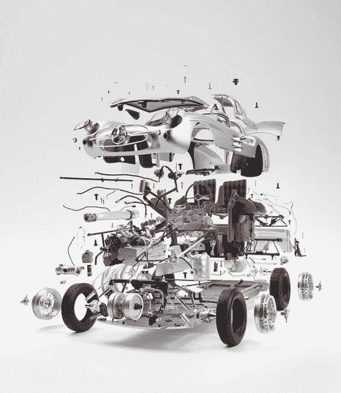
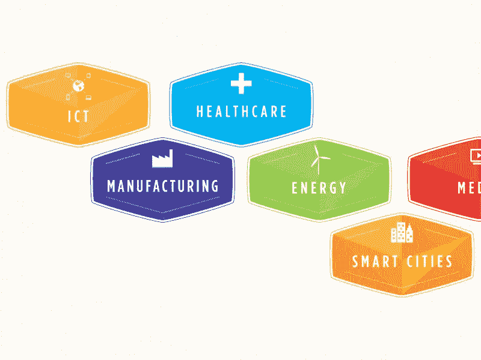
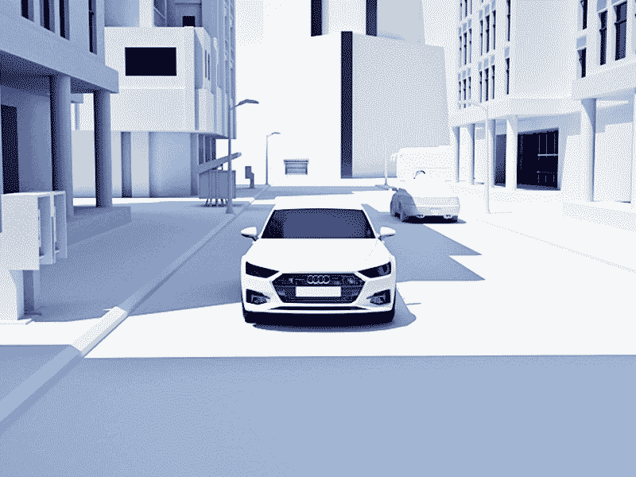
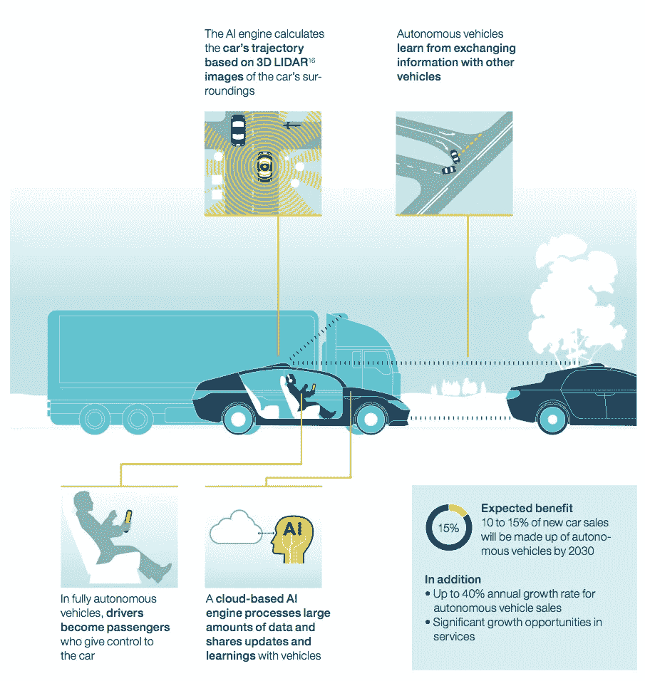

# 艾。新卓越工程的支点

> 原文：<https://medium.com/swlh/ai-the-fulcrum-of-new-engineering-excellence-52bfd5345303>

Dark Side of Typography

A *我的研究主导着每一个传统行业。怀疑和忽视的时代已经过去了。每个企业的未来都是迷人的。包括重型机械制造业。在这篇文章中，我们探讨了自动交通的人工智能研究领域，更重要的是，它对每个现代数字企业家都很重要的原因。*

今年，苹果实现了历史性的飞跃，成为首家市值突破 1 万亿美元的美国上市公司。这一成就已经被更大的外国公司解锁，但谁在乎呢。性感的不是身家一万亿的事实。而是苹果不是传统意义上的硬件工程公司这一事实。当然，它生产设备，但并不局限于其生产设施。苹果从任何地方采购所有东西，直到产品在哪里制造变得微不足道。重要的是它们被设计的地方。

苹果的思想领导力、标志性的设计和卓越的营销方式都由巨额资金注入和完全的独立性提供动力，这使得这个库比蒂诺的巨人无与伦比。

> *如果你的全球化和模块化供应链没有任何限制，那么什么可能会阻止你提供更多更好的产品呢？*

这让传统行业进入了一个不同的视角。如果没有飞离实体生产设施的能力，他们如何支持创新？在生产量更少但意义更大的制造业中，有没有优化生产的方法？人工智能技术在传统国家的传统行业中有什么作用？

# 精湛的工程濒临灭绝

如果整个国家的声誉能够受到它所诞生的公司的影响，那么这些公司就是一些杰出的公司。如果我们想到德国工程，我们指的是卓越。德国的工业增长植根于过程的解构、精密工程和人力资源管理。一些事情极大地推动了这个国家最优秀的制造品牌的发展。那就是创新。

德国的设计和生产开创了汽车工业。其他重型机械制造商紧随其后。除此之外，德国制作公司经受住了多重危机，表现出了巨大的弹性，你会看到这是一部依靠纪律和奉献精神的艰苦发展的编年史。

图片来源:Fabian Oefner

这种工作流程成为了一种传统。随着时间的推移，它获得了新的能力，随着与硬件生产方法和材料相关的现代技术的发展而演变，但没有破坏性，非正统，太投机。德国制造业仍然非常传统，抗拒变革。它采取了一项名为工业 4.0 的政府举措，以启动急需的未来技术运动。

德国汽车工业专注于卓越的工程和生产。今天，你很难对德国汽车在这方面的不完美提出异议。然而，下一件大事不是平稳运行 10+年的可靠汽车。

> 相关领域技术创新的快速发展也对汽车行业产生了同样的期望。

尽管日本和韩国汽车集团正在系统而有效地利用纯工程优势，但有一个领域提供了最多的机会，也最具挑战性。自动驾驶汽车和其他自动驾驶汽车需要一种完全不同方向的有点冲突的外观——软件。

# 数字颠覆是不可避免的，也是必要的

软件是你不能仅仅依靠纪律和一丝不苟来构建的。如今，一台好的机器需要交互功能和自己操作的能力。作为这种操作核心的人工智能依赖于机器学习和数据管理。这些类别对于硬件制造商来说尤其令人困惑，因为它们没有展示任何有形的价值。这使得德国汽车公司不愿意资助人工智能应用研究。

世界上所有伟大的(也许是最伟大的)德国汽车工程都有可能走上成为一家以客户为基础的公司的齿轮的道路。苹果的供应链是一个由你从未听说过的伟大公司组成的复杂网络。

> *同样，美国公司拥有的人工智能汽车初创公司可能会压倒欧洲制造商，将他们从曾经的竞争对手变成供应商。*

这并不是说没有进展，但很大一部分进展被立法(优步禁令)、过时的公司领导模式、官僚障碍和缺乏协调拖慢了。最重要的是，创新文化是流行文化，2015 年的大众争议没有增加公众对该品牌的信任。因此，该公司必须加倍努力重新赢得信任，并[引入新的价值](https://www.economist.com/business/2018/03/01/german-cars-have-the-most-to-lose-from-a-changing-auto-industry)。想想所有可以用于研究和创新的资源。

Image credit: [Britton Stipetic](https://dribbble.com/bdstipetic)

# 传统领导模式已经过时

建立可靠和可信的管理的方法之一是在企业内部发展它。通过逐步提升员工，你得到了一个传统的决策过程和继承的运作。然而，作为当今创新驱动力的创业文化并不依赖于传统的领导。

当一切都与积极招聘有关时，美国科技初创公司的员工更关注愿景和价值，而不是业绩历史和经验。与此同时，德国的劳动法是高标准的，本应是一个社会奇迹，但在当前的背景下却是缓慢的。更难解雇员工，这为表现不佳(移民劳工道德问题)和缺乏紧迫感提供了机会。

# AI 辐射进化

人工智能的核心在于足够强大的计算机不断学习的能力，而无需人类鼓动每一种环境。德国现在的自动化水平足够高，可以照顾机械劳动，完全取代人类，赋予他们创造性和分析性的工作。然而，有了人工智能，就有机会取得这样的进步，而这在几年前还是不可能的。

> 我们谈论的是自然语言处理、视觉对象识别、智能空间推理等等。

德国经济是半个欧洲大陆的驱动力，拥有巨大的人工智能发展潜力。事实上，手头没有太多其他选择能够击败人口快速老龄化和与美国的潜在贸易战的耻辱。超越机械劳动的自动化是德国未来称霸的关键。

无论行业及其复杂的细节如何，人工智能都可以提高生产率。汽车行业是早期人工智能采用的最大受益者之一。任务的高度可预测性、相当缓慢的材料技术发展以及愿景不仅可以提高生产率，还可以为传统上与数字颠覆无关的品牌打开新市场。

# 崛起中的智能制造

也就是说，颠覆不一定是极端的。我们相信成为未来制造商的方法之一是拥抱*智能制造*。智能制造使用连接、传感、实时协作、学习分析、业务数据研究和处理以及环境信息来实现制造各方面的集成和优化。

> *智能制造有三大支柱:人、管理和技术。*

人工智能技术的发展为智能制造新模式和系统的创造注入了新的活力。新意味着集成、数字化、智能、绿色和灵活。如果所有这些模型都集成到一个制造生态系统中，它就可以称为智能。

Image credit: [Bene](https://dribbble.com/Bene)

# 人工智能的工业潜力

既然我们从汽车行业开始，让我们坚持这个话题，考虑人工智能在产品构思、制造和商业价值方面产生影响的机会。自动驾驶汽车被认为将在 2030 年成为最安全的通勤方式。总销量预计将超过全球汽车销量的 15%。这将需要大量的数据收集、处理和算法实现。建立一个人工智能并教授它人类生活的领域是未来的长期目标。换句话说，

> *汽车的未来不在工厂车间，而在计算机实验室。*

自动驾驶汽车的潜力远远不止无人驾驶出租车和汽车共享服务。人工智能驱动的车辆将重塑物流运作的方式。像汉堡和多特蒙德这样的物流中心将处于这些变化的前沿。自动高效卡车和无人驾驶货运无人机将重新定义供应链，更加强调交付的质量和及时性。

# 自动驾驶汽车

最大的社会影响来自于 AI 对个人交通工具的应用。自动驾驶汽车被广泛认为是人类移动的未来。尖端汽车行业领导者的努力是重新考虑辅助驾驶的解决方案，并将其转变为自动驾驶。

现有的高级驾驶辅助系统大多基于面向规则的编程，这是一把双刃剑。一方面，手动场景输入在很大程度上是准确和无歧义的，另一方面，你可以投入的时间和精力只有这么多来记录交通状况的多样性。

> *在一套完整而明确的行为规则中，整体交通安全是可能的，而这是给定的人性所无法做到的。*

Image credit: [Gleb Kuznetsov](https://dribbble.com/glebich)

最重要的是，基于规则的驾驶系统不利用从雷达、摄像头和其他传感器接收的处理过的数据。到目前为止，只有人类有可能处理这种类型的信息，这使得自主交通的唯一想法变得微不足道。

为了完成向自动驾驶汽车的过渡，制造商必须采用机器学习等现代人工智能开发技术。对于一些基于规则的系统，人工智能驱动的模块已经成为可靠的替代品。除了谷歌和特斯拉，走在曲线前面的是 Argo.ai、Drive.ai、nuTonomy 等自动驾驶初创公司。他们专注于在四个大方向上构建由人工智能驱动的学习系统:

*   传感
*   数据处理
*   规划
*   受过训练会玩把戏的

所有这些都需要大量分析和生产计算能力资源。由于没有清楚地了解人工智能必须学习多少场景才能开始做出 100%正确的决定，因此很难规划安全的自动驾驶汽车系统的基础设施。

> 从技术上来说，每辆车的计算能力都可以用来为常识做贡献。区块链 AF。

在这种情况下，我们可以完全排除经常导致驾驶过程中断的人类判断，让人工智能系统在机器对机器的交互中解决它。在自动驾驶汽车成为公认的现实之前，在研究、开发和客户准备方面还有很多工作要做。这是主要品牌和汽车集团可以找到他们的甜蜜点。

汽车行业的巨头们有这个名字，但是他们太重了，不能像市场需要的那样对变化做出快速反应。与此同时，自动驾驶初创公司努力在大多数人不信任的方向上建立声誉。两个世界的协同是未来的所在。等待高度自主的汽车将私人拥有的汽车挤出市场并不是一个明智的策略。相比之下，如果私人汽车和公共汽车之间的界限变得模糊，您会希望站在进步的一边，而不是捍卫传统的工作流程。

Image credit: McKinsey Global Institute

2030 年后，自动驾驶汽车销量的预计年增长率为 40%。这种动态迫使今天的市场领导者重新评估他们的商业模式、生产设施以及人工智能研究和新技术开发的财务资源分配。

> *这一变化有助于避免美国公司主导自动驾驶的研究和实验，从而导致全球市场停滞和垄断。*

对于大多数不一定参与人工智能开发的科技公司来说，潜力可能在于为自动驾驶汽车提供的额外服务，一旦大规模接受将数字企业主的头脑转向人工智能运输，这些服务肯定会存在。

卓越的工程不能成为过去的荣誉。它是动态的，移动的，极其敏感的。昨天，耐克公司通过一个在网上疯传的广告宣布了与科林·卡佩尼克的合作。结尾是“除非你去做，否则这只是疯狂。去做就是了。”

我们在 Shakuro 还没有弄清楚如何开始制造人工智能引擎。一些能把石头刻成花的最伟大的制造商不知道如何给它注入生命。一百多年前，汽车还不存在。今天，我们想知道我们每个人能做些什么来让这个行业变得更好、更安全、更酷。让我们不只是见证探索现实边界的最伟大时代；让我们成为它的一部分。

## 这篇文章发表在 [The Startup](https://medium.com/swlh) 上，这是 Medium 最大的创业刊物，有+367，349 人关注。

## 订阅接收[我们的头条新闻](http://growthsupply.com/the-startup-newsletter/)。

