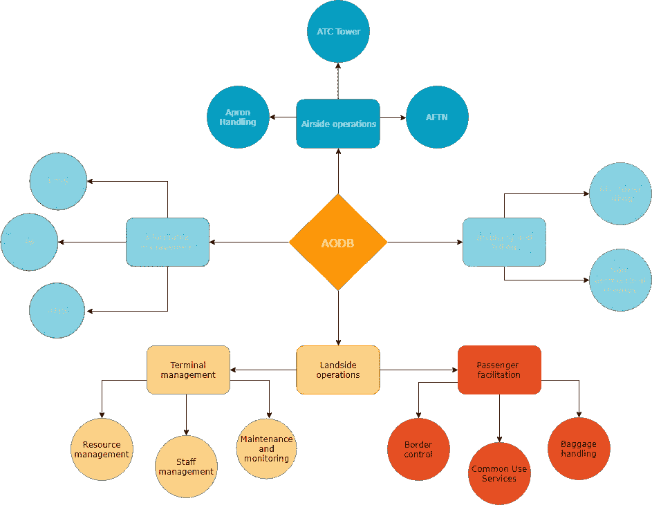
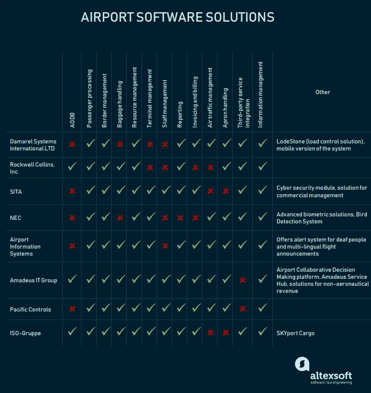
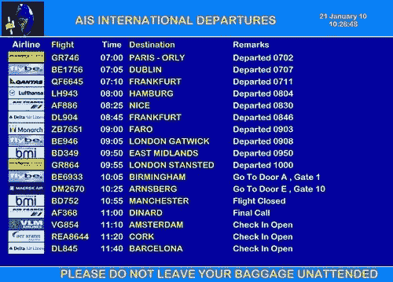

# 机场技术管理:运营、软件解决方案和供应商

> 原文：<https://medium.com/swlh/airport-technology-management-operations-software-solutions-and-vendors-5e5faef71a52>

想象一个机场。首先想到的是什么？巨大的候机楼、信息显示屏、长长的队伍、行李认领传送带、等待加油和即将起飞的到达飞机。机场的航班时刻表很紧，包括相关的员工管理、乘客处理、对细节的关注等等。机场自动化加快了流程，提高了服务质量。

我们提出了使航空公司运营现代化的最佳实践，并把我们的才能用于 T2 的美乐航空公司，T4 的先进航空管理公司。在本文中，我们将详细介绍主要的机场运营，以及集成软件解决方案如何促进这些运营，并描述一些主要供应商提供的集成机场管理套件。

我们的文章由两个主要部分组成:主要机场运营的概述，以及市场上一些最广泛使用的解决方案的描述。如果你知道基本知识，就跳过第一部分，直接进入第二部分。

# 机场运营

在我们学习软件之前，让我们先从主要的机场操作开始。它们可以分为四种类型:陆侧运行、空侧运行、计费和发票以及信息管理。

陆侧运营旨在为乘客提供服务，维护航站楼、停车设施和交通环形车道。乘客操作包括行李处理和标记。码头运营包括资源分配和员工管理。

**空侧操作**包括飞机着陆和导航、机场交通管理、跑道管理和地勤安全。

**开票和发票操作**涵盖航空和非航空收入。分类账或会计系统包含有关机场财务的信息:航班账单、处理发票、现金、机场内销售额(销售点)、员工工资单等。

**信息管理**涉及每日航班信息的收集和发布，季节性和到达/离开信息的存储，以及与航空公司的联系。

机场软件通常被称为机场管理系统，用于优化所有这些操作:乘客处理、行李标记和处理、到达/离开操作、离开控制系统、信息分发和空中交通控制(ATC)。Airport 软件还可以包括其他解决方案，如 CRMs 和环境管理系统。让我们仔细看看机场管理软件的模块。

# 机场管理软件模块

机场管理系统通常有以下大部分模块，但不限于此。

*Airport software system*

## 机场运行数据库(AODB)

**软件提供商:** Amadeus IT 集团，Leidos，SITA，Rockwell Collins，Siemens

每个机场都有自己的中央数据库，用于存储和更新所有必要的数据，如每日航班、季节性航班、可用资源以及其他与航班相关的信息，如账单数据和航班费用。AODB 是机场运行的一个关键特征。

该数据库与机场的其他模块相连:机场信息系统、收入管理系统和空中交通管理。该系统可以为不同的用户提供不同的信息:乘客、机场工作人员、机组人员或特定部门、当局、商业伙伴或警察的成员。AODB 在图形显示器上显示信息。

AODB 功能包括:

*   参考数据处理
*   季节性调度
*   每日航班时刻表处理
*   付款的处理

这个数据库保存的最重要的信息是季节时间表。它显示一个季度的商业航班信息。通常，它包含航班代码、飞机类型、预计到达和离开时间、多站航班、一周中的运营日、例外日期以及其他相关信息。手动输入或下载的这种信息分配诸如到达或离开门、登机桥和停机位、登记台的资源。

虽然 AODB 是独立的，不属于任何操作，但它是机场的支柱。存储在 AODB 中的信息有助于规划和分配机场的实物和金融资产。

## 陆侧作业

**软件提供商:** SITA，Rockwell Collins，NEC，ISO-Gruppe。

该模块执行的操作包括航站楼操作和航空公司离港控制:乘客登记、海关、行李处理、安检等。一些机场有自动生物识别控制系统。乘客数据被纳入边境管理系统，使相关人员能够在数据库中检查乘客。让我们看看集成到机场管理软件中的服务。

**旅客便利** **服务**包括旅客处理(办理登机手续、登机、边境管制)和行李处理(贴标签、卸货和搬运)。他们跟着乘客走向班车，把他们带到他们的航班上。抵达操作包括登机控制和行李处理。

**边境管制** **(海关和安全部门)**。在机场，安全服务通常包括周边安全、终端安全和边境控制。这些服务需要生物特征认证并集成到政府系统中，以允许海关官员查看乘客的状态。

**行李处理。**很明显，乘客必须在行李上飞机前检查它。行李装载的时间被显示和跟踪，直到到达目的地，行李被归还给主人。

**常用服务(自助值机系统)。**机场必须保证客流畅通。各种各样的数字自助服务(如登机亭或自动自助服务门)让这一切成为可能。自助服务选项，尤其是值机亭，仍然很受欢迎。在 2018 年的全球范围内，乘客在 88%的时间里使用自助服务机检查自己。

*Self-boarding gates at Gatwick Airport*

其他陆侧模块包括:

**终端管理。**软件包括资产、建筑、电网、环境系统和垂直运输组织的管理系统的维护和监控。它还有助于员工沟通和管理。

**员工管理。** Staff 模块提供有关机场正在进行的流程的必要信息，例如航班数据(采用 ICAO 或 UTC 格式)和其他重要事件，以便负责的工作人员了解最新情况。信息通过 airport 无线电系统发布，或显示在通过 airport LAN 连接的 PC 或移动设备上。

**报道。**该模块允许工作人员在屏幕或印刷品上查看数据，以了解正在进行的流程对业务决策和机场整体运作的影响。此外，它可以包括来自航空公司、飞机、运营商、乘客和飞机的每小时活动、运动类型等的报告。它们包括飞机的时刻表、路线和目的地，以及交通分布。

## 空中交通管理

**软件提供商** : AIS、Adacel、Transoft、Pacific Controls、SITA

空侧运行包括控制和促进飞机操作和停放。这包括空中交通管制设备和空中导航管理解决方案。大多数空侧解决方案都面向航空学和飞机分配。

**航空固定电信网络(AFTN)系统**。AFTN 系统处理通信和数据交换，包括导航服务。通常，机场交换交通环境信息、安全信息、关于天气的信息、地理材料、中断等。它们是机场和飞机之间的通讯工具。

航空电信软件存储以 ICAO 格式和 UTC 格式输入的飞行计划和飞行信息。存储的信息可用于规划和统计目的。对于机场而言，了解飞机类型及其重量以将其分配到跑道上的正确位置非常重要。AFTN 系统包含以下信息:

*   飞机注册
*   使用的跑道
*   实际着陆和起飞时间
*   电路数量
*   方法的数量和类型
*   到达和离开的新估计
*   新航班信息

空中交通管理是由空中交通管制塔台执行的。

**空管塔台。**空中交通控制塔是一个提供飞机空中和地面控制的建筑。它通过引导和导航车辆和飞机来确保安全。它是通过空中和地面的可视信号、雷达和无线电通信来完成的。塔台的主要目的是确保所有飞机都被分配到正确的位置，乘客没有危险，并且飞机会在停机坪上分配一个合适的乘客登机桥。

空管塔台有一个控制室，作为机场陆侧(航站楼)和空侧操作之间的通道。控制室人员的任务是确保乘客的安全和地勤服务。通常，一个控制室有闭路电视监视器和空中交通管制系统来维持航站楼和停机坪的秩序。

**围裙搬运**。停机坪或地面服务处理飞机服务。这包括乘客登机和引导、货物和邮件装载以及停机坪服务。停机坪服务包括飞机引导、清洁、排水、除冰、餐饮和加油。在这一阶段，软件有助于处理有关行李和货物重量、乘客人数、登机桥停车和必须提供给飞机的地面服务的信息。通过将这些信息输入到系统中，他们的成本可以通过计费系统进行计算并开具发票。

## 开具发票和账单

**软件提供商:** Amadeus IT 集团、AIS、Damarel 系统国际有限公司

机场处理的每一个航班都会为机场产生一笔固定的收入，由运营飞机的航空公司支付。航空发票系统使得任何类型和大小的飞机都可以付款。它接受多种货币的现金和信用支付。收费也延伸到空中交通管制服务。

根据飞机类型和重量以及所提供的地面服务，机场可以计算航空费用，并开具带账单的发票。它是使用以下数据计算的:

*   飞机注册
*   机场停车时间
*   机场出发和/或降落点
*   不同入境点或出境点的时间
*   数据是从 ATC 输入或整合的。根据这些信息，机场计算费用并发送账单。

**收入管理**。非航空收入管理系统由会计系统、商业智能、工资单和来自机场地勤服务的收入组成。

信息管理—机场信息系统(AIS)

**软件提供商:**罗克韦尔柯林斯、西门子、超电子控股、Amadeus IT 集团、SITA。

此类别包括从机场周围收集、分发和更新信息的所有类型的软件，包括公共广播系统和航班信息显示系统(FIDS)。他们接收来自航空公司和航站楼的数据，以及必须发送给乘客的到达时间和登机口的数据。但是，它们也可以显示营销信息或任何其他与航班无关的类型，例如天气或新闻广播。

机场信息系统包括航班信息显示系统(FIDS)、机场广播或公共广播(PA)系统以及自动终端信息服务(ATIS)。

**航班信息显示系统(FIDS)** 显示登机状态、登机口、飞机、航班号和其他航班信息。一台电脑控制着与数据管理系统相连的屏幕，实时显示航班的最新信息。一些机场以应用程序的形式或在他们的网站上有一个数字 FIDS。此外，显示器可以显示其他公共信息，例如天气、新闻、安全信息、菜单和广告。机场可以选择输入信息的类型、语言和方式，无论是手动输入还是从中央数据库加载。

**机场广播系统或公共广播(PA)系统**通知乘客和机场工作人员任何重要的变化和流程，例如登机口、到达时间、呼叫和警报。此外，信息可以传达给飞行员，飞机工作人员，机组人员等。PA 系统通常包括通过扬声器广播的语音信息。

**自动终端信息服务(ATIS)** 为飞行员和机组人员广播天气预报、跑道状况或其他当地信息。

一些 airport 软件供应商提供现成的解决方案来促进特定任务，如维护或机场运营。然而，它们中的大多数提供了集成的系统，该系统包括用于几个操作的模块。让我们来看看其中的一些。

# 机场管理软件解决方案和供应商

一个小的旅行中断会造成严重的后果。由于机场是一个大型结构，需要同时跟踪、处理和维护许多程序，因此与多个软件程序混杂在一起相比，集成解决方案是管理的一个好选择。

*Integrated airport software solutions*

## 达马雷尔系统国际有限公司

[达马雷尔系统国际公司](https://www.damarel.com/)为航空公司和机场运营提供软件解决方案。机场软件解决方案涵盖乘客处理、地面服务和信息系统。

FiNDnet Suite 是一个基于云的机场航站楼运营解决方案。它包括会计和飞行信息系统以及收入和管理模块。套件模块包括:

用于地面操作的 **FiNDnet 操作**和 **FiNDnet 分配**

**FiNDnet 服务、FiNDnet 收入、FiNDnet 计费**用于计费和收入管理

**FiNDnet 资源**和 **FiNDnet 需求规划**进行资源规划和分配

**FiNDnet Mobile** 用于模块软件应用

**FiNDnet 仪表盘**

**FiNDnet FIDS**

此外，该供应商还提供边境控制解决方案 Vanguard 和 Aura、支持自助登机口的乘客登机解决方案 [Embark](https://www.damarel.com/products/embark-passenger-boarding-solution/) 及其移动版本 EMBARKmobile、负载控制解决方案 LodeStone，以及支持本地航空公司应用程序在通用平台上运行的中间件解决方案 Babel ZIP。

Damarel 系统解决方案符合第三方管理系统、通用终端设备(CUTE)和通用乘客处理系统(CUPPS)的要求。根据机场要求，可以定制软件。

## 罗克韦尔柯林斯公司。

[罗克韦尔柯林斯公司](https://www.rockwellcollins.com/Products-and-Services/Airports.aspx)为机场自助服务、行李处理、员工管理以及陆侧运营提供解决方案。罗克韦尔柯林斯公司的解决方案可以很容易地集成到机场已经使用的现有系统中。该解决方案在云和内部都可用。

机场 ARINC 套件提供以下模块:

**ARINC AirDB** —罗克韦尔柯林斯 AODB 公司，用于数据存储、网络集成和信息管理。

**ARINC SmartBag，BagLink，BagMatch，ExpressCheck，**和 **ExpressDrop** —行李处理系统**。**

**ARINC SelfServ，ARINC 自动护照控制(APC)信息亭** —带生物识别身份管理的旅客便利解决方案。登机亭集成了护照读取设备、读卡器、安全摄像头、生物识别系统，并允许旅客标记他们的行李。罗克韦尔柯林斯通用系统具有多用户系统环境(MUSE)应用。

**ARINC 边境管理解决方案**和 **ARINC 电子边境** —边境控制和海关管理解决方案。

ARINC AirPlan —规划和资源分配解决方案。

ARINC AirTQM —周转管理解决方案

**ARINC AIM 物理安全**和 **ARINC VeriPax** —安全解决方案。

## 悉多

[SITA](https://www.sita.aero/) 是全球 1000 多家机场使用的航空软件的领先供应商。SITA 为机场商业管理提供解决方案。SITA 的机场解决方案基于云，涵盖乘客处理、边境控制、网络安全、商业智能、机场运营、市场营销、当日旅行服务和近场通信(NFC)。SITA 解决方案在移动模式下可用。

SITA 的机场解决方案包括:

**机场商业管理** —员工管理、机场收入管理、市场营销、旅客处理、数据管理和商业智能的解决方案。

**机场运营** — SITA ControlBridge 从一个地方策划所有运营。这包括容量规划、插槽管理、资源管理和信息管理(PA systems，FIDS)。

**行李处理** — SITABagDrop，用于行李托运、追踪和找回以及支付。

**企业管理** — SITA 机场 MSI(主系统集成)监控航站楼的建设和运营。它包括一个安全监控模块。

**信息和基础设施管理** — SITA 的机场基础设施管理套件包括数据保护模式、运营信息、SITA Connect 和 SITA CyberSeciruty。

**乘客处理** — SITA 智能通道，配有机场自助服务门和条形码阅读器，以及生物信息处理和电子护照读取。

## NEC 空中交通管制和机场系统

为十多个行业提供解决方案的日本厂商 NEC 是生物识别技术的领导者。他们的机场解决方案包括民用航空解决方案，包含以下模块:

*   机场通信
*   监视(机场监视雷达、二次监视雷达)
*   空中交通管制(移动式雷达管制系统和自动雷达终端系统)
*   机场运行(FIDS、鸟类探测系统、停机位管理系统)
*   登机控制。

NEC 的生物习语解决方案 NeoFace 为机场提供生物识别。这种不可变的身份验证使用以下方式建立身份:

*   人脸识别
*   虹膜识别
*   指纹和掌纹识别
*   手指静脉识别
*   声音识别
*   人耳声学认证

*NEC’s airport biometric authentication gate solution*

## 机场信息系统

[AIS](http://www.airport-information-systems.com/products.aspx) 提供了一个将 FIDS 的信息链接到机场网站的解决方案。供应商还提供其燃油系统，可手动输入已售油和销售分析报告。该软件接受通行证卡。

*AIS Flight Information Display
Source:* [*AIS*](http://www.airport-information-systems.com/products/airport-flight-information-display.aspx)

*   机场航班信息显示
*   机场运营(机场着陆费信息)
*   空中交通管制
*   停机坪管理
*   带现金发票的空中交通管制飞行计费系统
*   处理代理系统
*   会计
*   报告(时间表、交通分析报告、运营和每小时活动)
*   登机控制(安全哨兵和大门守卫)。

登机控制解决方案支持 2D 条形码扫描仪、用于网络登机牌的 M1 式条形码和用于自助登机卡的 S 式条形码。此外，安全哨兵允许乘客处理他们的行李。这些模块有一个报告工具。

AIS 与 [AVIAVOX](http://aviavox.com/#watch-our-video) 合作，提供与 FIDS 实时更新的多语言航班公告，以及为聋人和重听人显示航班信息的[聋人警报器](http://www.deaf-alerter.com/)信息系统。

## Amadeus IT 集团

作为领先的旅行软件解决方案提供商之一， [Amadeus IT Group](https://amadeus.com/en/portfolio.airports) 为机场提供 IT 产品。除了陆侧和空侧管理解决方案，Amadeus 还提供非航空收入(乘客销售和广告)和机场协作决策(A-CDM)解决方案。

Amadeus 根据机场决策平台提供自己的 AODB。Amadeus 的另一个产品是周转管理解决方案，可以跟踪机场从登记到地面操作的所有流程。

Amadeus 解决方案:

阿玛迪斯·FIDS

**Amadeus 虚拟机场管理系统(VAMS)** —空管塔台解决方案

**Amadeus 资源管理系统，Amadeus 固定资源管理系统(F-RMS)** —资源管理解决方案

**Altéa Suite** —乘客处理系统

**Amadeus 行李核对解决方案(BRS)** —行李处理解决方案

**阿马德乌斯机场序列经理** —地勤解决方案

**Amadeus PROPworks** —支付和管理工具

此外，Amadeus 为机场客户支持培训提供了一个解决方案 Amadeus 服务中心:机场员工可以在这里找到必要的信息。

## 太平洋控制公司

[Pacific Controls](http://pacificcontrols.net/solutions/airport-automation.html) 为机场自动化开发了融合综合机场解决方案(CIAS)。这些解决方案涵盖所有机场运营，包括建筑物和飞机的安全和安保。不同的系统汇聚在一个基于 IP 的平台上，该平台使用开放标准协议(如 BACnet、LonWorks、EIB、OPC、XML/SOAP、SNMP、Modbus/TCP)促进数据移动。该系统的灵活性允许用户在将来添加更多的系统。

CIAS 是一个集成系统，将以下模块整合在一个解决方案中:

*   报告、规划、数据管理(机场业务)
*   空中交通管制、乘客便利、行李处理、货物和运输运营、FIDS、资源控制(机场运营和维护)
*   终端和现场报警、闭路电视、出入控制(机场安全)
*   警报、座位监控、现场警报(机场安全)
*   机场通信

## ISO-Gruppe SKYport

德国供应商 [ISO-Gruppe](https://www.iso-gruppe.com/en/iso-software-systeme/services/airport-management.html) 为机场管理提供集成的基于云的解决方案软件——sky port 机场管理套件。该解决方案涵盖空中交通管理、停机坪管理、航空计费、报告、货物和协作决策(CDM)。SKYport 拥有适用于平板电脑和其他便携式设备的移动版本。CDM 模块的特点是管理和监控飞机操作，并为机场工作人员提供一个交流平台。

SKYport 包括:

**机场运行数据库(AODB)**

**SKYport 客户门户** —航班信息与机场网站整合的模块

**SKYport Connect** —用于与第三方系统集成的模块

**SKYport 报告**—HTML、XML 或 XLS 格式的综合报告

**sky port Business Intelligence**—整合计费系统数据并创建报告的模块。BI 的另一个模块是 SKYport BI for SAP，它创建官方流量统计数据，并在 Web 或 Excel 中比较数据。商业智能模块执行战略规划并分析不同的场景。

**天港货运**用于货物装卸

**SKYport 资源** —用于分配固定资源管理的模块(登机口、停车位、行李传送带)。

**SKYport 活动** —员工管理和任务分配模块

**FIDS 天合机场** —集成网络服务(天气、广告、新闻流)的航班信息显示

# 一锤定音

无缝客流、最新信息和空中交通管理是机场成功运行的关键。全球技术发展影响着机场，创造了新的机遇和挑战。据 SITA 报道，未来三年，机场 IT 运营将专注于客户服务、信息技术和网络安全。让我们简要地看一下这些趋势的未来:

**面部识别和生物特征 ID 管理。**77%的机场计划在未来三年内启动生物识别 ID 管理项目。

**旅客自助服务解决方案**。这些不仅包括乘客登机亭、自动登机口、行李托运和智能跟踪，还包括机场信息系统的移动集成。

**人工智能和预测分析**。航空公司已经在运营中使用人工智能和数据科学。几乎 80%的机场也在客户服务中使用它们，或者计划在不久的将来将它们用作虚拟代理和聊天机器人，用于广告、个性化、机场和航班状态信息以及品牌认知改善。

**乘客识别中的区块链。**到 2021 年，34%的机场将使用区块链来简化乘客身份识别流程。

*照片由* [*埃里克·卡里姆·科内利斯*](https://unsplash.com/photos/QEh7kSRzTPg) *上的*[*Unsplash*](https://unsplash.com/?utm_source=unsplash&utm_medium=referral&utm_content=creditCopyText)

*原载于 AltexSoft Tech 博客**[***机场技术管理:运营、软件解决方案和供应商***](https://www.altexsoft.com/blog/travel/airport-technology-management-operations-software-solutions-and-vendors/?utm_source=MediumCom&utm_medium=referral)*

****

## **这篇文章发表在 [The Startup](https://medium.com/swlh) 上，这是 Medium 最大的创业刊物，有+397，714 人关注。**

## **订阅接收[我们的头条](http://growthsupply.com/the-startup-newsletter/)。**

****