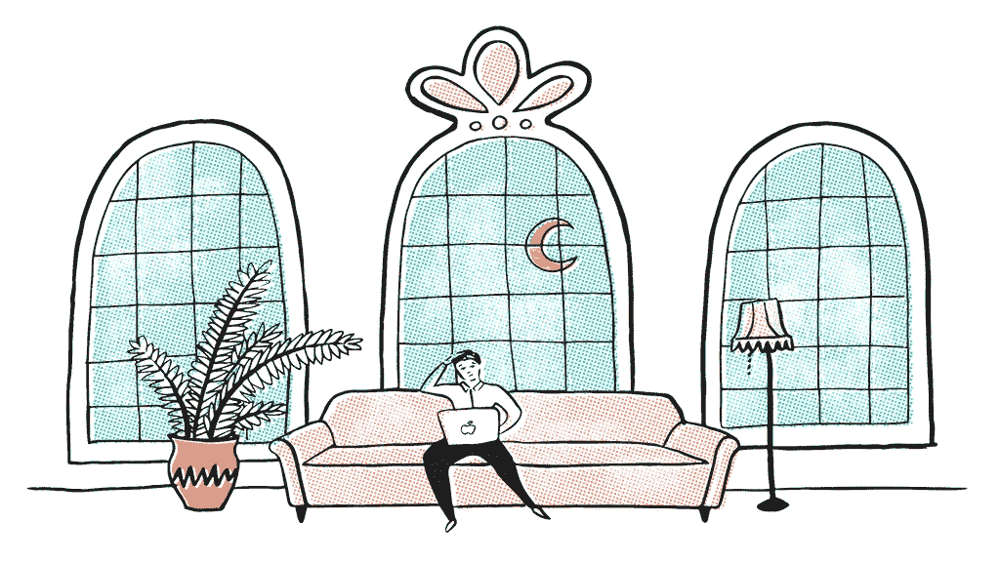

# 阿尔伯特·爱因斯坦和雷伊·达里奥——智慧之旅

> 原文：<https://medium.com/swlh/albert-einstein-and-ray-dalio-and-the-journey-to-become-intelligent-ce6b2ae2df47>

> 真理——更准确地说，对现实的准确理解——是产生好结果的重要基础雷伊·达里奥

直面你的恐惧是很难的，批判性地面对最初引发恐惧的残酷事实更难。

为什么我们很难面对真相这样简单的事情？尤其是知道我们会被赋予力量，在更好的位置上提高自己，即使这是一个弱点。

感觉并不总是理性的，正如我们从经验中所知，当我们面对它们时，恐惧会立即消失。

开始时紧张的公共演说家，直到他/她渐入佳境，变得自信起来。

或者直面拖延症，并因为克服了它而自我感觉良好。

恐惧充斥着我们的生活，比我们知道的要多得多，让我们难以克服恐惧，甚至更难有效地引导我们积极成长和发展。

恐惧大师，意识到它的力量，能够为自己超越它，并从一个情境、一个人或一次经历的字里行间读出。

这是无条件激情所需要的基础。在更原始的基督时代，一个人需要极度的无畏才能想出:

> *“宽恕他们吧，神父，因为他们不知道自己在做什么。”*

对于一个[光晕幸存者来说，看着自己的家庭被亵渎需要更多的时间，几年后，当发现一名员工偷他的东西时，即使他是一个慷慨的雇主，他仍然宣布](https://www.ted.com/talks/ben_dunlap_talks_about_a_passionate_life?language=en):

> *“人性本善。”*

如果他们能做到，我们当然也能在今天的奢华环境中做到。

我们感受到的压力可能会引发与过去相同的情绪，所以我明白，但我们要意识到，它们在数量上没有可比性。世界是相对的，我们对它的感知是基于我们生活的时代。

我们今天都很幸运。

让我们承认，如果我们没有直接遭受痛苦，没有受到外界力量的影响，没有挨饿，我们就过着奢侈的生活。

你可能想知道为什么到目前为止我一直在一篇关于智力的文章中谈论恐惧和感觉。这是因为根据麻省理工学院的马克斯·泰格马克博士的说法，在个人生活的背景下，定义智力的最实用的方法是在长时间内完成复杂的目标。

在我们的日常生活中，目标需要日复一日的决定，从一种情况到另一种情况，从一个人到另一个人。

是什么驱使我们做出大多数决定？恐惧。

我相信，白手起家的亿万富翁、有史以来表现最好的对冲基金经理雷伊·达里奥会同意这个定义，他在书中给出的原则是:

> “真理——更准确地说，是对现实的准确理解——是产生良好结果的重要基础。”

因此，绝对真理和实现目标可以建立关联。

**你越是寻求艰难而痛苦的真理，你就会变得越聪明。你越回避痛苦的事实，或者更糟的是，否认它们，你就越不聪明。**

今天，获胜的意愿往往比客观地看数据更重要。

这将使我们变得太愚蠢，无法对#MeToo vs. #HimToo 或种族主义等话题进行批判性讨论，因为它与警察暴行有关，以及人们可以做些什么来摆脱贫困并过上幸福的生活——这是最重要的事情。

你要么支持一边，要么反对一边，甚至到了无法进行对话的地步。

这种情况必须停止，我们将会变得更聪明，为了变得更聪明，我们需要说出真相，不管这有多伤害我们的感情。

**教育和智力——有什么区别，为什么重要？**

> 教育是你可以用来改变世界的最强大的武器纳尔逊·曼德拉

1983 年，发展心理学家哈沃德·加德纳描述了 9 种智力类型:

*   自然主义者(自然智能)
*   **音乐剧**(声音智能)
*   **逻辑-数学**(数字/ **推理**智能)
*   **存在主义**(生活智慧)
*   **人际关系**(人聪明)
*   身体- **动觉**(身体智能)
*   **语言学** (word smart)

由于它们与我们对智力的定义有关，我们将重点关注*存在性*(生活智能)、人际交往(人际智能)以及一点身体和语言方面的知识。

因为最终复杂的目标是在与人最佳合作和社会地位上升时实现的，最理想的是因为你拥有一项技能。

因此，知识就是力量，但如果我们没有应用知识的生活和人际交往技能，我们就无法在复杂的游戏、环境或政治舞台上长时间有效地使用它。

因为缺乏生存智慧而酗酒的老师，或者因为无法克服在竞争激烈的市场中竞争时经常出现的失败恐惧而只能教书的教授。

一个擅长编码的工程师，但是他没有人际智能去同情他的团队成员，所以他们不能

他们仍然被认为是“受过教育的”，但他们缺乏完成复杂目标所需的智力

结果的差异将是大企业家与长期雇员。超级企业家必须具备这种智慧，但长期雇员没有这种智慧也能逃脱。随着赌注的增加，这在更高的级别上变得更加普遍。

那么，为什么有些人的智力如此之高，而有些人却没有呢？

是能力吗？关心？智商？基因？

我们都带着同样的潜力来到这个世界，尽管当我们真正进入这个世界时，当然不会分享同样的环境和条件。

然而，一个又一个战胜困难、克服困难、将障碍转化为意义、将意义转化为美好生活的例子不断出现，无处不在。

我相信这对大多数人来说都太难了，最不幸的是，他们没有开始探索复杂事物的工具。生活很混乱。

是什么让一些人接受巨大的挑战，拥抱问题以获得成长，而另一些人却畏缩不前、萎靡不振？

这是我一直在努力解决的问题，它把我引向了智力这个有争议的话题。

头脑的清白——智力的最低先决条件

真相有时是令人痛苦的。

正如传奇创伤/成瘾先驱 Gabor Mate 博士所说:

"逃避痛苦的企图会制造更多的痛苦."

然而，我们面对的真相越痛苦，我们就越能消除心中的恐惧，解决更多的问题。

不这样做就是为什么我们大多数人生活在否认中，这是一种恐惧和创伤的防御机制。让这变得危险的是，除非我们直面我们的恐惧，否则我们甚至不能开始阻止它们阻碍我们——产生破坏性的力量，超越我们的建设性行动。这当然都是无意识的，因此必须作为一种生活方式有意识地实践来超越。

除非我们“清理我们的行为”并对我们的行为负责，否则我们甚至无法生存，更不用说繁荣了。

这是大多数反复失败的人的问题，不相信自己，破坏他们复杂的目标。当然，我是从经验上来说的，作为一个经历过巨大失败和成功的人——谁的“谷底”时刻表现为认识到否认，一长串大约 50 件我需要清理和面对的事情，这样我的大脑才能平静地运行，让我的潜意识允许我获得我的意识意识所梦想的成功。

除非你停止否认，否则你不配拥有你想要的。

这就是为什么在有史以来最成功的自我提升机构“匿名戒酒会”中，第一步就是去找每一个你做错了的人，消除误会，向他们道歉，或者原谅那些伤害你的人。

所以你的思想可以呼吸，你不会被内疚和自我憎恨所困扰。我现在每周都在这样的清单上划掉一部分，直到成为法医的程度，去掉任何和所有有可能表现为隐藏的破坏行为的负面因素。

***这是超级成功和快乐的秘密。***

他们生活在和平中，没有[的黑暗阻碍他们前进。从爱情和人际关系到工作上的成功，这是第一步，有一个干净的记录——这是智力所必需的。](https://www.youtube.com/watch?v=3FR1VLQc7HM)

阿尔伯特·爱因斯坦(1879 年 3 月 14 日-1955 年 4 月 18 日)在他的最后一本书《我的晚年》中，以同样多的敏感和善良，向所有人指出了一个关于人性的艰难而痛苦的事实:

> “生活在不同国家的人们不定期地互相残杀，因此也是因为这个原因，一个想到未来的人必须生活在恐惧和恐怖之中。这是因为大众的智力和品格比那些为社会生产有价值的东西的少数人的智力和品格要低得多。”

你拥有成为聪明人所需要的清白记录吗？

经过大量的自我反省和自我努力，我最近几年才开始过上智慧的生活——我担心我们的许多同胞没有意识到过上我们敬爱的爱因斯坦所说的智慧生活所需要的深刻探索。

**情报**

一个人如何按照爱因斯坦的方式变得聪明？如果每个人都聪明，世界就不会如此混乱。

首先，世界不会被认为如此混乱，它只是一个事物完全不完美的地方。

是的，有战争，因为我们是一个暴力的物种，但暴力战争正在成为一种过时的外交战略，并在大规模下降。

是的，有种族主义的疯子，但这在主流社会是禁忌，只有在边缘地区才是规范。请注意，仅仅在几千年前(从数十亿年的进化来看)，看到你的部落之外的另一个人，尤其是一个与你肤色不同的人，实际上是想杀人或被杀。

是的，有潜意识的偏见和由此产生的偏见，历史上人们为了金钱奴役他人，所以我们必须等待几代人的时间才能消亡。然而，未来的几代人甚至不会认识到种族是一个问题，因为那也将变得过时，他们将有机会获得如此多的信息，以便能够为自己思考。

那么是什么阻止我们完成复杂的目标(变得聪明)？

没有意识到你的恐惧是如何驱使你的，让你很容易被操纵和散播恐惧。

不聪明的是一开始就过着未经审视的生活，而不是质疑自己是如何生活的，并不断努力改进。

不明智的是认为没有意识没关系，并保持低标准。

不聪明的是认为自己什么都知道，而不是生活在高度饥饿的状态中(不管你有多饱)。

亿万富翁天才史蒂夫·乔布斯说要永远“保持饥饿和愚蠢”是有原因的。人类最伟大的思想家之一苏格拉底说“未经审视的生活不值得过”，这是有原因的。

也许在个人层面上，最热衷于寻求真理和支持自我发展的人是布里奇沃特公司的创始人兼董事长雷伊·达里奥。Bridgewater 是世界上最成功的对冲基金，Dalio 是亿万富翁。它甚至因其“彻底透明”的文化而臭名昭著，有人开玩笑说，在布里奇沃特，除了投资，你什么都可以做。这就是这些原则对 Dalio 的重要性。他们是布里奇沃特的宗教。

达利奥原则的基础是有意识地寻求痛苦真相以努力成长的习惯。正如他在他的章节中所说:“拥抱现实，面对现实”。

> “我养成的最有价值的习惯是用痛苦来引发高质量的思考。如果你能自己养成这个习惯，你就会知道是什么导致了你的痛苦，你能做些什么，这将对你的效率产生巨大的影响。”

关于“知道”,达利奥非常努力地做一名学生，知道正确是多么困难，并且不声称自己什么都知道。他学的越多，经历的越多，就越意识到自己什么都不懂。

这是这个星球上最富有的 100 个人之一，他玩了一个最复杂的游戏，股票市场，并且赢了，他说他知道不要真的相信他什么都知道，他错的比他对的多。

这里有 8 件事可以让你变得聪明。

# 1.让法医生活清洁成为你每周生活的一部分

> 你永远不会上升到你的目标的高度，你只会下降到你的系统的高度詹姆斯清除

生命净化不是一个事件或新年决心，它是永无止境的重复工作。我每周一都专注于此。寻找让你犯错的事情。你在这里花费太多钱吗？你让你的健康在那里下滑吗？列出你生活中想要监控的所有领域，每周检查一次。设定你为之奋斗的绝对最低标准。

# 2.变得非常自觉

发展自我意识，就像你的生活依赖于它一样。

你到底想要什么？

你为什么想要它？

当你得到你想要的东西后，你还想要什么？

是什么让你痛苦？

为什么会让你痛苦？

你的动机和欲望从何而来？

这些都是有自知之明的人经常思考的问题。在回答这些问题时，我意识到一件事:

1.  实现的每一个目标或里程碑都会引领你走向新的目标。每一个。单身。时间。无论是你挣的第一个 1000 美元还是 10 亿美元，个人的主观现实都会简单地讲述一个故事，导致对更多新奇事物的需求。有自知之明的人知道这一事实，并能够处理成功，因此，他们通常会追求更高的目标，或者选择承担更少的责任。

# 3.知道你永远不会知道很多——但是把知道所有事情作为你的使命

> *“就好像知道的越多，不知道的越多，狗屁。”大卫·查普尔*
> 
> *我们意识越少，我们越认为自己知道。最有资格的人知道这个世界不仅仅是复杂和混乱的。*
> 
> *这就是为什么乔丹·皮特森博士把他最近的畅销书叫做《生活的 12 条规则:混乱的轶事》。因为生活就是管理混乱。不是以物理混沌的体验方式，而是作为一系列复杂的游戏。有许多变数在起作用。这就是为什么彼得森博士经常在他的演讲中说，生活是一系列的游戏。最重要的是你如何与他人一起玩游戏，所以你会不断地被邀请回来玩更多的游戏。*

# *4。寻找苦难，拥抱苦难的意义*

> “决定我们是谁的不是发生在我们身上的事，而是我们如何应对。”爱比克泰德

这是生活大师的秘密。

他们喜欢困难的问题，拥抱痛苦，并沉迷于超越痛苦以获得更多的意义和个人发展。这既适用于商业创新，也适用于个人生活。我的教练和有史以来成长最快的作家之一告诉我，他收养三个孩子(请注意，他也将有一对双胞胎)的原因是，他认为这只是一个困难的挑战，他将从中学习，并且他会有很多乐趣来克服它。那些苹果怎么样？

或者在另一个不同的背景下，在对蒂姆·费里斯的采访中，通常被认为是世界上最好的餐厅 Alinea 的联合创始人尼克·科科纳斯说，他生活的哲学是追求似乎不可能解决的最困难的问题。指出当你在解决不可能的问题时，它并不拥挤，实际上解决问题本身很有趣。有了 Alinea，他用自己的软件彻底重新发明了餐厅体验，从定价(通常至少是每人 400 美元)，到没有菜单，再到定期重新发明食物种类。

# 5.做你天生擅长的事情

无论你的智商是高于平均水平还是低于平均水平，是街头智慧还是书本智慧，在开放的市场竞争中，我们所有人都在工作中玩耍，利用你擅长的东西永远不会有坏处。正如习惯大师 James Clear 在他关于习惯的专著中所说:

> “理论上，你几乎可以享受任何东西。实际上，你更有可能享受那些对你来说轻而易举的事情。在某个特定领域有天赋的人往往更有能力完成这项任务，并且会因为做得好而受到称赞。他们保持活力，因为他们在别人失败的地方取得了进步，因为他们得到了更高的工资和更大的机会，这不仅让他们更快乐，也促使他们做出更高质量的工作。这是一个良性循环。选择正确的习惯，进步是容易的。挑错习惯，人生就是一场斗争。”

什么对你来说很容易，或者什么是你必须做的事情？对我来说，就是写作。这是我不能不做的事。这是我整个职业生涯都在做的事情，无论是在创业、工作还是拍电影的时候。我一直在写作，并将永远不得不写作。自然地，我加倍努力成为一名全职作家。

**结论**

寻求痛苦的真相是通往更多智慧的非直觉之路。这种模式很明显:为了积极的成长和意义而接受困难，是获得极度幸福和全面成功所需要的心态。

人类的猴子思维会拖你的后腿，除非你自己控制它，永远对你的精神状态和结果负责。

这是那些能够从一无所有变得富有的人和那些偏离了满足他们生活欲望和成就的道路的人之间的一个主要的(几个)区别。

传奇的精神病学家和卤素灯幸存者维克多·弗兰克尔说:

> *“人的一切都可以被夺走，只有一样东西除外:人类最后的自由——在任何特定环境下选择自己的态度，选择自己的道路。”*

永远选择让你感觉最好的态度。批判但不愤世嫉俗。一个是合理的，一个是坏习惯。

人类及其系统是奇迹。我们驱动力的复杂性导致一些人过着无私的服务、精力和幸福的生活，而另一些人却过着可耻的悲惨生活。

是我们改变的能力让我们变得不可思议，是我们的力量让我们有能力掌控自己的命运。

即使在暴行中，我们的同情心也让我们变得不可思议。

我们中的一些人迷失了很长一段路，比我们希望的更频繁。

我们必须原谅他们，不是因为他们不应该被阻止，而是因为不原谅不允许我们放开情感自由，继续我们的自我完善和最大化我们潜力的旅程。

原谅他们吧，神父，因为他们不知道自己在做什么。

这个策略不是压制或压抑，而是帮助我们管理人类生存混乱的策略。这种策略能让你在漫长的生存游戏中获得生存所需的韧性。

生命不再短暂，而是变得漫长，变得聪明是一生的旅程，比以往任何时候都需要。

我们所有人的命运都取决于它。

点击并接收我个人用来赢得一天的晨间例行电子表格和愿景板。多年来我一直在改进它，它改变了我的生活。每周日早上你还会收到我的最佳每周文章。

## 这篇文章发表在[《创业](https://medium.com/swlh)》上，这是 Medium 最大的创业刊物，有+390，426 人关注。

## 订阅接收[我们的头条新闻](http://growthsupply.com/the-startup-newsletter/)。

